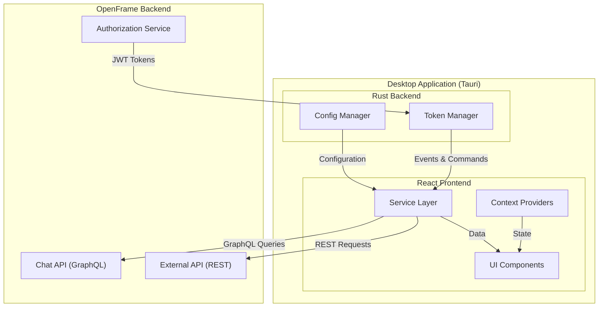

# Frontend Chat Module - Documentation Index

## Overview

The **Frontend Chat Module** is a standalone Tauri-based desktop application that provides a dedicated chat interface for the OpenFrame platform. This documentation covers the architecture, components, and integration points of the chat client.

---

## Quick Links

### Main Documentation
- **[Frontend Chat Module](./frontend_chat.md)** - Complete module documentation with architecture overview

### Sub-Module Documentation
- **[Context Management](./frontend_chat_contexts.md)** - React context providers for global state
- **[Service Layer](./frontend_chat_services.md)** - Business logic and API communication services

---

## Module Structure

```text
frontend_chat/
├── contexts/
│   └── DebugModeContext.tsx          # Debug mode state management
├── services/
│   ├── tokenService.ts               # Authentication token management
│   ├── dialogGraphQLService.ts       # GraphQL client for dialogs
│   ├── supportedModelsService.ts     # AI model configuration
│   └── mockChatService.ts            # Development mock service
└── types/
    └── chat.types.ts                 # TypeScript type definitions
```

---

## Key Features

### 🖥️ Native Desktop Experience
- Cross-platform support (Windows, macOS, Linux)
- Built with Tauri for lightweight, secure desktop apps
- Native OS integration for notifications and system tray

### 💬 Real-time Chat Interface
- Streaming message support with live updates
- Tool execution visualization
- Rich message formatting with markdown support

### 🔐 Secure Authentication
- JWT token-based authentication
- Secure token storage in Tauri backend
- Automatic token refresh and validation

### 🤖 AI Integration
- Support for multiple AI providers (Anthropic, OpenAI, Google Gemini)
- Dynamic model configuration
- Tool execution and approval workflows

### 🛠️ Developer-Friendly
- Mock service layer for offline development
- Debug mode with detailed logging
- Environment variable configuration support

---

## Architecture Diagram



---

## Component Overview

### Context Management

| Component | Purpose | Documentation |
|-----------|---------|---------------|
| **DebugModeContext** | Global debug mode state | [frontend_chat_contexts.md](./frontend_chat_contexts.md) |

### Service Layer

| Service | Purpose | Documentation |
|---------|---------|---------------|
| **TokenService** | Authentication token management | [frontend_chat_services.md](./frontend_chat_services.md#tokenservice) |
| **DialogGraphQLService** | GraphQL client for chat operations | [frontend_chat_services.md](./frontend_chat_services.md#dialoggraphqlservice) |
| **SupportedModelsService** | AI model metadata management | [frontend_chat_services.md](./frontend_chat_services.md#supportedmodelsservice) |
| **MockChatService** | Development mock service | [frontend_chat_services.md](./frontend_chat_services.md#mockchatservice) |

---

## Integration Points

### Backend Services

| Service | Integration | Documentation |
|---------|-------------|---------------|
| **Authorization Service** | JWT token generation | [authorization_service.md](./authorization_service.md) |
| **Chat API** | GraphQL queries for dialogs/messages | [api_service_graphql_datafetchers.md](./api_service_graphql_datafetchers.md) |
| **External API** | REST API for configuration | [external_api.md](./external_api.md) |
| **Gateway Service** | API routing and WebSocket | [gateway_service.md](./gateway_service.md) |

### Frontend Modules

| Module | Integration | Documentation |
|--------|-------------|---------------|
| **Frontend Core Components** | Shared UI components | [frontend_core_components.md](./frontend_core_components.md) |
| **Frontend Main** | Web application integration | [frontend_main.md](./frontend_main.md) |
| **Frontend Mingo AI** | AI assistant integration | [frontend_mingo_ai.md](./frontend_mingo_ai.md) |

---

## Getting Started

### Prerequisites

- Node.js 18+ and npm
- Rust toolchain (for Tauri)
- OpenFrame backend services running

### Development Setup

```bash
# Clone the repository
git clone https://github.com/your-org/openframe.git
cd openframe/clients/openframe-chat

# Install dependencies
npm install

# Set environment variables for development
export VITE_TOKEN="your-jwt-token"
export VITE_SERVER_URL="https://api.openframe.example.com"

# Start development server
npm run tauri dev
```

### Building for Production

```bash
# Build for current platform
npm run tauri build

# Build for specific platform
npm run tauri build -- --target x86_64-pc-windows-msvc  # Windows
npm run tauri build -- --target x86_64-apple-darwin     # macOS
npm run tauri build -- --target x86_64-unknown-linux-gnu # Linux
```

---

## Configuration

### Environment Variables

```bash
# Development mode configuration
VITE_TOKEN=eyJhbGciOiJSUzI1NiIsInR5cCI6IkpXVCJ9...
VITE_SERVER_URL=https://api.openframe.example.com
```

### Tauri Configuration

The Tauri configuration is defined in `src-tauri/tauri.conf.json`:

```json
{
  "build": {
    "beforeDevCommand": "npm run dev",
    "beforeBuildCommand": "npm run build",
    "devPath": "http://localhost:1420",
    "distDir": "../dist"
  },
  "package": {
    "productName": "OpenFrame Chat",
    "version": "0.1.0"
  }
}
```

---

## Key Workflows

### 1. Application Initialization
1. Tauri runtime starts
2. Token service initializes and requests token from Rust backend
3. Supported models service loads AI model configuration
4. Dialog service checks for resumable dialog
5. If dialog exists, load message history
6. Render chat UI

### 2. Sending a Message
1. User types message in input field
2. Token service validates authentication
3. Message sent to Chat API via GraphQL
4. Response streamed back with text and tool execution segments
5. UI updates in real-time as segments arrive
6. Message added to dialog history

### 3. Tool Execution
1. AI determines tool execution is needed
2. "EXECUTING_TOOL" segment streamed to UI
3. Tool function executed on backend
4. "EXECUTED_TOOL" segment streamed with results
5. AI processes results and continues response
6. Complete message displayed to user

---

## API Reference

### TokenService

```typescript
// Get current token
const token = tokenService.getCurrentToken()

// Request token from Rust backend
const token = await tokenService.requestToken()

// Subscribe to token updates
const unsubscribe = tokenService.onTokenUpdate((token) => {
  console.log('Token updated:', token)
})

// Get API base URL
const apiUrl = tokenService.getCurrentApiBaseUrl()

// Ensure token is ready before API calls
await tokenService.ensureTokenReady()
```

### DialogGraphQLService

```typescript
// Get resumable dialog
const dialog = await dialogGraphQLService.getResumableDialog()

// Get dialog messages with pagination
const messages = await dialogGraphQLService.getDialogMessages(
  dialogId,
  cursor,
  limit
)

// Dispose service (cleanup)
dialogGraphQLService.dispose()
```

### SupportedModelsService

```typescript
// Load supported models
await supportedModelsService.loadSupportedModels()

// Get model display name
const displayName = supportedModelsService.getModelDisplayName('claude-3-opus')

// Get model details
const model = supportedModelsService.getModel('gpt-4')

// Check if model is supported
const isSupported = supportedModelsService.isModelSupported('claude-3-opus')

// Get all models
const allModels = supportedModelsService.getAllModels()
```

### MockChatService

```typescript
// Stream mock response
const mockService = new MockChatService()
for await (const segment of mockService.streamResponse(message)) {
  if (segment.type === 'text') {
    console.log(segment.text)
  } else if (segment.type === 'tool_execution') {
    console.log('Tool:', segment.data)
  }
}
```

---

## Testing

### Unit Tests

```bash
# Run unit tests
npm test

# Run tests in watch mode
npm test -- --watch

# Run tests with coverage
npm test -- --coverage
```

### Integration Tests

```bash
# Run integration tests
npm run test:integration

# Run E2E tests with Tauri
npm run test:e2e
```

### Manual Testing with Mock Service

The mock service provides realistic responses for manual testing:

```typescript
import { MockChatService } from './services/mockChatService'

const mockService = new MockChatService()

// Test basic response
for await (const segment of mockService.streamResponse('Hello')) {
  console.log(segment)
}

// Test tool execution
for await (const segment of mockService.streamResponse('Check processes')) {
  console.log(segment)
}

// Test error handling
for await (const segment of mockService.streamResponseWithError('Test')) {
  console.log(segment)
}
```

---

## Troubleshooting

### Common Issues

#### Token Not Available

**Problem**: Application shows "Authentication token not available" error.

**Solution**:
1. Check that authorization service is running
2. Verify `VITE_TOKEN` environment variable (development)
3. Check Tauri backend logs for token retrieval errors
4. Ensure user is logged in to OpenFrame platform

#### GraphQL Connection Failed

**Problem**: Cannot connect to Chat API.

**Solution**:
1. Verify `VITE_SERVER_URL` is correct
2. Check that gateway service is running
3. Verify network connectivity
4. Check CORS configuration in gateway service

#### Messages Not Loading

**Problem**: Dialog history doesn't load.

**Solution**:
1. Check browser console for GraphQL errors
2. Verify dialog ID is valid
3. Check backend logs for query errors
4. Ensure user has permission to access dialog

---

## Performance Optimization

### Message Pagination

The dialog service automatically fetches all message pages, which can be slow for large dialogs. Consider implementing:

1. **Virtual Scrolling**: Only render visible messages
2. **Lazy Loading**: Load older messages on demand
3. **Message Caching**: Cache messages in local storage

### Token Caching

Tokens are cached in memory to avoid repeated Tauri command invocations:

```typescript
// First call: fetches from Rust
const token1 = await tokenService.requestToken()

// Subsequent calls: returns cached token
const token2 = tokenService.getCurrentToken()
```

### Model Metadata Caching

Supported models are loaded once and cached:

```typescript
// Load once on app start
await supportedModelsService.loadSupportedModels()

// Fast lookups from cache
const displayName = supportedModelsService.getModelDisplayName('claude-3-opus')
```

---

## Security Best Practices

### Token Security

- ✅ **DO**: Store tokens in Tauri Rust backend
- ✅ **DO**: Use HTTPS for all API communication
- ✅ **DO**: Mask tokens in logs
- ❌ **DON'T**: Store tokens in localStorage or sessionStorage
- ❌ **DON'T**: Log full tokens to console

### API Communication

- ✅ **DO**: Validate all API responses
- ✅ **DO**: Use Bearer token authentication
- ✅ **DO**: Handle token expiration gracefully
- ❌ **DON'T**: Send tokens in URL parameters
- ❌ **DON'T**: Disable SSL certificate validation

### Debug Mode

- ✅ **DO**: Disable debug mode in production builds
- ✅ **DO**: Use debug mode for development only
- ❌ **DON'T**: Log sensitive data in debug mode
- ❌ **DON'T**: Enable debug mode for end users

---

## Contributing

### Code Style

- Follow TypeScript best practices
- Use ESLint and Prettier for code formatting
- Write unit tests for new features
- Document public APIs with JSDoc comments

### Pull Request Process

1. Create feature branch from `main`
2. Implement changes with tests
3. Update documentation
4. Submit PR with detailed description
5. Address review comments
6. Merge after approval

### Reporting Issues

Please report issues through our **OpenMSP Slack Community**:
- [Join Slack](https://join.slack.com/t/openmsp/shared_invite/zt-36bl7mx0h-3~U2nFH6nqHqoTPXMaHEHA)
- [OpenMSP Website](https://www.openmsp.ai/)

**Note**: We do not use GitHub Issues. All discussions happen in Slack.

---

## Related Documentation

### Frontend Modules
- [Frontend Main](./frontend_main.md) - Main web application
- [Frontend Core Components](./frontend_core_components.md) - Shared UI components
- [Frontend Mingo AI](./frontend_mingo_ai.md) - AI assistant integration
- [Frontend Authentication](./frontend_authentication.md) - Authentication flows

### Backend Services
- [Authorization Service](./authorization_service.md) - JWT token generation
- [API Service](./api_service.md) - REST and GraphQL APIs
- [Gateway Service](./gateway_service.md) - API routing
- [External API](./external_api.md) - External API endpoints

### Security
- [Security Core](./security_core.md) - JWT and authentication
- [Security OAuth](./security_oauth.md) - OAuth 2.0 flows

---

## Resources

### Official Links
- **OpenFrame Platform**: [https://openframe.ai](https://openframe.ai)
- **Flamingo Platform**: [https://flamingo.run](https://flamingo.run)
- **OpenMSP Community**: [https://www.openmsp.ai/](https://www.openmsp.ai/)

### Technology Documentation
- **Tauri**: [https://tauri.app/](https://tauri.app/)
- **React**: [https://react.dev/](https://react.dev/)
- **GraphQL**: [https://graphql.org/](https://graphql.org/)
- **TypeScript**: [https://www.typescriptlang.org/](https://www.typescriptlang.org/)

---

## License

This module is part of the OpenFrame platform. See the main repository for license information.

---

**Last Updated**: 2024  
**Version**: 1.0.0  
**Maintainers**: OpenFrame Team
