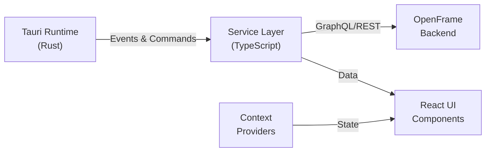

# Frontend Chat Module - Summary

## Quick Overview

The **Frontend Chat Module** is a standalone Tauri-based desktop application that provides a dedicated chat interface for the OpenFrame platform. It enables users to communicate with AI assistants (Mingo AI) and support technicians through a native desktop experience.

---

## Key Characteristics

| Aspect | Details |
|--------|---------|
| **Type** | Desktop Application (Tauri + React) |
| **Language** | TypeScript, Rust |
| **Framework** | React 18+, Tauri |
| **Communication** | GraphQL, REST APIs |
| **Authentication** | JWT tokens via Tauri backend |
| **State Management** | React Context API |

---

## Core Components

### Context Providers
- **DebugModeContext**: Global debug mode state management

### Services
- **TokenService**: Authentication token management with Tauri integration
- **DialogGraphQLService**: GraphQL client for dialog and message operations
- **SupportedModelsService**: AI model metadata and configuration
- **MockChatService**: Development and testing mock service

---

## Architecture Highlights



---

## Key Features

✅ **Native Desktop Experience** - Cross-platform support (Windows, macOS, Linux)  
✅ **Real-time Chat** - Streaming messages with tool execution visualization  
✅ **Secure Authentication** - JWT tokens managed by Tauri Rust backend  
✅ **AI Integration** - Support for multiple AI providers (Anthropic, OpenAI, Google Gemini)  
✅ **Developer-Friendly** - Mock services, debug mode, environment configuration  

---

## Integration Points

### Backend Services
- **Authorization Service**: JWT token generation
- **Chat API (GraphQL)**: Dialog and message management
- **External API (REST)**: AI model configuration
- **Gateway Service**: API routing and WebSocket

### Frontend Modules
- **Frontend Core Components**: Shared UI components
- **Frontend Main**: Web application integration
- **Frontend Mingo AI**: AI assistant integration

---

## Data Flow

### Message Sending
```text
User Input → Token Validation → Chat API → Stream Response → Update UI
```

### Dialog Loading
```text
App Start → Request Token → Load Dialog → Fetch Messages → Render History
```

### Tool Execution
```text
AI Request → Execute Tool → Stream Result → Display to User
```

---

## Technology Stack

| Layer | Technology |
|-------|-----------|
| **Desktop Runtime** | Tauri (Rust) |
| **Frontend Framework** | React 18+ |
| **Language** | TypeScript |
| **API Client** | GraphQL (graphql-request) |
| **State Management** | React Context API |
| **Build Tool** | Vite |

---

## Configuration

### Environment Variables (Development)
```bash
VITE_TOKEN=<jwt-token>
VITE_SERVER_URL=https://api.openframe.example.com
```

### Tauri Commands
```typescript
invoke<string>('get_token')          // Get authentication token
invoke<string>('get_server_url')     // Get API server URL
invoke<boolean>('get_debug_mode')    // Get debug mode state
```

### Tauri Events
```typescript
listen<{token: string}>('token-update', callback)  // Token updates
```

---

## Security Features

🔐 **Secure Token Storage** - Tokens managed by Rust backend, not JavaScript  
🔐 **HTTPS Only** - All API communication uses HTTPS  
🔐 **Bearer Authentication** - JWT tokens in Authorization header  
🔐 **Masked Logging** - Tokens masked in logs (first 4 + last 4 chars)  
🔐 **Event-Driven Updates** - Token updates pushed from Rust to JavaScript  

---

## Development Workflow

### Setup
```bash
npm install
export VITE_TOKEN="your-token"
export VITE_SERVER_URL="https://api.example.com"
npm run tauri dev
```

### Testing with Mock Service
```typescript
import { MockChatService } from './services/mockChatService'

const mockService = new MockChatService()
for await (const segment of mockService.streamResponse('Hello')) {
  console.log(segment)
}
```

### Building
```bash
npm run tauri build
```

---

## Performance Considerations

⚡ **Token Caching** - Tokens cached in memory to avoid repeated Rust calls  
⚡ **Model Metadata Caching** - AI models loaded once and cached  
⚡ **Automatic Pagination** - Dialog service fetches all message pages automatically  
⚡ **Streaming Responses** - Messages streamed in real-time for better UX  

---

## Error Handling

### Token Errors
```typescript
await tokenService.ensureTokenReady()
// Throws if token or API URL not available
```

### GraphQL Errors
```typescript
const dialog = await dialogGraphQLService.getResumableDialog()
if (!dialog) {
  // Handle no resumable dialog
}
```

### Network Errors
```typescript
try {
  for await (const segment of chatService.streamResponse(message)) {
    // Process segment
  }
} catch (error) {
  // Handle connection errors
}
```

---

## Future Enhancements

### Planned Features
- 📴 Offline support with message queuing
- 🔍 Full-text search across dialog history
- 📎 File attachments and image support
- 🎤 Voice input with speech-to-text
- 🔔 Desktop notifications for new messages
- 💬 Multi-dialog support
- 😊 Message reactions with emojis
- ✍️ Rich text formatting with markdown

### Technical Improvements
- Virtual scrolling for large message lists
- Local storage for message caching
- Optimistic updates for better UX
- WebSocket support for real-time updates
- Automatic retry with exponential backoff
- Analytics integration

---

## Documentation Structure

```text
frontend_chat/
├── FRONTEND_CHAT_README.md          # Main documentation index
├── FRONTEND_CHAT_SUMMARY.md         # This file - quick reference
├── frontend_chat.md                 # Complete module documentation
├── frontend_chat_contexts.md        # Context providers documentation
└── frontend_chat_services.md        # Service layer documentation
```

---

## Quick Links

### Documentation
- **[Complete Documentation](./frontend_chat.md)** - Full module documentation
- **[Context Management](./frontend_chat_contexts.md)** - React context providers
- **[Service Layer](./frontend_chat_services.md)** - Business logic and API services
- **[Documentation Index](./FRONTEND_CHAT_README.md)** - All documentation links

### Related Modules
- [Frontend Main](./frontend_main.md) - Main web application
- [Frontend Core Components](./frontend_core_components.md) - Shared UI components
- [Frontend Mingo AI](./frontend_mingo_ai.md) - AI assistant integration
- [Authorization Service](./authorization_service.md) - JWT token generation
- [API Service GraphQL](./api_service_graphql_datafetchers.md) - Chat data fetchers

---

## Support

For questions, issues, or contributions:

- **OpenMSP Slack Community**: [Join here](https://join.slack.com/t/openmsp/shared_invite/zt-36bl7mx0h-3~U2nFH6nqHqoTPXMaHEHA)
- **Website**: [https://www.openmsp.ai/](https://www.openmsp.ai/)
- **OpenFrame Platform**: [https://openframe.ai](https://openframe.ai)

**Note**: We manage all discussions through Slack, not GitHub Issues.

---

## API Quick Reference

### TokenService
```typescript
tokenService.getCurrentToken()                    // Get cached token
await tokenService.requestToken()                 // Request from Rust
tokenService.onTokenUpdate(callback)              // Subscribe to updates
tokenService.getCurrentApiBaseUrl()               // Get API URL
await tokenService.ensureTokenReady()             // Ensure ready
```

### DialogGraphQLService
```typescript
await dialogGraphQLService.getResumableDialog()   // Get active dialog
await dialogGraphQLService.getDialogMessages(id)  // Get messages
dialogGraphQLService.dispose()                    // Cleanup
```

### SupportedModelsService
```typescript
await supportedModelsService.loadSupportedModels()           // Load models
supportedModelsService.getModelDisplayName(name)             // Get display name
supportedModelsService.getModel(name)                        // Get model details
supportedModelsService.isModelSupported(name)                // Check support
supportedModelsService.getAllModels()                        // Get all models
```

### MockChatService
```typescript
const mockService = new MockChatService()
for await (const segment of mockService.streamResponse(msg)) {
  // Process segment
}
```

---

**Last Updated**: 2024  
**Version**: 1.0.0  
**Module Type**: Frontend Desktop Application
