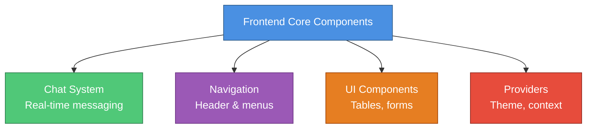

# Frontend Core Components Module

> **Comprehensive React/TypeScript component library for OpenFrame platform**

[](https://www.typescriptlang.org/)
[](https://react.dev/)
[](https://nextjs.org/)

---

## 📖 Overview

The **Frontend Core Components** module (`openframe-frontend-core`) is the foundational UI component library for the OpenFrame platform. It provides production-ready, type-safe React components for building modern web applications with real-time chat, data tables, navigation, and dynamic theming.

**Part of the OpenFrame ecosystem** - an AI-powered MSP platform that replaces expensive proprietary software with open-source alternatives enhanced by intelligent automation.

---

## 🚀 Quick Start

### Installation

```bash
npm install @openframe/frontend-core
# or
yarn add @openframe/frontend-core
```

### Basic Usage

```typescript
import { 
  DynamicThemeProvider,
  Header,
  Table,
  ChatContainer 
} from '@openframe/frontend-core'

function App() {
  return (
    <DynamicThemeProvider>
      <Header config={headerConfig} />
      <ChatContainer>
        {/* Your chat UI */}
      </ChatContainer>
    </DynamicThemeProvider>
  )
}
```

---

## 📚 Documentation

### Main Documentation
- **[Frontend Core Components](./frontend_core_components.md)** - Complete module documentation

### Sub-Module Documentation
1. **[Chat System](./frontend_core_chat_system.md)** - Real-time messaging with AI assistants
2. **[Navigation Components](./frontend_core_navigation.md)** - Responsive header and menus
3. **[UI Table Component](./frontend_core_ui_table.md)** - Advanced data tables
4. **[Theme Provider](./frontend_core_theme_provider.md)** - Dynamic theming system

### Quick Reference
- **[Documentation Summary](./FRONTEND_CORE_COMPONENTS_SUMMARY.md)** - Quick navigation guide

---

## ✨ Key Features

### 💬 Chat System
- Real-time message streaming via NATS WebSocket
- Multi-segment messages (text, tool execution, approvals)
- AI assistant integration (Fae for clients, Mingo for technicians)
- Tool execution visualization
- Approval workflows with status tracking
- Historical message loading with chunk catchup

### 🧭 Navigation
- Auto-hide header on scroll
- Nested dropdown menus
- Mobile-responsive design
- Active state management
- Custom action buttons
- External link support

### 📊 Data Tables
- Sortable and filterable columns
- Row selection and bulk actions
- Cursor-based and page-based pagination
- Responsive card view for mobile
- Skeleton loading states
- Custom cell renderers

### 🎨 Theming
- Runtime theme customization
- Dark mode support
- CSS variable injection
- Platform-specific themes
- Accessibility features
- Theme persistence

---

## 🏗️ Architecture



---

## 🔧 Core Components

### Chat Components

```typescript
import { 
  ChatContainer,
  ChatMessageList,
  ChatInput,
  ChatHeader,
  useRealtimeChunkProcessor,
  useNatsDialogSubscription
} from '@openframe/frontend-core'

import type {
  Message,
  MessageSegment,
  ChatAPIRequest,
  ChatAPIResponse,
  RealtimeChunkCallbacks
} from '@openframe/frontend-core'
```

### Navigation Components

```typescript
import { Header } from '@openframe/frontend-core'

import type {
  HeaderConfig,
  NavigationItem
} from '@openframe/frontend-core'
```

### Table Components

```typescript
import { Table } from '@openframe/frontend-core'

import type {
  TableProps,
  TableColumn,
  CursorPagination,
  PagePagination,
  BulkAction,
  RowAction
} from '@openframe/frontend-core'
```

### Theme Components

```typescript
import { 
  DynamicThemeProvider,
  useDynamicTheme
} from '@openframe/frontend-core'

import type {
  DynamicThemeContextType
} from '@openframe/frontend-core'
```

---

## 📋 Usage Examples

### Chat Interface

```typescript
import { 
  ChatContainer, 
  ChatMessageList, 
  ChatInput,
  useRealtimeChunkProcessor,
  useNatsDialogSubscription 
} from '@openframe/frontend-core'
import type { Message, RealtimeChunkCallbacks } from '@openframe/frontend-core'

function ChatInterface({ dialogId }: { dialogId: string }) {
  const [messages, setMessages] = useState<Message[]>([])
  
  const callbacks: RealtimeChunkCallbacks = {
    onStreamStart: () => console.log('Stream started'),
    onSegmentsUpdate: (segments) => {
      // Update current message
    },
    onStreamEnd: () => console.log('Stream ended')
  }
  
  const processor = useRealtimeChunkProcessor({ callbacks })
  
  const { isConnected } = useNatsDialogSubscription({
    enabled: true,
    dialogId,
    onEvent: (payload) => processor.processChunk(payload),
    getNatsWsUrl: () => process.env.NEXT_PUBLIC_NATS_WS_URL
  })
  
  return (
    <ChatContainer>
      <ChatMessageList 
        messages={messages}
        dialogId={dialogId}
        isTyping={isConnected}
      />
      <ChatInput onSend={(message) => sendMessage(message)} />
    </ChatContainer>
  )
}
```

### Navigation Header

```typescript
import { Header } from '@openframe/frontend-core'
import type { HeaderConfig } from '@openframe/frontend-core'

function AppLayout() {
  const headerConfig: HeaderConfig = {
    logo: {
      element: <Logo />,
      href: '/'
    },
    navigation: {
      items: [
        { id: 'devices', label: 'Devices', href: '/devices', isActive: true },
        { id: 'logs', label: 'Logs', href: '/logs' },
        {
          id: 'settings',
          label: 'Settings',
          children: [
            { id: 'profile', label: 'Profile', href: '/settings/profile' },
            { id: 'security', label: 'Security', href: '/settings/security' }
          ]
        }
      ],
      position: 'center'
    },
    actions: {
      right: [<UserMenu key="user" />]
    },
    autoHide: true
  }
  
  return <Header config={headerConfig} />
}
```

### Data Table

```typescript
import { Table } from '@openframe/frontend-core'
import type { TableProps, TableColumn } from '@openframe/frontend-core'

interface Device {
  id: string
  name: string
  status: 'online' | 'offline'
  lastSeen: Date
}

function DeviceTable() {
  const columns: TableColumn<Device>[] = [
    {
      key: 'name',
      label: 'Device Name',
      sortable: true,
      width: 'flex-1'
    },
    {
      key: 'status',
      label: 'Status',
      sortable: true,
      filterable: true,
      filterOptions: [
        { id: 'online', label: 'Online', value: 'online' },
        { id: 'offline', label: 'Offline', value: 'offline' }
      ],
      renderCell: (device) => <StatusBadge status={device.status} />
    }
  ]
  
  return (
    <Table
      data={devices}
      columns={columns}
      rowKey="id"
      loading={isLoading}
      onRowClick={(device) => navigate(`/devices/${device.id}`)}
      cursorPagination={{
        hasNextPage: true,
        onNext: (cursor) => fetchNextPage(cursor)
      }}
    />
  )
}
```

---

## 🎨 Design System

All components follow the **OpenFrame Design System (ODS)** with:

- **Color Tokens**: `--ods-bg-primary`, `--ods-text-primary`, `--ods-accent`
- **Typography**: DM Sans font family with consistent sizing
- **Spacing**: Tailwind CSS utilities for consistent spacing
- **Dark Mode**: Automatic dark mode support via theme provider

---

## 🔗 Integration

### With Frontend Main Application

```typescript
// Main application uses core components
import { Header, Table, ChatContainer } from '@openframe/frontend-core'
```

See [Frontend Main documentation](./frontend_main.md) for details.

### With Frontend Chat Client

```typescript
// Chat client extends core chat types
import type { Message, MessageSegment } from '@openframe/frontend-core'
```

See [Frontend Chat documentation](./frontend_chat.md) for details.

---

## 🧪 Testing

Components are tested using React Testing Library:

```typescript
import { render, screen, fireEvent } from '@testing-library/react'
import { ChatInput } from '@openframe/frontend-core'

describe('ChatInput', () => {
  it('calls onSend when message is submitted', () => {
    const onSend = jest.fn()
    render(<ChatInput onSend={onSend} />)
    
    const input = screen.getByRole('textbox')
    fireEvent.change(input, { target: { value: 'Hello' } })
    fireEvent.submit(input)
    
    expect(onSend).toHaveBeenCalledWith('Hello')
  })
})
```

---

## 📦 Package Structure

```text
openframe-frontend-core/
├── src/
│   ├── components/
│   │   ├── chat/              # Chat system components
│   │   │   ├── types/         # Type definitions
│   │   │   ├── hooks/         # React hooks
│   │   │   └── components/    # UI components
│   │   ├── navigation/        # Navigation components
│   │   ├── ui/                # UI components (table, etc.)
│   │   └── providers/         # Context providers
│   ├── hooks/                 # Shared hooks
│   ├── types/                 # Shared types
│   └── utils/                 # Utility functions
└── package.json
```

---

## 🤝 Related Modules

### Frontend Modules
- [Frontend Main Application](./frontend_main.md) - Main dashboard
- [Frontend Chat Client](./frontend_chat.md) - Standalone chat
- [Frontend Mingo AI](./frontend_mingo_ai.md) - AI assistant
- [Frontend MeshCentral](./frontend_meshcentral.md) - Remote desktop

### Backend Services
- [API Service](./api_service.md) - REST and GraphQL APIs
- [Gateway Service](./gateway_service.md) - API gateway
- [Authorization Service](./authorization_service.md) - OAuth2 auth

---

## 🌐 Community & Support

- **OpenMSP Slack**: https://join.slack.com/t/openmsp/shared_invite/zt-36bl7mx0h-3~U2nFH6nqHqoTPXMaHEHA
- **Website**: https://www.flamingo.run
- **OpenFrame**: https://www.flamingo.run/openframe

> **Note**: We don't use GitHub Issues or Discussions. All support and development discussions are managed through our OpenMSP Slack community.

---

## 📄 License

Part of the OpenFrame open-source project.

---

## 🎯 Next Steps

1. **Read the documentation**: Start with [Frontend Core Components](./frontend_core_components.md)
2. **Explore sub-modules**: Check out [Chat System](./frontend_core_chat_system.md), [Navigation](./frontend_core_navigation.md), [Table](./frontend_core_ui_table.md), and [Theme Provider](./frontend_core_theme_provider.md)
3. **Try the examples**: Copy and adapt the usage examples above
4. **Join the community**: Connect with other developers on Slack

---

**Built with ❤️ by the Flamingo team**
