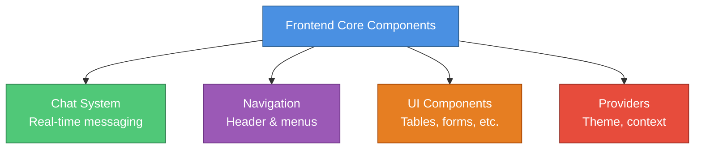
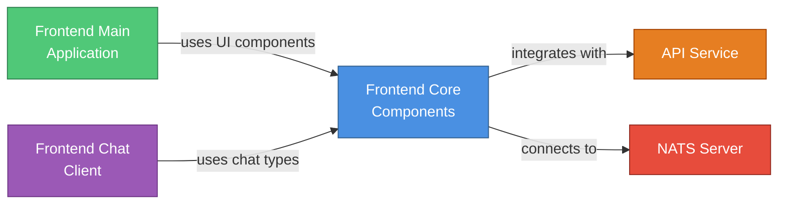

# Frontend Core Components - Documentation Summary

## 📚 Documentation Structure

This summary provides quick navigation to all Frontend Core Components documentation.

---

## Main Documentation

### [Frontend Core Components Module](./frontend_core_components.md)

**Main entry point** for the Frontend Core Components module documentation.

**Contents:**
- Module overview and architecture
- Sub-module organization
- Integration with other modules
- Component usage examples
- Design system integration
- Real-time communication patterns
- Performance considerations
- Best practices and troubleshooting

---

## Sub-Module Documentation

### 1. [Chat System](./frontend_core_chat_system.md)

**Real-time messaging framework** for AI-driven conversational interfaces.

**Key Topics:**
- Message types and segmentation
- Real-time streaming with NATS
- Chunk processing and catchup
- Approval workflows
- Tool execution tracking
- Multi-assistant support

**Core Components:**
- `ChatAPIRequest`, `ChatAPIResponse`
- `Message`, `MessageSegment`
- `ChatContainerProps`
- `useRealtimeChunkProcessor`
- `useNatsDialogSubscription`

---

### 2. [Navigation Components](./frontend_core_navigation.md)

**Responsive header navigation system** for OpenFrame applications.

**Key Topics:**
- Header configuration
- Navigation items and dropdowns
- Auto-hide behavior
- Mobile responsiveness
- Action buttons
- Styling and theming

**Core Components:**
- `HeaderProps`, `HeaderConfig`
- `NavigationItem`
- `Header` component

---

### 3. [UI Table Component](./frontend_core_ui_table.md)

**Enterprise-grade data table** with advanced features.

**Key Topics:**
- Column configuration
- Sorting and filtering
- Pagination (cursor and page-based)
- Row selection and bulk actions
- Responsive design
- Custom renderers
- Loading and empty states

**Core Components:**
- `TableProps`
- `TableColumn`
- `CursorPagination`, `PagePagination`
- `BulkAction`, `RowAction`

---

### 4. [Theme Provider](./frontend_core_theme_provider.md)

**Dynamic theming system** for runtime theme customization.

**Key Topics:**
- Theme context and provider
- Dark mode support
- CSS variable injection
- Platform-specific themes
- Theme persistence
- Accessibility features

**Core Components:**
- `DynamicThemeContextType`
- `DynamicThemeProvider`
- `useDynamicTheme` hook

---

## Quick Reference

### Component Import Paths

```typescript
// Chat components
import { 
  ChatContainer, 
  ChatMessageList, 
  ChatInput,
  useRealtimeChunkProcessor,
  useNatsDialogSubscription 
} from '@openframe/frontend-core'

// Navigation
import { Header } from '@openframe/frontend-core'

// Table
import { Table } from '@openframe/frontend-core'

// Theme
import { DynamicThemeProvider, useDynamicTheme } from '@openframe/frontend-core'
```

### Type Import Paths

```typescript
// Chat types
import type { 
  Message, 
  MessageSegment,
  ChatAPIRequest,
  ChatAPIResponse,
  RealtimeChunkCallbacks 
} from '@openframe/frontend-core'

// Navigation types
import type { HeaderConfig, NavigationItem } from '@openframe/frontend-core'

// Table types
import type { 
  TableProps, 
  TableColumn,
  CursorPagination,
  PagePagination 
} from '@openframe/frontend-core'

// Theme types
import type { DynamicThemeContextType } from '@openframe/frontend-core'
```

---

## Architecture Diagrams

### Module Organization



### Integration with OpenFrame Platform



---

## Key Features by Sub-Module

### Chat System
- ✅ Real-time message streaming
- ✅ Multi-segment messages
- ✅ Tool execution visualization
- ✅ Approval workflows
- ✅ Historical message loading
- ✅ Chunk catchup synchronization
- ✅ AI metadata display

### Navigation
- ✅ Auto-hide on scroll
- ✅ Dropdown menus
- ✅ Mobile responsive
- ✅ Active state management
- ✅ Custom action buttons
- ✅ External link support

### Table
- ✅ Sortable columns
- ✅ Filterable data
- ✅ Row selection
- ✅ Bulk actions
- ✅ Cursor pagination
- ✅ Page pagination
- ✅ Responsive card view
- ✅ Skeleton loading

### Theme Provider
- ✅ Runtime theme updates
- ✅ Dark mode toggle
- ✅ CSS variable injection
- ✅ Platform-specific themes
- ✅ Accessibility support
- ✅ Theme persistence

---

## Common Use Cases

### Building a Chat Interface

1. Read [Chat System documentation](./frontend_core_chat_system.md)
2. Import chat components and types
3. Set up NATS subscription
4. Implement chunk processing
5. Handle approval workflows

**Example:**
```typescript
import { ChatContainer, ChatMessageList, ChatInput } from '@openframe/frontend-core'
import type { Message, RealtimeChunkCallbacks } from '@openframe/frontend-core'
```

### Creating Application Navigation

1. Read [Navigation documentation](./frontend_core_navigation.md)
2. Define header configuration
3. Set up navigation items
4. Configure mobile menu
5. Add action buttons

**Example:**
```typescript
import { Header } from '@openframe/frontend-core'
import type { HeaderConfig } from '@openframe/frontend-core'
```

### Displaying Data Tables

1. Read [Table documentation](./frontend_core_ui_table.md)
2. Define table columns
3. Configure sorting/filtering
4. Set up pagination
5. Add row actions

**Example:**
```typescript
import { Table } from '@openframe/frontend-core'
import type { TableProps, TableColumn } from '@openframe/frontend-core'
```

### Implementing Theming

1. Read [Theme Provider documentation](./frontend_core_theme_provider.md)
2. Wrap app with provider
3. Use theme hook
4. Implement dark mode toggle
5. Customize theme colors

**Example:**
```typescript
import { DynamicThemeProvider, useDynamicTheme } from '@openframe/frontend-core'
```

---

## Related Documentation

### Frontend Modules
- [Frontend Main Application](./frontend_main.md) - Main dashboard application
- [Frontend Chat Client](./frontend_chat.md) - Standalone chat client
- [Frontend Mingo AI](./frontend_mingo_ai.md) - Mingo AI assistant
- [Frontend MeshCentral](./frontend_meshcentral.md) - Remote desktop integration

### Backend Services
- [API Service](./api_service.md) - REST and GraphQL APIs
- [Gateway Service](./gateway_service.md) - API gateway and routing
- [Authorization Service](./authorization_service.md) - OAuth2 authentication

### Data Layer
- [Data Layer Mongo](./data_layer_mongo.md) - MongoDB integration
- [Data Layer Kafka](./data_layer_kafka.md) - Kafka streaming

---

## Development Resources

### Design System
- OpenFrame Design System (ODS) guidelines
- Color tokens and typography
- Component patterns

### External Documentation
- **React**: https://react.dev
- **TypeScript**: https://www.typescriptlang.org/docs
- **Tailwind CSS**: https://tailwindcss.com
- **Next.js**: https://nextjs.org/docs

### Community
- **OpenMSP Slack**: https://join.slack.com/t/openmsp/shared_invite/zt-36bl7mx0h-3~U2nFH6nqHqoTPXMaHEHA
- All support and discussions managed via Slack

---

## Documentation Status

| Document | Status | Last Updated |
|----------|--------|--------------|
| [Frontend Core Components](./frontend_core_components.md) | ✅ Complete | 2024 |
| [Chat System](./frontend_core_chat_system.md) | ✅ Complete | 2024 |
| [Navigation](./frontend_core_navigation.md) | ✅ Complete | 2024 |
| [UI Table](./frontend_core_ui_table.md) | ✅ Complete | 2024 |
| [Theme Provider](./frontend_core_theme_provider.md) | ✅ Complete | 2024 |

---

## Quick Start

### Installation

```bash
npm install @openframe/frontend-core
# or
yarn add @openframe/frontend-core
```

### Basic Setup

```typescript
import { DynamicThemeProvider } from '@openframe/frontend-core'

function App() {
  return (
    <DynamicThemeProvider>
      <YourApp />
    </DynamicThemeProvider>
  )
}
```

### Using Components

```typescript
import { Header, Table, ChatContainer } from '@openframe/frontend-core'
import type { HeaderConfig, TableProps, Message } from '@openframe/frontend-core'

// Use components with full type safety
```

---

**For detailed information on any component or feature, refer to the specific sub-module documentation linked above.**
