# Frontend Core Components - Visual Overview

> **Quick visual guide to the Frontend Core Components module architecture and capabilities**

---

## Module Architecture

### High-Level Organization

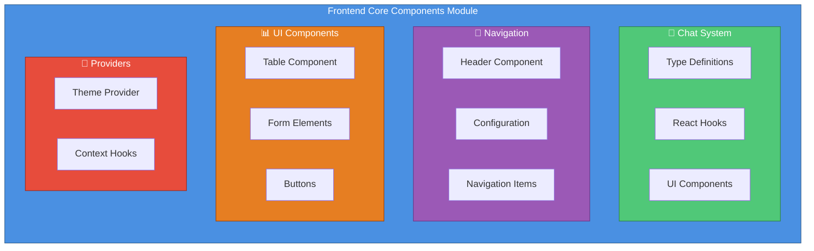

---

## Chat System Architecture

### Real-Time Message Flow

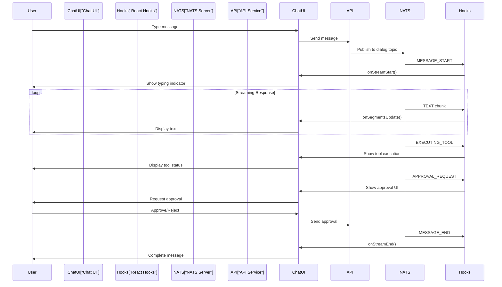

### Message Type Hierarchy

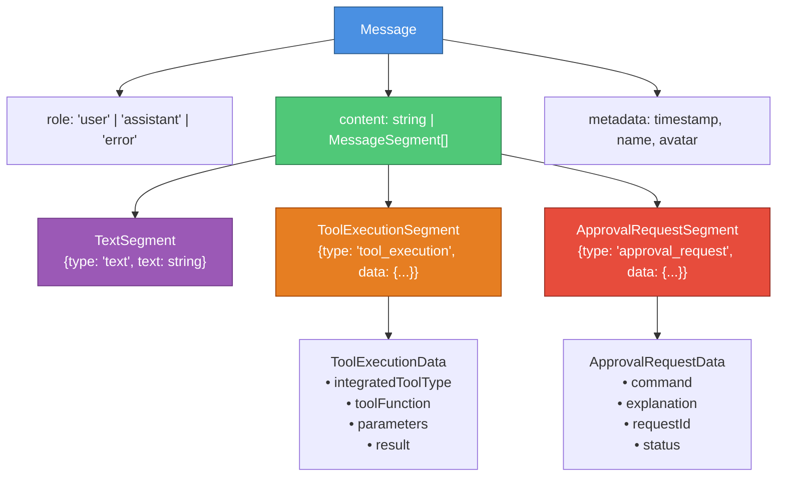

---

## Navigation System

### Header Component Structure

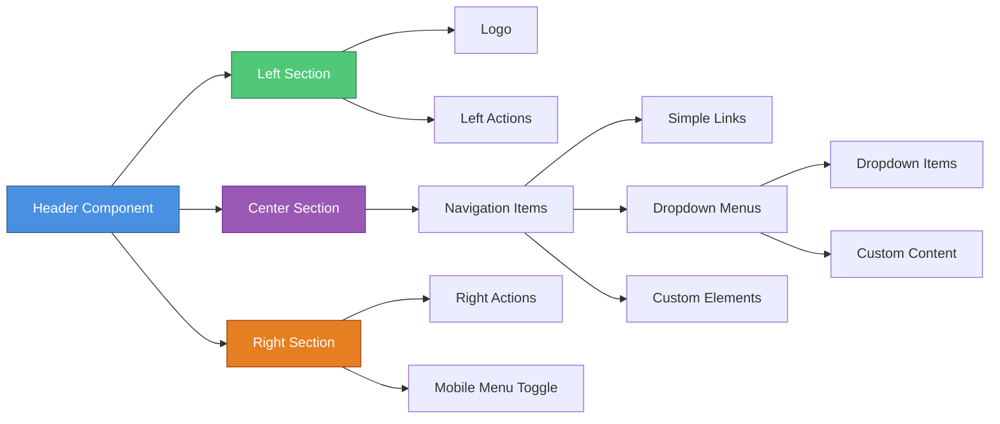

### Navigation State Management

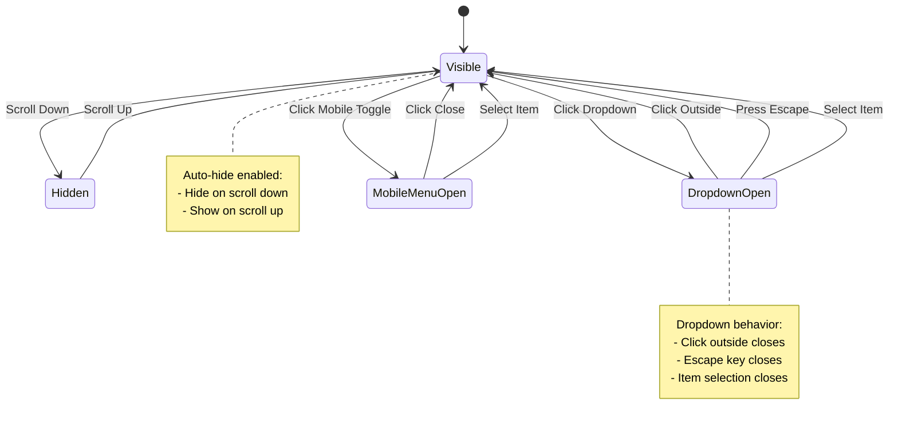

---

## Table Component Architecture

### Table Rendering Flow

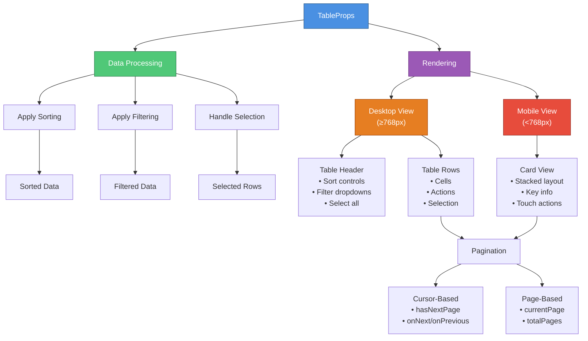

### Table Features Matrix

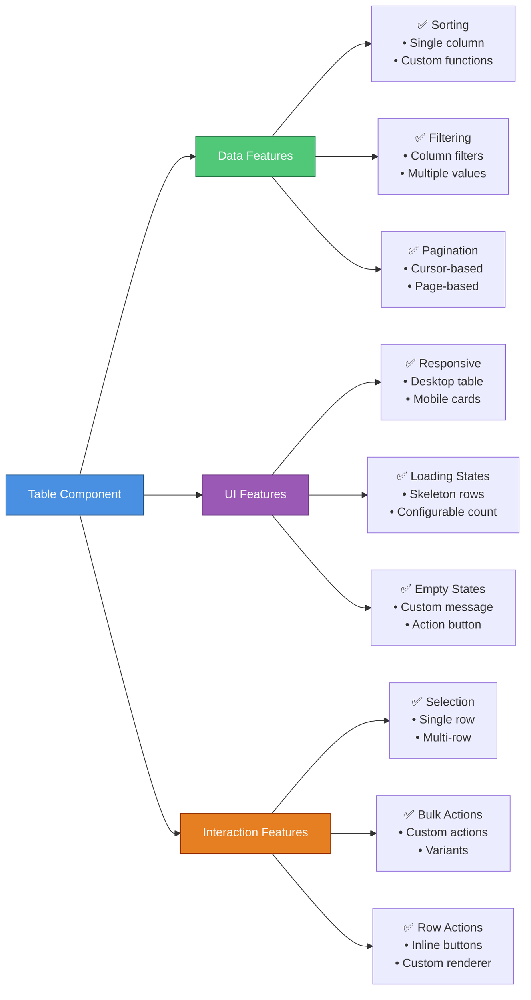

---

## Theme System

### Theme Provider Flow

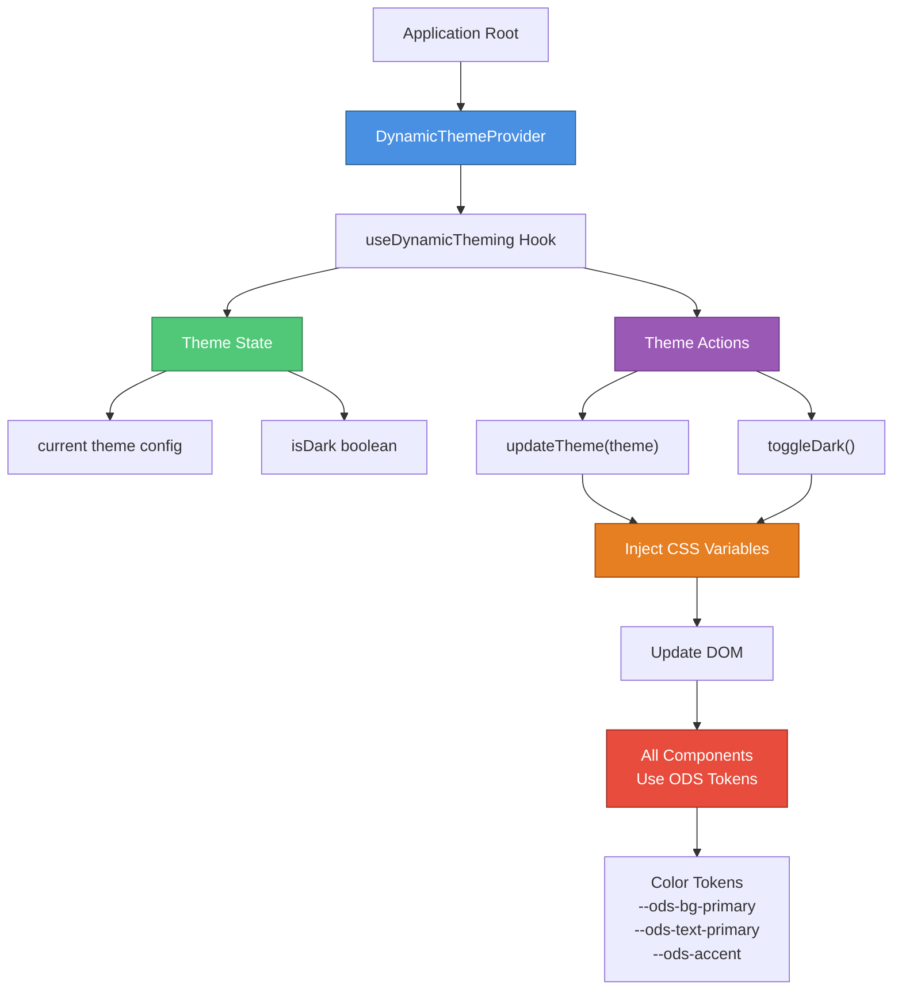

### Theme Token System

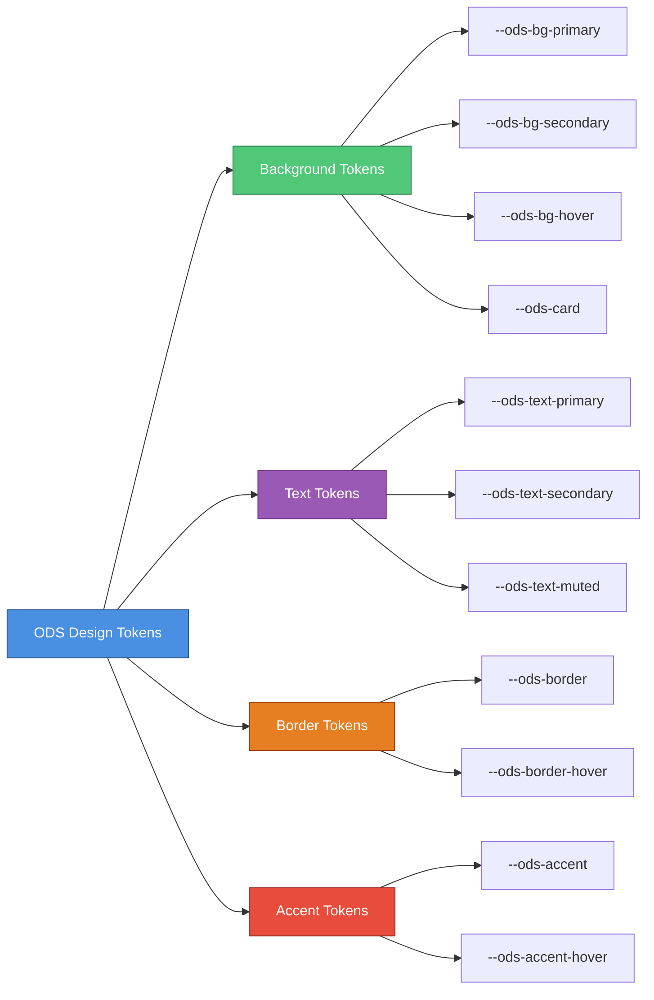

---

## Integration Patterns

### Frontend Module Integration

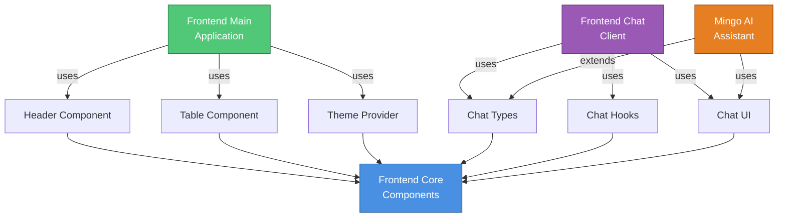

### Backend Service Integration

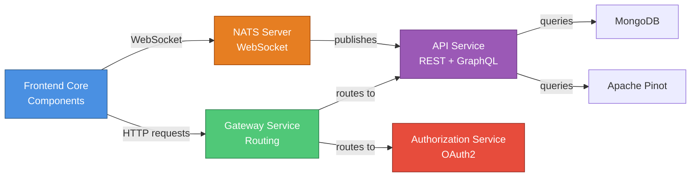

---

## Component Lifecycle

### Chat Component Lifecycle

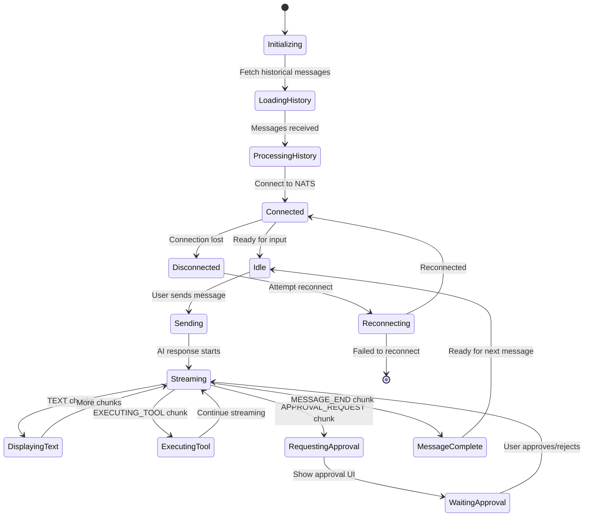

### Table Component Lifecycle

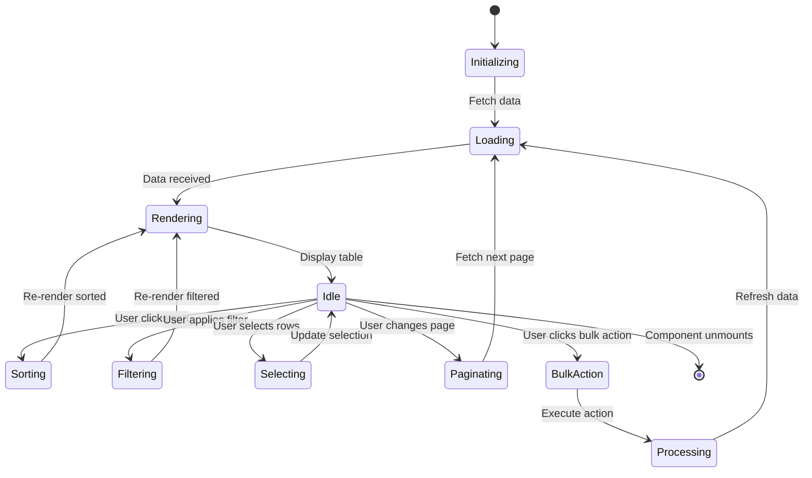

---

## Performance Optimization

### Component Optimization Strategy

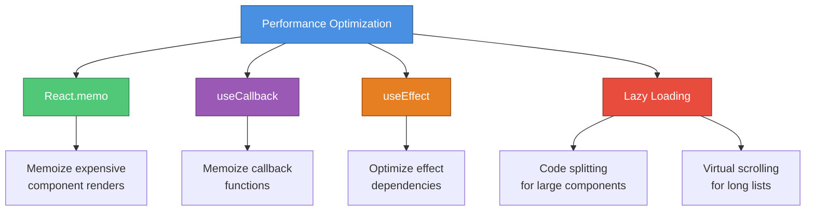

---

## Quick Reference

### Component Import Map

| Component | Import Path | Type Import |
|-----------|-------------|-------------|
| **Chat** | `import { ChatContainer } from '@openframe/frontend-core'` | `import type { Message } from '@openframe/frontend-core'` |
| **Navigation** | `import { Header } from '@openframe/frontend-core'` | `import type { HeaderConfig } from '@openframe/frontend-core'` |
| **Table** | `import { Table } from '@openframe/frontend-core'` | `import type { TableProps } from '@openframe/frontend-core'` |
| **Theme** | `import { DynamicThemeProvider } from '@openframe/frontend-core'` | `import type { DynamicThemeContextType } from '@openframe/frontend-core'` |

### Feature Availability Matrix

| Feature | Chat | Navigation | Table | Theme |
|---------|------|------------|-------|-------|
| **Real-time Updates** | ✅ | ❌ | ❌ | ✅ |
| **Responsive Design** | ✅ | ✅ | ✅ | N/A |
| **Dark Mode** | ✅ | ✅ | ✅ | ✅ |
| **TypeScript** | ✅ | ✅ | ✅ | ✅ |
| **Custom Styling** | ✅ | ✅ | ✅ | ✅ |
| **Accessibility** | ✅ | ✅ | ✅ | ✅ |
| **Mobile Support** | ✅ | ✅ | ✅ | N/A |
| **Loading States** | ✅ | ❌ | ✅ | N/A |

---

## Documentation Navigation

### Start Here
1. **[README](./FRONTEND_CORE_COMPONENTS_README.md)** - Quick start guide
2. **[Main Documentation](./frontend_core_components.md)** - Complete overview
3. **[Summary](./FRONTEND_CORE_COMPONENTS_SUMMARY.md)** - Quick reference

### Deep Dive
- **[Chat System](./frontend_core_chat_system.md)** - Real-time messaging
- **[Navigation](./frontend_core_navigation.md)** - Header and menus
- **[Table](./frontend_core_ui_table.md)** - Data tables
- **[Theme](./frontend_core_theme_provider.md)** - Theming system

---

**Visual Overview Complete** ✅

For detailed documentation, see [Frontend Core Components](./frontend_core_components.md)
