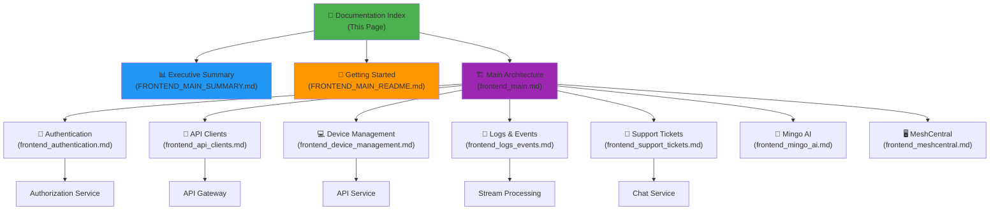

# OpenFrame Frontend - Complete Documentation Index

## 📖 Welcome to OpenFrame Frontend Documentation

This is the complete documentation index for the **OpenFrame Frontend Main Module**, the primary web application interface for the OpenFrame MSP platform.

---

## 🚀 Quick Navigation

### For New Users

1. **[Executive Summary](./FRONTEND_MAIN_SUMMARY.md)** - High-level overview and key features
2. **[Getting Started Guide](./FRONTEND_MAIN_README.md)** - Installation, setup, and first steps
3. **[Main Architecture](./frontend_main.md)** - Complete system architecture and design

### For Developers

1. **[Authentication Module](./frontend_authentication.md)** - Auth flows and session management
2. **[API Clients](./frontend_api_clients.md)** - Backend communication layer
3. **[Device Management](./frontend_device_management.md)** - Device monitoring and control
4. **[Logs & Events](./frontend_logs_events.md)** - Log streaming and analysis

### For System Architects

1. **[System Architecture](./frontend_main.md#architecture-overview)** - High-level architecture diagrams
2. **[Data Flow Patterns](./frontend_main.md#data-flow-architecture)** - Request/response flows
3. **[Integration Points](./frontend_main.md#integration-points)** - Backend service integration
4. **[Security Architecture](./frontend_main.md#security-considerations)** - Security design

---

## 📚 Complete Documentation Structure

### 📄 Main Documentation Files

| Document | Description | Audience |
|----------|-------------|----------|
| **[FRONTEND_MAIN_SUMMARY.md](./FRONTEND_MAIN_SUMMARY.md)** | Executive summary with key metrics and features | Executives, Product Managers |
| **[FRONTEND_MAIN_README.md](./FRONTEND_MAIN_README.md)** | Getting started guide with setup instructions | Developers, DevOps |
| **[frontend_main.md](./frontend_main.md)** | Complete architecture and technical documentation | Architects, Senior Developers |

### 🔧 Sub-Module Documentation

#### Core Infrastructure

| Module | File | Description |
|--------|------|-------------|
| **Authentication** | [frontend_authentication.md](./frontend_authentication.md) | Multi-tenant auth, SSO, session management |
| **API Clients** | [frontend_api_clients.md](./frontend_api_clients.md) | HTTP client layer, token refresh, error handling |

#### Feature Modules

| Module | File | Description |
|--------|------|-------------|
| **Device Management** | [frontend_device_management.md](./frontend_device_management.md) | Device monitoring, remote access, tool integration |
| **Logs & Events** | [frontend_logs_events.md](./frontend_logs_events.md) | Real-time log streaming, filtering, search |
| **Support Tickets** | [frontend_support_tickets.md](./frontend_support_tickets.md) | AI-powered ticketing, real-time chat |
| **Mingo AI Assistant** | [frontend_mingo_ai.md](./frontend_mingo_ai.md) | Conversational AI, automation, context-aware responses |
| **MeshCentral Integration** | [frontend_meshcentral.md](./frontend_meshcentral.md) | Remote desktop, file management, binary protocol |

---

## 🗺️ Documentation Map

---

## 🎯 Documentation by Use Case

### Use Case 1: Setting Up Local Development

**Path**: README → Authentication → API Clients

1. **[Getting Started Guide](./FRONTEND_MAIN_README.md#getting-started)** - Installation and setup
2. **[Environment Configuration](./FRONTEND_MAIN_README.md#environment-configuration)** - Configure env variables
3. **[Authentication Setup](./frontend_authentication.md#development-setup)** - Configure auth mode
4. **[API Client Configuration](./frontend_api_clients.md#configuration)** - Backend URLs

### Use Case 2: Understanding Authentication Flow

**Path**: Main → Authentication → API Clients

1. **[Authentication Overview](./frontend_main.md#authentication-modes)** - Auth modes and patterns
2. **[Authentication Module](./frontend_authentication.md)** - Detailed auth flows
3. **[Token Management](./frontend_authentication.md#token-management)** - Token storage and refresh
4. **[API Client Auth](./frontend_api_clients.md#authentication-handling)** - Request authentication

### Use Case 3: Integrating New Backend Service

**Path**: API Clients → Main → Backend Docs

1. **[API Client Architecture](./frontend_api_clients.md#architecture-overview)** - Client design patterns
2. **[Creating Custom Client](./frontend_api_clients.md#extending-api-clients)** - Extend base client
3. **[Integration Points](./frontend_main.md#integration-points)** - Backend service integration
4. **[Backend Service Docs](./api_service.md)** - Backend API documentation

### Use Case 4: Adding New Feature Module

**Path**: Main → Device Management (as example) → API Clients

1. **[Module Structure](./frontend_main.md#core-sub-modules)** - Module organization
2. **[Device Management Example](./frontend_device_management.md)** - Reference implementation
3. **[State Management](./frontend_main.md#state-management-strategy)** - Zustand patterns
4. **[API Integration](./frontend_api_clients.md)** - Backend communication

### Use Case 5: Troubleshooting Issues

**Path**: README → Troubleshooting → Specific Module

1. **[Common Issues](./FRONTEND_MAIN_README.md#troubleshooting)** - Frequent problems and solutions
2. **[Authentication Issues](./frontend_authentication.md#troubleshooting)** - Auth-specific problems
3. **[API Client Issues](./frontend_api_clients.md#error-handling)** - Network and API errors
4. **[Performance Issues](./frontend_main.md#performance-optimization)** - Performance tuning

---

## 🔍 Documentation by Topic

### Authentication & Security

| Topic | Primary Document | Related Documents |
|-------|------------------|-------------------|
| **Multi-tenant Auth** | [Authentication](./frontend_authentication.md#multi-tenant-architecture) | [Main](./frontend_main.md#authentication-modes) |
| **SSO Integration** | [Authentication](./frontend_authentication.md#sso-integration) | [Auth Service](./authorization_service.md) |
| **Token Management** | [Authentication](./frontend_authentication.md#token-management) | [API Clients](./frontend_api_clients.md#token-refresh) |
| **Session Validation** | [Authentication](./frontend_authentication.md#session-management) | [Main](./frontend_main.md#security-considerations) |
| **Security Best Practices** | [Main](./frontend_main.md#security-considerations) | [README](./FRONTEND_MAIN_README.md#security) |

### API Communication

| Topic | Primary Document | Related Documents |
|-------|------------------|-------------------|
| **Base API Client** | [API Clients](./frontend_api_clients.md#base-api-client) | [Main](./frontend_main.md#api-client-infrastructure) |
| **Token Refresh** | [API Clients](./frontend_api_clients.md#token-refresh-mechanism) | [Authentication](./frontend_authentication.md#token-management) |
| **Error Handling** | [API Clients](./frontend_api_clients.md#error-handling) | [Main](./frontend_main.md#error-handling-strategy) |
| **Fleet MDM Integration** | [API Clients](./frontend_api_clients.md#fleet-api-client) | [Fleet SDK](./fleet_mdm_sdk.md) |
| **Tactical RMM Integration** | [API Clients](./frontend_api_clients.md#tactical-api-client) | [Tactical SDK](./tactical_rmm_sdk.md) |

### Device Management

| Topic | Primary Document | Related Documents |
|-------|------------------|-------------------|
| **Device Data Model** | [Device Management](./frontend_device_management.md#unified-device-model) | [Main](./frontend_main.md#device-management) |
| **Multi-Source Aggregation** | [Device Management](./frontend_device_management.md#data-aggregation) | [API Service](./api_service.md) |
| **Remote Access** | [Device Management](./frontend_device_management.md#remote-access) | [MeshCentral](./frontend_meshcentral.md) |
| **Device Filtering** | [Device Management](./frontend_device_management.md#filtering-and-search) | [Logs](./frontend_logs_events.md#filtering) |

### Logs & Events

| Topic | Primary Document | Related Documents |
|-------|------------------|-------------------|
| **Log Streaming** | [Logs & Events](./frontend_logs_events.md#real-time-streaming) | [Stream Processing](./stream_processing.md) |
| **Cursor Pagination** | [Logs & Events](./frontend_logs_events.md#pagination) | [Main](./frontend_main.md#performance-optimization) |
| **Log Filtering** | [Logs & Events](./frontend_logs_events.md#filtering-and-search) | [Device Management](./frontend_device_management.md#filtering-and-search) |
| **GraphQL Queries** | [Logs & Events](./frontend_logs_events.md#graphql-integration) | [API Service](./api_service.md) |

### Support & AI

| Topic | Primary Document | Related Documents |
|-------|------------------|-------------------|
| **Support Tickets** | [Support Tickets](./frontend_support_tickets.md) | [Main](./frontend_main.md#support-tickets-dialogs) |
| **Real-time Chat** | [Support Tickets](./frontend_support_tickets.md#real-time-messaging) | [Mingo AI](./frontend_mingo_ai.md) |
| **Mingo AI Assistant** | [Mingo AI](./frontend_mingo_ai.md) | [Main](./frontend_main.md#mingo-ai-assistant) |
| **AI Context Management** | [Mingo AI](./frontend_mingo_ai.md#context-management) | [Support Tickets](./frontend_support_tickets.md) |

---

## 🔗 Related Backend Documentation

### Core Backend Services

| Service | Documentation | Integration Point |
|---------|---------------|-------------------|
| **API Service** | [api_service.md](./api_service.md) | GraphQL/REST endpoints |
| **Authorization Service** | [authorization_service.md](./authorization_service.md) | OAuth 2.0 authentication |
| **Gateway Service** | [gateway_service.md](./gateway_service.md) | API routing and proxying |
| **Client Service** | [client_service.md](./client_service.md) | Agent registration |
| **Stream Processing** | [stream_processing.md](./stream_processing.md) | Real-time events |
| **Management Service** | [management_service.md](./management_service.md) | Tool management |

### Data Layer

| Layer | Documentation | Purpose |
|-------|---------------|---------|
| **MongoDB** | [data_layer_mongo.md](./data_layer_mongo.md) | Primary data storage |
| **Core Data** | [data_layer_core.md](./data_layer_core.md) | Analytics and time-series |
| **Kafka** | [data_layer_kafka.md](./data_layer_kafka.md) | Event streaming |

### External Integrations

| Integration | Documentation | Purpose |
|-------------|---------------|---------|
| **Fleet MDM SDK** | [fleet_mdm_sdk.md](./fleet_mdm_sdk.md) | Device management |
| **Tactical RMM SDK** | [tactical_rmm_sdk.md](./tactical_rmm_sdk.md) | Windows agent management |
| **Security Core** | [security_core.md](./security_core.md) | Security primitives |
| **Security OAuth** | [security_oauth.md](./security_oauth.md) | OAuth implementation |

---

## 📊 Documentation Statistics

| Metric | Count |
|--------|-------|
| **Total Documents** | 10 |
| **Main Documents** | 3 |
| **Sub-Module Documents** | 7 |
| **Mermaid Diagrams** | 50+ |
| **Code Examples** | 100+ |
| **Total Pages** | ~200 |

---

## 🎓 Learning Paths

### Path 1: Frontend Developer (Beginner)

1. **Week 1**: [Getting Started](./FRONTEND_MAIN_README.md) + [Main Architecture](./frontend_main.md)
2. **Week 2**: [Authentication](./frontend_authentication.md) + [API Clients](./frontend_api_clients.md)
3. **Week 3**: [Device Management](./frontend_device_management.md) + [Logs & Events](./frontend_logs_events.md)
4. **Week 4**: [Support Tickets](./frontend_support_tickets.md) + [Mingo AI](./frontend_mingo_ai.md)

### Path 2: Full-Stack Developer (Intermediate)

1. **Week 1**: [Frontend Main](./frontend_main.md) + [API Service](./api_service.md)
2. **Week 2**: [Authentication](./frontend_authentication.md) + [Authorization Service](./authorization_service.md)
3. **Week 3**: [API Clients](./frontend_api_clients.md) + [Gateway Service](./gateway_service.md)
4. **Week 4**: [Device Management](./frontend_device_management.md) + [Client Service](./client_service.md)

### Path 3: System Architect (Advanced)

1. **Week 1**: [Executive Summary](./FRONTEND_MAIN_SUMMARY.md) + All Main Docs
2. **Week 2**: All Frontend Sub-Modules
3. **Week 3**: All Backend Services
4. **Week 4**: Data Layer + External Integrations

---

## 🛠️ Documentation Maintenance

### Last Updated

- **FRONTEND_MAIN_SUMMARY.md**: 2024
- **FRONTEND_MAIN_README.md**: 2024
- **frontend_main.md**: 2024
- **All Sub-Modules**: 2024

### Version History

| Version | Date | Changes |
|---------|------|---------|
| **1.0** | 2024 | Initial comprehensive documentation |

### Contributing to Documentation

1. **Fork the repository**
2. **Update documentation files**
3. **Validate Mermaid diagrams**
4. **Submit pull request**
5. **Discuss on Slack** (not GitHub Issues)

---

## 🤝 Community and Support

### Getting Help

- **OpenMSP Slack**: [Join our community](https://join.slack.com/t/openmsp/shared_invite/zt-36bl7mx0h-3~U2nFH6nqHqoTPXMaHEHA)
- **Website**: [https://www.openmsp.ai/](https://www.openmsp.ai/)
- **Flamingo Platform**: [https://flamingo.run](https://flamingo.run)
- **OpenFrame**: [https://openframe.ai](https://openframe.ai)

**Important**: We do not use GitHub Issues or GitHub Discussions. All support and discussions happen on our OpenMSP Slack community.

### Reporting Documentation Issues

1. **Join OpenMSP Slack**
2. **Post in #documentation channel**
3. **Provide specific page and section**
4. **Suggest improvements**

---

## 🎬 Video Resources

Learn more about OpenFrame in action:

---

## 📄 License

OpenFrame is part of the Flamingo open-source MSP platform. See the main repository for license information.

---

**Documentation Maintained by**: Flamingo Team  
**Last Updated**: 2024  
**Version**: 1.0
