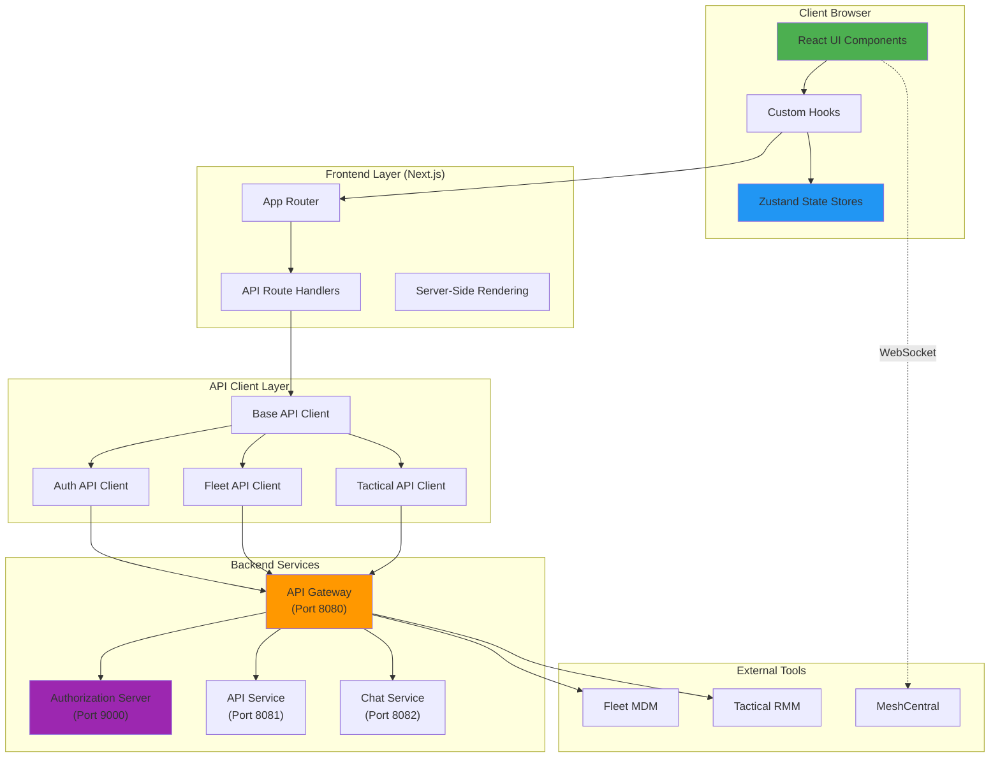
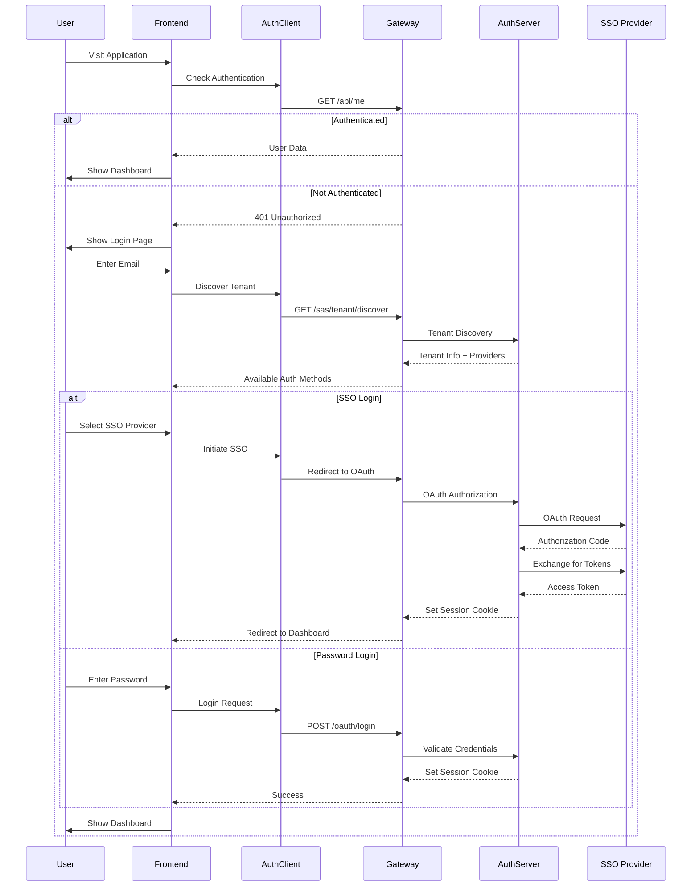
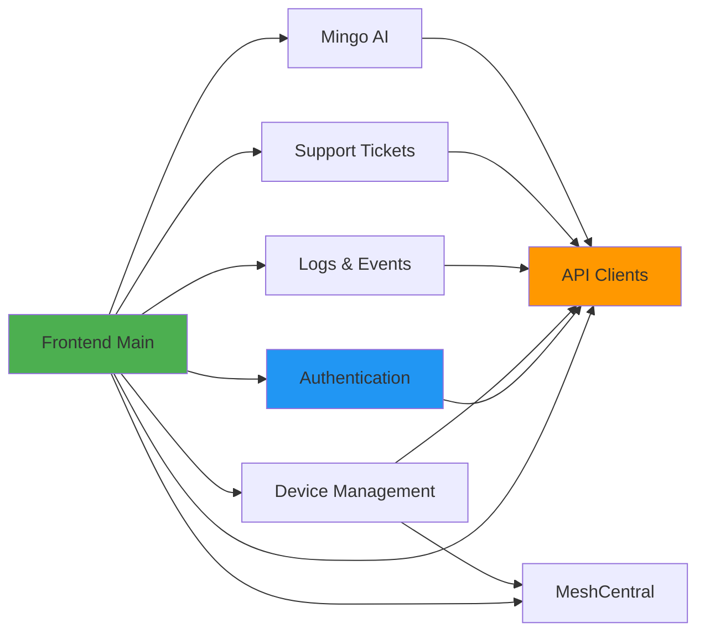

# OpenFrame Frontend - Complete Documentation

## 📚 Documentation Index

This directory contains comprehensive documentation for the **OpenFrame Frontend Main Module**, the primary web application interface for the OpenFrame MSP platform.

---

## 🎯 Quick Start

**New to OpenFrame Frontend?** Start here:

1. **[Frontend Main Overview](./frontend_main.md)** - Architecture, deployment modes, and core concepts
2. **[Authentication Module](./frontend_authentication.md)** - User authentication and multi-tenant support
3. **[API Clients](./frontend_api_clients.md)** - Backend communication and integration

---

## 📖 Complete Module Documentation

### Core Infrastructure

| Module | Description | Key Components |
|--------|-------------|----------------|
| **[Frontend Main](./frontend_main.md)** | Main application architecture and overview | Next.js app, routing, state management |
| **[Authentication](./frontend_authentication.md)** | User authentication and authorization | `useAuth`, `AuthApiClient`, tenant discovery |
| **[API Clients](./frontend_api_clients.md)** | Unified API communication layer | `ApiClient`, `FleetApiClient`, `TacticalApiClient` |

### Feature Modules

| Module | Description | Key Components |
|--------|-------------|----------------|
| **[Device Management](./frontend_device_management.md)** | Device monitoring and management | `Device` type, device list/detail views |
| **[Logs & Events](./frontend_logs_events.md)** | Real-time log streaming and monitoring | `useLogs`, `LogsStore`, GraphQL queries |
| **[Support Tickets](./frontend_support_tickets.md)** | AI-powered support ticket system | `DialogsStore`, `DialogDetailsStore` |
| **[Mingo AI Assistant](./frontend_mingo_ai.md)** | Conversational AI for IT support | `MingoDialogDetailsStore`, message streaming |
| **[MeshCentral Integration](./frontend_meshcentral.md)** | Remote desktop and file management | `MeshDesktop`, binary protocol handling |

---

## 🏗️ System Architecture

### High-Level Architecture



### Authentication Flow



---

## 🔑 Key Features

### Multi-Tenant Architecture

The frontend supports three deployment modes:

1. **SaaS Shared Mode**: Multiple tenants on shared infrastructure with subdomain routing
2. **SaaS Tenant Mode**: Dedicated tenant instances with custom domains
3. **Self-Hosted Mode**: Single-tenant on-premises deployment

### Authentication Modes

- **Cookie-Based (Production)**: Secure HTTP-only cookies for session management
- **Token-Based (Development)**: JWT tokens in localStorage for easier debugging

### Real-Time Features

- **WebSocket Connections**: Live updates for logs, device status, and chat messages
- **Server-Sent Events**: Real-time notifications and alerts
- **Optimistic Updates**: Immediate UI feedback with background sync

### Device Management

- **Unified Device View**: Aggregates data from Fleet MDM, Tactical RMM, and MeshCentral
- **Multi-Source Sync**: Automatic synchronization across management tools
- **Remote Access**: Integrated remote desktop and file management

---

## 🛠️ Technology Stack

### Core Technologies

| Technology | Version | Purpose |
|------------|---------|---------|
| **Next.js** | 14.x | React framework with App Router |
| **React** | 18.x | UI component library |
| **TypeScript** | 5.x | Type-safe development |
| **Zustand** | 4.x | State management |
| **TanStack Query** | 5.x | Server state management |
| **Tailwind CSS** | 3.x | Utility-first CSS framework |

### Key Libraries

- **@flamingo-stack/openframe-frontend-core**: Shared UI components and hooks
- **GraphQL**: API query language for flexible data fetching
- **WebSocket**: Real-time bidirectional communication
- **React Hook Form**: Form state management and validation
- **Zod**: Runtime type validation

---

## 📦 Module Dependencies

### Internal Dependencies



### Backend Service Dependencies

- **[API Service](./api_service.md)**: GraphQL and REST endpoints for core functionality
- **[Authorization Service](./authorization_service.md)**: OAuth 2.0 authentication and authorization
- **[Gateway Service](./gateway_service.md)**: API gateway and request routing
- **[Client Service](./client_service.md)**: Agent registration and device management
- **[Stream Processing](./stream_processing.md)**: Real-time event processing and log aggregation

---

## 🚀 Getting Started

### Prerequisites

```bash
# Node.js 18+ and npm
node --version  # v18.0.0 or higher
npm --version   # 9.0.0 or higher
```

### Installation

```bash
# Clone the repository
git clone https://github.com/flamingo-run/openframe.git
cd openframe/services/openframe-frontend

# Install dependencies
npm install

# Copy environment template
cp .env.example .env.local
```

### Environment Configuration

```bash
# .env.local

# Deployment Mode
NEXT_PUBLIC_SAAS_SHARED_MODE=false

# Backend URLs
NEXT_PUBLIC_SHARED_HOST_URL=http://localhost:8080
NEXT_PUBLIC_TENANT_HOST_URL=http://localhost:8080

# Authentication Mode
NEXT_PUBLIC_ENABLE_DEV_TICKET_OBSERVER=true

# Session Management
NEXT_PUBLIC_AUTH_CHECK_INTERVAL_MS=300000
```

### Development Server

```bash
# Start development server
npm run dev

# Open browser
open http://localhost:3000
```

### Production Build

```bash
# Build for production
npm run build

# Start production server
npm start
```

---

## 🧪 Testing

### Running Tests

```bash
# Unit tests
npm test

# Integration tests
npm run test:integration

# E2E tests
npm run test:e2e

# Test coverage
npm run test:coverage
```

### Test Structure

```text
__tests__/
├── unit/
│   ├── hooks/
│   ├── utils/
│   └── components/
├── integration/
│   ├── api-clients/
│   └── stores/
└── e2e/
    ├── auth.spec.ts
    ├── devices.spec.ts
    └── logs.spec.ts
```

---

## 📊 Performance Metrics

### Key Performance Indicators

| Metric | Target | Current |
|--------|--------|---------|
| **First Contentful Paint** | < 1.5s | ~1.2s |
| **Time to Interactive** | < 3.0s | ~2.5s |
| **Largest Contentful Paint** | < 2.5s | ~2.0s |
| **Cumulative Layout Shift** | < 0.1 | ~0.05 |

### Optimization Strategies

1. **Code Splitting**: Automatic route-based splitting via Next.js
2. **Image Optimization**: Next.js Image component with lazy loading
3. **Bundle Analysis**: Regular bundle size monitoring
4. **Caching**: Aggressive caching of static assets and API responses
5. **Virtual Scrolling**: For large lists (devices, logs)

---

## 🔒 Security

### Security Features

- **Content Security Policy**: Strict CSP headers to prevent XSS
- **HTTPS Only**: All production traffic over HTTPS
- **Secure Cookies**: HTTP-only, Secure, SameSite cookies
- **Token Rotation**: Automatic access token refresh
- **Input Validation**: Client-side and server-side validation
- **CSRF Protection**: Anti-CSRF tokens for state-changing operations

### Security Best Practices

1. **Never log sensitive data**: Tokens, passwords, PII
2. **Sanitize user input**: Prevent XSS attacks
3. **Validate API responses**: Type checking and schema validation
4. **Clear sensitive data**: On logout and session expiry
5. **Use HTTPS**: Always in production

---

## 🐛 Troubleshooting

### Common Issues

#### Authentication Loops

**Symptom**: Infinite redirect between login and dashboard

**Solution**:
```bash
# Clear browser storage
localStorage.clear()
sessionStorage.clear()

# Check environment variables
echo $NEXT_PUBLIC_SHARED_HOST_URL
echo $NEXT_PUBLIC_ENABLE_DEV_TICKET_OBSERVER
```

#### API Connection Errors

**Symptom**: "Failed to fetch" or CORS errors

**Solution**:
```bash
# Verify backend services are running
curl http://localhost:8080/health

# Check CORS configuration in gateway
# Ensure frontend URL is in allowed origins
```

#### Token Refresh Failures

**Symptom**: Frequent logouts or 401 errors

**Solution**:
```typescript
// Check token storage
const accessToken = localStorage.getItem('of_access_token')
const refreshToken = localStorage.getItem('of_refresh_token')

// Verify token expiry
// Check authorization server logs
```

---

## 📈 Monitoring and Observability

### Logging

```typescript
// Structured logging
console.log('[Auth] User logged in:', { userId, tenantId })
console.error('[API] Request failed:', { url, status, error })
```

### Error Tracking

- **Sentry**: Production error tracking and alerting
- **Console Logs**: Development debugging
- **Network Tab**: API request/response inspection

### Performance Monitoring

- **Web Vitals**: Core Web Vitals tracking
- **Lighthouse**: Regular performance audits
- **Bundle Analyzer**: Bundle size monitoring

---

## 🤝 Contributing

### Development Workflow

1. **Fork the repository**
2. **Create a feature branch**: `git checkout -b feature/my-feature`
3. **Make changes and test**: `npm test`
4. **Commit with conventional commits**: `git commit -m "feat: add new feature"`
5. **Push and create PR**: `git push origin feature/my-feature`

### Code Style

- **ESLint**: Automatic linting with `npm run lint`
- **Prettier**: Code formatting with `npm run format`
- **TypeScript**: Strict type checking enabled

---

## 📚 Additional Resources

### Related Backend Services

- **[API Service Documentation](./api_service.md)** - GraphQL/REST API endpoints
- **[Authorization Service Documentation](./authorization_service.md)** - OAuth 2.0 flows
- **[Gateway Service Documentation](./gateway_service.md)** - API routing and proxying
- **[Data Layer (MongoDB) Documentation](./data_layer_mongo.md)** - Primary data storage
- **[Stream Processing Documentation](./stream_processing.md)** - Real-time events

### External Integrations

- **[Fleet MDM SDK](./fleet_mdm_sdk.md)** - Fleet MDM integration
- **[Tactical RMM SDK](./tactical_rmm_sdk.md)** - Tactical RMM integration
- **[Frontend Core Components](./frontend_core_components.md)** - Shared UI library

### Community and Support

- **OpenMSP Slack**: [Join our community](https://join.slack.com/t/openmsp/shared_invite/zt-36bl7mx0h-3~U2nFH6nqHqoTPXMaHEHA)
- **Website**: [https://www.openmsp.ai/](https://www.openmsp.ai/)
- **Flamingo Platform**: [https://flamingo.run](https://flamingo.run)
- **OpenFrame**: [https://openframe.ai](https://openframe.ai)

**Note**: We do not use GitHub Issues or GitHub Discussions. All support and discussions happen on our OpenMSP Slack community.

---

## 📄 License

OpenFrame is part of the Flamingo open-source MSP platform. See the main repository for license information.

---

## 🎬 Demo Video

Learn more about OpenFrame in action:

[](https://www.youtube.com/watch?v=awc-yAnkhIo)

---

**Last Updated**: 2024  
**Version**: 1.0  
**Maintained by**: Flamingo Team
