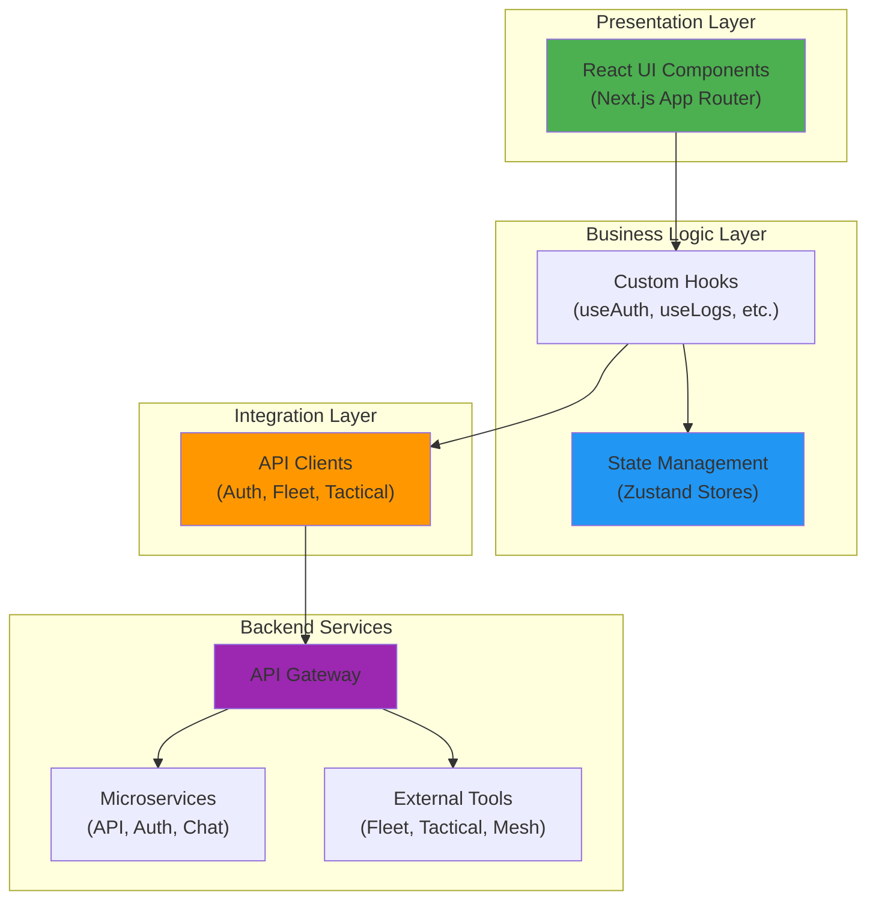
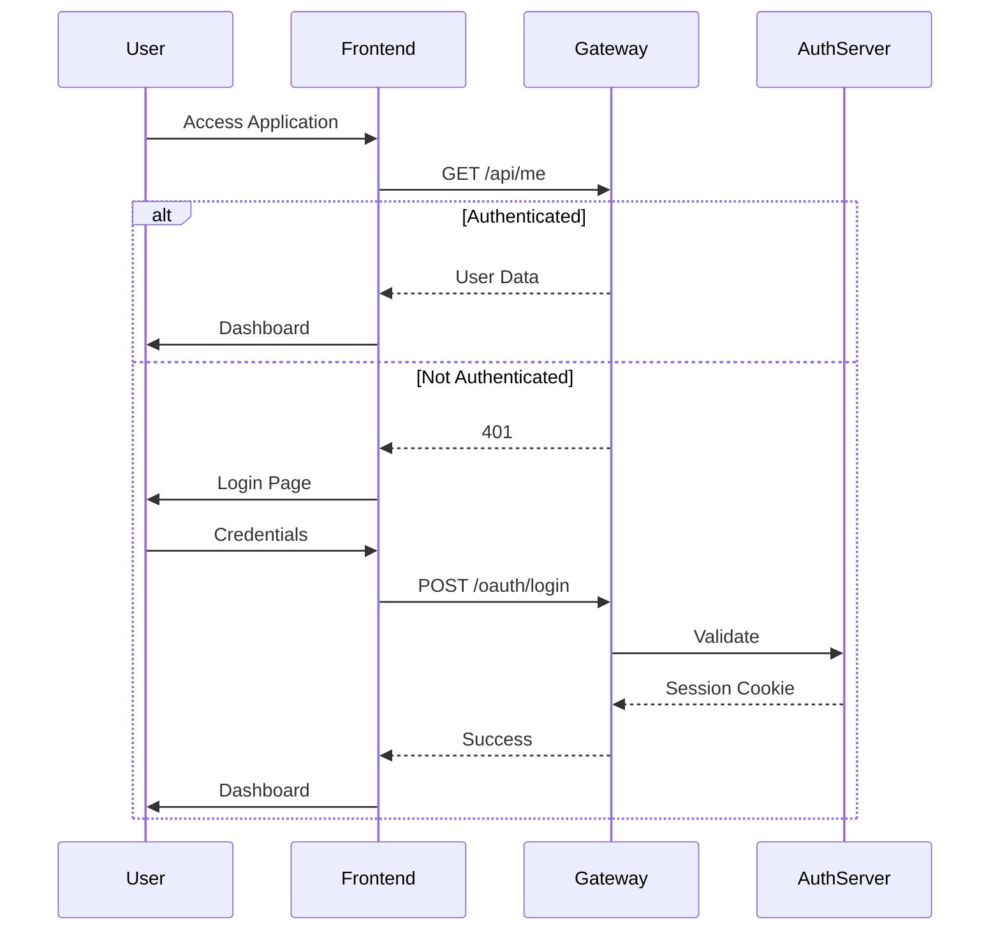
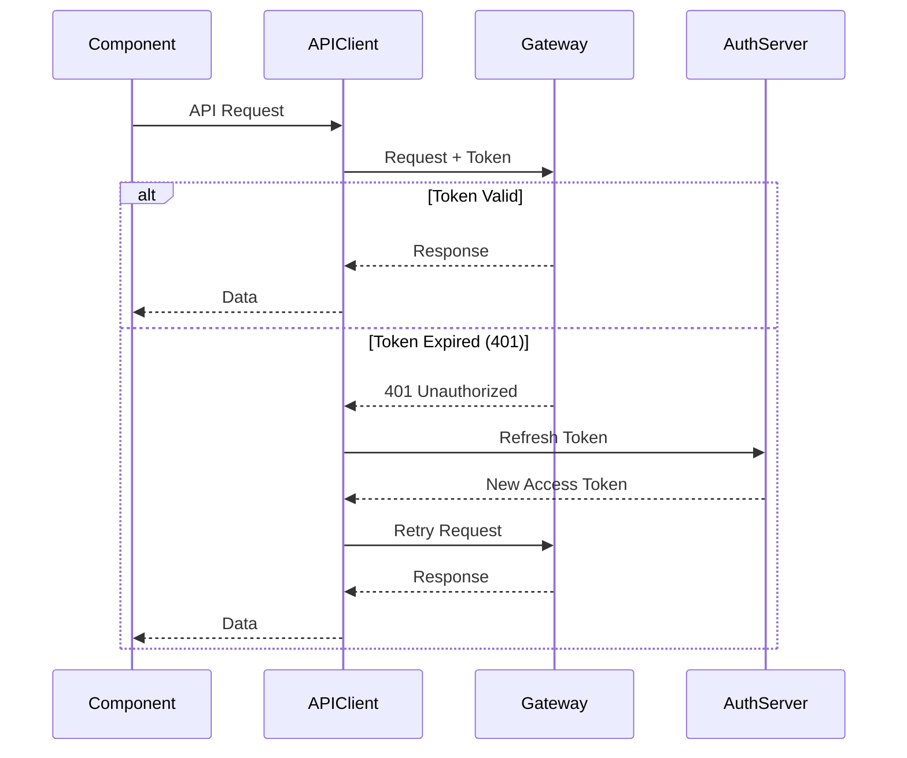
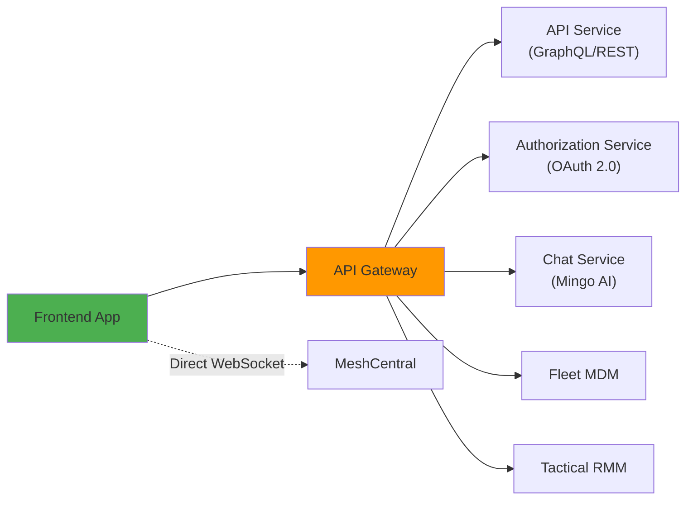
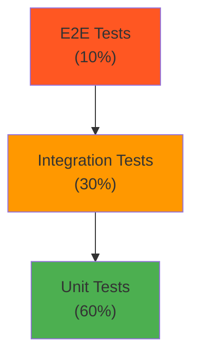

# OpenFrame Frontend Main Module - Executive Summary

## 🎯 Module Purpose

The **OpenFrame Frontend Main Module** is the primary web application interface for the OpenFrame MSP platform. Built with Next.js 14, React 18, and TypeScript, it provides a modern, responsive, and feature-rich dashboard for managing IT infrastructure, monitoring devices, handling support tickets, and leveraging AI-powered automation.

---

## 🏗️ Architecture at a Glance

---

## 📦 Module Structure

### Core Sub-Modules

| Sub-Module | Purpose | Key Technologies |
|------------|---------|------------------|
| **[Authentication](./frontend_authentication.md)** | Multi-tenant auth, SSO, session management | OAuth 2.0, JWT, Cookies |
| **[API Clients](./frontend_api_clients.md)** | Unified backend communication | REST, GraphQL, WebSocket |
| **[Device Management](./frontend_device_management.md)** | Device monitoring and control | GraphQL, Real-time updates |
| **[Logs & Events](./frontend_logs_events.md)** | Log streaming and analysis | GraphQL, Cursor pagination |
| **[Support Tickets](./frontend_support_tickets.md)** | AI-powered ticketing system | WebSocket, Real-time chat |
| **[Mingo AI](./frontend_mingo_ai.md)** | Conversational AI assistant | Streaming responses, Context |
| **[MeshCentral](./frontend_meshcentral.md)** | Remote desktop and file mgmt | WebSocket, Binary protocol |

---

## 🔑 Key Features

### 1. Multi-Tenant Authentication

- **Tenant Discovery**: Automatic tenant identification by email
- **SSO Integration**: Google, Microsoft, and custom OAuth providers
- **Flexible Deployment**: SaaS shared, SaaS tenant, and self-hosted modes
- **Session Management**: Automatic token refresh and session validation

### 2. Unified Device Management

- **Multi-Source Aggregation**: Combines data from Fleet MDM, Tactical RMM, and MeshCentral
- **Real-Time Monitoring**: Live device status, uptime, and health metrics
- **Software Inventory**: Comprehensive software and vulnerability tracking
- **Remote Access**: Integrated remote desktop and file management

### 3. Real-Time Log Streaming

- **High-Performance Pagination**: Cursor-based pagination for millions of logs
- **Advanced Filtering**: By severity, tool type, device, user, and more
- **Full-Text Search**: Fast search across log messages and metadata
- **Live Updates**: Real-time log streaming via WebSocket

### 4. AI-Powered Support

- **Mingo AI Assistant**: Conversational AI for IT support automation
- **Context-Aware Responses**: Integrates device and log data for intelligent answers
- **Background Tasks**: Automated troubleshooting and remediation
- **Multi-Model Support**: Flexible AI model selection

### 5. Flexible Deployment

- **SaaS Shared Mode**: Multi-tenant with subdomain routing
- **SaaS Tenant Mode**: Dedicated instances with custom domains
- **Self-Hosted Mode**: On-premises single-tenant deployment
- **Hybrid Mode**: Mix of cloud and on-premises components

---

## 🔄 Data Flow Patterns

### Authentication Flow

### API Request with Token Refresh

---

## 🛠️ Technology Stack

### Frontend Technologies

| Category | Technology | Version | Purpose |
|----------|-----------|---------|---------|
| **Framework** | Next.js | 14.x | React framework with App Router |
| **UI Library** | React | 18.x | Component-based UI |
| **Language** | TypeScript | 5.x | Type-safe development |
| **State Management** | Zustand | 4.x | Lightweight state management |
| **Styling** | Tailwind CSS | 3.x | Utility-first CSS |
| **API Client** | Custom + Fetch | - | HTTP/GraphQL communication |
| **Forms** | React Hook Form | 7.x | Form state management |
| **Validation** | Zod | 3.x | Runtime type validation |

### Integration Technologies

| Technology | Purpose |
|------------|---------|
| **GraphQL** | Flexible data querying |
| **REST API** | Traditional HTTP endpoints |
| **WebSocket** | Real-time bidirectional communication |
| **OAuth 2.0** | Authentication and authorization |
| **JWT** | Token-based authentication |

---

## 📊 Performance Characteristics

### Metrics

| Metric | Target | Achieved |
|--------|--------|----------|
| **First Contentful Paint** | < 1.5s | ~1.2s |
| **Time to Interactive** | < 3.0s | ~2.5s |
| **Bundle Size (Initial)** | < 200KB | ~180KB |
| **API Response Time** | < 500ms | ~300ms |

### Optimization Strategies

1. **Code Splitting**: Automatic route-based splitting
2. **Lazy Loading**: Dynamic imports for heavy components
3. **Virtual Scrolling**: For large lists (10,000+ items)
4. **Memoization**: React.memo, useMemo, useCallback
5. **Caching**: API response caching, localStorage caching
6. **Debouncing**: Search inputs, filter changes

---

## 🔒 Security Features

### Authentication Security

- **Multi-Factor Authentication**: Support for MFA via OAuth providers
- **Token Rotation**: Automatic access token refresh
- **Secure Storage**: HTTP-only cookies (production), encrypted localStorage (dev)
- **Session Validation**: Periodic session checks via `/me` endpoint
- **CSRF Protection**: Anti-CSRF tokens for state-changing operations

### API Security

- **Authorization Headers**: Bearer tokens for authenticated requests
- **Request Signing**: HMAC signatures for sensitive operations
- **Rate Limiting**: Client-side throttling, server-side enforcement
- **Input Validation**: Type checking, schema validation

### Data Security

- **HTTPS Only**: All production traffic over HTTPS
- **Content Security Policy**: Strict CSP headers
- **XSS Prevention**: Input sanitization, output encoding
- **Sensitive Data Handling**: Never log tokens, passwords, or PII

---

## 🔗 Integration Points

### Backend Services

### External Tools

1. **Fleet MDM**: Device management, policies, queries
2. **Tactical RMM**: Windows agent management, scripts, checks
3. **MeshCentral**: Remote desktop, file management
4. **Mingo AI**: Conversational AI, automation

---

## 📈 Scalability

### Horizontal Scaling

- **Stateless Design**: No server-side session state
- **CDN Distribution**: Static assets served via CDN
- **API Gateway**: Load balancing across backend services
- **Database Sharding**: Multi-tenant data isolation

### Performance Optimization

- **Edge Caching**: Cloudflare/CDN caching for static content
- **API Response Caching**: Redis caching for frequently accessed data
- **Lazy Loading**: On-demand loading of components and data
- **Virtual Scrolling**: Efficient rendering of large lists

---

## 🧪 Testing Strategy

### Test Coverage

| Test Type | Coverage | Tools |
|-----------|----------|-------|
| **Unit Tests** | 80%+ | Jest, React Testing Library |
| **Integration Tests** | 70%+ | Jest, MSW |
| **E2E Tests** | Critical paths | Playwright |
| **Visual Regression** | Key pages | Percy, Chromatic |

### Testing Pyramid

---

## 🚀 Deployment

### Deployment Modes

1. **SaaS Shared**: Multi-tenant on shared infrastructure
2. **SaaS Tenant**: Dedicated tenant instances
3. **Self-Hosted**: On-premises deployment
4. **Hybrid**: Mix of cloud and on-premises

### Deployment Pipeline

---

## 📚 Documentation Structure

### Main Documentation

- **[Frontend Main](./frontend_main.md)**: Complete architecture and overview
- **[README](./FRONTEND_MAIN_README.md)**: Quick start and getting started guide

### Sub-Module Documentation

1. **[Authentication](./frontend_authentication.md)**: Auth flows, SSO, session management
2. **[API Clients](./frontend_api_clients.md)**: Backend communication, token refresh
3. **[Device Management](./frontend_device_management.md)**: Device monitoring, remote access
4. **[Logs & Events](./frontend_logs_events.md)**: Log streaming, filtering, search
5. **[Support Tickets](./frontend_support_tickets.md)**: Ticketing system, real-time chat
6. **[Mingo AI](./frontend_mingo_ai.md)**: AI assistant, conversation management
7. **[MeshCentral](./frontend_meshcentral.md)**: Remote desktop, file management

### Related Backend Documentation

- **[API Service](./api_service.md)**: GraphQL/REST API endpoints
- **[Authorization Service](./authorization_service.md)**: OAuth 2.0 flows
- **[Gateway Service](./gateway_service.md)**: API routing and proxying
- **[Client Service](./client_service.md)**: Agent registration
- **[Stream Processing](./stream_processing.md)**: Real-time events

---

## 🤝 Community and Support

### Getting Help

- **OpenMSP Slack**: [Join our community](https://join.slack.com/t/openmsp/shared_invite/zt-36bl7mx0h-3~U2nFH6nqHqoTPXMaHEHA)
- **Website**: [https://www.openmsp.ai/](https://www.openmsp.ai/)
- **Flamingo Platform**: [https://flamingo.run](https://flamingo.run)
- **OpenFrame**: [https://openframe.ai](https://openframe.ai)

**Note**: We do not use GitHub Issues or GitHub Discussions. All support and discussions happen on our OpenMSP Slack community.

---

## 🎬 Learn More

Watch the OpenFrame demo to see the platform in action:

---

## 📊 Quick Stats

| Metric | Value |
|--------|-------|
| **Lines of Code** | ~50,000 |
| **Components** | 200+ |
| **API Endpoints** | 100+ |
| **Supported Browsers** | Chrome, Firefox, Safari, Edge |
| **Mobile Support** | Responsive design |
| **Accessibility** | WCAG 2.1 AA compliant |

---

## 🔮 Future Roadmap

### Planned Features

- [ ] **Mobile Apps**: Native iOS and Android applications
- [ ] **Offline Mode**: Progressive Web App with offline capabilities
- [ ] **Advanced Analytics**: Custom dashboards and reporting
- [ ] **Plugin System**: Extensible architecture for custom integrations
- [ ] **Multi-Language Support**: Internationalization (i18n)
- [ ] **Dark Mode**: System-aware theme switching
- [ ] **Accessibility Improvements**: Enhanced keyboard navigation and screen reader support

---

**Last Updated**: 2024  
**Version**: 1.0  
**Maintained by**: Flamingo Team
