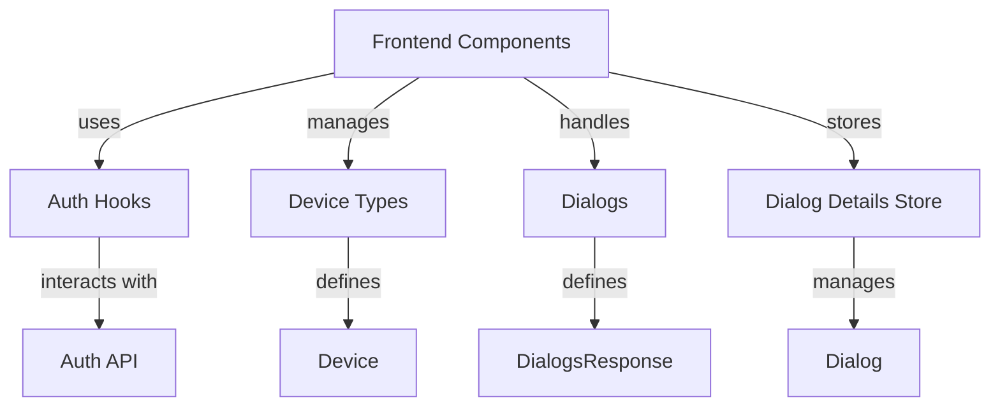

# Frontend Components Documentation

## Overview
The Frontend Components module is a crucial part of the Flamingo platform, providing the user interface and interaction logic for various functionalities. This module integrates with backend services to manage authentication, device management, and dialog handling, ensuring a seamless user experience.

## Architecture Overview
The architecture of the Frontend Components module is designed to facilitate interaction with various services while maintaining a clean and efficient structure. Below is a diagram illustrating the key components and their relationships:

## Core Components

### Auth Hooks
- **Component:** `TenantInfo`
- **Purpose:** Manages authentication state and tenant information.
- **Documentation:** Refer to [Auth Hooks](Auth Hooks.md)

### Device Types
- **Component:** `Device`
- **Purpose:** Defines the structure and properties of devices managed within the system.
- **Documentation:** Refer to [Device Types](Device Types.md)

### Dialogs
- **Component:** `DialogsResponse`
- **Purpose:** Represents the response structure for dialog-related queries.
- **Documentation:** Refer to [Dialogs](Dialogs.md)

### Dialog Details Store
- **Component:** `DialogDetailsStore`
- **Purpose:** Manages the state and interactions for dialog details, including fetching messages and updating dialog status.
- **Documentation:** Refer to [Dialog Details Store](Dialog Details Store.md)
The Frontend Components module consists of several core components, each responsible for specific functionalities:

### 1. Auth Hooks
- **Component:** `TenantInfo`
- **Purpose:** Manages authentication state and tenant information.
- **Documentation:** Refer to [use-auth.ts](openframe/services/openframe-frontend/src/app/auth/hooks/use-auth.ts)

### 2. Device Types
- **Component:** `Device`
- **Purpose:** Defines the structure and properties of devices managed within the system.
- **Documentation:** Refer to [device.types.ts](openframe/services/openframe-frontend/src/app/devices/types/device.types.ts)

### 3. Dialogs
- **Component:** `DialogsResponse`
- **Purpose:** Represents the response structure for dialog-related queries.
- **Documentation:** Refer to [dialog.types.ts](openframe/services/openframe-frontend/src/app/mingo/types/dialog.types.ts)

### 4. Dialog Details Store
- **Component:** `DialogDetailsStore`
- **Purpose:** Manages the state and interactions for dialog details, including fetching messages and updating dialog status.
- **Documentation:** Refer to [dialog-details-store.ts](openframe/services/openframe-frontend/src/app/tickets/stores/dialog-details-store.ts)

## Conclusion
The Frontend Components module plays a vital role in the Flamingo platform, enabling users to interact with various services efficiently. For further details on each component, please refer to the linked documentation files.