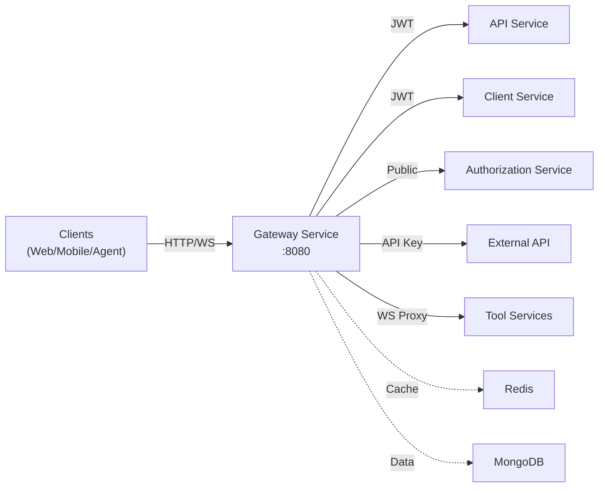

# Gateway Service Documentation

## Quick Navigation

This directory contains comprehensive documentation for the **OpenFrame Gateway Service** - the central API gateway and entry point for the OpenFrame platform.

---

## 📚 Documentation Structure

### Main Documentation
- **[Gateway Service](gateway_service.md)** - Complete overview, architecture, and feature documentation

### Sub-Module Documentation
1. **[Gateway Configuration](gateway_service_configuration.md)** - HTTP client, WebSocket routing, and CORS configuration
2. **[Gateway Security](gateway_service_security.md)** - JWT authentication, API key validation, and rate limiting
3. **[Gateway Application](gateway_service_application.md)** - Spring Boot application entry point and deployment

---

## 🎯 What is the Gateway Service?

The Gateway Service is a **reactive API gateway** built on Spring Cloud Gateway that provides:

- ✅ **Unified Entry Point**: Single ingress for all HTTP/HTTPS and WebSocket traffic
- ✅ **Multi-Tenant JWT Authentication**: Dynamic issuer resolution with caching
- ✅ **API Key Authentication**: Secure external API access with rate limiting
- ✅ **WebSocket Proxying**: Real-time communication routing to tools and NATS
- ✅ **Request Routing**: Intelligent routing to backend microservices
- ✅ **Rate Limiting**: Token bucket algorithm with minute/hour/day windows
- ✅ **CORS Management**: Configurable cross-origin policies

---

## 🏗️ Architecture at a Glance



---

## 🚀 Quick Start

### Prerequisites
- Java 21+
- Spring Boot 3.x
- Redis (for rate limiting)
- MongoDB (for tenant/API key data)

### Running Locally

```bash
# Clone the repository
git clone https://github.com/openframe/openframe.git
cd openframe/services/openframe-gateway

# Configure environment
export ISSUER_BASE=https://auth.openframe.ai
export REDIS_HOST=localhost
export NATS_WS_URL=ws://localhost:4222

# Run the service
./mvnw spring-boot:run
```

### Docker Deployment

```bash
docker run -p 8080:8080 \
  -e ISSUER_BASE=https://auth.openframe.ai \
  -e REDIS_HOST=redis \
  -e NATS_WS_URL=ws://nats:4222 \
  openframe/gateway:latest
```

---

## 🔑 Key Features

### 1. JWT Authentication

Multi-tenant JWT validation with dynamic issuer resolution:

```yaml
openframe:
  security:
    jwt:
      cache:
        expire-after: 1h
        refresh-after: 30m
        maximum-size: 100
      allowed-issuer-base: https://auth.openframe.ai
```

**Supported Token Sources:**
- `Authorization: Bearer {token}` header
- `access_token` cookie
- `Access-Token` custom header
- `?authorization={token}` query parameter (WebSocket)

### 2. API Key Authentication

External API access with rate limiting:

```bash
# API Key Format: ak_{keyId}.sk_{secret}
curl -H "X-API-Key: ak_1a2b3c4d.sk_9i0j1k2l3m4n5o6p" \
  https://api.openframe.ai/external-api/devices
```

**Rate Limit Headers:**
```http
X-RateLimit-Limit-Minute: 60
X-RateLimit-Remaining-Minute: 45
X-RateLimit-Limit-Hour: 1000
X-RateLimit-Remaining-Hour: 850
```

### 3. WebSocket Proxying

Real-time communication routing:

| Route | Target | Role Required |
|-------|--------|---------------|
| `/ws/tools/agent/{toolId}/**` | Tool Services | `AGENT` |
| `/ws/tools/{toolId}/**` | Tool Services | `ADMIN` |
| `/ws/nats` | NATS Server | `AGENT` or `ADMIN` |

### 4. Request Routing

Path-based routing to backend services:

| Path | Service | Auth |
|------|---------|------|
| `/dashboard/**` | API Service | JWT + `ROLE_ADMIN` |
| `/clients/**` | Client Service | JWT + `ROLE_AGENT` |
| `/external-api/**` | External API | API Key |
| `/actuator/**` | Gateway Actuator | Public |

---

## 📖 Documentation Guide

### For Developers

1. **Start Here**: [Gateway Service](gateway_service.md) - Complete overview
2. **Configuration**: [Gateway Configuration](gateway_service_configuration.md) - Setup and tuning
3. **Security**: [Gateway Security](gateway_service_security.md) - Authentication and authorization
4. **Deployment**: [Gateway Application](gateway_service_application.md) - Running in production

### For Operators

1. **Deployment**: See [Deployment section](gateway_service.md#deployment) in main docs
2. **Monitoring**: See [Monitoring & Observability](gateway_service.md#monitoring--observability)
3. **Troubleshooting**: See [Troubleshooting](gateway_service.md#troubleshooting)
4. **Performance**: See [Performance Tuning](gateway_service.md#performance-tuning)

### For Security Teams

1. **Security Model**: [Gateway Security](gateway_service_security.md)
2. **JWT Validation**: See [Multi-Tenant JWT Authentication](gateway_service.md#1-multi-tenant-jwt-authentication)
3. **API Key Management**: See [API Key Authentication & Rate Limiting](gateway_service.md#2-api-key-authentication--rate-limiting)
4. **Threat Mitigation**: See [Security Considerations](gateway_service.md#security-considerations)

---

## 🔗 Related Services

The Gateway Service integrates with these OpenFrame services:

- **[API Service](api_service.md)**: Main API endpoints for admin dashboard
- **[Client Service](client_service.md)**: Agent communication and device management
- **[Authorization Service](authorization_service.md)**: OAuth2/OIDC authentication
- **[External API Service](external_api.md)**: Public API with API key authentication
- **[Management Service](management_service.md)**: Tool integration management
- **[Security Core](security_core.md)**: Shared security utilities
- **[Data Layer (Mongo)](data_layer_mongo.md)**: Database repositories

---

## 🛠️ Configuration Reference

### Essential Environment Variables

| Variable | Description | Default |
|----------|-------------|---------|
| `ISSUER_BASE` | Base URL for JWT issuers | `https://auth.openframe.ai` |
| `SUPER_TENANT_ID` | Super tenant identifier | `system` |
| `NATS_WS_URL` | NATS WebSocket URL | `ws://nats:4222` |
| `REDIS_HOST` | Redis host for rate limiting | `localhost` |
| `REDIS_PORT` | Redis port | `6379` |

### Rate Limiting Configuration

```yaml
openframe:
  rate-limit:
    enabled: true
    fail-open: true
    include-headers: true
    default-requests-per-minute: 60
    default-requests-per-hour: 1000
    default-requests-per-day: 10000
```

### CORS Configuration

```yaml
spring:
  cloud:
    gateway:
      globalcors:
        cors-configurations:
          '[/**]':
            allowed-origins: "*"
            allowed-methods: "*"
            allowed-headers: "*"
            allow-credentials: true
```

---

## 📊 Monitoring

### Health Checks

```bash
# Liveness
curl http://localhost:8080/actuator/health

# Readiness
curl http://localhost:8080/actuator/health/readiness
```

### Metrics

```bash
# Prometheus metrics
curl http://localhost:8080/actuator/metrics

# Specific metric
curl http://localhost:8080/actuator/metrics/gateway.requests.total
```

### Key Metrics

- `gateway.requests.total`: Total requests processed
- `gateway.requests.duration`: Request duration histogram
- `gateway.rate_limit.exceeded`: Rate limit violations
- `gateway.jwt.validation.failures`: JWT validation failures
- `gateway.websocket.connections`: Active WebSocket connections

---

## 🐛 Troubleshooting

### Common Issues

#### JWT Validation Failures
```bash
# Check JWT claims
echo $JWT_TOKEN | cut -d'.' -f2 | base64 -d | jq
```

#### Rate Limit Exceeded
```bash
# Check rate limit status
curl -H "X-API-Key: ak_xxx.sk_xxx" \
  http://localhost:8080/external-api/health
```

#### WebSocket Connection Failures
```javascript
// Include JWT in WebSocket URL
const ws = new WebSocket(
  `ws://localhost:8080/ws/nats?authorization=${jwtToken}`
);
```

See [Troubleshooting Guide](gateway_service.md#troubleshooting) for more details.

---

## 🔒 Security Best Practices

1. **JWT Validation**
   - Always validate issuer against allowlist
   - Check token expiration and not-before claims
   - Verify signature with cached public keys

2. **API Key Management**
   - Store hashed keys only (BCrypt)
   - Use strong random secrets (min 16 chars)
   - Implement key rotation policies

3. **Rate Limiting**
   - Configure appropriate limits per use case
   - Use fail-open strategy for high availability
   - Monitor rate limit violations

4. **WebSocket Security**
   - Validate JWT before connection upgrade
   - Enforce role-based access per route
   - Implement connection timeouts

See [Security Considerations](gateway_service.md#security-considerations) for complete guide.

---

## 📚 Additional Resources

### OpenFrame Platform
- **Website**: [https://www.flamingo.run/openframe](https://www.flamingo.run/openframe)
- **Flamingo AI MSP**: [https://flamingo.run](https://flamingo.run)
- **OpenMSP Community**: [https://www.openmsp.ai/](https://www.openmsp.ai/)

### Community Support
- **Slack**: [Join OpenMSP Slack](https://join.slack.com/t/openmsp/shared_invite/zt-36bl7mx0h-3~U2nFH6nqHqoTPXMaHEHA)

### Documentation
- [Gateway Service](gateway_service.md) - Main documentation
- [Gateway Configuration](gateway_service_configuration.md) - Configuration details
- [Gateway Security](gateway_service_security.md) - Security implementation
- [Gateway Application](gateway_service_application.md) - Application setup

---

## 📝 Version Information

- **Last Updated**: 2024
- **Version**: 1.0
- **Spring Boot**: 3.x
- **Spring Cloud Gateway**: 4.x
- **Java**: 21+

---

## 🤝 Contributing

We welcome contributions! Please join our Slack community for discussions:

**Slack Community**: [OpenMSP Slack](https://join.slack.com/t/openmsp/shared_invite/zt-36bl7mx0h-3~U2nFH6nqHqoTPXMaHEHA)

---

**Need Help?** Check the [Troubleshooting Guide](gateway_service.md#troubleshooting) or join our Slack community!
