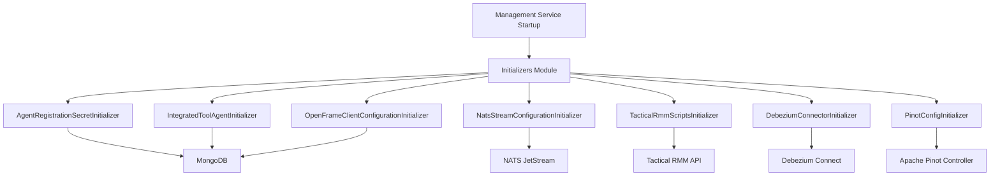
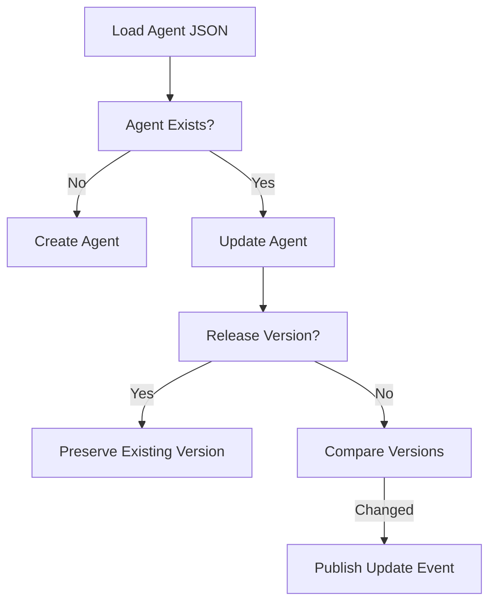
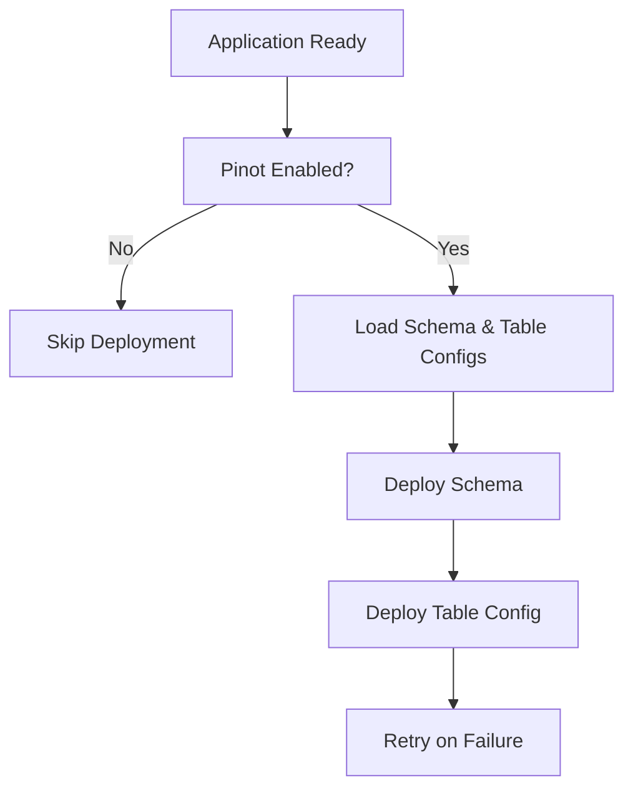

# Initializers Module

## Overview

The **Initializers** module is part of the **management_service_core** and is responsible for bootstrapping critical configuration, metadata, and external-system state when the OpenFrame Management service starts.

These components ensure that:
- Required secrets and default configurations exist
- Integrated tools and agents are pre-registered and version-aware
- Messaging, streaming, and analytics backends are provisioned
- External systems (Tactical RMM, Debezium, Pinot) are synchronized with OpenFrame state

The module relies heavily on Spring Boot lifecycle hooks (`ApplicationRunner`, `@PostConstruct`, and `ApplicationReadyEvent`) to execute initialization logic at the correct phase of application startup.

---

## Responsibilities at a Glance

- **Security bootstrap**: Create initial agent registration secrets
- **Agent & tool bootstrap**: Load IntegratedToolAgent definitions and client defaults
- **Messaging bootstrap**: Provision NATS JetStream streams
- **External tool sync**: Install or update Tactical RMM scripts
- **CDC bootstrap**: Initialize Debezium connectors if missing
- **Analytics bootstrap**: Deploy Pinot schemas and table configurations

---

## High-Level Architecture

---

## Component Breakdown

### AgentRegistrationSecretInitializer

**Purpose**
- Ensures an initial agent registration secret exists
- Enables secure onboarding of OpenFrame client agents

**Lifecycle Hook**
- Implements `ApplicationRunner`

**Key Behavior**
- Executes on application startup
- Calls `AgentRegistrationSecretManagementService.createInitialSecret()`
- Logs and safely handles failures

**Dependencies**
- Management service layer
- Persistent storage (MongoDB)

---

### IntegratedToolAgentInitializer

**Purpose**
- Loads and synchronizes `IntegratedToolAgent` definitions from classpath JSON resources
- Detects version changes and publishes update events

**Lifecycle Hook**
- `@PostConstruct`

**Key Behavior**
- Reads agent configuration paths from `AgentConfigurationProperties`
- Creates or updates agents in persistence
- Preserves versions for release agents
- Publishes update events when versions change

**Dependencies**
- `IntegratedToolAgentService`
- `ToolAgentUpdateUpdatePublisher`
- Jackson `ObjectMapper`

**Version Update Flow**

---

### NatsStreamConfigurationInitializer

**Purpose**
- Provisions required NATS JetStream streams

**Lifecycle Hook**
- `@PostConstruct`

**Configured Streams**
- TOOL_INSTALLATION
- CLIENT_UPDATE
- TOOL_UPDATE
- TOOL_CONNECTIONS
- INSTALLED_AGENTS

**Key Behavior**
- Uses predefined `StreamConfiguration` definitions
- Idempotently saves configurations via `NatsStreamManagementService`

**Dependencies**
- NATS JetStream

---

### OpenFrameClientConfigurationInitializer

**Purpose**
- Initializes the default OpenFrame client configuration

**Lifecycle Hook**
- `@PostConstruct`

**Key Behavior**
- Loads `client-configuration.json` from resources
- Ensures a single default configuration (`id = default`)
- Preserves existing version on updates

**Dependencies**
- `OpenFrameClientConfigurationService`
- MongoDB

---

### TacticalRmmScriptsInitializer

**Purpose**
- Ensures required OpenFrame scripts exist in Tactical RMM

**Lifecycle Hook**
- Implements `ApplicationRunner`

**Key Behavior**
- Retrieves Tactical RMM API details from `IntegratedTool`
- Loads script content from classpath resources
- Creates or updates scripts via Tactical RMM API

**Example Script Use Case**
- OpenFrame Client update to latest version

**Dependencies**
- Tactical RMM API
- `IntegratedToolService`
- `ToolUrlService`

---

### DebeziumConnectorInitializer

**Purpose**
- Bootstraps Debezium connectors from persisted tool definitions

**Lifecycle Hook**
- `ApplicationReadyEvent`

**Conditional Activation**
- Enabled only if `openframe.debezium.health-check.enabled` is `true`

**Key Behavior**
- Checks if connectors already exist
- If none exist, loads connector definitions from `IntegratedTool` documents
- Creates or updates connectors through `DebeziumService`

**Dependencies**
- Debezium Connect
- Integrated tool metadata

---

### PinotConfigInitializer

**Purpose**
- Deploys Pinot schemas and table configurations for analytics

**Lifecycle Hook**
- `ApplicationReadyEvent`

**Key Behavior**
- Loads schema and table JSON files from classpath
- Resolves environment placeholders
- Creates or updates Pinot schemas and tables
- Retries on transient connectivity failures

**Managed Datasets**
- Devices
- Logs

**Dependencies**
- Apache Pinot Controller
- Spring `RestTemplate`

**Deployment Flow**

---

## Execution Order and Lifecycle

| Phase | Initializers |
|------|--------------|
| Bean construction | `@PostConstruct` initializers |
| Application startup | `ApplicationRunner` initializers |
| Application ready | `ApplicationReadyEvent` listeners |

This staged approach ensures that:
- Internal state is prepared early
- External systems are contacted only when the application is fully ready

---

## How This Module Fits the Platform

The Initializers module acts as the **bootstrap backbone** for OpenFrame Management:
- It bridges persisted configuration with runtime systems
- It ensures idempotent, repeatable startup behavior
- It reduces manual operational steps for new deployments

Other modules (controllers, schedulers, processors) rely on these initializers to guarantee that the underlying platform state is consistent and ready.

---

## Operational Notes

- Initializers are designed to be **safe to re-run**
- Failures are logged but generally do not block startup unless critical
- External dependencies (Pinot, Debezium, Tactical RMM) must be reachable for full initialization

For deeper details on related runtime behavior, refer to the management service and data layer documentation.
