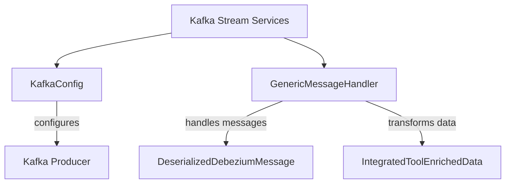

# Kafka Stream Services Documentation

## Overview
The Kafka Stream Services module is responsible for handling streaming data within the Flamingo platform. It integrates with Kafka to process and manage real-time data streams, enabling efficient data handling and transformation.

## Architecture Overview
The Kafka Stream Services module consists of two core components:
1. **KafkaConfig**: Configures Kafka settings and message type conversions.
2. **GenericMessageHandler**: An abstract class that provides a framework for handling messages from Kafka streams.

### Architecture Diagram


## Core Components

### 1. KafkaConfig
- **Package**: `com.openframe.stream.config`
- **Purpose**: Configures Kafka settings and provides a message type converter.
- **Key Functionality**:
  - Converts byte arrays to `MessageType` enums.

#### Code Snippet:
```java
@Bean
public Converter<byte[], MessageType> messageTypeConverter() {
    return new Converter<byte[], MessageType>() {
        @Override
        public MessageType convert(byte[] source) {
            try {
                String stringValue = new String(source, StandardCharsets.UTF_8);
                return MessageType.valueOf(stringValue.toUpperCase());
            } catch (IllegalArgumentException e) {
                return null;
            }
        }
    };
}
```

### 2. GenericMessageHandler
- **Package**: `com.openframe.stream.handler`
- **Purpose**: Abstract class for handling messages from Kafka streams.
- **Key Functionality**:
  - Validates messages, transforms data, and pushes data based on operation type.

#### Code Snippet:
```java
protected void pushData(T data, OperationType operationType) {
    switch (operationType) {
        case READ -> handleRead(data);
        case CREATE -> handleCreate(data);
        case UPDATE -> handleUpdate(data);
        case DELETE -> handleDelete(data);
    }
}
```

## Integration with Other Modules
The Kafka Stream Services module interacts with the following modules:
- **API Services**: Utilizes the `InstalledAgentService` for agent-related data.
- **Data Models**: Works with `DeserializedDebeziumMessage` and `IntegratedToolEnrichedData` for data transformation.

For more details on these modules, refer to their respective documentation:
- [API Services Documentation](API Services.md)
- [Data Models Documentation](Data Models.md)

## Conclusion
The Kafka Stream Services module plays a crucial role in the Flamingo platform by enabling real-time data processing and integration with other services. Its architecture is designed to be extensible and adaptable to various data handling needs.