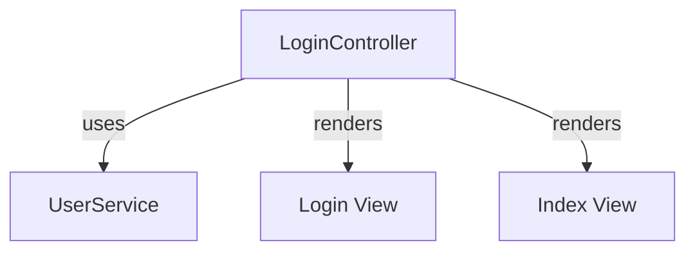

# LoginController Documentation

## Overview
The `LoginController` is a Spring MVC controller responsible for handling user login requests in the OpenFrame authorization service. It provides endpoints for displaying the login page and handling login errors and logout messages.

## Core Functionality
The `LoginController` contains the following key functionalities:

1. **Login Page Rendering**: Displays the login page and handles error messages related to invalid login attempts.
2. **Logout Handling**: Displays a message upon successful logout.
3. **Index Page**: Provides a landing page for the application.

## Endpoints

### 1. Login Endpoint
- **Path**: `/login`
- **Method**: `GET`
- **Parameters**:
  - `error` (optional): A flag indicating if there was an error during login.
  - `logout` (optional): A flag indicating if the user has logged out.
- **Response**: Renders the login view with appropriate messages based on the parameters.

#### Example Usage:
```java
@GetMapping("/login")
public String login(Model model,
                    @RequestParam(value = "error", required = false) String error,
                    @RequestParam(value = "logout", required = false) String logout) {
    if (error != null) {
        model.addAttribute("errorMessage", "Invalid credentials");
    }
    if (logout != null) {
        model.addAttribute("logoutMessage", "Logged out successfully");
    }
    return "login";
}
```

### 2. Index Endpoint
- **Path**: `/`
- **Method**: `GET`
- **Response**: Renders the index view with a welcome message.

#### Example Usage:
```java
@GetMapping("/")
public String index(Model model) {
    model.addAttribute("message", "OpenFrame Multi-Tenant Authorization");
    return "index";
}
```

## Architecture
The `LoginController` is part of the **Authorization Services** module and interacts with the following components:
- **UserService**: Handles user-related operations, such as authentication and user data retrieval.

### Component Interaction Diagram


## Conclusion
The `LoginController` plays a crucial role in managing user authentication and providing a seamless login experience in the OpenFrame platform. It ensures that users receive appropriate feedback during the login process and facilitates easy access to the application.