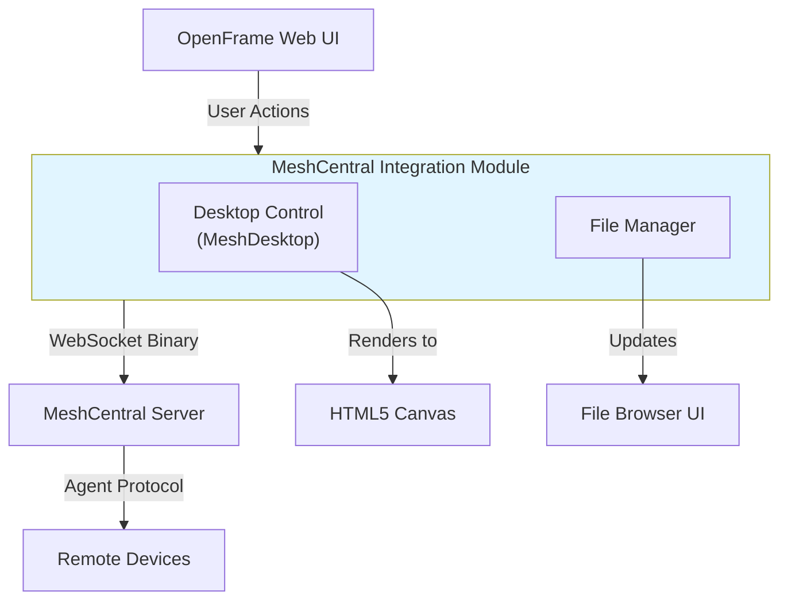

# MeshCentral Integration Module

> **Browser-based remote desktop control and file management for OpenFrame**

[](MESHCENTRAL_INTEGRATION_INDEX.md)
[](meshcentral_integration.md)
[](https://openframe.ai)

---

## 🎯 Overview

The **MeshCentral Integration Module** provides a comprehensive TypeScript-based client implementation for integrating with MeshCentral's remote desktop and file management capabilities within the OpenFrame platform. This module enables technicians to remotely control and manage client devices directly from their web browser.

### Key Capabilities

- 🖥️ **Remote Desktop Control** - Full KVM (Keyboard, Video, Mouse) capabilities
- 📁 **File Management** - Complete file system operations on remote devices
- 🖼️ **Multi-Display Support** - Handle multiple monitor configurations
- 🔒 **Secure Communication** - WebSocket Secure (WSS) with binary protocol
- ⚡ **High Performance** - JPEG tile streaming with concurrent decoding
- 🎨 **Browser-Based** - No plugins required, works in modern browsers

---

## 📚 Documentation

### Quick Start

| Document | Purpose | Audience |
|----------|---------|----------|
| **[Index](MESHCENTRAL_INTEGRATION_INDEX.md)** | Complete documentation index and navigation | Everyone |
| **[Summary](MESHCENTRAL_INTEGRATION_SUMMARY.md)** | Quick reference and overview | New developers |
| **[Main Documentation](meshcentral_integration.md)** | Complete module guide | All developers |

### Detailed Documentation

| Document | Purpose | Audience |
|----------|---------|----------|
| **[Desktop Control](meshcentral_desktop_control.md)** | Remote desktop implementation | Desktop developers |
| **[File Management](meshcentral_file_management.md)** | File operations protocol | File developers |
| **[Visual Overview](MESHCENTRAL_INTEGRATION_VISUAL_OVERVIEW.md)** | Architecture diagrams | Architects, visual learners |

### 🎓 Recommended Reading Order

1. **New to the module?** → Start with [Summary](MESHCENTRAL_INTEGRATION_SUMMARY.md)
2. **Need complete details?** → Read [Main Documentation](meshcentral_integration.md)
3. **Visual learner?** → Check [Visual Overview](MESHCENTRAL_INTEGRATION_VISUAL_OVERVIEW.md)
4. **Implementing features?** → See [Desktop Control](meshcentral_desktop_control.md) or [File Management](meshcentral_file_management.md)
5. **Looking for something specific?** → Use the [Index](MESHCENTRAL_INTEGRATION_INDEX.md)

---

## 🚀 Quick Example

### Desktop Control

```typescript
import { MeshDesktop } from './lib/meshcentral/meshcentral-desktop'

// Initialize desktop control
const desktop = new MeshDesktop()
const canvas = document.getElementById('remote-desktop') as HTMLCanvasElement
desktop.attach(canvas)

// Set up WebSocket communication
desktop.setSender((data: Uint8Array) => {
  websocket.send(data)
})

websocket.onmessage = (event) => {
  desktop.onBinaryFrame(new Uint8Array(event.data))
}

// Send special commands
desktop.sendCtrlAltDel()
desktop.sendKeyCombo('win+l')
desktop.switchDisplay(1)
```

### File Management

```typescript
import type { FileManagerOptions } from './lib/meshcentral/file-manager-types'

// Configure file manager
const options: FileManagerOptions = {
  nodeId: 'device-id',
  onDirectoryChange: (files) => updateFileList(files),
  onTransferProgress: (progress) => updateProgressBar(progress)
}

// List directory
sendFileCommand({
  action: 'ls',
  reqid: generateId(),
  path: '/home/user'
})

// Upload file
sendFileCommand({
  action: 'upload',
  reqid: generateId(),
  path: '/home/user',
  name: 'document.pdf',
  size: fileData.byteLength
})
```

---

## 🏗️ Architecture



---

## ✨ Key Features

### Desktop Control

- ✅ Real-time JPEG tile streaming
- ✅ Full keyboard and mouse input
- ✅ Multi-monitor support and switching
- ✅ Special key combinations (Ctrl+Alt+Del, Win+L, etc.)
- ✅ View-only mode
- ✅ Configurable compression and quality
- ✅ Concurrent tile decoding (3 parallel)
- ✅ Backpressure management
- ✅ Canvas rendering optimization

### File Management

- ✅ Directory browsing and navigation
- ✅ File upload with progress tracking
- ✅ File download with progress tracking
- ✅ Hash-based upload optimization
- ✅ File operations (rename, delete, mkdir)
- ✅ Binary message accumulation
- ✅ Transfer cancellation
- ✅ Permission-based access control
- ✅ Search functionality

---

## 🔌 Protocol Support

### Desktop Protocol Commands

| Command | Purpose | Direction |
|---------|---------|-----------|
| KVM_INIT | Initialize session | Client → Server |
| COMPRESSION | Set quality | Client → Server |
| PAUSE/UNPAUSE | Control stream | Client → Server |
| REFRESH | Request update | Client → Server |
| SCREEN_SIZE | Dimensions | Server → Client |
| TILE | JPEG tile | Server → Client |
| MOUSE | Mouse event | Client → Server |
| KEY | Keyboard event | Client → Server |
| CTRLALTDEL | Special command | Client → Server |
| DISPLAY_LIST | Multi-monitor | Bidirectional |
| SWITCH_DISPLAY | Change display | Client → Server |

### File Protocol Commands

| Command | Purpose |
|---------|---------|
| `ls` | List directory |
| `upload` | Upload file |
| `uploadhash` | Upload with hash check |
| `download` | Download file |
| `rename` | Rename file/directory |
| `delete` | Delete file/directory |
| `mkdir` | Create directory |

---

## 🌐 Browser Compatibility

### Required Features

- ✅ WebSocket API (binary communication)
- ✅ Canvas 2D Context (screen rendering)
- ✅ Typed Arrays (binary data)
- ✅ Blob API (file handling)
- ✅ ImageBitmap API (JPEG decoding, with fallback)

### Tested Browsers

- **Chrome/Edge:** 90+
- **Firefox:** 88+
- **Safari:** 14+

---

## 📊 Performance

### Desktop Streaming

- **Tile Queue:** 300 tiles maximum
- **Concurrent Decoders:** 3 parallel JPEG decoders
- **Buffer Limit:** 16MB maximum accumulation
- **Rendering:** RequestAnimationFrame-based
- **Compression:** Configurable JPEG quality (1-100)

### File Transfers

- **Chunked Transfers:** Large files split into chunks
- **Hash Optimization:** Skip unchanged files
- **Progress Updates:** Real-time tracking
- **Cancellation:** Abort transfers in progress

---

## 🔒 Security

### Authentication & Authorization

- ✅ Session-based authentication
- ✅ MeshCentral permission model
- ✅ Device-level access control
- ✅ User consent mechanism

### Data Protection

- ✅ WebSocket Secure (WSS) encryption
- ✅ Binary protocol (reduced attack surface)
- ✅ Input validation
- ✅ Resource limits (prevent DoS)

---

## 🛠️ Integration with OpenFrame

### Related Modules

- **[Frontend Main](frontend_main.md)** - Main web application
- **[Frontend API Clients](frontend_api_clients.md)** - Backend communication
- **[Frontend Device Management](frontend_device_management.md)** - Device selection
- **[Client Service](client_service.md)** - Backend device management

### External Dependencies

- **MeshCentral Server** - Remote management platform
- **MeshCentral Agents** - Device-side agents

---

## 📖 Documentation Index

### Main Documentation
1. **[meshcentral_integration.md](meshcentral_integration.md)** - Complete module guide
   - Overview and purpose
   - Architecture and components
   - Protocol specification
   - Usage examples
   - Performance and security
   - Troubleshooting

### Sub-Module Documentation
2. **[meshcentral_desktop_control.md](meshcentral_desktop_control.md)** - Desktop control
   - MeshDesktop class
   - KVM protocol
   - Input handling
   - Rendering pipeline
   - Multi-display management

3. **[meshcentral_file_management.md](meshcentral_file_management.md)** - File operations
   - File protocol
   - Binary message handling
   - File operations
   - Transfer management
   - Hash optimization

### Reference Documentation
4. **[MESHCENTRAL_INTEGRATION_SUMMARY.md](MESHCENTRAL_INTEGRATION_SUMMARY.md)** - Quick reference
5. **[MESHCENTRAL_INTEGRATION_VISUAL_OVERVIEW.md](MESHCENTRAL_INTEGRATION_VISUAL_OVERVIEW.md)** - Visual diagrams
6. **[MESHCENTRAL_INTEGRATION_INDEX.md](MESHCENTRAL_INTEGRATION_INDEX.md)** - Complete index

---

## 🐛 Troubleshooting

### Common Issues

| Issue | Solution | Documentation |
|-------|----------|---------------|
| Black screen | Check WebSocket connection | [Main Docs](meshcentral_integration.md#troubleshooting) |
| No input | Disable view-only mode | [Desktop Control](meshcentral_desktop_control.md) |
| Laggy streaming | Reduce JPEG quality | [Main Docs](meshcentral_integration.md#performance-considerations) |
| Upload fails | Check permissions | [File Management](meshcentral_file_management.md) |

---

## 📞 Support & Community

### OpenMSP Community

- **Website:** https://www.openmsp.ai/
- **Slack:** https://join.slack.com/t/openmsp/shared_invite/zt-36bl7mx0h-3~U2nFH6nqHqoTPXMaHEHA

### External Resources

- **MeshCentral:** https://meshcentral.com/
- **MeshCentral GitHub:** https://github.com/Ylianst/MeshCentral
- **OpenFrame:** https://openframe.ai
- **Flamingo MSP:** https://flamingo.run

---

## 🎓 Learning Resources

### For New Developers

1. Read [Summary](MESHCENTRAL_INTEGRATION_SUMMARY.md) for overview
2. Review [Visual Overview](MESHCENTRAL_INTEGRATION_VISUAL_OVERVIEW.md) for architecture
3. Study [Main Documentation](meshcentral_integration.md) for details
4. Explore sub-modules based on your needs

### For Implementers

1. Review usage examples in main documentation
2. Study protocol specifications
3. Examine visual diagrams
4. Reference API documentation during development

### For Architects

1. Study [Visual Overview](MESHCENTRAL_INTEGRATION_VISUAL_OVERVIEW.md)
2. Review system architecture in [Main Documentation](meshcentral_integration.md)
3. Understand integration points
4. Review scalability considerations

---

## 📈 Documentation Statistics

- **Total Files:** 6 documentation files
- **Total Pages:** 125-150 pages (estimated)
- **Diagrams:** 42+ Mermaid diagrams
- **Code Examples:** 50+ examples
- **Protocol Commands:** 25+ documented

---

## ✅ Documentation Status

| Component | Status |
|-----------|--------|
| **Main Documentation** | ✅ Complete |
| **Sub-Modules** | ✅ Complete |
| **Visual Diagrams** | ✅ Complete |
| **Code Examples** | ✅ Complete |
| **Protocol Specs** | ✅ Complete |
| **Troubleshooting** | ✅ Complete |
| **Cross-References** | ✅ Complete |

---

## 🚀 Getting Started

### Step 1: Read the Documentation

Start with the [Index](MESHCENTRAL_INTEGRATION_INDEX.md) to navigate the documentation.

### Step 2: Understand the Architecture

Review the [Visual Overview](MESHCENTRAL_INTEGRATION_VISUAL_OVERVIEW.md) for diagrams.

### Step 3: Implement Features

Follow the [Main Documentation](meshcentral_integration.md) and sub-module guides.

### Step 4: Get Support

Join the [OpenMSP Slack Community](https://join.slack.com/t/openmsp/shared_invite/zt-36bl7mx0h-3~U2nFH6nqHqoTPXMaHEHA) for help.

---

## 📝 Contributing

When contributing to the MeshCentral integration:

1. **Test Across Browsers** - Verify in Chrome, Firefox, Safari
2. **Binary Protocol** - Ensure proper byte ordering (big-endian)
3. **Memory Management** - Clean up resources properly
4. **Error Handling** - Never crash on protocol errors
5. **Performance** - Test with high-resolution displays
6. **Documentation** - Update docs when adding features

---

## 📅 Version Information

- **Module Version:** 1.0
- **Documentation Version:** 1.0
- **Last Updated:** 2024
- **Status:** ✅ Production Ready

---

## 🎉 Quick Links

- 📖 **[Complete Index](MESHCENTRAL_INTEGRATION_INDEX.md)** - Navigate all documentation
- 📋 **[Quick Reference](MESHCENTRAL_INTEGRATION_SUMMARY.md)** - Summary and quick access
- 📘 **[Main Guide](meshcentral_integration.md)** - Complete module documentation
- 🖥️ **[Desktop Control](meshcentral_desktop_control.md)** - Remote desktop details
- 📁 **[File Management](meshcentral_file_management.md)** - File operations details
- 🎨 **[Visual Overview](MESHCENTRAL_INTEGRATION_VISUAL_OVERVIEW.md)** - Architecture diagrams

---

**For detailed information, please refer to the [Complete Documentation Index](MESHCENTRAL_INTEGRATION_INDEX.md).**

---

*Part of the [OpenFrame Platform](https://openframe.ai) | Powered by [MeshCentral](https://meshcentral.com/) | Built by [Flamingo](https://flamingo.run)*
