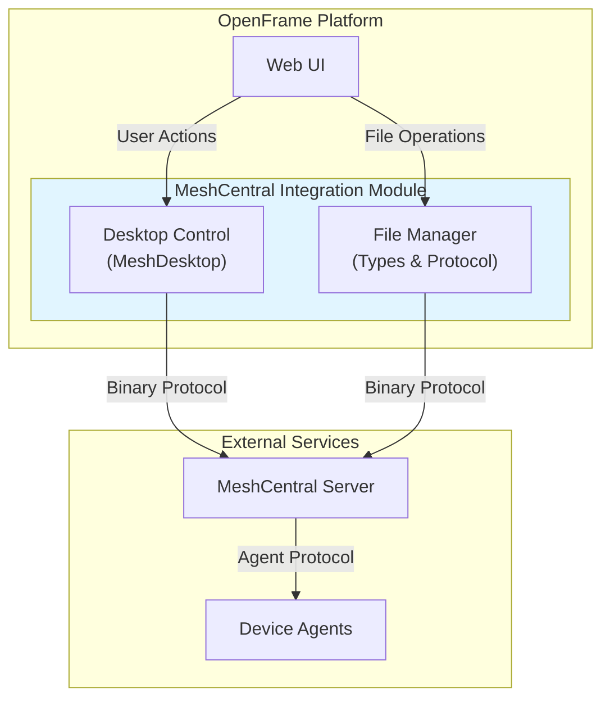

# MeshCentral Integration Module - Documentation Summary

## 📋 Overview

This document provides a comprehensive index and summary of the **MeshCentral Integration Module** documentation for the OpenFrame platform. The MeshCentral integration enables browser-based remote desktop control and file management capabilities through WebSocket communication with MeshCentral servers.

---

## 📚 Documentation Structure

### Main Documentation
- **[meshcentral_integration.md](meshcentral_integration.md)** - Complete module overview, architecture, and integration guide

### Sub-Module Documentation
1. **[meshcentral_desktop_control.md](meshcentral_desktop_control.md)** - Remote desktop control implementation
2. **[meshcentral_file_management.md](meshcentral_file_management.md)** - File operations and transfer protocol

---

## 🎯 Module Purpose

The MeshCentral Integration Module serves as the frontend bridge between OpenFrame's web interface and MeshCentral's binary protocol, providing:

1. **Remote Desktop Control** - Full KVM (Keyboard, Video, Mouse) capabilities
2. **File Management** - Complete file system operations on remote devices
3. **Multi-Display Support** - Handle multiple monitor configurations
4. **Binary Protocol** - Efficient binary message encoding/decoding
5. **Real-time Streaming** - JPEG tile-based screen rendering

---

## 🏗️ Architecture Overview



---

## 📦 Core Components

### Desktop Control Components

| Component | File | Purpose |
|-----------|------|---------|
| **MeshDesktop** | `meshcentral-desktop.ts` | Main desktop control class implementing KVM protocol |
| **DisplayInfo** | `meshcentral-desktop.ts` | Multi-monitor display information |
| **DesktopInputHandlers** | `meshcentral-desktop.ts` | Public API interface for desktop operations |

**Key Features:**
- Real-time JPEG tile streaming
- Full keyboard/mouse input handling
- Multi-display management
- Special key combinations (Ctrl+Alt+Del, Win+L, etc.)
- View-only mode support
- Configurable compression and quality

### File Management Components

| Component | File | Purpose |
|-----------|------|---------|
| **BinaryHeader** | `file-manager-types.ts` | Binary message header structure |
| **BinaryAccumulator** | `file-manager-types.ts` | Buffer for fragmented messages |
| **FileEntry** | `file-manager-types.ts` | Remote file/directory representation |
| **FileManagerOptions** | `file-manager-types.ts` | Configuration interface |
| **FileOperationRequest** | `file-manager-types.ts` | File operation command structure |

**Key Features:**
- Directory browsing and navigation
- File upload/download with progress
- Hash-based upload optimization
- File operations (rename, delete, mkdir)
- Transfer cancellation
- Permission-based access control

---

## 🔌 Protocol Specification

### Binary Message Format

**Standard Frame (4-byte header):**
```text
Bytes 0-1: Command (uint16, big-endian)
Bytes 2-3: Total Size (uint16, big-endian)
Bytes 4+:  Payload data
```

**Jumbo Frame (for messages > 64KB):**
```text
Bytes 0-1: Command 27 (0x001B)
Bytes 2-3: Size 8 (0x0008)
Bytes 4:   Reserved
Bytes 5-7: Jumbo Size (24-bit, big-endian)
Bytes 8-9: Actual Command (uint16, big-endian)
Bytes 10+: Payload data
```

### Desktop Protocol Commands

| Command | Hex | Direction | Purpose |
|---------|-----|-----------|---------|
| KVM_INIT | 0x000E | Client → Server | Initialize desktop session |
| COMPRESSION | 0x0005 | Client → Server | Set compression settings |
| PAUSE | 0x0008 | Client → Server | Pause/unpause stream |
| REFRESH | 0x0006 | Client → Server | Request screen refresh |
| SCREEN_SIZE | 0x0007 | Server → Client | Screen dimensions |
| TILE | 0x0003 | Server → Client | JPEG screen tile |
| MOUSE | 0x0002 | Client → Server | Mouse event |
| KEY | 0x0001 | Client → Server | Keyboard event |
| CTRLALTDEL | 0x000A | Client → Server | Ctrl+Alt+Del |
| DISPLAY_LIST | 0x000B | Bidirectional | Display enumeration |
| SWITCH_DISPLAY | 0x000C | Client → Server | Switch active display |

### File Protocol Commands

| Command | Direction | Purpose |
|---------|-----------|---------|
| `ls` | Client → Server | List directory contents |
| `upload` | Client → Server | Upload file |
| `uploadhash` | Client → Server | Upload with hash check |
| `download` | Bidirectional | Download file |
| `rename` | Client → Server | Rename file/directory |
| `delete` | Client → Server | Delete file/directory |
| `mkdir` | Client → Server | Create directory |

---

## 💡 Usage Examples

### Desktop Control

```typescript
import { MeshDesktop } from './lib/meshcentral/meshcentral-desktop'

// Initialize desktop control
const desktop = new MeshDesktop()
const canvas = document.getElementById('remote-desktop') as HTMLCanvasElement
desktop.attach(canvas)

// Set up WebSocket communication
desktop.setSender((data: Uint8Array) => {
  websocket.send(data)
})

websocket.onmessage = (event) => {
  desktop.onBinaryFrame(new Uint8Array(event.data))
}

// Control operations
desktop.sendCtrlAltDel()
desktop.sendKeyCombo('win+l')
desktop.switchDisplay(1)
desktop.setViewOnly(true)

// Cleanup
desktop.detach()
```

### File Management

```typescript
import type { FileManagerOptions, FileEntry } from './lib/meshcentral/file-manager-types'

// Configure file manager
const options: FileManagerOptions = {
  nodeId: 'device-id',
  onDirectoryChange: (files: FileEntry[]) => {
    updateFileList(files)
  },
  onTransferProgress: (progress) => {
    updateProgressBar(progress)
  }
}

// List directory
sendFileCommand({
  action: 'ls',
  reqid: generateId(),
  path: '/home/user'
})

// Upload file
sendFileCommand({
  action: 'upload',
  reqid: generateId(),
  path: '/home/user',
  name: 'document.pdf',
  size: fileData.byteLength
})
```

---

## 🔗 Integration Points

### Related OpenFrame Modules

| Module | Relationship | Documentation |
|--------|--------------|---------------|
| **Frontend Main** | Parent application | [frontend_main.md](frontend_main.md) |
| **Frontend API Clients** | Backend communication | [frontend_api_clients.md](frontend_api_clients.md) |
| **Frontend Device Management** | Device selection | [frontend_device_management.md](frontend_device_management.md) |
| **Client Service** | Backend device management | [client_service.md](client_service.md) |

### External Dependencies

- **MeshCentral Server** - Open-source remote management platform
- **MeshCentral Agents** - Device-side agents (Windows/Linux/Mac)
- **WebSocket API** - Browser WebSocket for binary communication
- **Canvas API** - HTML5 Canvas for screen rendering

---

## ⚡ Performance Characteristics

### Desktop Streaming

- **Tile Queue**: Maximum 300 tiles to prevent memory exhaustion
- **Concurrent Decoding**: 3 parallel JPEG decoders
- **Buffer Limit**: 16MB maximum accumulation buffer
- **Rendering**: RequestAnimationFrame-based drawing
- **Compression**: Configurable JPEG quality (1-100)

### File Transfers

- **Chunked Transfers**: Large files split into manageable chunks
- **Hash Optimization**: Skip unchanged files using hash comparison
- **Progress Updates**: Real-time transfer progress tracking
- **Cancellation**: Abort transfers in progress

---

## 🔒 Security Features

### Authentication & Authorization

- **Session Cookies**: MeshCentral authentication cookies
- **Node Authorization**: Device-level access control
- **Consent Mechanism**: User consent for remote access
- **Permission Model**: Respects MeshCentral rights system

### Data Protection

- **WSS Encryption**: All communication over WebSocket Secure
- **Binary Protocol**: Reduced attack surface
- **Input Validation**: Validates all incoming messages
- **Resource Limits**: Prevents memory exhaustion attacks

### Permission Constants

```typescript
export const MeshRights = {
  SERVERFILES: 0x00000020,     // Server file access
  NOFILES: 0x00000400,         // Block file access
}

export const SiteRights = {
  FILEACCESS: 0x00000008,       // Site-level file access
}
```

---

## 🌐 Browser Compatibility

### Required Features

- ✅ WebSocket API (binary communication)
- ✅ Canvas 2D Context (screen rendering)
- ✅ Typed Arrays (binary data manipulation)
- ✅ Blob API (file handling)
- ✅ ImageBitmap API (JPEG decoding, with fallback)

### Tested Browsers

- **Chrome/Edge**: 90+
- **Firefox**: 88+
- **Safari**: 14+

---

## 🐛 Troubleshooting Guide

### Desktop Issues

| Symptom | Possible Cause | Solution |
|---------|----------------|----------|
| Black screen | WebSocket not connected | Check connection status |
| No input | View-only mode enabled | Call `setViewOnly(false)` |
| Laggy streaming | High compression quality | Reduce JPEG quality setting |
| Memory issues | Tile queue overflow | Check browser console for errors |

### File Transfer Issues

| Symptom | Possible Cause | Solution |
|---------|----------------|----------|
| Upload fails | Permission denied | Check remote file permissions |
| Download incomplete | Network interruption | Implement retry logic |
| Slow transfers | Large file size | Use chunked transfer with progress |
| Hash mismatch | File changed during transfer | Retry upload |

---

## 🚀 Future Enhancements

### Planned Features

1. **Audio Streaming** - Remote audio support
2. **Clipboard Sync** - Bidirectional clipboard
3. **Drag-and-Drop** - File drag from local to remote
4. **Video Codecs** - H.264/VP9 compression
5. **Touch Input** - Touch device support
6. **Session Recording** - Record and playback sessions

### Performance Improvements

1. **WebAssembly Decoder** - Faster JPEG decoding
2. **WebGL Rendering** - Hardware-accelerated rendering
3. **Delta Compression** - Only transmit changes
4. **Predictive Prefetch** - Lower latency

---

## 📖 Documentation Index

### Main Documentation
1. **[meshcentral_integration.md](meshcentral_integration.md)**
   - Module overview and purpose
   - Architecture and component relationships
   - Protocol specification
   - Integration with OpenFrame
   - Usage examples
   - Performance and security considerations

### Sub-Module Documentation

2. **[meshcentral_desktop_control.md](meshcentral_desktop_control.md)**
   - MeshDesktop class implementation
   - KVM protocol details
   - Input handling (keyboard/mouse)
   - Screen rendering pipeline
   - Multi-display management
   - Key mapping system
   - Frame processing and optimization

3. **[meshcentral_file_management.md](meshcentral_file_management.md)**
   - File protocol specification
   - Binary message handling
   - File operations (browse, upload, download)
   - Transfer progress tracking
   - Hash-based optimization
   - Permission model
   - Error handling

---

## 🔍 Quick Reference

### Key Classes

```typescript
// Desktop Control
class MeshDesktop implements DesktopInputHandlers {
  attach(canvas: HTMLCanvasElement): void
  detach(): void
  setSender(sender: (data: Uint8Array) => void): void
  onBinaryFrame(data: Uint8Array): Promise<void>
  setViewOnly(viewOnly: boolean): void
  sendCtrlAltDel(): void
  sendKeyCombo(combo: string): void
  switchDisplay(displayId: number): void
  requestRefresh(): void
}

// File Management Types
interface BinaryHeader {
  command: number
  size: number
  headerSize: number
}

interface BinaryAccumulator {
  buffer: Uint8Array
  expectedSize: number
  command: number
}

interface FileEntry {
  n: string           // Name
  t: number          // Type (1=Link, 2=Dir, 3=File)
  s?: number         // Size
  d?: number         // Modified date
  path?: string      // Absolute path
}
```

### Common Operations

```typescript
// Initialize desktop
desktop.attach(canvas)
desktop.setSender(websocket.send)

// Handle input
desktop.sendCtrlAltDel()
desktop.sendKeyCombo('ctrl+c')

// Manage displays
desktop.requestDisplayList()
desktop.switchDisplay(1)

// File operations
sendCommand({ action: 'ls', path: '/home' })
sendCommand({ action: 'upload', name: 'file.txt' })
sendCommand({ action: 'download', path: '/file.txt' })
```

---

## 📞 Support & Community

### OpenMSP Community

- **Website**: https://www.openmsp.ai/
- **Slack Community**: https://join.slack.com/t/openmsp/shared_invite/zt-36bl7mx0h-3~U2nFH6nqHqoTPXMaHEHA

### External Resources

- **MeshCentral Official**: https://meshcentral.com/
- **MeshCentral GitHub**: https://github.com/Ylianst/MeshCentral
- **OpenFrame Platform**: https://openframe.ai
- **Flamingo MSP**: https://flamingo.run

---

## 📝 Contributing Guidelines

When contributing to the MeshCentral integration:

1. **Test Across Browsers** - Verify in Chrome, Firefox, Safari
2. **Binary Protocol** - Ensure proper byte ordering (big-endian)
3. **Memory Management** - Clean up resources (ImageBitmap, Blob URLs)
4. **Error Handling** - Never crash on protocol errors
5. **Performance** - Test with high-resolution displays and slow networks
6. **Documentation** - Update protocol tables when adding features

---

## 📅 Version Information

- **Module Version**: 1.0
- **OpenFrame Version**: Latest
- **Last Updated**: 2024
- **Documentation Status**: ✅ Complete

---

## 🎓 Learning Path

### For New Developers

1. Start with **[meshcentral_integration.md](meshcentral_integration.md)** for overview
2. Review protocol specification and architecture diagrams
3. Study **[meshcentral_desktop_control.md](meshcentral_desktop_control.md)** for desktop implementation
4. Explore **[meshcentral_file_management.md](meshcentral_file_management.md)** for file operations
5. Review usage examples and troubleshooting guide

### For Integration

1. Understand WebSocket setup and binary communication
2. Implement sender/receiver functions
3. Handle binary frame accumulation
4. Integrate with UI components
5. Add error handling and progress tracking

### For Protocol Development

1. Study MeshCentral protocol documentation
2. Review binary message format specifications
3. Understand command encoding/decoding
4. Implement new protocol features
5. Test with MeshCentral server

---

**End of Summary Document**

For detailed information, please refer to the individual documentation files listed above.
