# MeshCentral Integration - Visual Architecture Overview

## 📊 Complete System Architecture

This document provides comprehensive visual diagrams for understanding the MeshCentral Integration Module architecture, data flows, and component interactions.

---

## 🏗️ System-Level Architecture

### OpenFrame Platform Integration

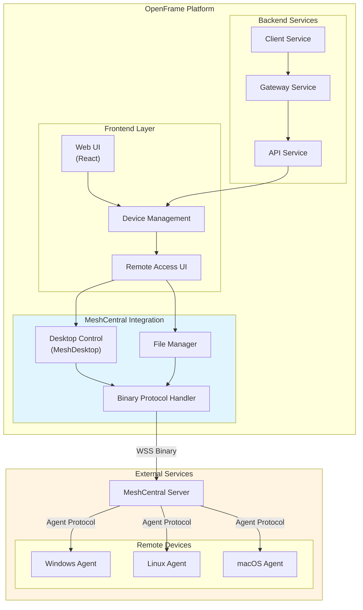
```mermaid
flowchart TD
    subgraph OpenFramePlatform["OpenFrame Platform"]
        subgraph Frontend["Frontend Layer"]
            WebUI["Web UI<br/>(React)"]
            DeviceMgmt["Device Management"]
            RemoteAccess["Remote Access UI"]
        end
        
        subgraph MeshIntegration["MeshCentral Integration"]
            DesktopControl["Desktop Control<br/>(MeshDesktop)"]
            FileManager["File Manager"]
            BinaryProtocol["Binary Protocol Handler"]
        end
        
        subgraph BackendServices["Backend Services"]
            ClientService["Client Service"]
            APIService["API Service"]
            Gateway["Gateway Service"]
        end
    end
    
    subgraph ExternalServices["External Services"]
        MeshServer["MeshCentral Server"]
        
        subgraph RemoteDevices["Remote Devices"]
            WindowsAgent["Windows Agent"]
            LinuxAgent["Linux Agent"]
            MacAgent["macOS Agent"]
        end
    end
    
    WebUI --> DeviceMgmt
    DeviceMgmt --> RemoteAccess
    RemoteAccess --> DesktopControl
    RemoteAccess --> FileManager
    
    DesktopControl --> BinaryProtocol
    FileManager --> BinaryProtocol
    
    BinaryProtocol -->|"WSS Binary"| MeshServer
    
    ClientService --> Gateway
    Gateway --> APIService
    APIService --> DeviceMgmt
    
    MeshServer -->|"Agent Protocol"| WindowsAgent
    MeshServer -->|"Agent Protocol"| LinuxAgent
    MeshServer -->|"Agent Protocol"| MacAgent
    
    style MeshIntegration fill:#e1f5ff
    style ExternalServices fill:#fff4e1
```

---

## 🖥️ Desktop Control Architecture

### Component Interaction Diagram

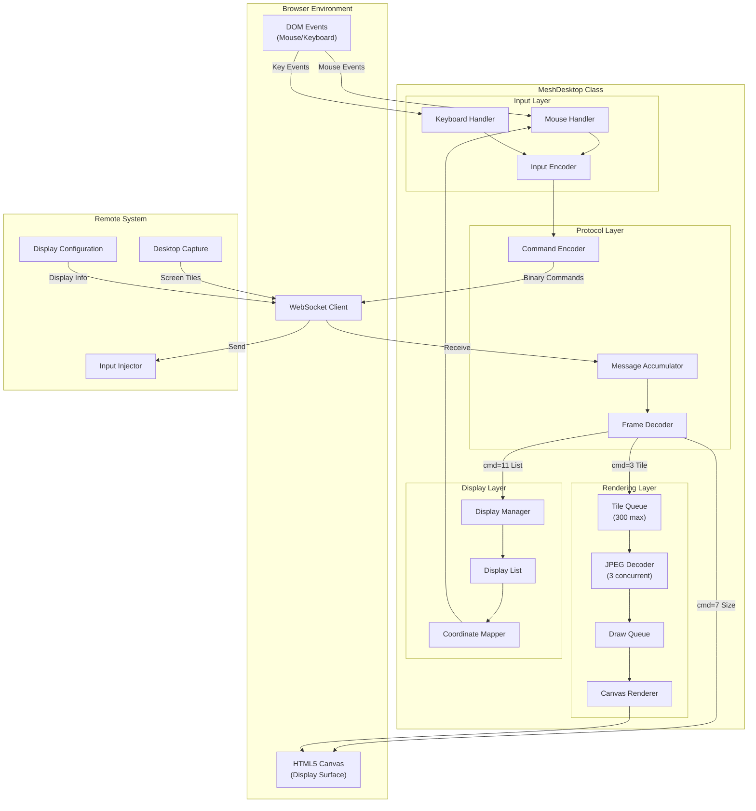
```mermaid
flowchart TD
    subgraph Browser["Browser Environment"]
        Canvas["HTML5 Canvas<br/>(Display Surface)"]
        DOMEvents["DOM Events<br/>(Mouse/Keyboard)"]
        WSClient["WebSocket Client"]
    end
    
    subgraph MeshDesktopClass["MeshDesktop Class"]
        subgraph InputLayer["Input Layer"]
            MouseHandler["Mouse Handler"]
            KeyboardHandler["Keyboard Handler"]
            InputEncoder["Input Encoder"]
        end
        
        subgraph ProtocolLayer["Protocol Layer"]
            CommandEncoder["Command Encoder"]
            FrameDecoder["Frame Decoder"]
            MessageAccumulator["Message Accumulator"]
        end
        
        subgraph RenderingLayer["Rendering Layer"]
            TileQueue["Tile Queue<br/>(300 max)"]
            JPEGDecoder["JPEG Decoder<br/>(3 concurrent)"]
            DrawQueue["Draw Queue"]
            CanvasRenderer["Canvas Renderer"]
        end
        
        subgraph DisplayLayer["Display Layer"]
            DisplayManager["Display Manager"]
            DisplayList["Display List"]
            CoordinateMapper["Coordinate Mapper"]
        end
    end
    
    subgraph RemoteSystem["Remote System"]
        DesktopCapture["Desktop Capture"]
        InputInjector["Input Injector"]
        DisplayConfig["Display Configuration"]
    end
    
    DOMEvents -->|"Mouse Events"| MouseHandler
    DOMEvents -->|"Key Events"| KeyboardHandler
    
    MouseHandler --> InputEncoder
    KeyboardHandler --> InputEncoder
    InputEncoder --> CommandEncoder
    
    CommandEncoder -->|"Binary Commands"| WSClient
    WSClient -->|"Send"| InputInjector
    
    DesktopCapture -->|"Screen Tiles"| WSClient
    WSClient -->|"Receive"| MessageAccumulator
    
    MessageAccumulator --> FrameDecoder
    FrameDecoder -->|"cmd=7 Size"| Canvas
    FrameDecoder -->|"cmd=3 Tile"| TileQueue
    FrameDecoder -->|"cmd=11 List"| DisplayManager
    
    TileQueue --> JPEGDecoder
    JPEGDecoder --> DrawQueue
    DrawQueue --> CanvasRenderer
    CanvasRenderer --> Canvas
    
    DisplayManager --> DisplayList
    DisplayList --> CoordinateMapper
    CoordinateMapper --> MouseHandler
    
    DisplayConfig -->|"Display Info"| WSClient
```

### Desktop Streaming Data Flow

```mermaid
flowchart LR
    subgraph RemoteOS["Remote Operating System"]
        Screen["Screen Buffer"]
        Capture["Screen Capture<br/>(MeshAgent)"]
        Compress["JPEG Compression"]
    end
    
    subgraph Network["Network Layer"]
        AgentWS["Agent WebSocket"]
        ServerRelay["MeshCentral Server"]
        ClientWS["Client WebSocket"]
    end
    
    subgraph BrowserClient["Browser Client"]
        Accumulator["Byte Accumulator<br/>(16MB max)"]
        Parser["Frame Parser"]
        Queue["Tile Queue<br/>(300 tiles)"]
        
        subgraph Decoders["Parallel Decoders"]
            D1["Decoder 1"]
            D2["Decoder 2"]
            D3["Decoder 3"]
        end
        
        DrawQ["Draw Queue"]
        RAF["requestAnimationFrame"]
        Canvas["Canvas Context"]
    end
    
    Screen --> Capture
    Capture -->|"Tile Regions"| Compress
    Compress -->|"JPEG Bytes"| AgentWS
    
    AgentWS --> ServerRelay
    ServerRelay --> ClientWS
    
    ClientWS -->|"Binary Frames"| Accumulator
    Accumulator -->|"Complete Messages"| Parser
    Parser -->|"cmd=3 Tiles"| Queue
    
    Queue --> D1
    Queue --> D2
    Queue --> D3
    
    D1 -->|"ImageBitmap"| DrawQ
    D2 -->|"ImageBitmap"| DrawQ
    D3 -->|"ImageBitmap"| DrawQ
    
    DrawQ --> RAF
    RAF -->|"Batch Draw"| Canvas
```

### Input Event Flow

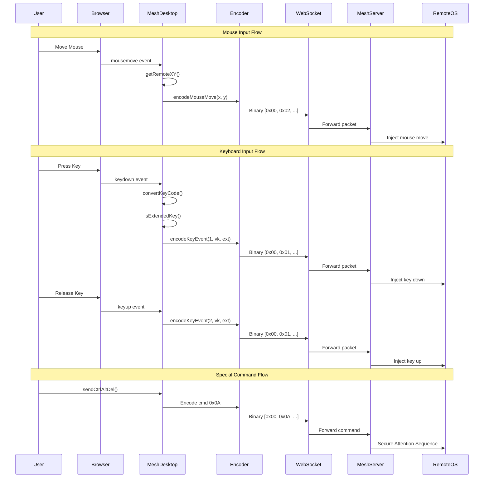
```mermaid
sequenceDiagram
    participant User
    participant Browser
    participant MeshDesktop
    participant Encoder
    participant WebSocket
    participant MeshServer
    participant RemoteOS
    
    Note over User,RemoteOS: Mouse Input Flow
    User->>Browser: Move Mouse
    Browser->>MeshDesktop: mousemove event
    MeshDesktop->>MeshDesktop: getRemoteXY()
    MeshDesktop->>Encoder: encodeMouseMove(x, y)
    Encoder->>WebSocket: Binary [0x00, 0x02, ...]
    WebSocket->>MeshServer: Forward packet
    MeshServer->>RemoteOS: Inject mouse move
    
    Note over User,RemoteOS: Keyboard Input Flow
    User->>Browser: Press Key
    Browser->>MeshDesktop: keydown event
    MeshDesktop->>MeshDesktop: convertKeyCode()
    MeshDesktop->>MeshDesktop: isExtendedKey()
    MeshDesktop->>Encoder: encodeKeyEvent(1, vk, ext)
    Encoder->>WebSocket: Binary [0x00, 0x01, ...]
    WebSocket->>MeshServer: Forward packet
    MeshServer->>RemoteOS: Inject key down
    
    User->>Browser: Release Key
    Browser->>MeshDesktop: keyup event
    MeshDesktop->>Encoder: encodeKeyEvent(2, vk, ext)
    Encoder->>WebSocket: Binary [0x00, 0x01, ...]
    WebSocket->>MeshServer: Forward packet
    MeshServer->>RemoteOS: Inject key up
    
    Note over User,RemoteOS: Special Command Flow
    User->>MeshDesktop: sendCtrlAltDel()
    MeshDesktop->>Encoder: Encode cmd 0x0A
    Encoder->>WebSocket: Binary [0x00, 0x0A, ...]
    WebSocket->>MeshServer: Forward command
    MeshServer->>RemoteOS: Secure Attention Sequence
```

---

## 📁 File Management Architecture

### File Operations Flow

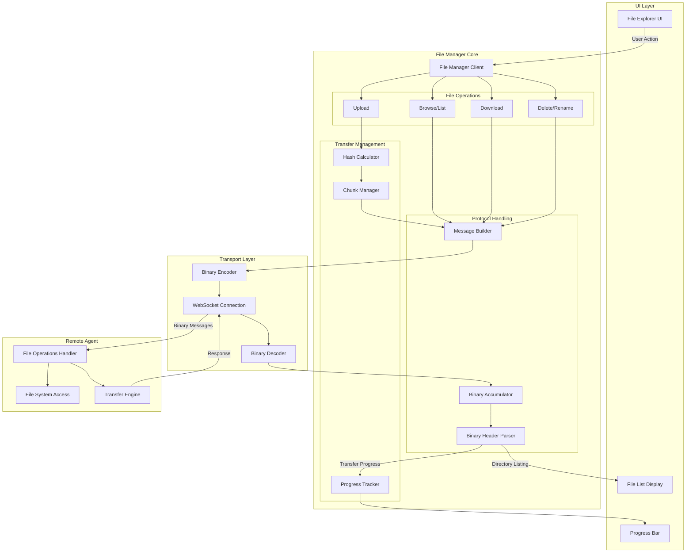
```mermaid
flowchart TD
    subgraph UILayer["UI Layer"]
        FileExplorer["File Explorer UI"]
        ProgressBar["Progress Bar"]
        FileList["File List Display"]
    end
    
    subgraph FileManagerCore["File Manager Core"]
        FileClient["File Manager Client"]
        
        subgraph Operations["File Operations"]
            Browse["Browse/List"]
            Upload["Upload"]
            Download["Download"]
            Delete["Delete/Rename"]
        end
        
        subgraph Protocol["Protocol Handling"]
            BinaryHeader["Binary Header Parser"]
            BinaryAccumulator["Binary Accumulator"]
            MessageBuilder["Message Builder"]
        end
        
        subgraph Transfer["Transfer Management"]
            HashCalc["Hash Calculator"]
            ChunkManager["Chunk Manager"]
            ProgressTracker["Progress Tracker"]
        end
    end
    
    subgraph Transport["Transport Layer"]
        WSConnection["WebSocket Connection"]
        BinaryEncoder["Binary Encoder"]
        BinaryDecoder["Binary Decoder"]
    end
    
    subgraph RemoteAgent["Remote Agent"]
        FileSystem["File System Access"]
        FileOps["File Operations Handler"]
        TransferEngine["Transfer Engine"]
    end
    
    FileExplorer -->|"User Action"| FileClient
    FileClient --> Browse
    FileClient --> Upload
    FileClient --> Download
    FileClient --> Delete
    
    Browse --> MessageBuilder
    Upload --> HashCalc
    HashCalc --> ChunkManager
    ChunkManager --> MessageBuilder
    Download --> MessageBuilder
    Delete --> MessageBuilder
    
    MessageBuilder --> BinaryEncoder
    BinaryEncoder --> WSConnection
    
    WSConnection -->|"Binary Messages"| FileOps
    FileOps --> FileSystem
    FileOps --> TransferEngine
    
    TransferEngine -->|"Response"| WSConnection
    WSConnection --> BinaryDecoder
    BinaryDecoder --> BinaryAccumulator
    BinaryAccumulator --> BinaryHeader
    
    BinaryHeader -->|"Directory Listing"| FileList
    BinaryHeader -->|"Transfer Progress"| ProgressTracker
    ProgressTracker --> ProgressBar
```

### Upload Flow with Hash Optimization

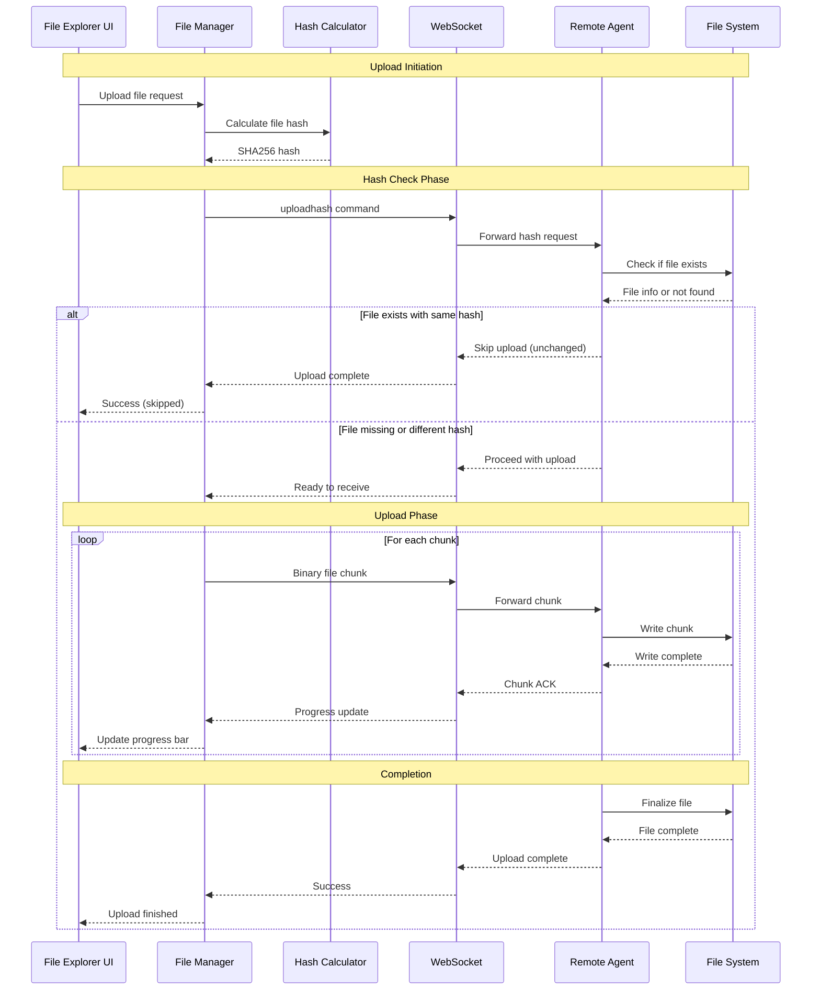
```mermaid
sequenceDiagram
    participant UI as File Explorer UI
    participant FM as File Manager
    participant Hash as Hash Calculator
    participant WS as WebSocket
    participant Agent as Remote Agent
    participant FS as File System
    
    Note over UI,FS: Upload Initiation
    UI->>FM: Upload file request
    FM->>Hash: Calculate file hash
    Hash-->>FM: SHA256 hash
    
    Note over UI,FS: Hash Check Phase
    FM->>WS: uploadhash command
    WS->>Agent: Forward hash request
    Agent->>FS: Check if file exists
    FS-->>Agent: File info or not found
    
    alt File exists with same hash
        Agent-->>WS: Skip upload (unchanged)
        WS-->>FM: Upload complete
        FM-->>UI: Success (skipped)
    else File missing or different hash
        Agent-->>WS: Proceed with upload
        WS-->>FM: Ready to receive
        
        Note over UI,FS: Upload Phase
        loop For each chunk
            FM->>WS: Binary file chunk
            WS->>Agent: Forward chunk
            Agent->>FS: Write chunk
            FS-->>Agent: Write complete
            Agent-->>WS: Chunk ACK
            WS-->>FM: Progress update
            FM-->>UI: Update progress bar
        end
        
        Note over UI,FS: Completion
        Agent->>FS: Finalize file
        FS-->>Agent: File complete
        Agent-->>WS: Upload complete
        WS-->>FM: Success
        FM-->>UI: Upload finished
    end
```

### Download Flow

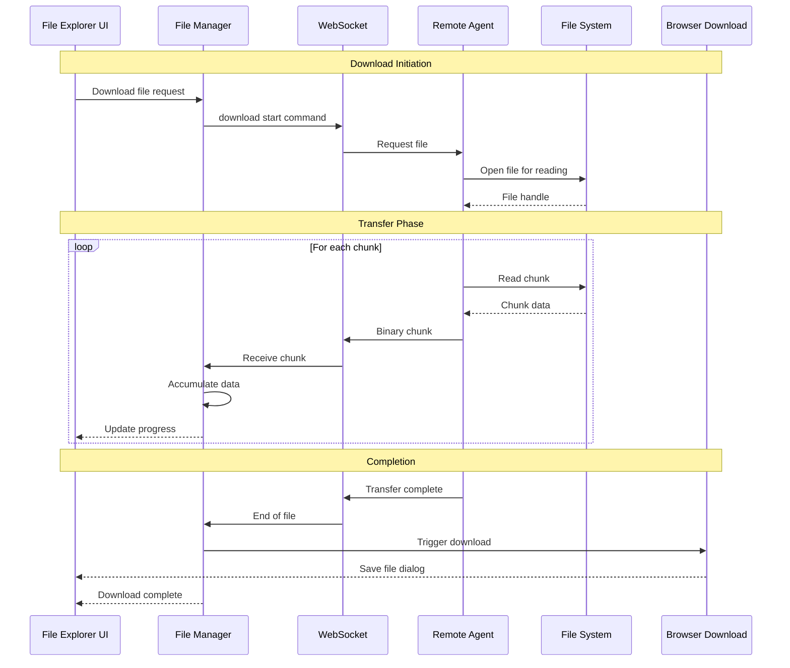
```mermaid
sequenceDiagram
    participant UI as File Explorer UI
    participant FM as File Manager
    participant WS as WebSocket
    participant Agent as Remote Agent
    participant FS as File System
    participant Browser as Browser Download
    
    Note over UI,Browser: Download Initiation
    UI->>FM: Download file request
    FM->>WS: download start command
    WS->>Agent: Request file
    Agent->>FS: Open file for reading
    FS-->>Agent: File handle
    
    Note over UI,Browser: Transfer Phase
    loop For each chunk
        Agent->>FS: Read chunk
        FS-->>Agent: Chunk data
        Agent->>WS: Binary chunk
        WS->>FM: Receive chunk
        FM->>FM: Accumulate data
        FM-->>UI: Update progress
    end
    
    Note over UI,Browser: Completion
    Agent->>WS: Transfer complete
    WS->>FM: End of file
    FM->>Browser: Trigger download
    Browser-->>UI: Save file dialog
    FM-->>UI: Download complete
```

---

## 🔄 Protocol State Machines

### Desktop Session State Machine

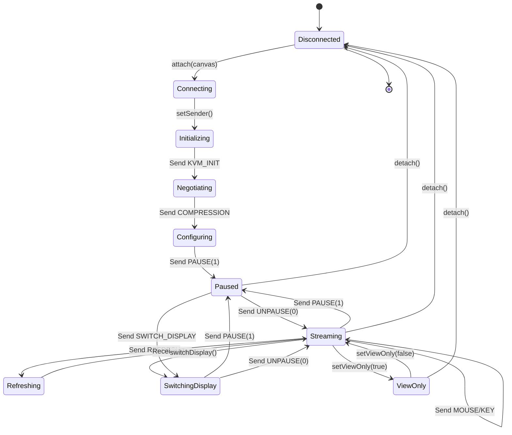
```mermaid
stateDiagram-v2
    [*] --> Disconnected
    
    Disconnected --> Connecting: attach(canvas)
    Connecting --> Initializing: setSender()
    
    Initializing --> Negotiating: Send KVM_INIT
    Negotiating --> Configuring: Send COMPRESSION
    Configuring --> Paused: Send PAUSE(1)
    
    Paused --> Streaming: Send UNPAUSE(0)
    Streaming --> Paused: Send PAUSE(1)
    
    Streaming --> Streaming: Receive TILE
    Streaming --> Streaming: Send MOUSE/KEY
    Streaming --> Refreshing: Send REFRESH
    Refreshing --> Streaming: Receive tiles
    
    Streaming --> SwitchingDisplay: switchDisplay()
    SwitchingDisplay --> Paused: Send PAUSE(1)
    Paused --> SwitchingDisplay: Send SWITCH_DISPLAY
    SwitchingDisplay --> Streaming: Send UNPAUSE(0)
    
    Streaming --> ViewOnly: setViewOnly(true)
    ViewOnly --> Streaming: setViewOnly(false)
    
    Streaming --> Disconnected: detach()
    Paused --> Disconnected: detach()
    ViewOnly --> Disconnected: detach()
    
    Disconnected --> [*]
```

### File Transfer State Machine

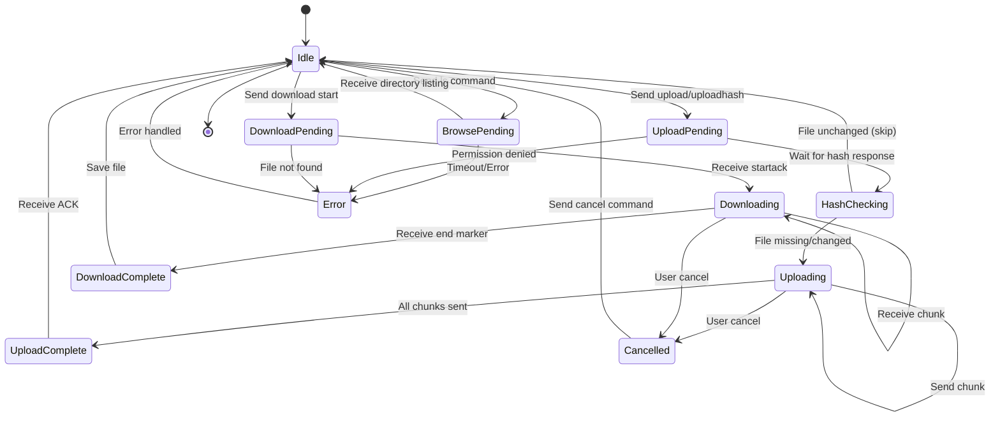
```mermaid
stateDiagram-v2
    [*] --> Idle
    
    Idle --> BrowsePending: Send ls command
    BrowsePending --> Idle: Receive directory listing
    
    Idle --> UploadPending: Send upload/uploadhash
    UploadPending --> HashChecking: Wait for hash response
    
    HashChecking --> Idle: File unchanged (skip)
    HashChecking --> Uploading: File missing/changed
    
    Uploading --> Uploading: Send chunk
    Uploading --> UploadComplete: All chunks sent
    UploadComplete --> Idle: Receive ACK
    
    Idle --> DownloadPending: Send download start
    DownloadPending --> Downloading: Receive startack
    
    Downloading --> Downloading: Receive chunk
    Downloading --> DownloadComplete: Receive end marker
    DownloadComplete --> Idle: Save file
    
    Uploading --> Cancelled: User cancel
    Downloading --> Cancelled: User cancel
    Cancelled --> Idle: Send cancel command
    
    BrowsePending --> Error: Timeout/Error
    UploadPending --> Error: Permission denied
    DownloadPending --> Error: File not found
    Error --> Idle: Error handled
    
    Idle --> [*]
```

---

## 🔌 Binary Protocol Visualization

### Message Frame Structure

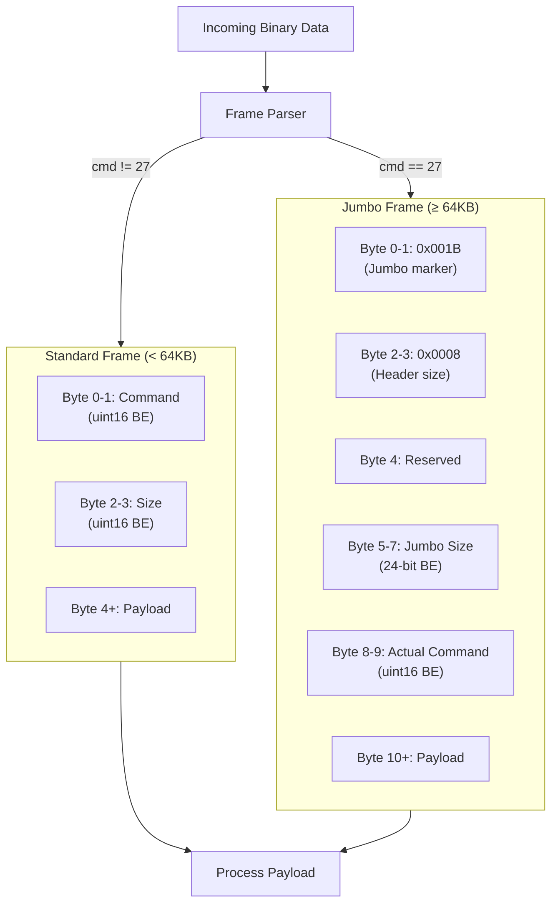
```mermaid
flowchart TD
    subgraph StandardFrame["Standard Frame (< 64KB)"]
        SF1["Byte 0-1: Command<br/>(uint16 BE)"]
        SF2["Byte 2-3: Size<br/>(uint16 BE)"]
        SF3["Byte 4+: Payload"]
    end
    
    subgraph JumboFrame["Jumbo Frame (≥ 64KB)"]
        JF1["Byte 0-1: 0x001B<br/>(Jumbo marker)"]
        JF2["Byte 2-3: 0x0008<br/>(Header size)"]
        JF3["Byte 4: Reserved"]
        JF4["Byte 5-7: Jumbo Size<br/>(24-bit BE)"]
        JF5["Byte 8-9: Actual Command<br/>(uint16 BE)"]
        JF6["Byte 10+: Payload"]
    end
    
    IncomingData["Incoming Binary Data"]
    Parser["Frame Parser"]
    
    IncomingData --> Parser
    Parser -->|"cmd != 27"| StandardFrame
    Parser -->|"cmd == 27"| JumboFrame
    
    StandardFrame --> ProcessPayload["Process Payload"]
    JumboFrame --> ProcessPayload
```

### Command Encoding Examples

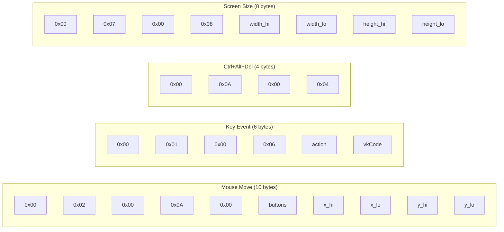
```mermaid
flowchart LR
    subgraph MouseMove["Mouse Move (10 bytes)"]
        MM1["0x00"]
        MM2["0x02"]
        MM3["0x00"]
        MM4["0x0A"]
        MM5["0x00"]
        MM6["buttons"]
        MM7["x_hi"]
        MM8["x_lo"]
        MM9["y_hi"]
        MM10["y_lo"]
    end
    
    subgraph KeyEvent["Key Event (6 bytes)"]
        KE1["0x00"]
        KE2["0x01"]
        KE3["0x00"]
        KE4["0x06"]
        KE5["action"]
        KE6["vkCode"]
    end
    
    subgraph CtrlAltDel["Ctrl+Alt+Del (4 bytes)"]
        CAD1["0x00"]
        CAD2["0x0A"]
        CAD3["0x00"]
        CAD4["0x04"]
    end
    
    subgraph ScreenSize["Screen Size (8 bytes)"]
        SS1["0x00"]
        SS2["0x07"]
        SS3["0x00"]
        SS4["0x08"]
        SS5["width_hi"]
        SS6["width_lo"]
        SS7["height_hi"]
        SS8["height_lo"]
    end
```

---

## 🎨 Rendering Pipeline

### Tile Decoding and Drawing Pipeline

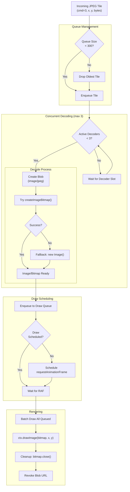
```mermaid
flowchart TD
    IncomingTile["Incoming JPEG Tile<br/>(cmd=3, x, y, bytes)"]
    
    subgraph QueueManagement["Queue Management"]
        CheckQueue{"Queue Size<br/>< 300?"}
        DropOldest["Drop Oldest Tile"]
        EnqueueTile["Enqueue Tile"]
    end
    
    subgraph ConcurrentDecoding["Concurrent Decoding (max 3)"]
        CheckDecoders{"Active Decoders<br/>< 3?"}
        WaitForSlot["Wait for Decoder Slot"]
        
        subgraph DecodeProcess["Decode Process"]
            CreateBlob["Create Blob<br/>(image/jpeg)"]
            TryImageBitmap["Try createImageBitmap()"]
            CheckSuccess{"Success?"}
            FallbackImage["Fallback: new Image()"]
            ImageReady["Image/Bitmap Ready"]
        end
    end
    
    subgraph DrawScheduling["Draw Scheduling"]
        EnqueueDraw["Enqueue to Draw Queue"]
        CheckScheduled{"Draw<br/>Scheduled?"}
        ScheduleRAF["Schedule requestAnimationFrame"]
        WaitForRAF["Wait for RAF"]
    end
    
    subgraph Rendering["Rendering"]
        BatchDraw["Batch Draw All Queued"]
        DrawToCanvas["ctx.drawImage(bitmap, x, y)"]
        CleanupBitmap["Cleanup: bitmap.close()"]
        RevokeURL["Revoke Blob URL"]
    end
    
    IncomingTile --> CheckQueue
    CheckQueue -->|"No"| DropOldest
    CheckQueue -->|"Yes"| EnqueueTile
    DropOldest --> EnqueueTile
    
    EnqueueTile --> CheckDecoders
    CheckDecoders -->|"No"| WaitForSlot
    CheckDecoders -->|"Yes"| CreateBlob
    WaitForSlot --> CheckDecoders
    
    CreateBlob --> TryImageBitmap
    TryImageBitmap --> CheckSuccess
    CheckSuccess -->|"Yes"| ImageReady
    CheckSuccess -->|"No"| FallbackImage
    FallbackImage --> ImageReady
    
    ImageReady --> EnqueueDraw
    EnqueueDraw --> CheckScheduled
    CheckScheduled -->|"No"| ScheduleRAF
    CheckScheduled -->|"Yes"| WaitForRAF
    ScheduleRAF --> WaitForRAF
    
    WaitForRAF --> BatchDraw
    BatchDraw --> DrawToCanvas
    DrawToCanvas --> CleanupBitmap
    CleanupBitmap --> RevokeURL
```

---

## 🖼️ Multi-Display Management

### Display Switching Flow

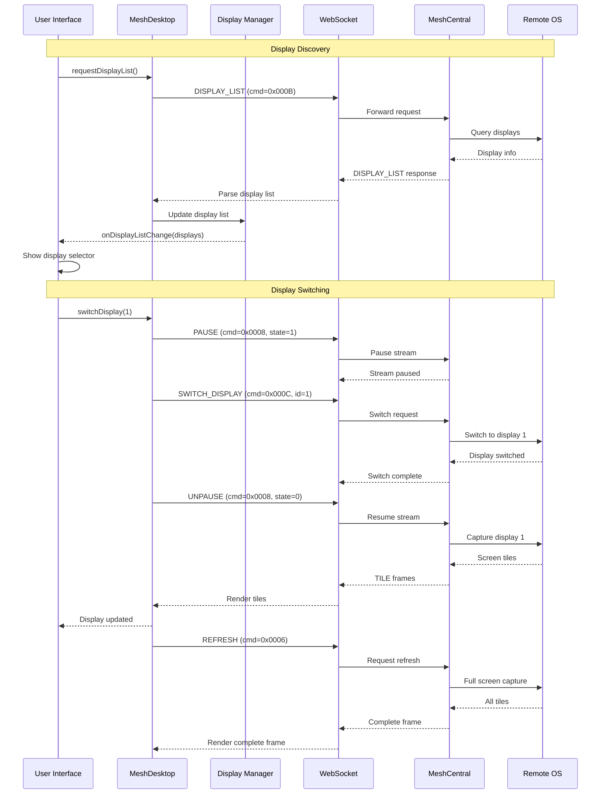
```mermaid
sequenceDiagram
    participant UI as User Interface
    participant MD as MeshDesktop
    participant DM as Display Manager
    participant WS as WebSocket
    participant Server as MeshCentral
    participant OS as Remote OS
    
    Note over UI,OS: Display Discovery
    UI->>MD: requestDisplayList()
    MD->>WS: DISPLAY_LIST (cmd=0x000B)
    WS->>Server: Forward request
    Server->>OS: Query displays
    OS-->>Server: Display info
    Server-->>WS: DISPLAY_LIST response
    WS-->>MD: Parse display list
    MD->>DM: Update display list
    DM-->>UI: onDisplayListChange(displays)
    UI->>UI: Show display selector
    
    Note over UI,OS: Display Switching
    UI->>MD: switchDisplay(1)
    MD->>WS: PAUSE (cmd=0x0008, state=1)
    WS->>Server: Pause stream
    Server-->>WS: Stream paused
    
    MD->>WS: SWITCH_DISPLAY (cmd=0x000C, id=1)
    WS->>Server: Switch request
    Server->>OS: Switch to display 1
    OS-->>Server: Display switched
    Server-->>WS: Switch complete
    
    MD->>WS: UNPAUSE (cmd=0x0008, state=0)
    WS->>Server: Resume stream
    Server->>OS: Capture display 1
    OS-->>Server: Screen tiles
    Server-->>WS: TILE frames
    WS-->>MD: Render tiles
    MD-->>UI: Display updated
    
    MD->>WS: REFRESH (cmd=0x0006)
    WS->>Server: Request refresh
    Server->>OS: Full screen capture
    OS-->>Server: All tiles
    Server-->>WS: Complete frame
    WS-->>MD: Render complete frame
```

### Display Coordinate Mapping

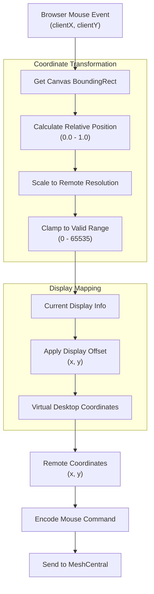
```mermaid
flowchart TD
    MouseEvent["Browser Mouse Event<br/>(clientX, clientY)"]
    
    subgraph CoordinateTransform["Coordinate Transformation"]
        GetRect["Get Canvas BoundingRect"]
        CalcRelative["Calculate Relative Position<br/>(0.0 - 1.0)"]
        ScaleToRemote["Scale to Remote Resolution"]
        ClampCoords["Clamp to Valid Range<br/>(0 - 65535)"]
    end
    
    subgraph DisplayMapping["Display Mapping"]
        CurrentDisplay["Current Display Info"]
        DisplayOffset["Apply Display Offset<br/>(x, y)"]
        VirtualDesktop["Virtual Desktop Coordinates"]
    end
    
    RemoteCoords["Remote Coordinates<br/>(x, y)"]
    EncodeCommand["Encode Mouse Command"]
    SendToServer["Send to MeshCentral"]
    
    MouseEvent --> GetRect
    GetRect --> CalcRelative
    CalcRelative --> ScaleToRemote
    ScaleToRemote --> ClampCoords
    
    ClampCoords --> CurrentDisplay
    CurrentDisplay --> DisplayOffset
    DisplayOffset --> VirtualDesktop
    
    VirtualDesktop --> RemoteCoords
    RemoteCoords --> EncodeCommand
    EncodeCommand --> SendToServer
```

---

## 🔐 Security Architecture

### Authentication and Authorization Flow

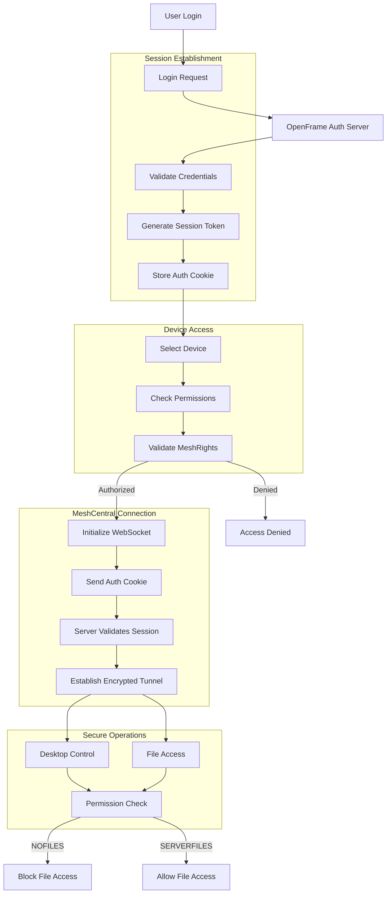
```mermaid
flowchart TD
    User["User Login"]
    AuthServer["OpenFrame Auth Server"]
    
    subgraph SessionEstablishment["Session Establishment"]
        Login["Login Request"]
        ValidateCreds["Validate Credentials"]
        GenerateToken["Generate Session Token"]
        StoreCookie["Store Auth Cookie"]
    end
    
    subgraph DeviceAccess["Device Access"]
        SelectDevice["Select Device"]
        CheckPerms["Check Permissions"]
        ValidateRights["Validate MeshRights"]
    end
    
    subgraph MeshConnection["MeshCentral Connection"]
        InitWS["Initialize WebSocket"]
        SendCookie["Send Auth Cookie"]
        ServerValidate["Server Validates Session"]
        EstablishTunnel["Establish Encrypted Tunnel"]
    end
    
    subgraph Operations["Secure Operations"]
        DesktopControl["Desktop Control"]
        FileAccess["File Access"]
        PermissionCheck["Permission Check"]
    end
    
    User --> Login
    Login --> AuthServer
    AuthServer --> ValidateCreds
    ValidateCreds --> GenerateToken
    GenerateToken --> StoreCookie
    
    StoreCookie --> SelectDevice
    SelectDevice --> CheckPerms
    CheckPerms --> ValidateRights
    
    ValidateRights -->|"Authorized"| InitWS
    ValidateRights -->|"Denied"| AccessDenied["Access Denied"]
    
    InitWS --> SendCookie
    SendCookie --> ServerValidate
    ServerValidate --> EstablishTunnel
    
    EstablishTunnel --> DesktopControl
    EstablishTunnel --> FileAccess
    
    DesktopControl --> PermissionCheck
    FileAccess --> PermissionCheck
    
    PermissionCheck -->|"NOFILES"| BlockFileAccess["Block File Access"]
    PermissionCheck -->|"SERVERFILES"| AllowFileAccess["Allow File Access"]
```

---

## 📊 Performance Monitoring

### Resource Usage Diagram

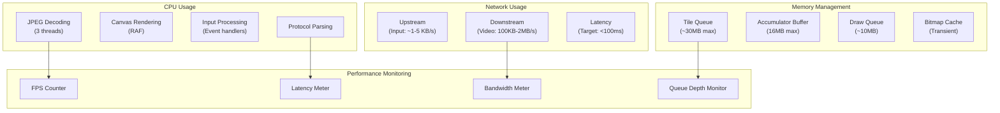
```mermaid
flowchart TD
    subgraph MemoryManagement["Memory Management"]
        TileQueueMem["Tile Queue<br/>(~30MB max)"]
        AccumulatorMem["Accumulator Buffer<br/>(16MB max)"]
        DrawQueueMem["Draw Queue<br/>(~10MB)"]
        BitmapCache["Bitmap Cache<br/>(Transient)"]
    end
    
    subgraph CPUUsage["CPU Usage"]
        JPEGDecode["JPEG Decoding<br/>(3 threads)"]
        CanvasRender["Canvas Rendering<br/>(RAF)"]
        InputProcessing["Input Processing<br/>(Event handlers)"]
        ProtocolParsing["Protocol Parsing"]
    end
    
    subgraph NetworkUsage["Network Usage"]
        Upstream["Upstream<br/>(Input: ~1-5 KB/s)"]
        Downstream["Downstream<br/>(Video: 100KB-2MB/s)"]
        Latency["Latency<br/>(Target: <100ms)"]
    end
    
    subgraph Monitoring["Performance Monitoring"]
        FPSCounter["FPS Counter"]
        LatencyMeter["Latency Meter"]
        BandwidthMeter["Bandwidth Meter"]
        QueueDepth["Queue Depth Monitor"]
    end
    
    TileQueueMem --> QueueDepth
    JPEGDecode --> FPSCounter
    Downstream --> BandwidthMeter
    ProtocolParsing --> LatencyMeter
```

---

## 🎯 Component Dependency Graph

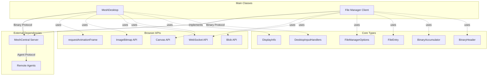
```mermaid
flowchart TD
    subgraph CoreTypes["Core Types"]
        DisplayInfo["DisplayInfo"]
        DesktopInputHandlers["DesktopInputHandlers"]
        BinaryHeader["BinaryHeader"]
        BinaryAccumulator["BinaryAccumulator"]
        FileEntry["FileEntry"]
        FileManagerOptions["FileManagerOptions"]
    end
    
    subgraph MainClasses["Main Classes"]
        MeshDesktop["MeshDesktop"]
        FileManagerClient["File Manager Client"]
    end
    
    subgraph BrowserAPIs["Browser APIs"]
        Canvas["Canvas API"]
        WebSocket["WebSocket API"]
        ImageBitmap["ImageBitmap API"]
        Blob["Blob API"]
        RAF["requestAnimationFrame"]
    end
    
    subgraph ExternalDeps["External Dependencies"]
        MeshCentralServer["MeshCentral Server"]
        RemoteAgents["Remote Agents"]
    end
    
    MeshDesktop -.implements.-> DesktopInputHandlers
    MeshDesktop -.uses.-> DisplayInfo
    MeshDesktop -.uses.-> Canvas
    MeshDesktop -.uses.-> WebSocket
    MeshDesktop -.uses.-> ImageBitmap
    MeshDesktop -.uses.-> RAF
    
    FileManagerClient -.uses.-> BinaryHeader
    FileManagerClient -.uses.-> BinaryAccumulator
    FileManagerClient -.uses.-> FileEntry
    FileManagerClient -.uses.-> FileManagerOptions
    FileManagerClient -.uses.-> WebSocket
    FileManagerClient -.uses.-> Blob
    
    MeshDesktop -->|"Binary Protocol"| MeshCentralServer
    FileManagerClient -->|"Binary Protocol"| MeshCentralServer
    MeshCentralServer -->|"Agent Protocol"| RemoteAgents
```

---

## 📈 Scalability Considerations

### Concurrent Session Handling

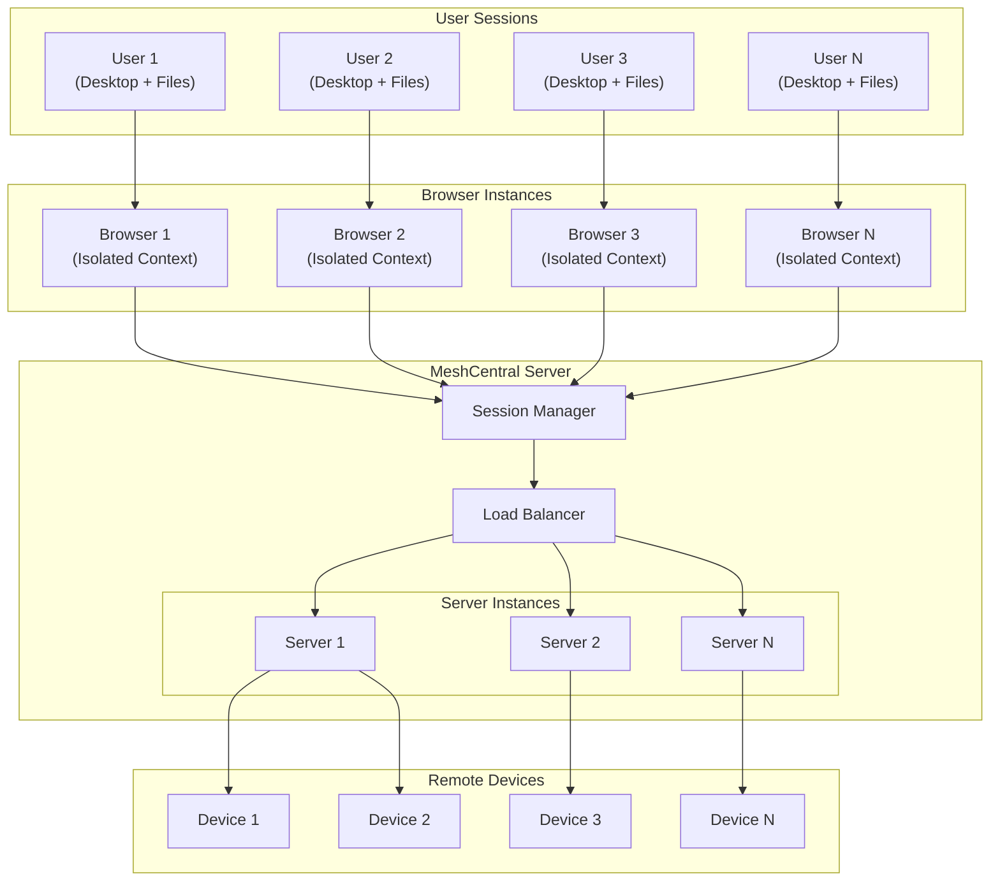
```mermaid
flowchart TD
    subgraph UserSessions["User Sessions"]
        User1["User 1<br/>(Desktop + Files)"]
        User2["User 2<br/>(Desktop + Files)"]
        User3["User 3<br/>(Desktop + Files)"]
        UserN["User N<br/>(Desktop + Files)"]
    end
    
    subgraph BrowserInstances["Browser Instances"]
        Browser1["Browser 1<br/>(Isolated Context)"]
        Browser2["Browser 2<br/>(Isolated Context)"]
        Browser3["Browser 3<br/>(Isolated Context)"]
        BrowserN["Browser N<br/>(Isolated Context)"]
    end
    
    subgraph MeshCentralServer["MeshCentral Server"]
        SessionMgr["Session Manager"]
        LoadBalancer["Load Balancer"]
        
        subgraph ServerInstances["Server Instances"]
            Server1["Server 1"]
            Server2["Server 2"]
            ServerN["Server N"]
        end
    end
    
    subgraph RemoteDevices["Remote Devices"]
        Device1["Device 1"]
        Device2["Device 2"]
        Device3["Device 3"]
        DeviceN["Device N"]
    end
    
    User1 --> Browser1
    User2 --> Browser2
    User3 --> Browser3
    UserN --> BrowserN
    
    Browser1 --> SessionMgr
    Browser2 --> SessionMgr
    Browser3 --> SessionMgr
    BrowserN --> SessionMgr
    
    SessionMgr --> LoadBalancer
    
    LoadBalancer --> Server1
    LoadBalancer --> Server2
    LoadBalancer --> ServerN
    
    Server1 --> Device1
    Server1 --> Device2
    Server2 --> Device3
    ServerN --> DeviceN
```

---

## 🔄 Error Recovery Flows

### Connection Recovery

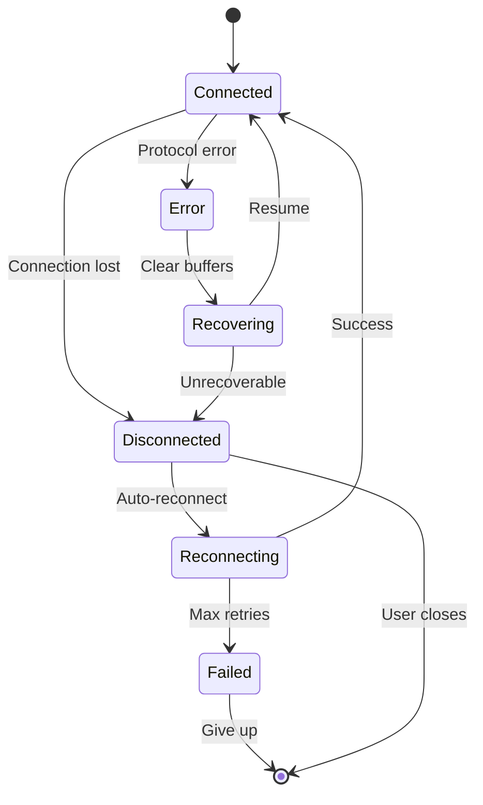
```mermaid
stateDiagram-v2
    [*] --> Connected
    
    Connected --> Disconnected: Connection lost
    
    Disconnected --> Reconnecting: Auto-reconnect
    Reconnecting --> Connected: Success
    Reconnecting --> Failed: Max retries
    
    Connected --> Error: Protocol error
    Error --> Recovering: Clear buffers
    Recovering --> Connected: Resume
    Recovering --> Disconnected: Unrecoverable
    
    Failed --> [*]: Give up
    Disconnected --> [*]: User closes
```

---

**End of Visual Overview**

For detailed implementation information, refer to:
- [meshcentral_integration.md](meshcentral_integration.md)
- [meshcentral_desktop_control.md](meshcentral_desktop_control.md)
- [meshcentral_file_management.md](meshcentral_file_management.md)
