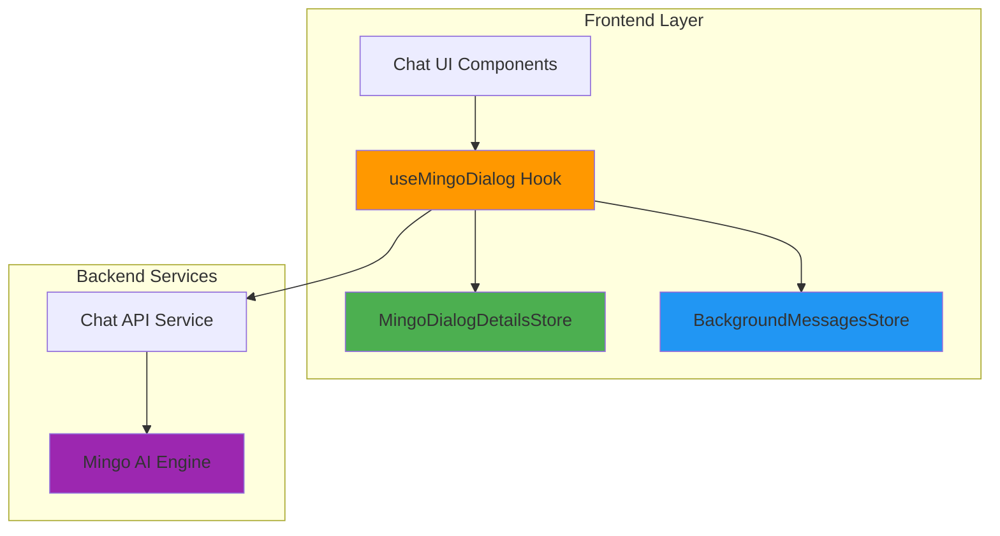

# Mingo AI Assistant Module - Documentation Index

Welcome to the **Mingo AI Assistant Module** documentation. This module provides the frontend implementation of Mingo, OpenFrame's AI-powered IT support assistant for MSP technicians.

---

## 📚 Documentation Structure

### Main Documentation
- **[Mingo AI Assistant - Complete Guide](./mingo_ai_assistant.md)**  
  Comprehensive documentation covering architecture, components, workflows, and implementation details.

### Quick Reference
- **[Module Summary](./MINGO_AI_ASSISTANT_SUMMARY.md)**  
  High-level overview with key statistics, architecture diagrams, and quick links.

---

## 🎯 What is Mingo AI Assistant?

Mingo is an AI-powered chat assistant designed specifically for MSP technicians. The frontend module provides:

- **Real-time AI Chat Interface** with streaming responses
- **Multi-Dialog Management** for handling multiple conversations
- **Background Message Processing** for inactive dialogs
- **Intelligent State Synchronization** across conversations
- **Unread Message Tracking** and notifications
- **Optimistic UI Updates** with error recovery

---

## 🏗️ Architecture Overview



---

## 🔑 Core Components

| Component | Purpose | Documentation |
|-----------|---------|---------------|
| **useMingoDialog** | Dialog lifecycle & message operations | [View Details](./mingo_ai_assistant.md#usemingodialog-hook-detailed) |
| **MingoDialogDetailsStore** | Active dialog state management | [View Details](./mingo_ai_assistant.md#mingodialogdetailsstore-detailed) |
| **BackgroundMessagesStore** | Background dialog state management | [View Details](./mingo_ai_assistant.md#backgroundmessagesstore-detailed) |

---

## 🚀 Quick Start

### Basic Usage

```typescript
import { useMingoDialog } from '@app/mingo/hooks/use-mingo-dialog'
import { useMingoDialogDetailsStore } from '@app/mingo/stores/mingo-dialog-details-store'

function ChatInterface() {
  const { sendMessage, isSendingMessage } = useMingoDialog()
  const { adminMessages } = useMingoDialogDetailsStore()
  
  const handleSend = async (content: string) => {
    const success = await sendMessage(content)
    if (success) {
      console.log('Message sent!')
    }
  }
  
  return (
    <div>
      {adminMessages.map(msg => (
        <MessageBubble key={msg.id} message={msg} />
      ))}
      <MessageInput onSend={handleSend} disabled={isSendingMessage} />
    </div>
  )
}
```

### Multi-Dialog Management

```typescript
import { useMingoBackgroundMessagesStore } from '@app/mingo/stores/mingo-background-messages-store'

function DialogList() {
  const { getUnreadCount, getDialogMessages } = useMingoBackgroundMessagesStore()
  
  return (
    <div>
      {dialogs.map(dialog => (
        <DialogItem 
          key={dialog.id}
          dialog={dialog}
          unreadCount={getUnreadCount(dialog.id)}
          lastMessage={getDialogMessages(dialog.id).slice(-1)[0]}
        />
      ))}
    </div>
  )
}
```

---

## 📖 Documentation Sections

### 1. [Overview & Architecture](./mingo_ai_assistant.md#overview)
- Module purpose and capabilities
- High-level architecture
- State management design
- Component interaction flow

### 2. [Core Components](./mingo_ai_assistant.md#core-components)
- useMingoDialog Hook
- MingoDialogDetailsStore
- BackgroundMessagesStore
- Detailed API documentation

### 3. [Data Types](./mingo_ai_assistant.md#data-types)
- Dialog types
- Message types
- Request/Response structures
- GraphQL schemas

### 4. [Key Workflows](./mingo_ai_assistant.md#key-workflows)
- Message sending flow
- Dialog switching flow
- Background message handling
- Streaming message pattern

### 5. [Integration](./mingo_ai_assistant.md#integration-with-backend)
- REST API endpoints
- GraphQL queries
- WebSocket integration (planned)
- Data flow sequences

### 6. [Performance](./mingo_ai_assistant.md#performance-considerations)
- Memory management
- Optimization strategies
- Message limits
- State separation benefits

### 7. [Error Handling](./mingo_ai_assistant.md#error-handling)
- Error types
- Recovery strategies
- User notifications
- Retry logic

### 8. [Testing](./mingo_ai_assistant.md#testing-considerations)
- Unit testing examples
- Integration testing
- E2E testing (planned)
- Testing strategies

---

## 🔗 Related Documentation

### Frontend Modules
- **[Frontend Main Application](./frontend_main.md)** - Parent application structure
- **[Frontend Chat](./frontend_chat.md)** - Shared chat components and services
- **[Frontend Core Components](./frontend_core_components.md)** - UI component library
- **[Frontend Support Tickets](./frontend_support_tickets.md)** - Related ticket system

### Backend Services
- **[API Service](./api_service.md)** - REST API endpoints
- **[Authorization Service](./authorization_service.md)** - Authentication & authorization
- **[Gateway Service](./gateway_service.md)** - API gateway

### Data Layer
- **[Data Layer MongoDB](./data_layer_mongo.md)** - MongoDB data models
- **[Data Layer Kafka](./data_layer_kafka.md)** - Event streaming

---

## 📊 Key Statistics

| Metric | Value |
|--------|-------|
| Core Components | 5 |
| State Stores | 2 (Active + Background) |
| API Integrations | 2 (REST + GraphQL) |
| Max Background Messages | 50 per dialog |
| Supported Chat Types | ADMIN_AI_CHAT |
| Message Retry Attempts | 3 |

---

## 🎥 Video Resources

### Mingo AI Demo

[](https://www.youtube.com/watch?v=awc-yAnkhIo)

*Watch a demonstration of Mingo AI Assistant in action, showcasing real-time chat, multi-dialog management, and AI-powered IT support.*

---

## 🛠️ Technology Stack

| Technology | Purpose |
|------------|---------|
| **React** | UI framework |
| **TypeScript** | Type safety |
| **Zustand** | State management |
| **React Query** | Data fetching & caching |
| **GraphQL** | Query language |
| **REST API** | CRUD operations |

---

## 🔐 Security Considerations

- **Authentication:** JWT-based authentication via API client
- **Authorization:** Role-based access control (ADMIN role required)
- **Data Privacy:** Messages encrypted in transit (HTTPS)
- **Input Validation:** Client-side validation before API calls
- **XSS Prevention:** React's built-in XSS protection

---

## 🚦 Performance Metrics

### Memory Management
- **Background Message Limit:** 50 messages per dialog
- **Message Deduplication:** Prevents duplicate storage
- **Automatic Trimming:** Removes oldest messages when limit exceeded

### Response Times
- **Dialog Creation:** < 500ms (typical)
- **Message Sending:** < 200ms (typical)
- **AI Response Start:** < 1s (typical)
- **Full AI Response:** 2-5s (varies by complexity)

---

## 🐛 Troubleshooting

### Common Issues

**Issue: Messages not appearing**
- Check network connectivity
- Verify dialog ID is set correctly
- Check browser console for errors
- Ensure WebSocket connection is active (if applicable)

**Issue: Typing indicator stuck**
- Check for streaming errors in console
- Verify `removeTypingMessage()` is called
- Check network tab for incomplete responses

**Issue: High memory usage**
- Verify background message limit is enforced
- Check for memory leaks in components
- Monitor store size in Redux DevTools

### Debug Mode

Enable debug logging:

```typescript
// In browser console
localStorage.setItem('DEBUG_MINGO', 'true')

// View store state
useMingoDialogDetailsStore.getState()
useMingoBackgroundMessagesStore.getState()
```

---

## 📝 Contributing

### Development Workflow

1. **Clone Repository**
   ```bash
   git clone https://github.com/flamingo/openframe.git
   cd openframe/services/openframe-frontend
   ```

2. **Install Dependencies**
   ```bash
   npm install
   ```

3. **Run Development Server**
   ```bash
   npm run dev
   ```

4. **Run Tests**
   ```bash
   npm test
   npm run test:coverage
   ```

### Code Style

- Follow TypeScript best practices
- Use ESLint and Prettier for formatting
- Write unit tests for new features
- Document complex logic with comments

---

## 🆘 Support & Community

### Get Help

- **OpenMSP Slack Community:** [Join here](https://join.slack.com/t/openmsp/shared_invite/zt-36bl7mx0h-3~U2nFH6nqHqoTPXMaHEHA)
- **Flamingo Platform:** [https://flamingo.run](https://flamingo.run)
- **OpenFrame Platform:** [https://openframe.ai](https://openframe.ai)

**Note:** We don't use GitHub Issues or GitHub Discussions. All support and discussions happen in our OpenMSP Slack community.

### Community Resources

- **Documentation:** [OpenFrame Docs](https://docs.openframe.ai)
- **Blog:** [Flamingo Blog](https://flamingo.run/blog)
- **Twitter:** [@FlamingoMSP](https://twitter.com/FlamingoMSP)

---

## 📅 Roadmap

### Current Version (1.0)
- ✅ Real-time chat interface
- ✅ Multi-dialog management
- ✅ Background message processing
- ✅ Streaming AI responses
- ✅ Error handling & recovery

### Upcoming Features (1.1)
- 🔄 WebSocket integration
- 🔄 Message search functionality
- 🔄 Rich message types (code, attachments)
- 🔄 Voice input support
- 🔄 Offline mode

### Future Enhancements (2.0)
- 📋 Advanced analytics
- 📋 Message templates
- 📋 AI model selection
- 📋 Custom AI training
- 📋 Integration with external tools

---

## 📄 License

This module is part of the OpenFrame platform. See the main repository for license information.

---

## 🙏 Acknowledgments

The Mingo AI Assistant module is built on top of:
- React and the React ecosystem
- Zustand for state management
- React Query for data fetching
- The OpenFrame platform architecture

Special thanks to the OpenMSP community for feedback and contributions.

---

## 📞 Contact

For questions, feedback, or contributions:

- **Slack:** [OpenMSP Community](https://join.slack.com/t/openmsp/shared_invite/zt-36bl7mx0h-3~U2nFH6nqHqoTPXMaHEHA)
- **Website:** [https://flamingo.run](https://flamingo.run)
- **Email:** support@flamingo.run

---

**Last Updated:** 2024  
**Documentation Version:** 1.0  
**Module Version:** 1.0
