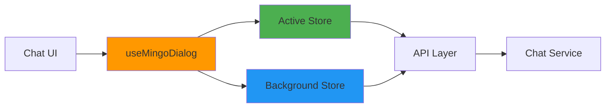

# Mingo AI Assistant Module - Summary

## Quick Overview

The **Mingo AI Assistant Module** is OpenFrame's frontend implementation of Mingo, an AI-powered IT support assistant for MSP technicians. It provides real-time chat capabilities with intelligent state management for handling multiple concurrent AI conversations.

**Module Type:** Frontend Application Module  
**Technology Stack:** React, TypeScript, Zustand, React Query, GraphQL  
**Primary Purpose:** AI-powered chat interface for IT support technicians

---

## Key Statistics

| Metric | Value |
|--------|-------|
| **Core Components** | 5 (3 stores, 1 hook, 1 type definitions) |
| **State Stores** | 2 (Active + Background) |
| **API Integrations** | 2 (REST + GraphQL) |
| **Message Types** | 2 (User + Assistant) |
| **Max Background Messages** | 50 per dialog |
| **Supported Chat Types** | ADMIN_AI_CHAT |

---

## Architecture at a Glance



**Key Design Principles:**
- **State Separation:** Active vs. Background dialog management
- **Memory Optimization:** 50-message limit per background dialog
- **Real-time Updates:** Streaming message support with typing indicators
- **Error Recovery:** Comprehensive error handling with user notifications

---

## Core Components

### 1. useMingoDialog Hook
**Purpose:** Dialog lifecycle and message operations  
**Key Features:**
- Automatic dialog creation
- Message validation and sending
- Error handling with toast notifications
- State synchronization

### 2. MingoDialogDetailsStore
**Purpose:** Active dialog state management  
**Key Features:**
- Full message history with pagination
- Streaming message handling
- Typing indicators
- Real-time updates

### 3. BackgroundMessagesStore
**Purpose:** Background dialog state management  
**Key Features:**
- Memory-optimized storage (50 msg limit)
- Unread count tracking
- Background typing indicators
- Efficient dialog switching

---

## Key Workflows

### Message Sending Flow

```text
1. User types message
2. Validate content (non-empty)
3. Check if dialog exists
   - If no: Create new dialog via POST /chat/api/v2/dialogs
   - If yes: Use existing dialog
4. Add typing indicator (ensureTypingMessage)
5. Send message via POST /chat/api/v2/messages
6. Receive streaming response chunks
7. Update message text incrementally (updateLastAssistantMessage)
8. Remove typing indicator when complete
```

### Dialog Switching Flow

```text
1. User clicks different dialog
2. Move background messages to active store
3. Reset unread count for selected dialog
4. Clear current active dialog state
5. Set new dialog as active
6. Load full message history via GraphQL
7. Update UI with new dialog messages
```

---

## Data Types

### Dialog Structure
```typescript
interface DialogNode {
  id: string
  title: string
  status: string
  owner?: { machineId?: string, machine?: {...} }
  createdAt: string
  statusUpdatedAt?: string
  resolvedAt?: string
}
```

### Message Structure
```typescript
interface Message {
  id: string
  dialogId: string
  chatType: 'ADMIN_AI_CHAT'
  dialogMode: string
  createdAt: string
  owner: { type: 'USER' | 'ASSISTANT', model?: string }
  messageData: { type: 'TEXT', text: string }
}
```

---

## API Integration

### REST Endpoints

| Method | Endpoint | Purpose |
|--------|----------|---------|
| POST | `/chat/api/v2/dialogs` | Create new dialog |
| POST | `/chat/api/v2/messages` | Send message |

### GraphQL Queries

| Query | Purpose |
|-------|---------|
| `dialogs` | Fetch dialog list with pagination |
| `messages` | Fetch messages for a dialog |

---

## Performance Features

### Memory Management
- **Background Message Limit:** 50 messages per dialog
- **Message Deduplication:** Prevents duplicate messages in stores
- **Automatic Trimming:** Removes oldest messages when limit exceeded

### Optimization Strategies
- **Lazy Loading:** Messages loaded on-demand with pagination
- **State Separation:** Active/background stores prevent unnecessary re-renders
- **Selective Re-rendering:** Zustand selectors minimize component updates

---

## Error Handling

### Error Types Handled
1. **Network Errors** - Automatic retry with exponential backoff
2. **Validation Errors** - Client-side validation before API calls
3. **API Errors** - User-friendly error messages via toast notifications

### Recovery Strategies
- **Optimistic Updates** - Immediate UI feedback with rollback on error
- **Automatic Retry** - React Query handles retry logic
- **State Recovery** - Reset dialog state on critical errors

---

## Integration Points

### Frontend Dependencies
- **[Frontend Main](./frontend_main.md)** - Parent application
- **[Frontend Chat](./frontend_chat.md)** - Shared chat components
- **[Frontend Core Components](./frontend_core_components.md)** - UI library

### Backend Dependencies
- **[API Service](./api_service.md)** - REST API endpoints
- **Chat Service** - GraphQL queries and message processing
- **AI Engine** - Mingo AI response generation

---

## Usage Example

```typescript
import { useMingoDialog } from '@app/mingo/hooks/use-mingo-dialog'
import { useMingoDialogDetailsStore } from '@app/mingo/stores/mingo-dialog-details-store'

function ChatInterface() {
  const { sendMessage, isSendingMessage } = useMingoDialog()
  const { adminMessages, isLoadingMessages } = useMingoDialogDetailsStore()
  
  const handleSend = async (content: string) => {
    const success = await sendMessage(content)
    if (success) {
      console.log('Message sent successfully')
    }
  }
  
  return (
    <div>
      {adminMessages.map(msg => (
        <MessageBubble key={msg.id} message={msg} />
      ))}
      {isLoadingMessages && <LoadingSpinner />}
      <MessageInput onSend={handleSend} disabled={isSendingMessage} />
    </div>
  )
}
```

---

## Future Enhancements

### Planned Features
- **WebSocket Integration** - Real-time message delivery
- **Message Search** - Full-text search across dialogs
- **Rich Message Types** - Code blocks, attachments, media
- **Voice Input** - Speech-to-text support
- **Offline Support** - Local caching and sync

### Technical Improvements
- **Performance** - Virtual scrolling, lazy loading
- **Testing** - Increase coverage to 90%+
- **Accessibility** - WCAG 2.1 AA compliance

---

## Key Metrics & Limits

| Metric | Value | Rationale |
|--------|-------|-----------|
| Max Background Messages | 50 per dialog | Memory optimization |
| Message Retry Attempts | 3 | Balance reliability vs. UX |
| Retry Delay | Exponential (1s → 30s) | Avoid server overload |
| Toast Duration | 5 seconds | User notification visibility |
| Typing Indicator Timeout | N/A (event-driven) | Real-time accuracy |

---

## Testing Strategy

### Unit Tests
- Hook behavior (dialog creation, message sending)
- Store operations (message management, state updates)
- Utility functions (validation, formatting)

### Integration Tests
- Message flow (send → stream → display)
- Dialog switching (background → active)
- Error handling (network failures, validation)

### E2E Tests (Planned)
- Complete user workflows
- Multi-dialog scenarios
- Real-time message streaming

---

## Documentation Structure

```text
mingo_ai_assistant.md (Main Documentation)
├── Overview & Architecture
├── Core Components
│   ├── useMingoDialog Hook
│   ├── MingoDialogDetailsStore
│   └── BackgroundMessagesStore
├── Data Types & API Integration
├── Key Workflows
├── Performance & Error Handling
└── Testing & Future Enhancements
```

---

## Quick Links

- **[Full Documentation](./mingo_ai_assistant.md)** - Complete module documentation
- **[Frontend Main](./frontend_main.md)** - Parent application
- **[Frontend Chat](./frontend_chat.md)** - Shared chat components
- **[API Service](./api_service.md)** - Backend API documentation

---

## Support

- **OpenMSP Slack:** [Join Community](https://join.slack.com/t/openmsp/shared_invite/zt-36bl7mx0h-3~U2nFH6nqHqoTPXMaHEHA)
- **Flamingo Platform:** [https://flamingo.run](https://flamingo.run)
- **OpenFrame Platform:** [https://openframe.ai](https://openframe.ai)

---

## Version Information

**Last Updated:** 2024  
**Module Version:** 1.0  
**Documentation Version:** 1.0

---

## Conclusion

The Mingo AI Assistant module provides a production-ready, performant chat interface for AI-powered IT support. Its sophisticated state management, real-time capabilities, and focus on user experience make it an essential component of the OpenFrame platform.

**Key Strengths:**
- ✅ Robust state management with Zustand
- ✅ Real-time streaming message support
- ✅ Memory-optimized multi-dialog handling
- ✅ Comprehensive error handling
- ✅ Clean, maintainable architecture

**Ideal For:**
- MSP technicians needing AI assistance
- Real-time chat applications
- Multi-conversation management
- Streaming AI response interfaces
