# Mingo AI Assistant - Visual Overview

This document provides comprehensive visual diagrams for understanding the Mingo AI Assistant module architecture, data flows, and component interactions.

---

## Table of Contents

1. [System Architecture](#system-architecture)
2. [Component Hierarchy](#component-hierarchy)
3. [State Management](#state-management)
4. [Data Flow Diagrams](#data-flow-diagrams)
5. [Sequence Diagrams](#sequence-diagrams)
6. [State Transitions](#state-transitions)
7. [Error Handling Flow](#error-handling-flow)
8. [Performance Optimization](#performance-optimization)

---

## System Architecture

### High-Level System Architecture

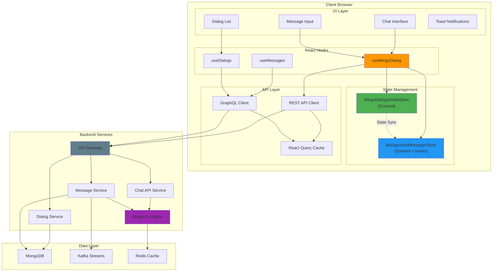

### Module Boundaries

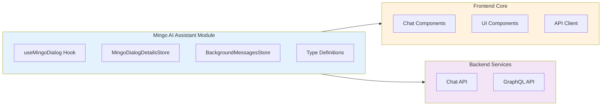

---

## Component Hierarchy

### React Component Tree

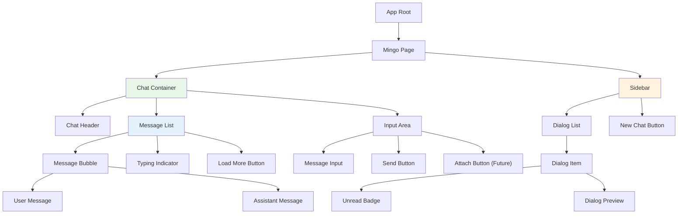

### Hook Dependencies

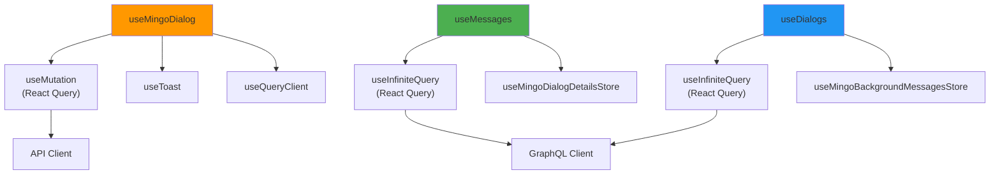

---

## State Management

### Store Architecture

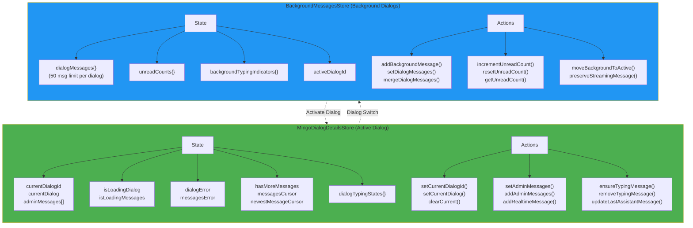

### State Synchronization

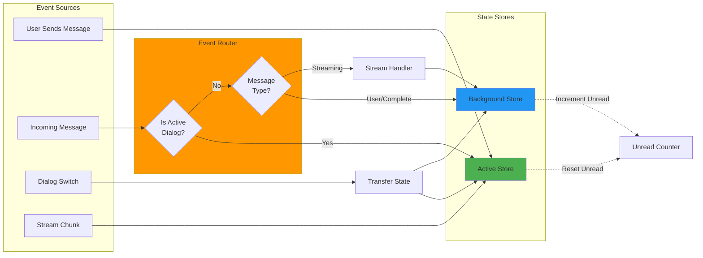

---

## Data Flow Diagrams

### Message Sending Flow

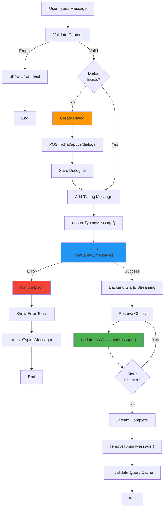

### Dialog Switching Flow

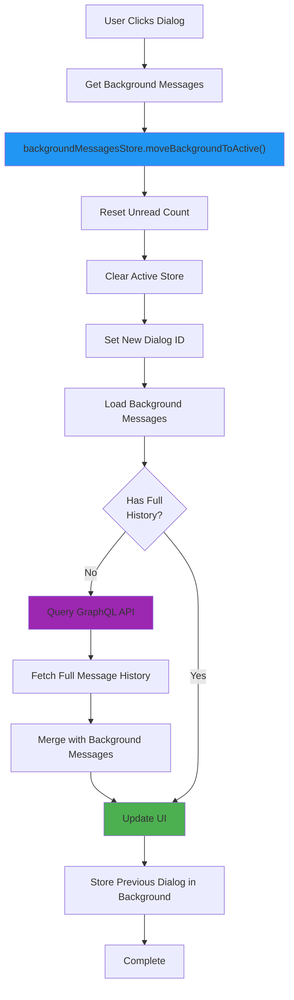

### Background Message Handling

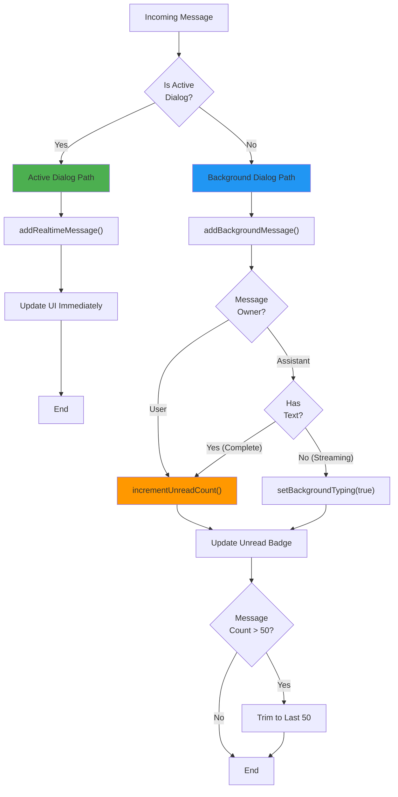

---

## Sequence Diagrams

### Complete Message Lifecycle

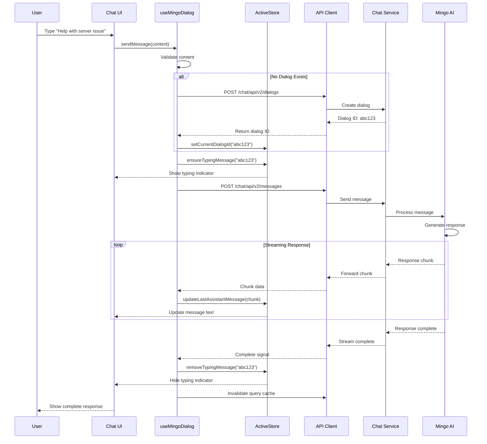

### Dialog Switching Sequence

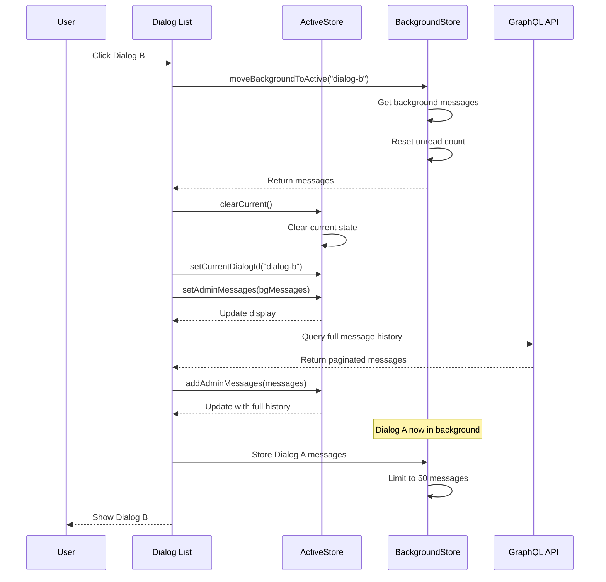

### Background Message Reception

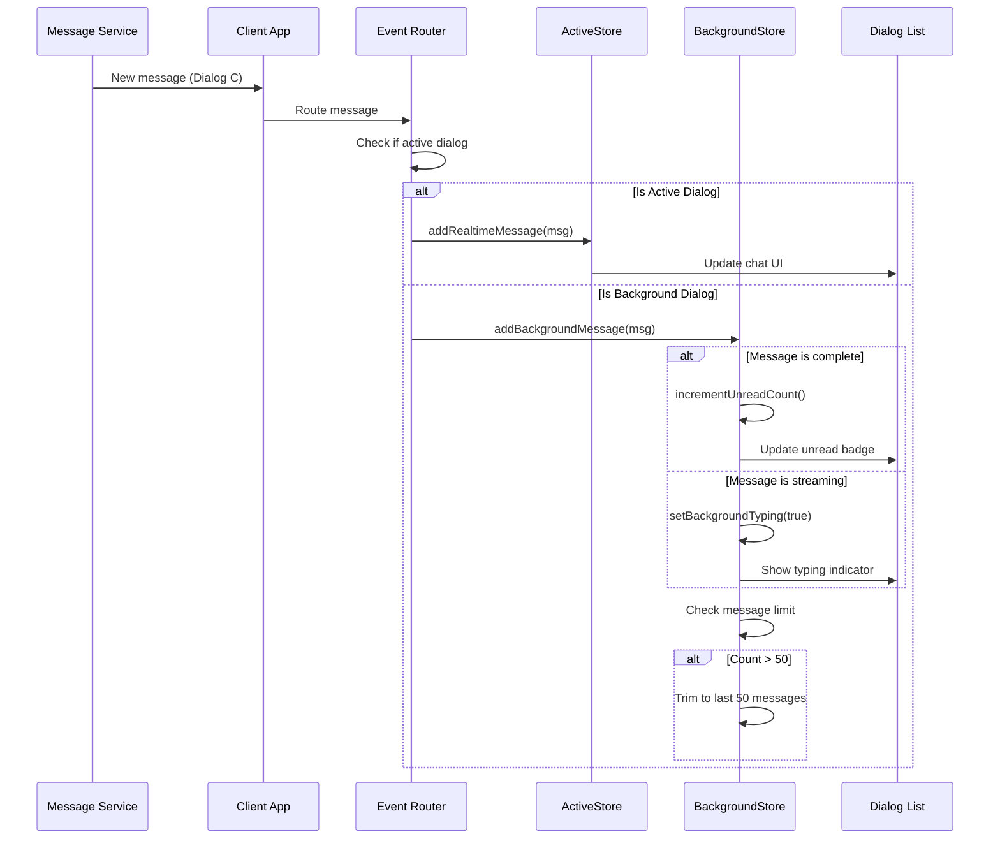

---

## State Transitions

### Dialog State Machine

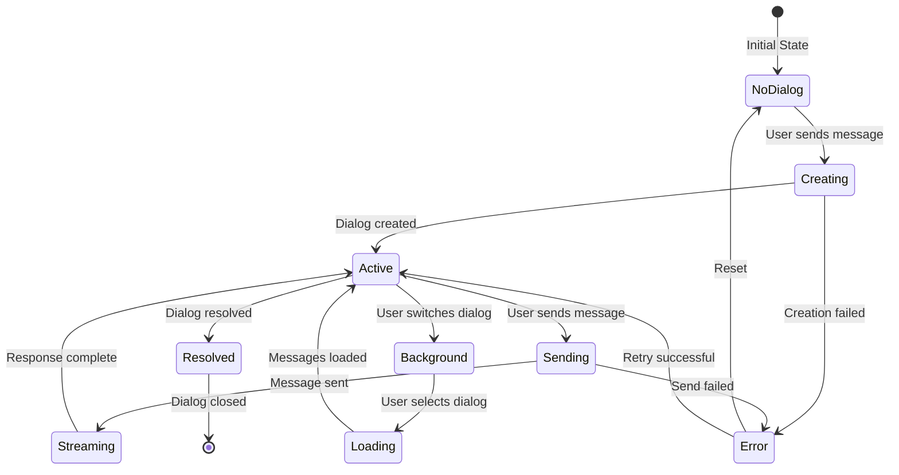

### Message State Machine

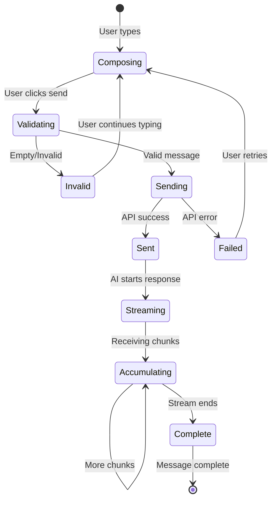

### Typing Indicator State

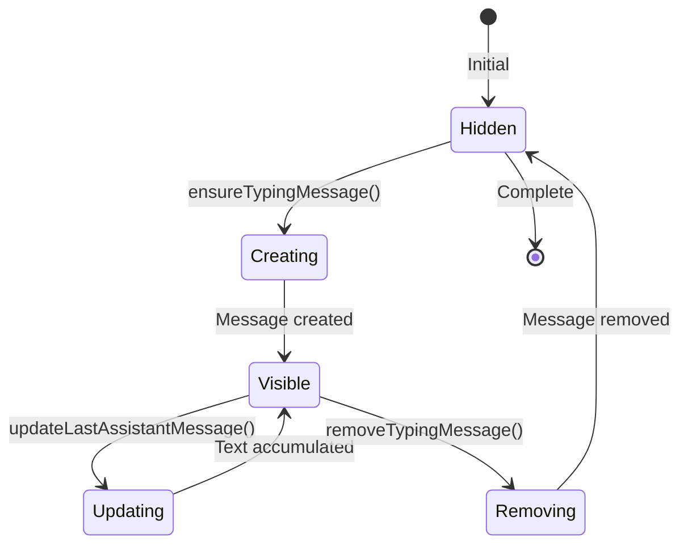

---

## Error Handling Flow

### Error Handling Strategy

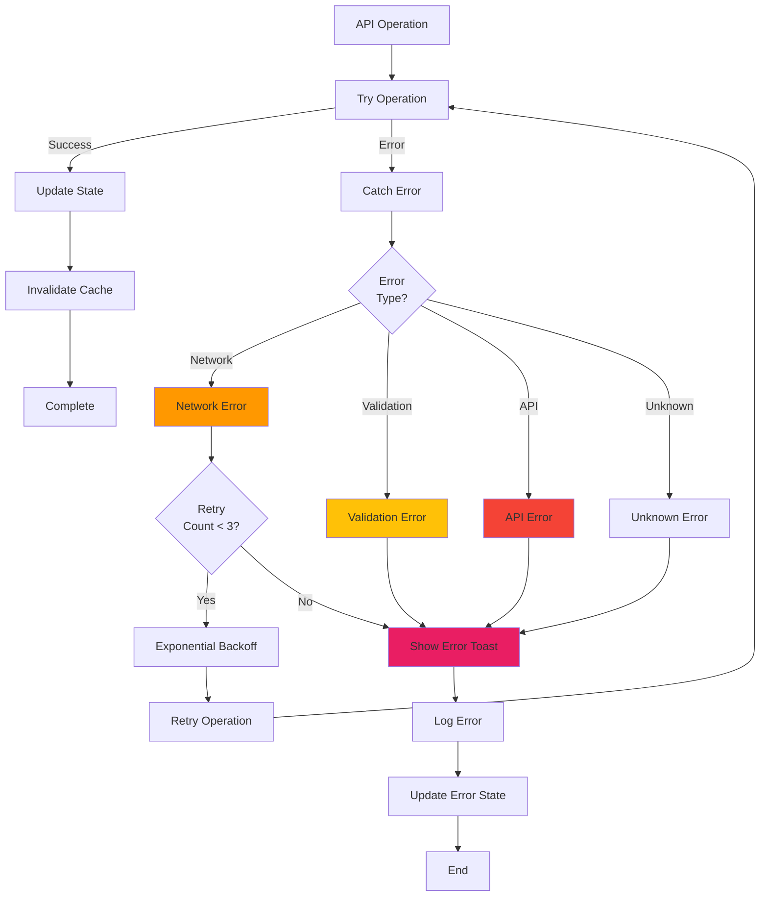

### Error Recovery Flow

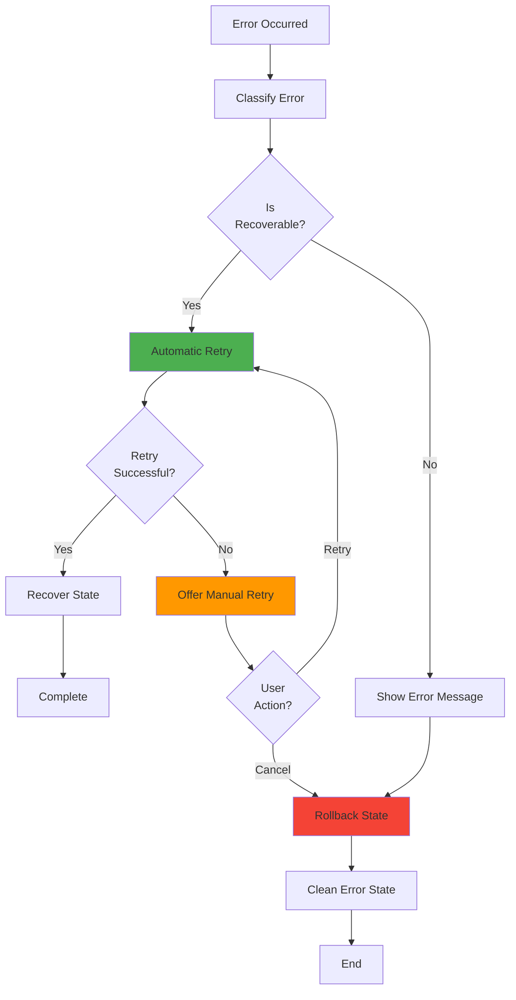

---

## Performance Optimization

### Memory Management Strategy

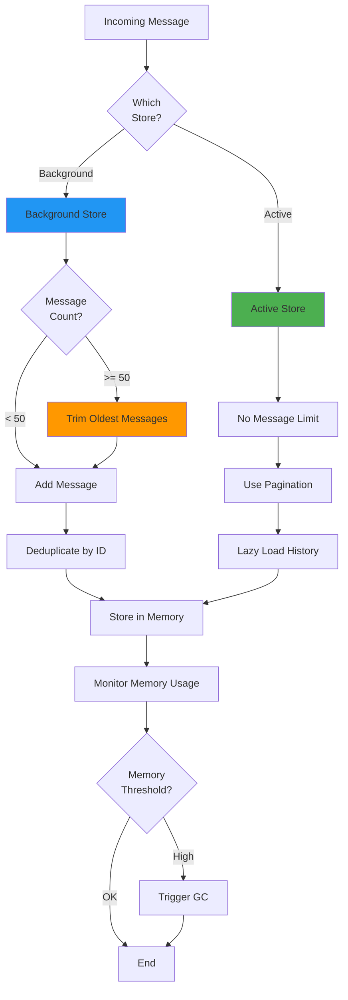

### Rendering Optimization

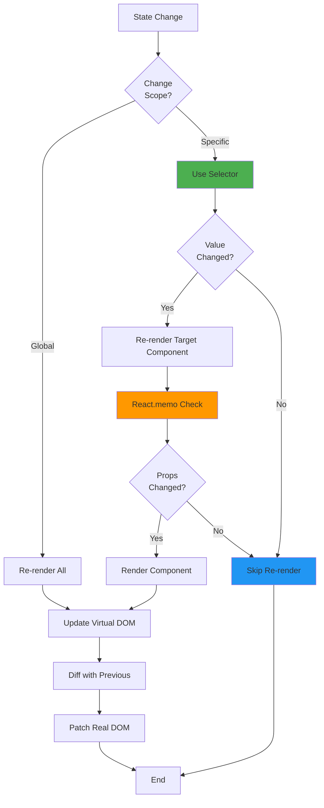

### Query Caching Strategy

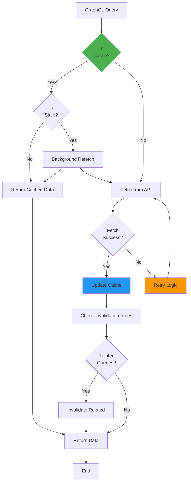

---

## Integration Patterns

### API Integration Pattern

```mermaid
flowchart TD
    Component["React Component"] --> Hook["Custom Hook"]
    
    Hook --> ReactQuery["React Query"]
    ReactQuery --> CheckCache{"Cache<br/>Hit?"}
    
    CheckCache -->|"Yes"| ReturnCache["Return Cached"]
    CheckCache -->|"No"| APIClient["API Client"]
    
    APIClient --> CheckType{"Request<br/>Type?"}
    
    CheckType -->|"REST"| RestAPI["REST API"]
    CheckType -->|"GraphQL"| GraphQLAPI["GraphQL API"]
    
    RestAPI --> Gateway["API Gateway"]
    GraphQLAPI --> Gateway
    
    Gateway --> Auth["Authentication"]
    Auth --> Backend["Backend Service"]
    
    Backend --> Response["Response"]
    Response --> Transform["Transform Data"]
    Transform --> UpdateCache["Update Cache"]
    UpdateCache --> ReturnData["Return to Component"]
    
    ReturnCache --> ReturnData
    ReturnData --> UpdateUI["Update UI"]
    
    style ReactQuery fill:#4CAF50
    style APIClient fill:#2196F3
    style Gateway fill:#FF9800
```

---

## Conclusion

These visual diagrams provide a comprehensive overview of the Mingo AI Assistant module's architecture, data flows, and component interactions. Use them as reference when:

- Understanding the system architecture
- Debugging issues
- Planning new features
- Onboarding new developers
- Documenting changes

For detailed implementation information, refer to the [main documentation](./mingo_ai_assistant.md).
