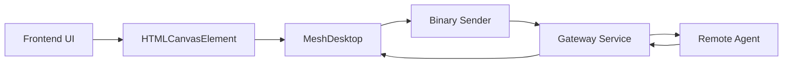
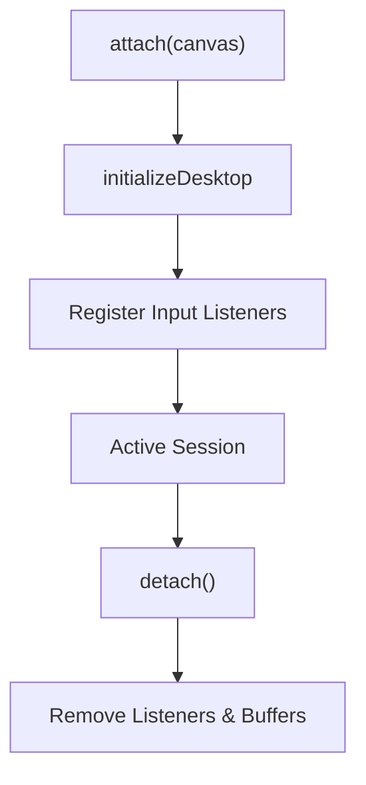
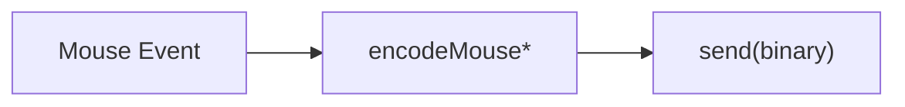
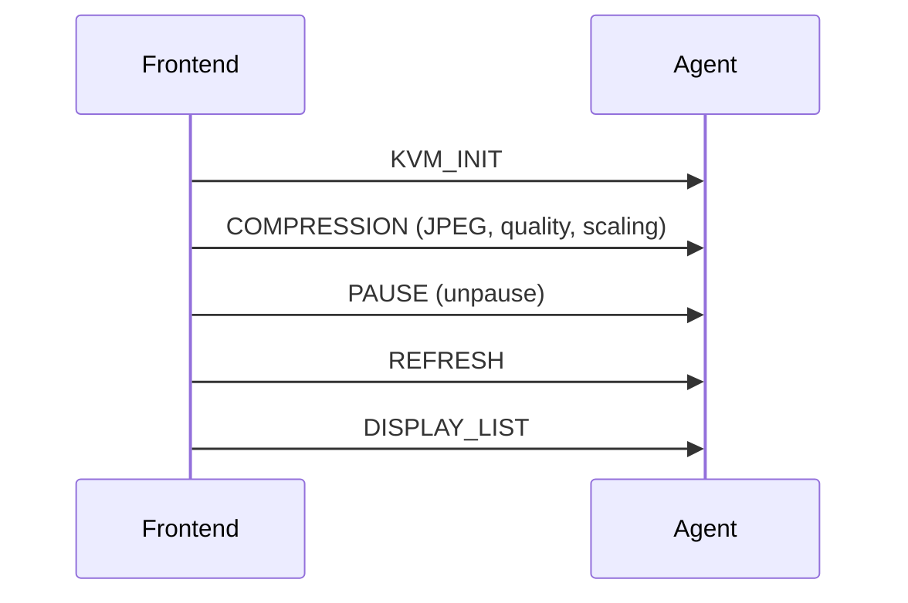
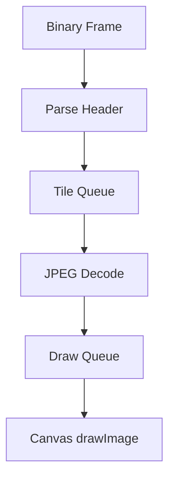
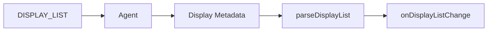

# MeshDesktop Module

The **MeshDesktop** module provides a browser-based remote desktop implementation for OpenFrame, enabling technicians to interact with managed devices directly from the frontend using the MeshCentral KVM protocol. It handles real-time rendering of the remote screen, user input capture (mouse, keyboard), multi-display management, and protocol-level message encoding/decoding.

This module lives in the frontend service core clients layer and is consumed by UI components that require live remote desktop access.

---

## Purpose and Responsibilities

MeshDesktop is responsible for:

- Rendering remote desktop frames onto an HTML canvas
- Encoding and sending mouse and keyboard input to a remote agent
- Managing session lifecycle (attach, detach, pause, resume)
- Handling MeshCentral desktop protocol commands
- Supporting multi-display (multi-monitor) environments
- Providing view-only and input-enabled modes

It does **not** handle authentication, WebSocket lifecycle management, or backend session orchestration. Those concerns are handled by gateway, authorization, and client services.

---

## High-Level Architecture



**Explanation:**

- UI components embed a canvas and instantiate `MeshDesktop`
- `MeshDesktop` captures user input and renders frames
- Binary protocol messages are sent through a provided sender (typically a WebSocket)
- Frames from the remote agent are decoded and drawn back onto the canvas

---

## Core Public API

### Interfaces

#### `DisplayInfo`

Represents a single remote display/monitor.

```typescript
export interface DisplayInfo {
  id: number
  x: number
  y: number
  w: number
  h: number
  primary: boolean
}
```

#### `DesktopInputHandlers`

Defines the contract used by UI components to interact with the desktop session.

```typescript
export type DesktopInputHandlers = {
  attach(canvas: HTMLCanvasElement): void
  detach(): void
  setViewOnly(viewOnly: boolean): void
  sendCtrlAltDel?(): void
  sendKeyCombo?(combo: string): void
  requestRefresh?(): void
  requestDisplayList?(): void
  switchDisplay?(displayId: number): void
  getDisplayList?(): DisplayInfo[]
  onDisplayListChange?(callback: (displays: DisplayInfo[]) => void): void
}
```

---

## MeshDesktop Class Overview

```typescript
export class MeshDesktop implements DesktopInputHandlers
```

### Key Internal State

| Property | Purpose |
|--------|---------|
| `canvas` | Target canvas for rendering |
| `ctx` | 2D rendering context |
| `sender` | Function used to send binary protocol messages |
| `viewOnly` | Disables input when enabled |
| `remoteWidth` / `remoteHeight` | Remote screen resolution |
| `tileQueue` | Pending JPEG tile decode tasks |
| `displayList` | Known remote displays |
| `pressedKeys` | Tracks pressed keys for proper key-up handling |

---

## Lifecycle Flow



### `attach(canvas)`

- Stores canvas and rendering context
- Registers mouse and keyboard listeners
- Enables focus handling

### `detach()`

- Stops decoding and rendering
- Clears queues and buffers
- Removes all event listeners

---

## Input Handling

### Mouse Events

Supported mouse interactions:

- Move
- Button down/up
- Double-click
- Scroll wheel

Each event is converted into a binary message compatible with the MeshCentral KVM protocol.



### Keyboard Events

- Maps browser key events to virtual key codes
- Handles extended keys (arrows, right-side modifiers)
- Tracks pressed keys to avoid stuck keys

Special combinations are supported via `sendKeyCombo`, including:

- Ctrl+C / Ctrl+V / Ctrl+X
- Alt+Tab / Alt+F4
- Win+L / Win+R
- Ctrl+Alt+Del

---

## Protocol Initialization Sequence

When a sender is attached via `setSender`, the following commands are sent automatically:



This ensures:

- Desktop streaming is enabled
- Image quality and refresh timing are configured
- Initial frame data is requested

---

## Frame Decoding and Rendering

### Binary Frame Handling

Incoming binary data is processed by `onBinaryFrame`:

- Supports standard and jumbo frames
- Handles partial frame accumulation
- Dispatches commands based on protocol ID

Supported commands:

| Command | Description |
|-------|-------------|
| `3` | JPEG tile update |
| `7` | Screen size update |
| `11` | Display list response |
| `82` | Display location update |

### Tile Decode Pipeline



- Decoding is capped at 3 concurrent tasks
- Uses `createImageBitmap` when available
- Falls back to `HTMLImageElement` if needed
- Rendering is synchronized via `requestAnimationFrame`

---

## Multi-Display Support

MeshDesktop supports multi-monitor environments via:

- Display list requests (`requestDisplayList`)
- Display switching (`switchDisplay`)
- Real-time display metadata updates



Special handling includes:

- "All displays" virtual mode
- Primary display detection
- Dynamic display geometry updates

---

## Error Handling and Backpressure

- Accumulated binary data is capped at 16 MB
- Tile queue is capped to prevent memory exhaustion
- Oldest tiles are dropped under pressure
- Errors during decoding or drawing are safely ignored

This ensures the UI remains responsive even under degraded network conditions.

---

## Integration Points

MeshDesktop integrates with:

- **Gateway Service** for WebSocket and routing
- **Client Agent Service** for KVM streaming
- **Authorization Server** for session security

For details on these services, see the platform documentation.

---

## Typical Usage Example

```typescript
const desktop = new MeshDesktop()

// Attach canvas
desktop.attach(canvasElement)

// Provide sender (e.g. WebSocket binary send)
desktop.setSender((data) => socket.send(data))

// Handle incoming frames
socket.onmessage = (evt) => {
  if (evt.data instanceof ArrayBuffer) {
    desktop.onBinaryFrame(new Uint8Array(evt.data))
  }
}

// Enable view-only mode if needed
desktop.setViewOnly(false)
```

---

## Summary

The MeshDesktop module is the core frontend building block for remote desktop functionality in OpenFrame. It bridges browser input events and canvas rendering with the MeshCentral binary desktop protocol, enabling secure, high-performance remote access directly from the web UI.

It is designed to be:

- Protocol-aware but transport-agnostic
- Resilient under network pressure
- Extensible for future protocol enhancements

For backend orchestration and security, refer to the relevant OpenFrame services documentation.