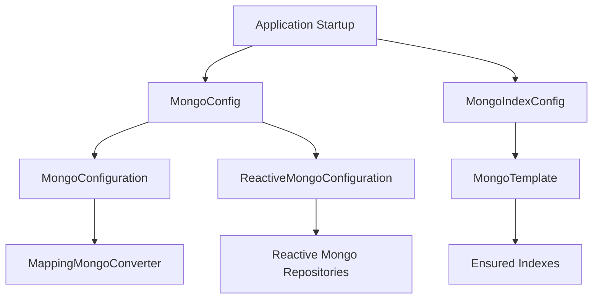
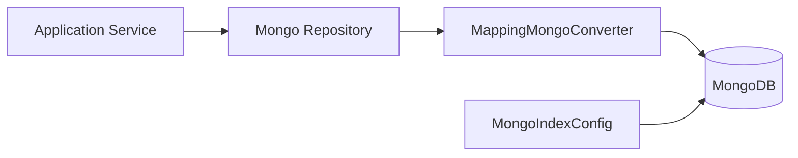

# Mongo Configuration Module

The **Mongo Configuration module** provides the foundational Spring configuration for integrating MongoDB into the OpenFrame platform. It is part of the `data_mongo_layer` and is responsible for:

- Enabling **blocking (imperative)** and **reactive** Mongo repositories
- Customizing MongoDB object mapping and conversions
- Applying global MongoDB behaviors such as auditing and key handling
- Defining and ensuring **critical database indexes** at startup

This module is shared across multiple services (API service, authorization server, management service, stream processors) that rely on MongoDB for persistence.

---

## Module Responsibilities

At a high level, the Mongo Configuration module ensures that:

- Mongo repositories are conditionally enabled based on runtime environment
- Both Servlet-based and Reactive Web applications are supported
- Domain documents can safely contain map keys with dots (`.`)
- Frequently queried collections are indexed consistently across deployments

It does **not** define domain schemas or repository interfaces themselves. Those are covered in the following modules:

- Domain documents: see **Domain Documents** documentation
- Repository interfaces and implementations: see **Repositories** documentation

---

## Core Components Overview

The module consists of two configuration classes:

| Component | Purpose |
|---------|---------|
| `MongoConfig` | Enables Mongo repositories and custom converters |
| `MongoIndexConfig` | Creates MongoDB indexes at application startup |

---

## Architecture Overview



---

## MongoConfig

The `MongoConfig` class is the main entry point for MongoDB-related Spring configuration. It contains two nested configuration classes to support different runtime modes.

### MongoConfiguration (Imperative)

```java
@Configuration
@ConditionalOnProperty(name = "spring.data.mongodb.enabled", havingValue = "true", matchIfMissing = false)
@EnableMongoRepositories(basePackages = "com.openframe.data.repository")
@EnableMongoAuditing
```

#### Key Responsibilities

- Activated only when `spring.data.mongodb.enabled=true`
- Enables **blocking (imperative)** Mongo repositories
- Enables **Mongo Auditing** (for fields like created/updated timestamps)
- Provides a customized `MappingMongoConverter`

#### Custom MappingMongoConverter

The custom converter bean applies important global behaviors:

```java
converter.setCustomConversions(conversions);
converter.setMapKeyDotReplacement("__dot__");
```

**Why this matters:**

- MongoDB does not allow dots (`.`) in map keys
- The replacement strategy ensures maps from domain objects can be safely persisted
- This is critical for documents that store dynamic metadata or tags

---

### ReactiveMongoConfiguration

```java
@Configuration
@ConditionalOnWebApplication(type = ConditionalOnWebApplication.Type.REACTIVE)
@EnableReactiveMongoRepositories(basePackages = "com.openframe.data.reactive.repository")
```

#### Key Responsibilities

- Activated automatically in **Reactive Web** applications
- Enables reactive Mongo repositories (`ReactiveCrudRepository`, etc.)
- No additional beans are required; it relies on Spring Boot defaults

This allows the same data layer to support both:

- Traditional Spring MVC services
- Reactive services (WebFlux, streaming workloads)

---

## MongoIndexConfig

The `MongoIndexConfig` class is responsible for **ensuring MongoDB indexes exist** when the application starts.

```java
@PostConstruct
public void initIndexes() {
    mongoTemplate.indexOps("application_events")
        .ensureIndex(new Index().on("userId", Sort.Direction.ASC)
                              .on("timestamp", Sort.Direction.DESC));

    mongoTemplate.indexOps("application_events")
        .ensureIndex(new Index().on("type", Sort.Direction.ASC)
                              .on("metadata.tags", Sort.Direction.ASC));
}
```

### Indexed Collection: `application_events`

The following compound indexes are enforced:

| Index | Purpose |
|------|--------|
| `(userId ASC, timestamp DESC)` | Efficient per-user event timelines |
| `(type ASC, metadata.tags ASC)` | Fast filtering by event type and tags |

### Design Considerations

- Uses `ensureIndex`, which is **idempotent**
- Safe to run on every startup
- Centralizes index definitions in code rather than manual DB setup

This approach ensures consistent performance characteristics across:

- Local development
- CI environments
- Production clusters

---

## Data Flow Context



---

## Integration with Other Modules

The Mongo Configuration module underpins several higher-level modules:

- **API Service Core**: persists users, devices, events, organizations
- **Authorization Server Core**: stores OAuth clients, tokens, and users
- **Management Service Core**: manages tools, agents, and configurations
- **Stream Processing Core**: writes enriched events and activity logs

Rather than duplicating configuration, these services import this module as a shared dependency.

---

## Operational Notes

- MongoDB must be reachable at startup for index creation to succeed
- Disabling Mongo entirely is supported via `spring.data.mongodb.enabled=false`
- Reactive and imperative repositories can coexist in different services

---

## Summary

The Mongo Configuration module provides:

- ✅ Conditional MongoDB enablement
- ✅ Unified configuration for blocking and reactive repositories
- ✅ Safe object mapping with custom key handling
- ✅ Centralized, code-driven MongoDB index management

It forms the **foundation of persistence** for the OpenFrame platform and ensures MongoDB is used consistently, safely, and efficiently across all services.
