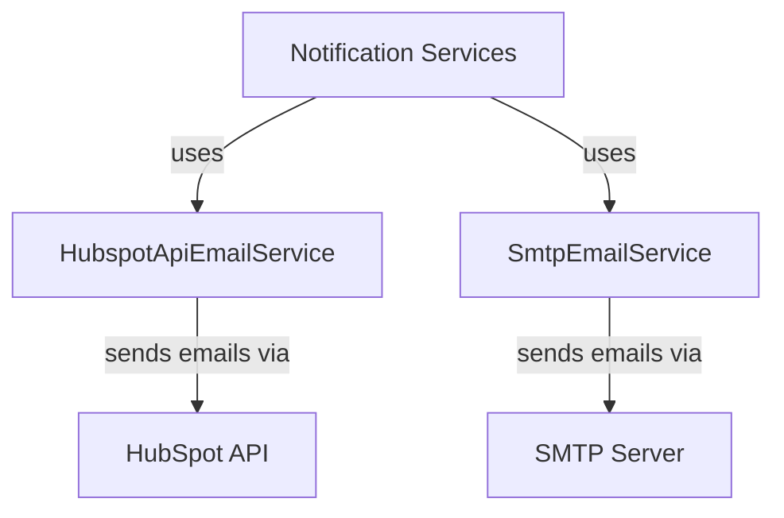

# Notification Services Module Documentation

## Overview
The Notification Services module is responsible for managing email notifications within the Flamingo platform. It provides functionality to send various types of emails, including invitation emails, password reset emails, and email verification emails, using different email service providers such as HubSpot and SMTP.

## Architecture Overview
The Notification Services module consists of two main components:
1. **HubspotApiEmailService**: This service uses the HubSpot API to send emails.
2. **SmtpEmailService**: This service sends emails using SMTP.

### Component Interaction Diagram


## Core Components

### HubspotApiEmailService
For detailed documentation, refer to [HubspotApiEmailService](HubspotApiEmailService.md).

### SmtpEmailService
For detailed documentation, refer to [SmtpEmailService](SmtpEmailService.md).

### 1. HubspotApiEmailService
- **Package**: `com.openframe.notification.mail.service`
- **Description**: This service is responsible for sending emails through the HubSpot API. It constructs email payloads and handles the API requests to send emails.
- **Key Methods**:
  - `sendInvitationEmail(String toEmail, String invitationId)`: Sends an invitation email to the specified address.
  - `sendPasswordResetEmail(String toEmail, String resetToken)`: Sends a password reset email.
  - `sendEmailVerificationEmail(String toEmail, String verifyToken)`: Sends an email verification email.

#### Code Snippet
```java
@Override
public void sendInvitationEmail(String toEmail, String invitationId) {
    String link = linkTemplate.replace("{id}", invitationId);
    sendWithTemplate(invitationEmailId, toEmail, "You’re invited to join Flamingo Workspace", link, "Invitation");
}
```

### 2. SmtpEmailService
- **Package**: `com.openframe.notification.mail.service`
- **Description**: This service sends emails using the SMTP protocol. It is a fallback option when the HubSpot API is not used.
- **Key Methods**:
  - `sendInvitationEmail(String toEmail, String invitationId)`: Sends an invitation email using SMTP.
  - `sendPasswordResetEmail(String toEmail, String resetToken)`: Sends a password reset email using SMTP.
  - `sendEmailVerificationEmail(String toEmail, String verifyToken)`: Not supported in this service.

#### Code Snippet
```java
@Override
public void sendInvitationEmail(String toEmail, String invitationId) {
    String link = linkTemplate.replace("{id}", invitationId);
    String subject = "You're invited to OpenFrame";
    String body = "Hello,\n\nYou've been invited. Please use the following link to register: " + link +
            "\n\nIf you did not expect this email, you can ignore it.";
    sendPlainText(toEmail, subject, body);
}
```

## Integration with Other Modules
The Notification Services module interacts with the following modules:
- **API Services**: The Notification Services module may be called by API endpoints to send notifications based on user actions.
- **Authorization Services**: It may send emails related to user invitations and password resets during the authentication process.

## Conclusion
The Notification Services module plays a crucial role in user engagement by facilitating communication through email notifications. It supports multiple email service providers, ensuring flexibility and reliability in sending notifications.