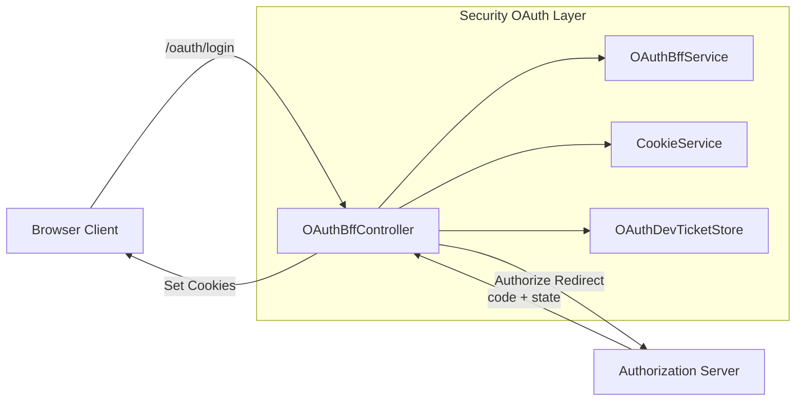
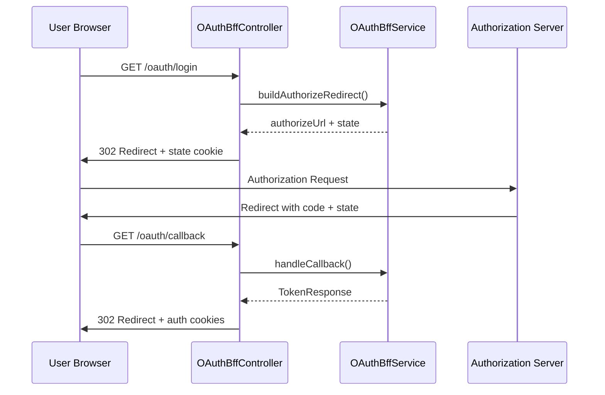

# OAuthBffController

## Overview

`OAuthBffController` is the **Backend-for-Frontend (BFF)** entry point for OAuth 2.0 / OIDC authentication flows in the OpenFrame platform. It is part of the **security_oauth_web** module and is designed to sit behind the OpenFrame Gateway, handling browser-facing OAuth interactions while delegating protocol-heavy logic to lower-level services.

The controller focuses on:

- Initiating OAuth authorization flows (with PKCE + state)
- Handling OAuth callbacks and token exchange
- Managing authentication cookies for browser clients
- Supporting refresh and logout flows
- Providing an optional developer-only ticket exchange mechanism

It is implemented using **Spring WebFlux** and exposes fully reactive, non-blocking endpoints.

---

## Module Context

`OAuthBffController` lives in the **security_oauth_web** layer and coordinates between:

- The **Gateway** (browser entry point)
- The **Authorization Server** (OAuth / OIDC provider)
- The **Security Core** (JWT, PKCE, constants)
- Cookie-based session handling for frontend applications

This separation allows frontend clients to remain OAuth-agnostic while the BFF enforces security best practices.

---

## Key Responsibilities

- **OAuth login initialization** with tenant, provider, redirect, PKCE, and state
- **Safe state handling** using signed JWT state cookies
- **Authorization callback handling** and token exchange
- **Secure cookie management** for access and refresh tokens
- **Token refresh** via cookies or headers
- **Logout and token revocation**
- **Developer-mode token tunneling** via short-lived tickets (optional)

---

## Runtime Conditions

The controller is conditionally enabled:

- Property: `openframe.gateway.oauth.enable=true`

This ensures OAuth endpoints are only exposed when the gateway OAuth feature is active.

---

## Endpoints

### `GET /oauth/login`

Starts a new OAuth authorization flow.

**Parameters**:

- `tenantId` (required)
- `redirectTo` (optional)
- `provider` (optional)

**Behavior**:

- Clears existing auth cookies
- Builds an authorization redirect (PKCE + state)
- Stores signed state in a short-lived cookie
- Redirects the browser to the authorization server

---

### `GET /oauth/continue`

Initializes an OAuth redirect **without clearing cookies**.

This endpoint is used for continuation flows (for example, after SSO finalization) where an authenticated principal already exists.

---

### `GET /oauth/callback`

Handles the OAuth authorization callback.

**Parameters**:

- `code`
- `state`

**Behavior**:

- Validates state
- Exchanges authorization code for tokens
- Sets auth cookies (access + refresh)
- Clears the OAuth state cookie
- Redirects to the original target

On failure, the user is redirected back with an error message appended.

---

### `POST /oauth/refresh`

Refreshes access tokens using a refresh token.

**Token sources**:

- Refresh token cookie
- `X-Refresh-Token` header

**Modes**:

- Tenant-aware refresh
- Lookup-based refresh when tenant is not provided

Returns:

- `204 No Content` with updated cookies on success
- `401 Unauthorized` if refresh fails

---

### `GET /oauth/logout`

Logs the user out.

**Behavior**:

- Clears authentication cookies
- Revokes the refresh token
- Supports tenant-aware and lookup-based revocation

---

### `GET /oauth/dev-exchange`

Developer-only endpoint for exchanging a **dev ticket** into auth headers.

**Notes**:

- Enabled only when `openframe.gateway.oauth.dev-ticket-enabled=true`
- Used for local development and debugging
- Not intended for production frontend flows

---

## Core Collaborators

### OAuthBffService

Responsible for:

- Building authorization URLs
- Generating and validating state
- Exchanging codes for tokens
- Refreshing and revoking tokens

### CookieService

Encapsulates all cookie-related logic:

- Setting auth cookies
- Clearing auth and state cookies
- Ensuring consistent security flags

### OAuthDevTicketStore

An in-memory ticket store used for development-only token handoff:

- Creates short-lived tickets for tokens
- Allows one-time ticket consumption

---

## Architecture Overview

---

## OAuth Login Flow

---

## Error Handling Strategy

- OAuth errors during callback are caught and handled gracefully
- The user is redirected back to:
  - The original `redirectTo`, or
  - The HTTP referer, or
  - `/` as a fallback

Error parameters appended:

- `error=oauth_failed`
- `message=<url-encoded-message>`

---

## Security Considerations

- OAuth `state` is signed and time-bound using JWT
- State is stored in **HTTP-only cookies**
- Refresh tokens are never exposed to JavaScript
- Dev ticket features are gated by configuration

---

## When to Use This Controller

Use `OAuthBffController` when:

- Frontend applications should not manage OAuth tokens directly
- You need consistent, centralized OAuth behavior across clients
- Cookie-based authentication is required
- Multi-tenant OAuth flows are in use

---

## Related Modules

This module works closely with:

- Authorization server services
- Gateway security configuration
- Security OAuth core utilities

Refer to platform documentation for deeper details on OAuth internals and authorization server configuration.
