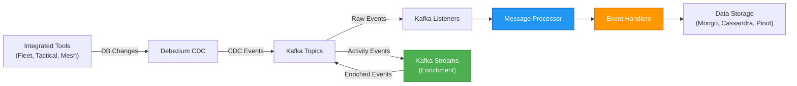

# Stream Processing Service - Documentation Index

## 📚 Quick Navigation

This directory contains comprehensive documentation for OpenFrame's **Stream Processing Service**, a real-time event processing system built on Apache Kafka and Kafka Streams.

---

## 🎯 Start Here

**New to Stream Processing?** Start with the main overview:

👉 **[Stream Processing Service Overview](./stream_processing.md)**

This document provides:
- High-level architecture and data flow
- Core responsibilities and capabilities
- Integration points with other services
- Performance characteristics and deployment considerations

---

## 📖 Module Documentation

### Core Modules

| Module | Description | Documentation |
|--------|-------------|---------------|
| **Configuration** | Kafka and Kafka Streams setup, serializers, multi-tenant config | [stream_processing_configuration.md](./stream_processing_configuration.md) |
| **Listeners** | Kafka event consumers for integrated tool events | [stream_processing_listeners.md](./stream_processing_listeners.md) |
| **Streams** | Kafka Streams topology for activity enrichment | [stream_processing_streams.md](./stream_processing_streams.md) |
| **Message Processing** | Central orchestration and routing layer | [stream_processing_message_processing.md](./stream_processing_message_processing.md) |
| **Handlers** | Event transformation and persistence handlers | [stream_processing_handlers.md](./stream_processing_handlers.md) |
| **Application** | Spring Boot entry point and bootstrapping | [stream_processing_application.md](./stream_processing_application.md) |

---

## 🔄 Data Flow Overview

---

## 🚀 Quick Start Guide

### 1. Understanding the Architecture

Read the [main overview](./stream_processing.md) to understand:
- How CDC events flow through the system
- The role of Kafka Streams in enrichment
- Multi-tenant support and configuration

### 2. Configuration Setup

Review [Configuration Module](./stream_processing_configuration.md) for:
- Kafka broker connection settings
- Kafka Streams topology configuration
- Serializer/deserializer setup
- Multi-tenant application ID configuration

### 3. Event Processing Pipeline

Understand the processing flow:
1. **[Listeners](./stream_processing_listeners.md)** - Consume events from Kafka topics
2. **[Message Processing](./stream_processing_message_processing.md)** - Deserialize and enrich messages
3. **[Handlers](./stream_processing_handlers.md)** - Transform and persist events

### 4. Stream Enrichment

Learn about real-time enrichment in [Streams Module](./stream_processing_streams.md):
- Activity-Host stream joins
- Windowed join operations
- Header injection for routing

### 5. Deployment

See [Application Module](./stream_processing_application.md) for:
- Spring Boot configuration
- Component scanning setup
- Deployment considerations

---

## 🔗 Integration Points

### Upstream Dependencies

| Service/Component | Purpose | Documentation |
|-------------------|---------|---------------|
| **Debezium Connectors** | CDC event generation | External (Kafka Connect) |
| **Kafka Broker** | Message transport | [Data Layer Kafka](./data_layer_kafka.md) |
| **Fleet MDM** | Source data for CDC | [Fleet MDM SDK](./fleet_mdm_sdk.md) |
| **Tactical RMM** | Source data for CDC | [Tactical RMM SDK](./tactical_rmm_sdk.md) |

### Downstream Consumers

| Service/Component | Purpose | Documentation |
|-------------------|---------|---------------|
| **MongoDB** | Event storage | [Data Layer Mongo](./data_layer_mongo.md) |
| **Apache Pinot** | Real-time analytics | [Data Layer Core](./data_layer_core.md) |
| **API Service** | Event queries | [API Service](./api_service.md) |
| **Management Service** | Tool health monitoring | [Management Service](./management_service.md) |

---

## 🎓 Learning Path

### For Developers

1. **Beginner**: Start with [Stream Processing Overview](./stream_processing.md)
2. **Intermediate**: Deep dive into [Message Processing](./stream_processing_message_processing.md) and [Handlers](./stream_processing_handlers.md)
3. **Advanced**: Study [Kafka Streams](./stream_processing_streams.md) topology and enrichment logic

### For DevOps/SRE

1. **Configuration**: Review [Configuration Module](./stream_processing_configuration.md)
2. **Deployment**: Read [Application Module](./stream_processing_application.md)
3. **Monitoring**: See performance and observability sections in [main overview](./stream_processing.md)

### For Architects

1. **Architecture**: Study the architecture diagrams in [main overview](./stream_processing.md)
2. **Integration**: Review integration points and data flow
3. **Scalability**: Understand multi-tenant support and horizontal scaling

---

## 📊 Key Concepts

### Message Types

The system processes multiple message types from integrated tools:

| Message Type | Source | Description |
|--------------|--------|-------------|
| `FLEET_MDM_EVENT` | Fleet MDM | General Fleet MDM events |
| `FLEET_MDM_ACTIVITY` | Fleet MDM | User activity events (enriched) |
| `FLEET_MDM_QUERY_RESULT` | Fleet MDM | Query execution results |
| `TACTICAL_RMM_EVENT` | Tactical RMM | Agent events |
| `MESHCENTRAL_EVENT` | MeshCentral | Device events |

### Processing Stages

1. **Ingestion**: Kafka listeners consume events from topics
2. **Deserialization**: Type-specific deserializers parse CDC messages
3. **Enrichment**: Contextual data added (organization, device info)
4. **Stream Processing**: Kafka Streams joins and enriches activities
5. **Transformation**: Handlers convert to domain models
6. **Persistence**: Events stored in appropriate data stores

### Multi-Tenant Support

- **Cluster-aware application IDs**: Separate Kafka Streams apps per tenant
- **Topic namespacing**: Tenant-prefixed topic names
- **Isolated state stores**: Per-tenant stream processing state

---

## 🛠️ Development Guide

### Adding a New Message Type

See the [Development Guide](./stream_processing.md#development-guide) section in the main overview for step-by-step instructions on:
- Defining new message type enums
- Creating deserializers
- Implementing handlers
- Configuring topics and listeners

### Testing

- **Unit Tests**: Test individual components (handlers, deserializers)
- **Integration Tests**: Use `@EmbeddedKafka` for end-to-end testing
- **Stream Tests**: Use Kafka Streams `TopologyTestDriver`

---

## 🐛 Troubleshooting

Common issues and solutions are documented in the [Troubleshooting](./stream_processing.md#troubleshooting) section:

- Consumer lag increasing
- Stream join not enriching
- State store corruption
- Duplicate event processing

---

## 📈 Performance Characteristics

**Expected Throughput**: 1,000-10,000 events/second per instance

**Latency**: <100ms for stream enrichment (p95)

**Scalability**: Horizontal scaling via Kafka partitions and consumer groups

See [Performance Characteristics](./stream_processing.md#performance-characteristics) for detailed metrics.

---

## 🔐 Security Considerations

- **Kafka Authentication**: SASL/SSL for broker connections
- **Topic ACLs**: Restrict access to sensitive topics
- **Data Encryption**: TLS for data in transit
- **Tenant Isolation**: Separate consumer groups and state stores

---

## 📚 Additional Resources

### Apache Kafka
- [Kafka Documentation](https://kafka.apache.org/documentation/)
- [Kafka Streams Guide](https://kafka.apache.org/documentation/streams/)

### Debezium
- [Debezium Documentation](https://debezium.io/documentation/)
- [CDC Best Practices](https://debezium.io/documentation/reference/stable/tutorial.html)

### Spring Kafka
- [Spring Kafka Reference](https://docs.spring.io/spring-kafka/reference/)
- [Spring Kafka Streams](https://docs.spring.io/spring-kafka/reference/kafka/streams.html)

---

## 💬 Support

**Questions or Issues?**

Join the OpenMSP Slack community:
- **Slack**: [OpenMSP Community](https://join.slack.com/t/openmsp/shared_invite/zt-36bl7mx0h-3~U2nFH6nqHqoTPXMaHEHA)
- **Website**: [OpenMSP](https://www.openmsp.ai/)

---

## 📝 Documentation Maintenance

This documentation is maintained as part of the OpenFrame project. For updates or corrections:

1. Review the source code in `deps-openframe-oss-lib/openframe-stream-service-core/`
2. Update the relevant markdown files
3. Ensure all cross-references are valid
4. Validate Mermaid diagrams render correctly

---

**Last Updated**: 2024  
**Version**: 1.0  
**Maintained By**: OpenFrame Team
