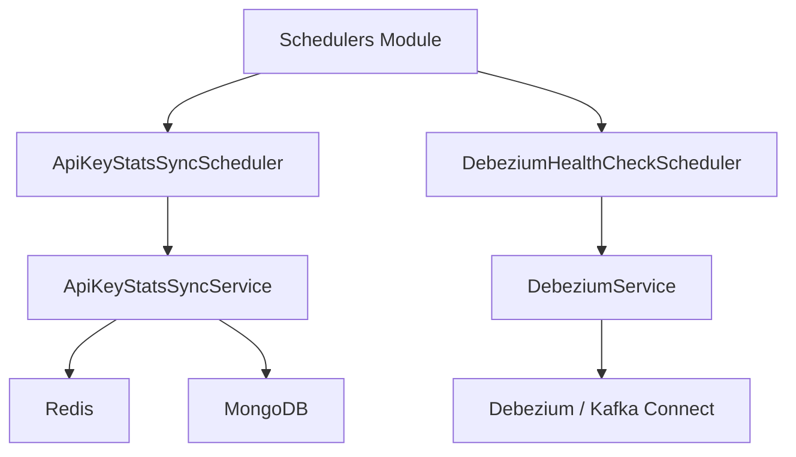
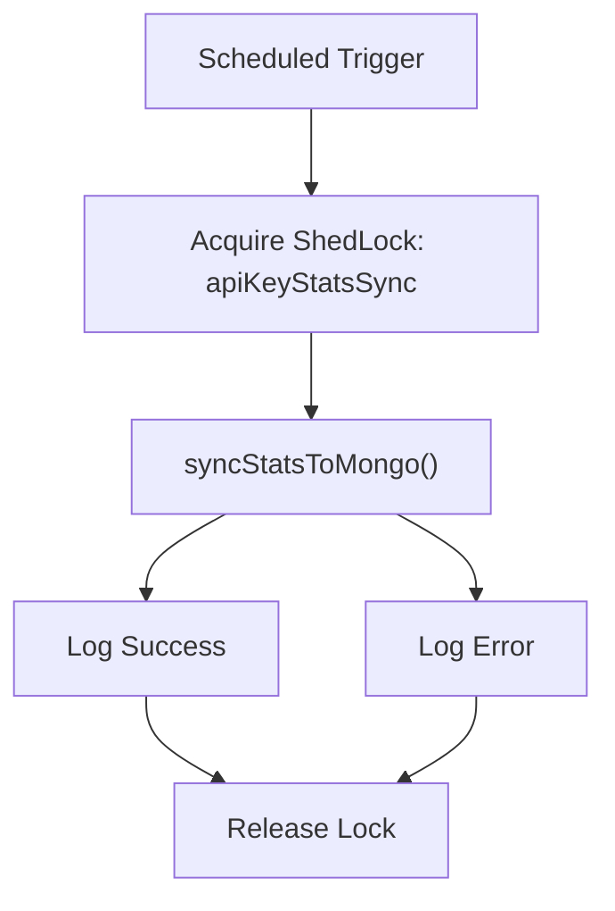
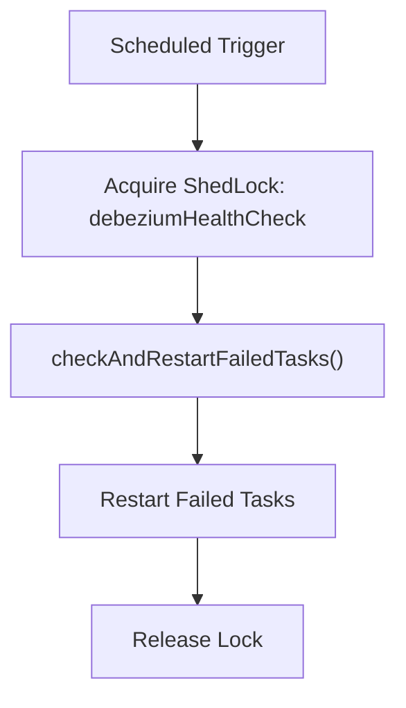

# Schedulers Module

The **Schedulers** module is part of the OpenFrame Management Service and is responsible for running background, time-based maintenance and synchronization tasks. These schedulers ensure system consistency, health, and observability across distributed deployments by coordinating periodic jobs with **distributed locking**.

This module currently contains two production schedulers:

- **ApiKeyStatsSyncScheduler** – synchronizes API key usage statistics from Redis into MongoDB
- **DebeziumHealthCheckScheduler** – monitors Debezium connectors and automatically restarts failed tasks

Both schedulers are implemented using Spring’s scheduling framework and **ShedLock** to guarantee safe execution in clustered environments.

---

## Responsibilities and Scope

The Schedulers module focuses on:

- Periodic background execution (cron / fixed-delay jobs)
- Distributed lock coordination across multiple service instances
- Operational safety (retry isolation, logging, and fault containment)
- Delegation of business logic to dedicated services

The module **does not** contain domain logic itself. Each scheduler acts as a thin orchestration layer that triggers domain services defined elsewhere in the management service.

---

## High-Level Architecture

**Key architectural traits:**

- Schedulers are **stateless**
- All stateful or transactional work is delegated to services
- ShedLock guarantees **single execution** across replicas

---

## Distributed Locking Strategy

Both schedulers use **ShedLock** (`net.javacrumbs.shedlock`) to prevent concurrent execution when the management service is deployed in multiple instances.

Each scheduled job:

- Acquires a named lock before execution
- Has a **maximum lock duration** to avoid deadlocks
- Has a **minimum lock duration** to avoid excessive re-execution

This design ensures:

- Exactly-once execution per interval
- Safe horizontal scaling
- Protection against node crashes during job execution

---

## ApiKeyStatsSyncScheduler

### Purpose

The **ApiKeyStatsSyncScheduler** periodically synchronizes API key usage metrics from Redis into MongoDB for persistence, reporting, and long-term analytics.

This is necessary because:

- Redis is optimized for fast, transient counters
- MongoDB is used for durable storage and querying

---

### Activation Conditions

The scheduler is conditionally enabled:

- Property: `openframe.api-key-stats.enabled`
- Default: **enabled** (`true` when missing)

---

### Execution Model

---

### Scheduling Configuration

- Trigger type: **fixed delay**
- Interval: `openframe.api-key-stats.sync-interval`
- Lock name: `apiKeyStatsSync`
- Default lock settings:
  - `lockAtMostFor`: `10m`
  - `lockAtLeastFor`: `1m`

---

### Behavior

- Logs scheduler initialization at startup
- Logs start and completion of each sync cycle
- Catches and logs exceptions without crashing the scheduler thread
- Delegates all business logic to `ApiKeyStatsSyncService`

---

## DebeziumHealthCheckScheduler

### Purpose

The **DebeziumHealthCheckScheduler** continuously monitors Debezium connectors and automatically restarts tasks that have failed.

This ensures:

- Long-running CDC pipelines remain operational
- Transient Kafka Connect or connector failures are self-healed
- Reduced operational burden

---

### Activation Conditions

The scheduler is conditionally enabled:

- Property: `openframe.debezium.health-check.enabled`
- Default: **disabled** unless explicitly enabled

---

### Execution Model

---

### Scheduling Configuration

- Trigger type: **fixed delay**
- Default interval: `300000` ms (5 minutes)
- Lock name: `debeziumHealthCheck`
- Default lock settings:
  - `lockAtMostFor`: `5m`
  - `lockAtLeastFor`: `1m`

---

### Behavior

- Logs initialization on startup
- Runs health checks at debug log level
- Delegates all operational logic to `DebeziumService`
- Designed to be safe to run continuously in production

---

## Lifecycle and Initialization

Both schedulers:

- Are Spring-managed `@Component`s
- Use constructor injection via Lombok `@RequiredArgsConstructor`
- Emit startup logs from `@PostConstruct`
- Are automatically registered when scheduling is enabled

---

## Operational Considerations

### Scalability

- Safe for horizontal scaling
- Only one node executes a job at a time

### Fault Tolerance

- Exceptions are contained within scheduler execution
- Failures do not stop future executions

### Observability

- Clear startup logs
- Execution logs for success and failure paths
- Lock-based execution can be monitored at the database level

---

## Summary

The **Schedulers** module provides reliable, production-grade background task execution for the OpenFrame Management Service. By combining Spring Scheduling with ShedLock, it ensures:

- Safe execution in distributed environments
- Clear separation between orchestration and domain logic
- Robust operational behavior for long-running systems

This module is a critical backbone for automation, data consistency, and platform health.