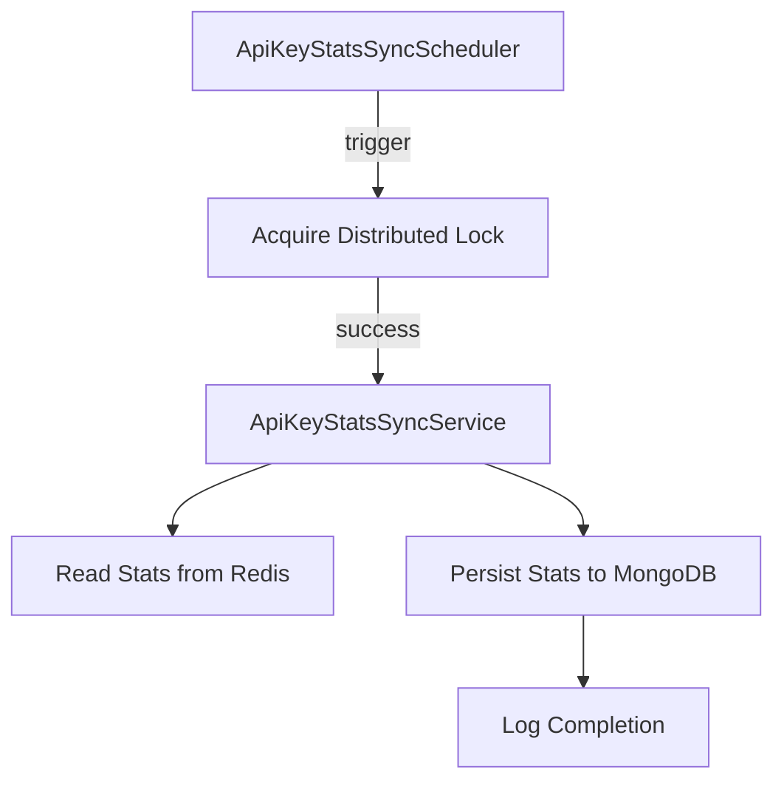
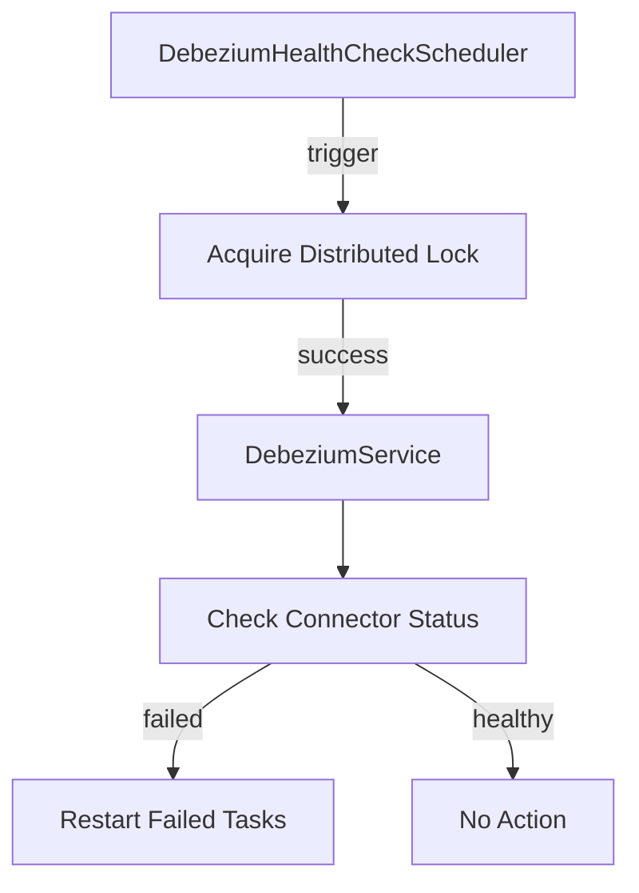
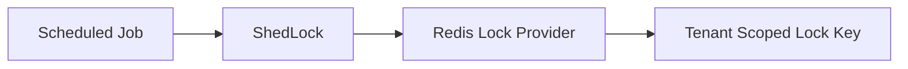
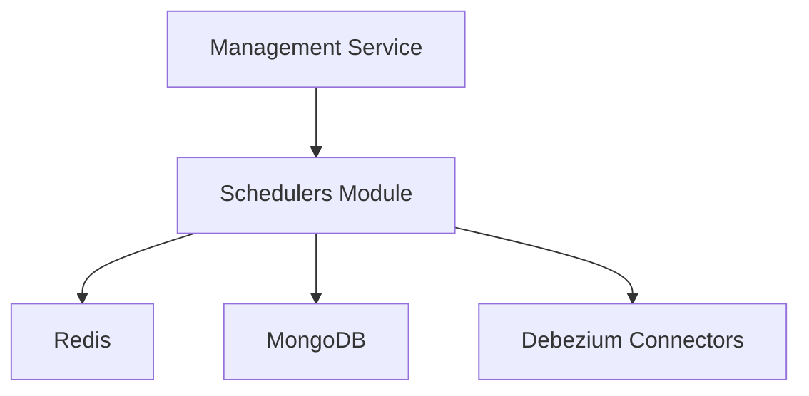

# Schedulers Module

## Overview

The **Schedulers module** is part of the **management service core** and is responsible for running **background, time-based operational tasks** that keep the OpenFrame platform healthy and consistent.

This module focuses on:

- Periodic synchronization of operational data across storage layers
- Continuous health monitoring of critical infrastructure components
- Safe execution in **distributed, multi-instance deployments** using **ShedLock with Redis**

Schedulers are implemented using Spring's scheduling framework and are guarded by **distributed locks** to ensure that, in clustered environments, **only one node executes a job at a time**.

---

## Responsibilities

The Schedulers module addresses the following system concerns:

- **Data consistency** between Redis and MongoDB
- **Debezium connector reliability** and self-healing
- **Multi-tenant safety** through tenant-scoped distributed locks
- **Operational resilience** by preventing duplicate executions

It integrates tightly with:

- Management service business logic
- Redis (for locking)
- External infrastructure services (Debezium)

---

## Core Components

### ApiKeyStatsSyncScheduler

**Purpose:**

Synchronizes API key usage statistics from **Redis** into **MongoDB** at a fixed interval.

**Key characteristics:**

- Enabled by default (configurable)
- Uses distributed locking to avoid concurrent syncs
- Designed for eventual consistency of usage metrics

**Key annotations and behavior:**

- `@Scheduled` — Executes at a configurable fixed delay
- `@SchedulerLock` — Ensures a single active execution across the cluster
- `@ConditionalOnProperty` — Can be disabled via configuration

**Execution flow:**



**Relevant configuration properties:**

```text
openframe.api-key-stats.enabled
openframe.api-key-stats.sync-interval
openframe.api-key-stats.lock-at-most-for
openframe.api-key-stats.lock-at-least-for
```

---

### DebeziumHealthCheckScheduler

**Purpose:**

Periodically monitors the health of **Debezium connectors** and automatically restarts failed tasks.

**Why this matters:**

Debezium is a critical component for CDC (Change Data Capture). If connectors silently fail, downstream data pipelines become stale. This scheduler provides a **self-healing mechanism**.

**Key characteristics:**

- Disabled by default unless explicitly enabled
- Lightweight periodic execution
- No persistence side effects outside Debezium management

**Execution flow:**



**Relevant configuration properties:**

```text
openframe.debezium.health-check.enabled
openframe.debezium.health-check.interval
openframe.debezium.health-check.lock-at-most-for
openframe.debezium.health-check.lock-at-least-for
```

---

## Distributed Locking with ShedLock

All schedulers in this module rely on **ShedLock** to provide **cluster-safe execution guarantees**.

### ShedLockConfig

**Purpose:**

Central configuration enabling:

- Spring scheduling
- ShedLock integration
- Redis-backed distributed locks

**Key features:**

- Redis-based `LockProvider`
- Tenant-aware lock key generation
- Environment isolation (e.g., dev, staging, prod)

**Lock key format:**

```text
of:{tenantId}:job-lock:{environment}:{lockName}
```

This ensures:

- No cross-tenant lock collisions
- No cross-environment interference
- Predictable operational behavior

**Configuration flow:**



---

## How This Module Fits Into the System

The Schedulers module is part of the **management service core** and operates entirely in the background.

It interacts with:

- **Data layers** (Redis, MongoDB)
- **Streaming infrastructure** (Debezium)
- **Service-layer business logic**

It does **not** expose REST or GraphQL APIs and is not directly user-facing.



---

## Operational Considerations

- **Idempotency:** Scheduler logic should remain safe to retry
- **Observability:** Logs are the primary feedback mechanism
- **Scalability:** Designed to run in horizontally scaled environments
- **Safety:** Distributed locks prevent duplicate execution

---

## Extending the Schedulers Module

When adding new schedulers:

1. Annotate with `@Scheduled`
2. Protect execution using `@SchedulerLock`
3. Use tenant-safe logic where applicable
4. Add configuration flags for enable/disable
5. Keep execution time within lock boundaries

This ensures consistency with existing operational patterns.

---

## Summary

The **Schedulers module** provides essential background automation for OpenFrame by:

- Keeping operational data synchronized
- Monitoring and healing infrastructure dependencies
- Ensuring safe execution in distributed systems

It is a foundational component for maintaining **platform reliability, consistency, and resilience**.