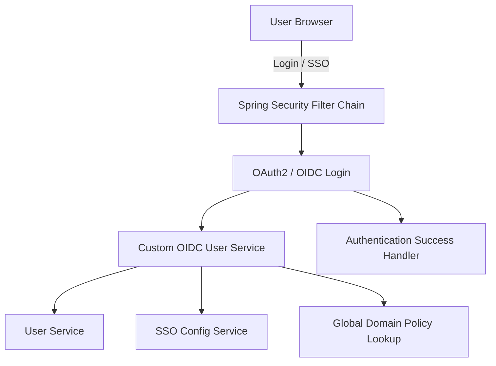
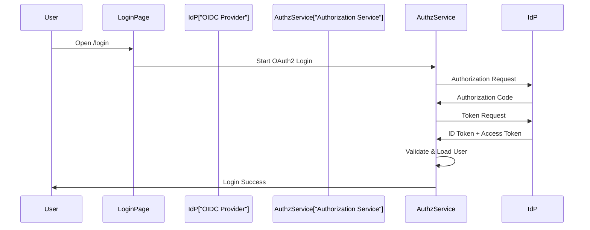
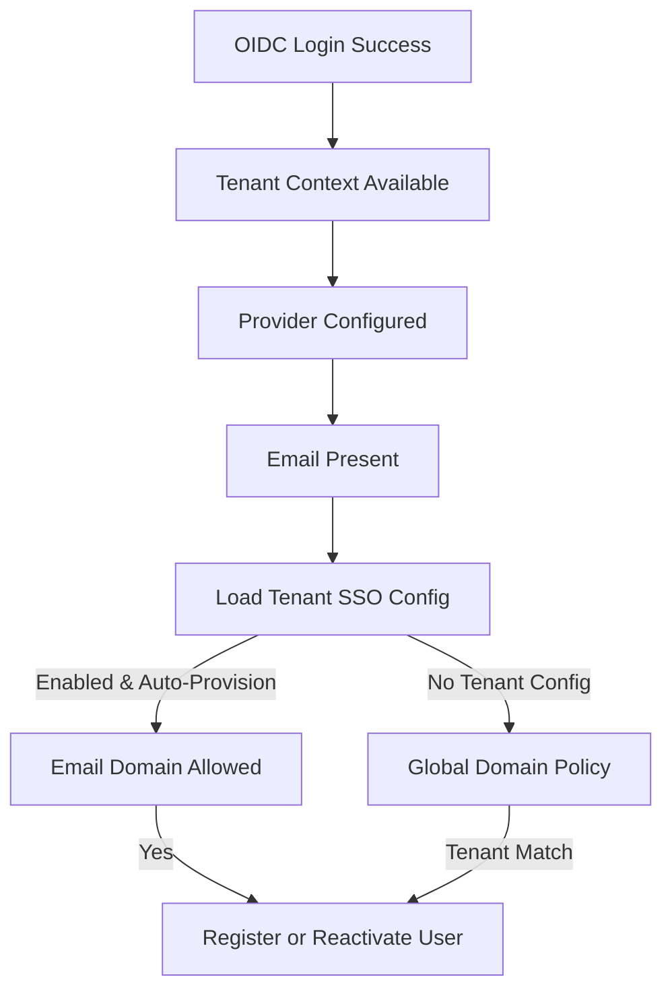
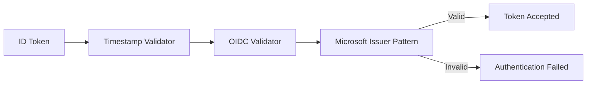

# Security Configuration Module

## Overview

The **Security Configuration** module defines the default security behavior for the OpenFrame **Authorization Service** outside of the OAuth2 Authorization Server endpoints. It is responsible for:

- Enforcing authentication and access rules for HTTP endpoints
- Integrating OAuth2 / OpenID Connect (OIDC) login flows
- Handling SSO auto-provisioning and user lifecycle integration
- Applying tenant-aware security decisions
- Supporting multi-tenant identity providers (notably Microsoft Entra ID)

This module is implemented in:

- `com.openframe.authz.config.SecurityConfig`

It operates in close coordination with tenant context handling, SSO configuration services, and user/domain policies.

---

## Role in the Overall System

Within the OpenFrame platform, security responsibilities are layered:

- **Gateway Service**: Validates JWTs and API keys at the edge
- **Authorization Service**: Issues tokens, manages login, SSO, and tenant identity
- **Application Services**: Rely on propagated identity and roles

This module sits in the **Authorization Service** and governs all *non-authorization-server* web requests, including login pages, SSO callbacks, tenant discovery, and user onboarding.

---

## High-Level Architecture

---

## Core Responsibilities

### 1. HTTP Security Rules

The module defines a **default `SecurityFilterChain`** with the following characteristics:

- CSRF protection: **disabled** (handled elsewhere or not required for these endpoints)
- CORS handling: **disabled** (typically handled by gateway or upstream layers)
- Public endpoints explicitly allowed
- All other requests require authentication

#### Publicly Accessible Paths

Examples of permitted endpoints include:

- `/oauth/**`, `/oauth2/**`
- `/login`
- `/tenant/**`
- `/invitations/**`
- `/password-reset/**`
- `/.well-known/**`
- `/management/v1/**`

All other paths are protected.

---

### 2. Form Login and OAuth2 Login

The configuration supports **both**:

- Form-based login (`/login`)
- OAuth2 / OIDC login (SSO providers)

Both flows share a common `AuthSuccessHandler`, ensuring consistent post-authentication behavior.

---

### 3. Custom OIDC User Processing

A custom `OAuth2UserService<OidcUserRequest, OidcUser>` wraps Spring’s default `OidcUserService` to add OpenFrame-specific behavior.

Key enhancements:

- Automatic user provisioning
- Tenant-aware user lookup
- Principal name normalization
- Authority preservation

#### Principal Claim Resolution

The principal (username) is resolved in the following priority order:

1. `email`
2. `preferred_username`
3. `upn`
4. `unique_name`
5. `sub`

This ensures compatibility across identity providers.

---

### 4. Tenant-Aware Auto-Provisioning

When an SSO login succeeds, the module may **automatically create or reactivate a user**.

#### Preconditions

- Tenant context is resolved
- SSO provider is known
- User email is present
- User does not already exist in the tenant

#### Provisioning Logic

#### Domain Validation

- Tenant-specific allowed domains take precedence
- If no tenant config exists, a **global domain policy** may map domains to tenants

---

### 5. Microsoft Multi-Tenant JWT Validation

Microsoft Entra ID (Azure AD) uses **tenant-specific issuer URLs**, which complicates standard OIDC validation.

This module introduces a **Microsoft-aware `JwtDecoderFactory`** that:

- Accepts issuer URLs matching the Microsoft multi-tenant pattern
- Applies standard timestamp validation
- Applies OIDC ID token validation
- Adds a custom issuer pattern validator

---

## Key Collaborating Components

This module relies on several other services and utilities:

- **Tenant Context**: Resolves the active tenant for the request
- **SSOConfigService**: Loads per-tenant SSO configuration
- **UserService**: Registers, reactivates, and looks up users
- **RegistrationProcessor**: Executes post-provisioning hooks
- **GlobalDomainPolicyLookup**: Maps email domains to tenants
- **AuthSuccessHandler**: Finalizes successful authentication

These components are defined in other modules and are intentionally not duplicated here.

---

## Security Design Considerations

- **Fail-safe provisioning**: Auto-provisioning errors never block login
- **Least privilege by default**: Only explicitly permitted endpoints are public
- **Tenant isolation**: All provisioning and lookups are tenant-scoped
- **Extensibility**: Custom JWT validation and SSO flows are pluggable

---

## Summary

The Security Configuration module is the backbone of OpenFrame’s interactive authentication experience. It bridges Spring Security, OAuth2/OIDC standards, and OpenFrame’s multi-tenant domain model to provide:

- Secure access control
- Flexible SSO integration
- Automated, policy-driven user onboarding
- Robust support for enterprise identity providers

This design ensures that authentication remains both **secure** and **operationally efficient** across tenants and identity ecosystems.
