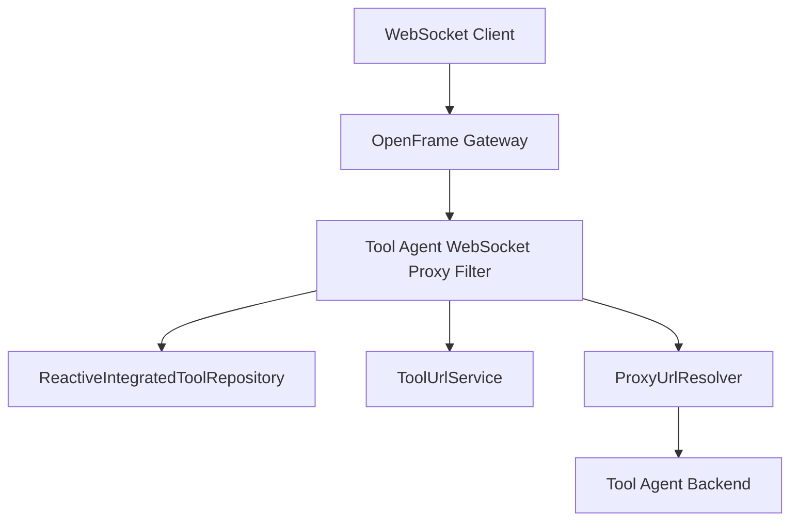
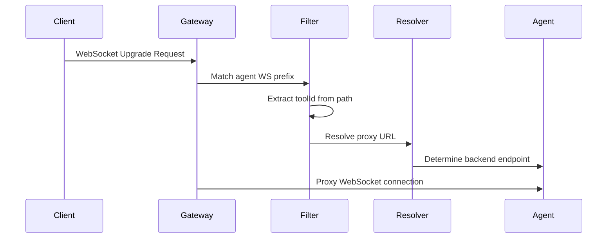

# Tool Agent WebSocket Proxy Filter

## Overview
The **Tool Agent WebSocket Proxy Filter** is a gateway-level component responsible for dynamically proxying **WebSocket connections** from external clients to the correct **tool agent backend endpoint**. It enables secure, tenant-aware, and tool-aware WebSocket routing without exposing internal service topology.

This module is part of the **gateway_websocket_proxying** layer and specifically handles **tool agent WebSocket traffic**, as opposed to tool API or HTTP-based traffic.

At runtime, it inspects incoming WebSocket request paths, extracts the target tool identifier, resolves the correct backend WebSocket URL, and delegates proxy routing to the shared WebSocket gateway infrastructure.

---

## Responsibilities

- Intercept incoming WebSocket upgrade requests targeting tool agents
- Extract the **tool ID** from the request path
- Resolve the correct backend WebSocket endpoint for the tool agent
- Delegate URL resolution and routing to shared gateway infrastructure
- Enforce consistent endpoint prefixing for agent WebSocket traffic

---

## Core Component

### `ToolAgentWebSocketProxyUrlFilter`

**Package**
`com.openframe.gateway.config.ws`

**Role**
A specialization of the abstract WebSocket proxy filter that applies routing rules specific to **tool agent WebSocket connections**.

**Inheritance**
Extends the shared `ToolWebSocketProxyUrlFilter`, inheriting common proxy logic while customizing:
- Tool ID extraction logic
- WebSocket endpoint prefix

---

## Dependencies

The filter relies on several shared services to perform dynamic routing:

- **ReactiveIntegratedToolRepository**  
  Used to look up tool metadata in a non-blocking, reactive manner.

- **ToolUrlService**  
  Resolves the externally reachable URL for a given integrated tool.

- **ProxyUrlResolver**  
  Constructs the final proxy target URL based on resolved tool data and request context.

These dependencies are injected via Spring’s dependency injection and shared across gateway WebSocket filters.

---

## How It Fits Into the System

The Tool Agent WebSocket Proxy Filter operates within the **OpenFrame Gateway**, which acts as the single entry point for client communication.

It specifically handles WebSocket traffic for **tool agents**, while related filters handle:
- Tool API WebSocket traffic
- Non-WebSocket HTTP traffic

The filter does **not** implement proxying itself. Instead, it supplies routing metadata to the WebSocket gateway configuration, ensuring separation of concerns.

---

## Request Path Handling

Incoming WebSocket requests follow a predefined URL structure. The filter extracts the tool identifier directly from the request path.

```text
Example path structure:
/ws/tools/agent/{toolId}/connect
```

The tool ID is extracted using positional path parsing, ensuring predictable and fast resolution.

---

## Key Methods

### `getRequestToolId(String path)`

Extracts the tool identifier from the incoming WebSocket request path.

```java
@Override
protected String getRequestToolId(String path) {
    return path.split("/")[4];
}
```

**Behavior**
- Assumes a stable, versioned WebSocket path structure
- Avoids regex overhead for performance-critical gateway paths

---

### `getEndpointPrefix()`

Defines the WebSocket endpoint prefix that this filter is responsible for.

```java
@Override
protected String getEndpointPrefix() {
    return TOOLS_AGENT_WS_ENDPOINT_PREFIX;
}
```

This ensures that only requests targeting the **tool agent WebSocket namespace** are handled by this filter.

---

## Architecture Overview



---

## WebSocket Routing Flow



---

## Design Considerations

- **Performance-first**: Path parsing avoids expensive operations
- **Reactive compatibility**: Designed to work with reactive repositories
- **Separation of concerns**: Routing logic is isolated from proxy mechanics
- **Extensibility**: New WebSocket filters can reuse the same base class

---

## Related Components

- Tool API WebSocket Proxy Filter (handles non-agent WebSocket traffic)
- WebSocket Gateway Configuration (registers and activates WebSocket routing)
- Proxy URL Resolver (shared routing logic across HTTP and WebSocket gateways)

---

## Summary

The Tool Agent WebSocket Proxy Filter is a focused, high-performance gateway component that enables secure and dynamic WebSocket routing to tool agents. By leveraging shared services and a common proxy base class, it ensures consistent behavior across the OpenFrame gateway while remaining easy to extend and maintain.
