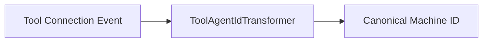

# Agent Registration & Transformation

## Overview
This sub-module handles agent registration workflows and normalization of external tool identifiers into OpenFrame machine identities.

---

## DefaultAgentRegistrationProcessor

### Role
- Provides a default, no-op post-registration hook
- Allows custom implementations to extend registration behavior

### Extension Point
- Override `AgentRegistrationProcessor` to add custom logic

---

## Tool Agent ID Transformers

Transformers adapt external system identifiers into a canonical format.

---

### FleetMdmAgentIdTransformer

- Resolves Fleet MDM UUIDs to numeric host IDs
- Queries Fleet MDM API using stored tool credentials
- Retries until last delivery attempt before fallback

### MeshCentralAgentIdTransformer

- Prefixes MeshCentral node IDs with `node//`
- Stateless and deterministic transformation

---

## Integration Notes

- Transformers are selected by `ToolType`
- Failures may trigger message redelivery via JetStream
