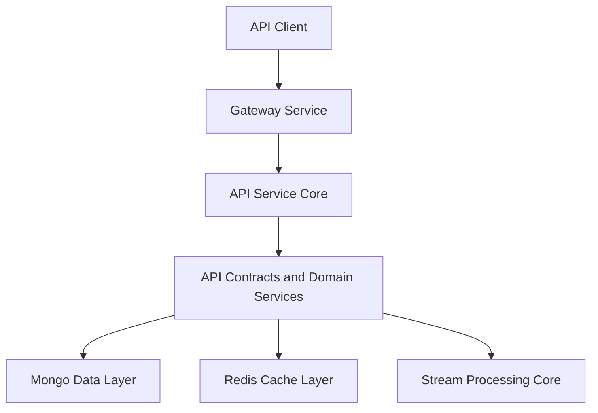

# API Contracts and Domain Services

This module provides **shared API contracts (DTOs), mappers, and lightweight domain services** used across the OpenFrame platform. It acts as the **contractual boundary** between API layers (REST, GraphQL, Gateway) and underlying domain/data layers, ensuring consistency, reuse, and decoupling.

Unlike service-core modules that expose controllers and business orchestration, this module focuses on:

- Stable **DTO definitions** used by multiple services
- **Filter and pagination models** for querying data
- **Mappers** translating persistence entities to API responses
- **Reusable domain services** supporting API data loaders and processors

---

## Role in the OpenFrame Architecture

The `api_contracts_and_domain_services` module sits between API-facing services and shared data layers.

**Key characteristics:**
- No controllers or HTTP endpoints
- No persistence configuration
- Safe to import into multiple services
- Versioned as a shared library

---

## High-Level Contents

This module is logically divided into the following sub-domains:

1. **Query & Pagination Contracts**
2. **Audit & Event DTOs**
3. **Device Filtering Contracts**
4. **Organization Contracts & Mapping**
5. **Tool & Integration Contracts**
6. **Shared Domain Services**
7. **Processing Extension Points**

Each is described below with links to detailed documentation.

---

## 1. Query & Pagination Contracts

These DTOs standardize list and cursor-based query responses.

- `CountedGenericQueryResult<T>`
- `CursorPaginationInput`

They are commonly used by:
- GraphQL data fetchers in `api_service_core`
- REST list endpoints in `external-api`

➡️ See: **query_and_pagination.md**

---

## 2. Audit & Event Contracts

Provides a unified model for audit logs and event filtering across tools.

Key DTOs:
- `LogEvent`
- `LogDetails`
- `LogFilterOptions`
- `LogFilters`
- `OrganizationFilterOption`

Used by:
- API log explorers
- Stream-enriched audit pipelines

➡️ See: **audit_and_event_contracts.md**

---

## 3. Device Filtering Contracts

Defines flexible filtering models for device queries and UI filter generation.

Key DTOs:
- `DeviceFilterOptions`
- `DeviceFilters`
- `DeviceFilterOption`
- `TagFilterOption`

Used by:
- Device GraphQL queries
- Fleet management views

➡️ See: **device_filtering_contracts.md**

---

## 4. Organization Contracts & Mapping

Shared organization DTOs and mapping logic used across REST and GraphQL APIs.

Key components:
- `OrganizationResponse`
- `OrganizationList`
- `OrganizationFilterOptions`
- `OrganizationMapper`

➡️ See: **organization_contracts_and_mapper.md**

---

## 5. Tool & Integration Contracts

Defines contracts for integrated tools and filtering.

Key DTOs:
- `ToolFilterOptions`
- `ToolFilters`
- `ToolList`

➡️ See: **tool_contracts.md**

---

## 6. Shared Domain Services

Lightweight services providing reusable domain logic for API layers.

Services:
- `InstalledAgentService`
- `ToolConnectionService`

These services are typically consumed by:
- GraphQL DataLoaders
- API service processors

➡️ See: **shared_domain_services.md**

---

## 7. Processing Extension Points

Provides default implementations for extensibility hooks.

- `DefaultDeviceStatusProcessor`

This enables downstream services to override behavior without modifying core logic.

➡️ See: **processing_extension_points.md**

---

## Design Principles

- **Contract-first**: DTOs evolve carefully to preserve API stability
- **Cross-service reuse**: Shared by API, Gateway, and Management services
- **No infrastructure coupling**: No web, security, or persistence configuration
- **Extensible defaults**: Uses Spring conditional beans for overrides

---

## Related Modules (Conceptual)

- API Service Core – consumes these contracts
- Data Mongo Layer – provides persistence entities
- Stream Processing Core – enriches events represented by these DTOs

(Refer to platform documentation for detailed module interactions.)
