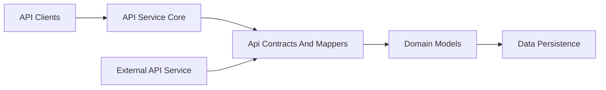
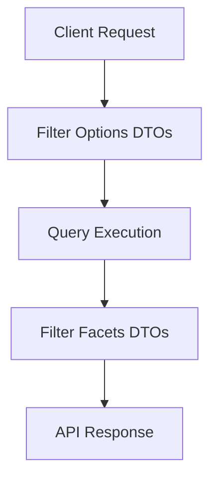
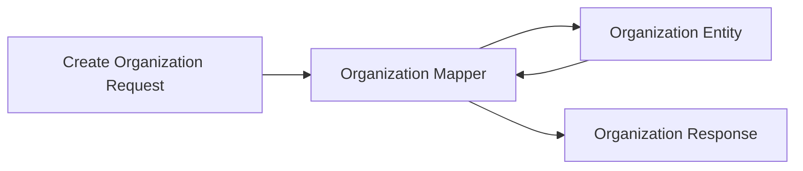

# Api Contracts And Mappers

## Overview

The **Api Contracts And Mappers** module defines the shared data transfer objects (DTOs), filter contracts, pagination models, and mapping logic that sit between the API layers and the underlying domain and persistence models. It acts as the **canonical contract layer** for multiple services, ensuring consistent request and response shapes across GraphQL and REST APIs.

This module is consumed heavily by:
- API Service Core (GraphQL and internal APIs)
- External API Service Core (public REST APIs)
- Gateway and frontend clients that rely on stable schemas

Its primary responsibilities are:
- Defining immutable API-facing DTOs
- Standardizing filtering and pagination models
- Mapping domain entities to API responses and vice versa
- Providing small shared services used by API data loaders

---

## Architectural Role

Api Contracts And Mappers sits between the API layer and the data layer. It does **not** contain controllers or persistence logic. Instead, it ensures that all APIs speak a common language when exchanging data.

Key characteristics:
- Pure contract definitions (DTOs)
- Minimal business logic
- No direct infrastructure dependencies
- Shared across multiple services

---

## Module Composition

The module can be logically divided into four areas:

1. **Query and Pagination Contracts**
2. **Filter and Facet Models**
3. **Domain-Specific DTOs**
4. **Mappers and Shared Services**

Each area is described below.

---

## Query and Pagination Contracts

### Counted Generic Query Result

`CountedGenericQueryResult<T>` extends a base query result with additional metadata about filtered totals. This is commonly used for list endpoints that support filtering and faceting.

**Responsibilities:**
- Wrap query results
- Provide filtered count separate from total count
- Enable efficient UI pagination and filtering

Typical use cases:
- Device listings
- Log queries
- Tool and organization searches

---

### Cursor Pagination Input

`CursorPaginationInput` defines a cursor-based pagination contract shared across APIs.

**Key properties:**
- `limit`: constrained between 1 and 100
- `cursor`: opaque continuation token

This enables:
- Stable pagination for large datasets
- Efficient scrolling experiences
- Consistent pagination semantics across services

---

## Filter and Facet Models

Filtering in OpenFrame APIs follows a clear separation:
- **Filter Options** describe what the client can request
- **Filters / Facets** describe what the API returns as available filters

### Audit and Log Filters

**LogFilterOptions**
- Date ranges
- Event types
- Tool types
- Severities
- Organization and device scoping

**LogFilters**
- Aggregated facet values
- Organization-based filter options

**LogEvent and LogDetails**
- `LogEvent`: lightweight event representation
- `LogDetails`: extended view including message and details

These DTOs are used by log and audit endpoints across internal and external APIs.

---

### Device Filters

**DeviceFilterOptions**
- Device statuses
- Device types
- Operating systems
- Organizations
- Tags

**DeviceFilters**
- Faceted filter options with counts
- Filtered device count

**DeviceFilterOption**
- Value / label pairs
- Optional count for UI display

This structure enables rich device filtering experiences in the frontend.

---

### Event Filters

**EventFilterOptions**
- User IDs
- Event types
- Date ranges

**EventFilters**
- Aggregated event-related facets

These contracts are shared by event and activity APIs.

---

### Organization Filters

`OrganizationFilterOptions` defines internal filtering criteria such as:
- Category
- Employee count ranges
- Contract status

These filters are typically applied server-side rather than exposed directly to clients.

---

### Tool Filters

**ToolFilterOptions**
- Enabled state
- Tool type
- Category
- Platform category

**ToolFilters**
- Aggregated lists of available types and categories

Used by both management and external APIs when listing integrated tools.

---

## Domain-Specific DTOs

### Organization DTOs

**OrganizationList**
- Wraps a list of organization entities
- Used for bulk organization responses

**OrganizationResponse**
- Canonical organization response model
- Shared between GraphQL and REST APIs

Fields include:
- Business metadata (category, employees, revenue)
- Contract lifecycle dates
- Contact information
- Audit timestamps

This DTO acts as the single source of truth for organization data exposed by APIs.

---

### Tool List

`ToolList` provides a simple wrapper around integrated tool entities for API responses.

---

## Mappers and Shared Services

### Organization Mapper

`OrganizationMapper` is a central component that converts between:
- Organization API requests
- Organization domain entities
- Organization API responses

Key behaviors:
- Generates immutable organization identifiers
- Supports partial updates (non-null fields only)
- Handles nested contact and address structures
- Ensures mailing and physical address consistency

This mapper is shared across GraphQL and REST implementations to guarantee identical behavior.

---

### Installed Agent Service

`InstalledAgentService` provides reusable query logic for installed agents. While it lives in this module, it is designed for consumption by API data loaders.

**Responsibilities:**
- Batch loading agents by machine ID
- Efficient grouping for GraphQL resolvers
- Simple lookup utilities

This service does not expose API endpoints directly.

---

### Tool Connection Service

`ToolConnectionService` mirrors the installed agent service pattern for tool connections.

**Key characteristics:**
- Read-only transactional scope
- Batch-oriented access patterns
- Optimized for DataLoader usage

---

### Default Device Status Processor

`DefaultDeviceStatusProcessor` is a fallback implementation used when no custom device status processor is provided.

**Purpose:**
- Hook point for device status change events
- Safe default behavior with logging only

This allows downstream services to override device status handling without modifying API contracts.

---

## Interaction With Other Modules

Api Contracts And Mappers is intentionally lightweight and broadly reused:

- **API Service Core** uses DTOs and mappers for GraphQL and internal APIs
- **External API Service Core** relies on the same contracts for REST endpoints
- **Gateway Service Core** and frontend clients depend on the stability of these schemas
- **Data Persistence modules** supply the entities mapped by this layer

By centralizing contracts here, the platform minimizes duplication and prevents schema drift across services.

---

## Design Principles

- **Stability first**: DTO changes are deliberate and backward-compatible
- **Clear separation**: Contracts and mappings are isolated from controllers
- **Shared ownership**: Used across multiple services
- **Minimal logic**: Only mapping and structural concerns

---

## Summary

The **Api Contracts And Mappers** module is the backbone of API consistency in the OpenFrame platform. It defines how data is shaped, filtered, paginated, and transformed across service boundaries. By consolidating contracts and mappers in one place, the platform ensures predictable APIs, simpler maintenance, and a better developer experience across the entire stack.
