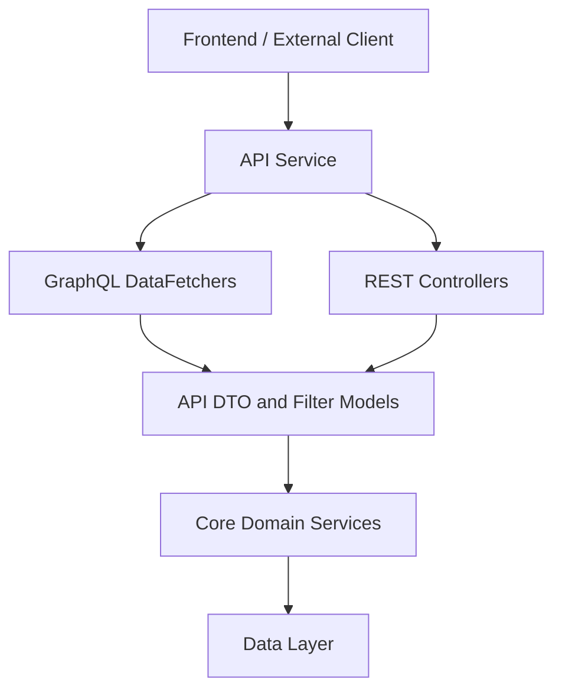
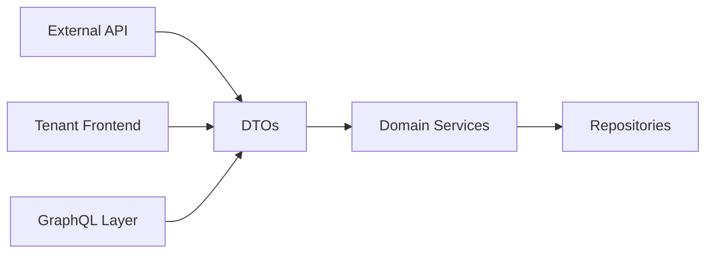

# API DTO and Filter Models

This module defines **shared Data Transfer Objects (DTOs)** and **filter models** used across OpenFrame API layers, including:

- API Service GraphQL layer
- API Service REST controllers
- External API service
- Core domain services

The primary responsibility of this module is to provide **stable, reusable contracts** for querying, filtering, paginating, and returning domain data such as devices, events, logs, organizations, and tools.

---

## Responsibilities

- Define **filter input models** for queries (dates, types, statuses, IDs)
- Define **filter option models** returned to UI clients for faceted search
- Define **list and response DTOs** shared between GraphQL and REST APIs
- Provide **generic pagination and counted result wrappers**

This module intentionally contains **no business logic**. It is a pure contract layer.

---

## High-Level Architecture

---

## Sub-Modules Overview

The module is organized by **domain context**. Each sub-module groups DTOs and filters for a specific domain.

### Audit / Logs
- Log events, log details, and log filter models
- Used by API GraphQL log queries and External API log endpoints

➡ See [Audit Models](Audit Models.md)

### Devices
- Device filter options and faceted filter results
- Used by device list queries and dashboards

➡ See [Device Models](Device Models.md)

### Events
- Event filters and query options
- Used by activity streams and audit timelines

➡ See [Event Models](Event Models.md)

### Organizations
- Organization responses and filter options
- Shared between GraphQL and REST APIs

➡ See [Organization Models](Organization Models.md)

### Tools
- Tool filters and list responses
- Used by integrations and management UIs

➡ See [Tool Models](Tool Models.md)

### Shared Utilities
- Cursor-based pagination
- Generic counted query results

➡ See [Shared Models](Shared Models.md)

---

## How This Module Fits the Platform

This separation ensures:

- ✅ Consistent data contracts across APIs
- ✅ Reduced duplication between GraphQL and REST layers
- ✅ Stable frontend integrations
- ✅ Clear evolution boundaries for API changes

---

## Design Principles

- **Immutability by convention** – DTOs represent snapshots of data
- **Explicit filtering** – all filters are typed and intentional
- **Backend-driven faceting** – filter option counts are computed server-side
- **Shared contracts** – reused across multiple services

---

## Related Modules (Conceptual)

- API Service GraphQL DTOs and Inputs
- External API DTOs
- Core Domain Services

Refer to platform documentation for those modules.
