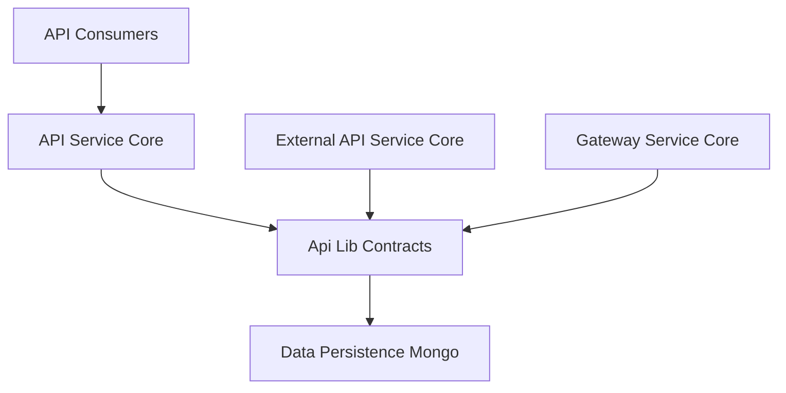
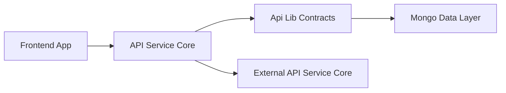

# Api Lib Contracts

## Overview

Api Lib Contracts is a shared library module that defines **API contracts**, **data transfer objects (DTOs)**, and **shared service abstractions** used across the OpenFrame platform. Its primary goal is to provide a **single source of truth** for request/response models, filtering semantics, pagination structures, and cross-service data mappings.

This module is consumed by multiple services, including API Service Core, External API Service Core, Gateway Service Core, and Frontend clients. By centralizing contracts here, OpenFrame ensures consistent behavior between GraphQL, REST, and internal service-to-service communication.

Api Lib Contracts does **not** expose HTTP endpoints itself. Instead, it defines the schemas and shared logic that higher-level services rely on.

---

## Responsibilities

Api Lib Contracts is responsible for:

- Defining shared DTOs for API responses and requests
- Standardizing filter and query option models
- Providing pagination and counted query result structures
- Sharing mapping logic between persistence entities and API responses
- Exposing lightweight domain services used by DataLoaders and processors

It deliberately avoids:

- Business workflows
- Authorization logic
- Persistence configuration
- Transport-specific concerns (HTTP, GraphQL, WebSocket)

---

## High-Level Architecture

Api Lib Contracts sits between API-facing services and the data layer, acting as a contract boundary that stabilizes how data is shaped and exchanged.

---

## Core Component Categories

The module can be logically divided into the following categories:

1. Query and pagination contracts
2. Audit and event DTOs
3. Device, tool, and organization filtering models
4. Shared organization DTOs and mappers
5. Lightweight shared services
6. Extension and processor hooks

Each category is described below.

---

## Query and Pagination Contracts

### CountedGenericQueryResult

`CountedGenericQueryResult` extends a generic query result to include filtered counts, which are essential for UI pagination and analytics.

Key characteristics:
- Generic container for query results
- Includes total and filtered counts
- Used by list and search endpoints

Typical usage scenarios:
- Device listings with applied filters
- Event and audit log searches
- Tool and organization queries

---

## Audit and Event DTOs

### LogEvent and LogDetails

These DTOs represent audit and activity log records at different detail levels:

- **LogEvent**: Lightweight representation for listings and summaries
- **LogDetails**: Full representation including message payload and details

Common fields include:
- Event type and severity
- Tool and organization context
- Device and user identifiers
- Timestamps for ingestion and occurrence

### LogFilterOptions and LogFilters

Filtering models that allow clients to:
- Restrict logs by date range
- Filter by tool type, event type, or severity
- Scope results to organizations or devices

These filters are used consistently across GraphQL and REST APIs.

---

## Device Filtering Contracts

### DeviceFilterOptions

Represents incoming filter criteria when querying devices, including:
- Device status
- Device type
- Operating system
- Organization scope
- Tag-based filtering

### DeviceFilters and DeviceFilterOption

Represents available filter facets returned to clients:
- Each option includes a label, value, and count
- Enables dynamic filter UI construction
- Includes a filtered count for result awareness

This pattern supports faceted search experiences in the frontend.

---

## Event Filtering Contracts

### EventFilterOptions and EventFilters

Standardized filtering structures for event queries:
- User-based filtering
- Event type selection
- Optional date range constraints

These DTOs ensure consistent event querying across internal and external APIs.

---

## Organization Contracts

### OrganizationFilterOptions

Internal filtering options used when querying organizations by:
- Category
- Employee count range
- Contract status

### OrganizationList and OrganizationResponse

- **OrganizationList** wraps collections of organization entities
- **OrganizationResponse** is the canonical API representation used by both GraphQL and REST services

OrganizationResponse includes:
- Business metadata
- Contract lifecycle information
- Audit timestamps
- Soft deletion indicators

---

## Shared Pagination Input

### CursorPaginationInput

Defines a cursor-based pagination model with validation constraints:
- Enforced minimum and maximum page sizes
- Opaque cursor for forward pagination

This input is used across multiple services to ensure predictable paging behavior.

---

## Tool Contracts

### ToolFilterOptions and ToolFilters

Defines how integrated tools can be queried and filtered:
- Enablement status
- Tool type and category
- Platform-specific grouping

### ToolList

A simple wrapper DTO used for returning collections of integrated tools.

---

## Organization Mapping Logic

### OrganizationMapper

OrganizationMapper is a shared, Spring-managed component that translates between:
- Persistence entities from the data layer
- API-facing DTOs used by GraphQL and REST

Responsibilities include:
- Creating new organization entities from requests
- Applying partial updates while preserving immutability rules
- Mapping nested contact and address structures
- Ensuring consistent organization identifiers

This mapper prevents duplication of transformation logic across services.

---

## Shared Services

### InstalledAgentService

Provides reusable logic for retrieving installed agents:
- Fetch agents by machine
- Batch-fetch agents for multiple machines
- Used primarily by DataLoaders and API services

Key design goals:
- Minimize database round-trips
- Provide predictable ordering aligned with input IDs

### ToolConnectionService

Exposes shared access patterns for tool connections:
- Retrieve connections per machine
- Batch-oriented access for DataLoader use cases

Both services abstract repository access and are intentionally thin.

---

## Extension and Processor Hooks

### DefaultDeviceStatusProcessor

A default, pluggable implementation of a device status processor:
- Invoked after device status updates
- Logs status transitions for observability
- Automatically replaced if a custom implementation is provided

This pattern allows downstream services to extend behavior without modifying core logic.

---

## How Api Lib Contracts Fits Into the Platform

Api Lib Contracts enables:
- Strong consistency between internal and external APIs
- Shared evolution of schemas without tight coupling
- Safer refactoring across services

It acts as a **contract boundary** that stabilizes the OpenFrame platform as it scales.

---

## Summary

Api Lib Contracts is a foundational module that defines how data moves through the OpenFrame ecosystem. By centralizing DTOs, filters, pagination models, mappers, and shared services, it ensures consistency, reduces duplication, and enables independent evolution of API-facing services.

Any change to this module should be treated as a contract change and reviewed carefully for cross-service impact.