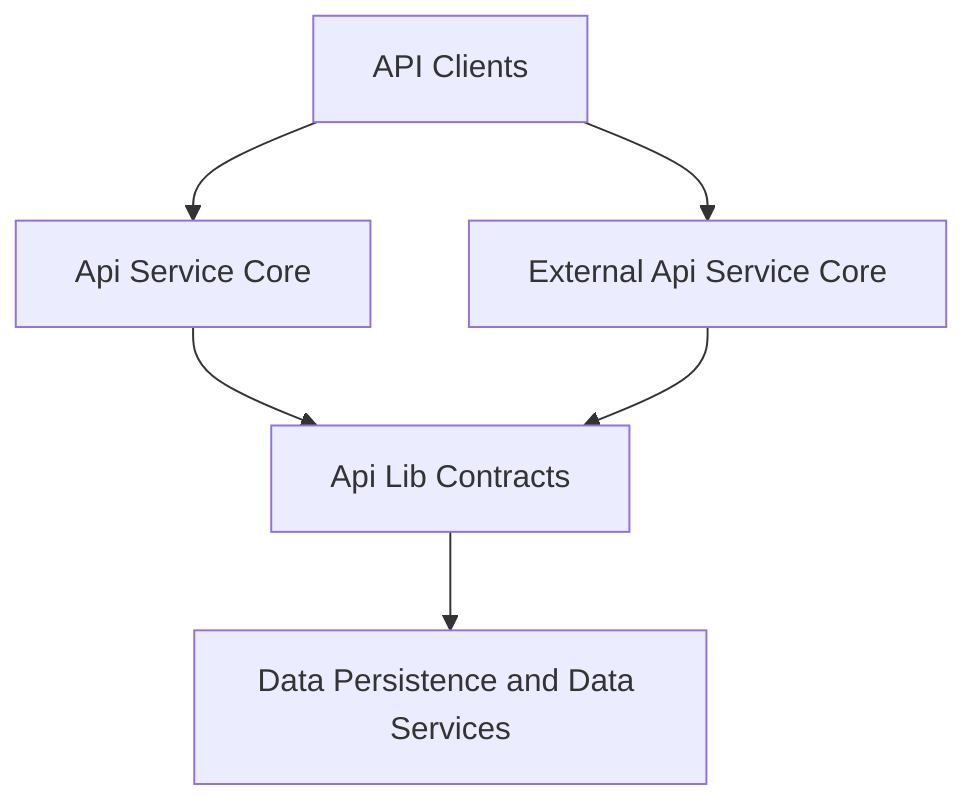
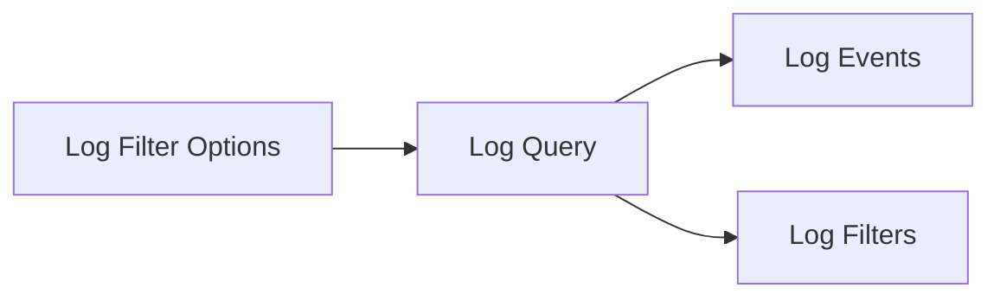
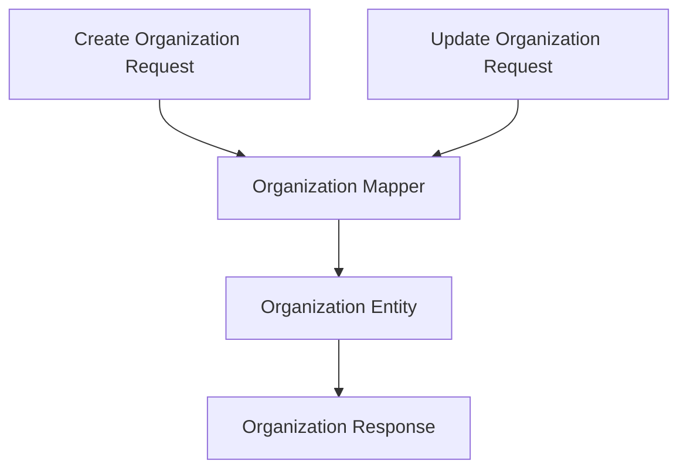

# Api Lib Contracts

## Overview

The **Api Lib Contracts** module defines the shared data contracts, filter models, pagination inputs, and lightweight services used across the OpenFrame backend. It acts as the **canonical boundary layer** between API-facing services (GraphQL and REST) and the underlying domain and persistence layers.

This module is intentionally **framework-light and reusable**. Its primary goals are:

- Provide stable DTOs shared by multiple services
- Standardize filtering, pagination, and list responses
- Centralize mapping logic between persistence entities and API responses
- Offer small, reusable domain services required by GraphQL DataLoaders

Api Lib Contracts is consumed heavily by:
- Api Service Core (GraphQL)
- External Api Service Core (REST)
- Gateway and client-facing services indirectly via shared DTOs

---

## Architectural Role

Api Lib Contracts sits between API services and data services, defining the **shape of data** exchanged while remaining independent of transport concerns.

**Key characteristics:**
- No controllers or transport bindings
- DTO-first design
- Shared by GraphQL and REST implementations
- Strong alignment with domain models, without exposing repositories directly

---

## Module Structure

Api Lib Contracts is organized into the following conceptual areas:

1. **Shared Query and Pagination Models**
2. **Audit and Event Contracts**
3. **Device and Tool Filtering Contracts**
4. **Organization Contracts and Mapping**
5. **Supporting Domain Services**
6. **Extension Hooks and Processors**

Each area is described below.

---

## Shared Query and Pagination Models

### Counted Generic Query Result

`CountedGenericQueryResult<T>` extends a generic query result with additional metadata describing the **filtered count** of items.

**Purpose:**
- Used when pagination or filtering is applied
- Allows clients to distinguish between total results and filtered subsets

**Typical use cases:**
- Device lists with active filters
- Tool or event queries with server-side filtering

---

### Cursor Pagination Input

`CursorPaginationInput` standardizes cursor-based pagination across APIs.

**Key properties:**
- `limit`: bounded between 1 and 100
- `cursor`: opaque continuation token

**Design intent:**
- Enforces consistent pagination limits
- Avoids offset-based pagination pitfalls
- Works seamlessly with GraphQL and REST endpoints

---

## Audit and Event Contracts

Audit and event DTOs define how logs and activities are queried, filtered, and displayed.

### Log Event and Log Details

- **Log Event** represents a lightweight audit entry suitable for lists
- **Log Details** extends this with message bodies and detailed descriptions

**Common fields include:**
- Tool and event identifiers
- Severity and type
- User, device, and organization context
- Timestamps and ingestion metadata

---

### Log Filter Options and Filters

Filtering is split into two responsibilities:

- **Log Filter Options**: inputs provided by clients when querying logs
- **Log Filters**: resolved filter metadata returned to clients (for UI dropdowns)

This separation allows APIs to:
- Accept flexible query inputs
- Return enriched filter metadata for client interfaces

---

### Organization Filter Option

`OrganizationFilterOption` provides a minimal identifier and display name pair used primarily in audit log filtering interfaces.

---

## Device Filtering Contracts

Device-related filtering follows the same **input vs output** separation pattern used by audit logs.

### Device Filter Options

`DeviceFilterOptions` represents client-provided criteria such as:
- Device status and type
- Operating system
- Organization scope
- Tag names

These inputs map closely to persistence-layer query capabilities.

---

### Device Filters

`DeviceFilters` represents aggregated filter metadata returned to clients, including:
- Available filter values
- Counts per filter value
- Total filtered count

This model is optimized for UI-driven filtering experiences.

---

### Tag Filter Option and Device Filter Option

These small DTOs provide consistent representations of filterable values:
- `value`: internal identifier
- `label`: human-readable name
- `count`: number of matching records

---

## Event Filtering Contracts

Event filtering mirrors the audit model but is scoped to system and user events.

### Event Filter Options

Used as input for event queries, supporting:
- User scoping
- Event type selection
- Date range filtering

### Event Filters

Returned to clients to describe available event filter dimensions.

---

## Organization Contracts and Mapping

Organization data is shared across multiple services and API styles, making this one of the most critical areas of Api Lib Contracts.

### Organization Filter Options

Defines internal filtering criteria such as:
- Organization category
- Employee range
- Contract status

---

### Organization List and Organization Response

- **Organization List** wraps raw organization entities for list responses
- **Organization Response** is the canonical API representation used by both GraphQL and REST

**Notable characteristics:**
- Supports lifecycle fields (created, updated, deleted)
- Includes contract and revenue metadata
- Encapsulates contact and address information

---

### Organization Mapper

The `OrganizationMapper` is a shared component responsible for:

- Creating entities from API requests
- Performing partial updates safely
- Mapping entities to API response DTOs

**Key design decisions:**
- Organization identifiers are immutable once created
- Partial updates ignore null fields
- Mailing address can be derived automatically from physical address

---

## Supporting Domain Services

Although primarily a contracts module, Api Lib Contracts includes a small number of **shared services** required by API DataLoaders.

### Installed Agent Service

Provides optimized access to installed agents by machine identifier.

**Responsibilities:**
- Batch-fetch agents for multiple machines
- Preserve input ordering
- Avoid N+1 query patterns

This service is commonly used by GraphQL resolvers.

---

### Tool Connection Service

Similar to Installed Agent Service, this component provides:
- Bulk retrieval of tool connections per machine
- Grouped results aligned with DataLoader expectations

---

## Extension Hooks and Processors

### Default Device Status Processor

`DefaultDeviceStatusProcessor` is a fallback implementation used when no custom processor is defined.

**Purpose:**
- Acts as a safe extension point
- Allows downstream services to react to device status changes

By default, it performs logging only, ensuring no side effects unless explicitly configured.

---

## Design Principles

Api Lib Contracts adheres to the following principles:

- **Shared Ownership**: DTOs are designed for cross-service use
- **Stability**: Backward compatibility is prioritized
- **Separation of Concerns**: No transport or controller logic
- **UI-Aware APIs**: Filter outputs are optimized for frontend consumption

---

## How This Module Fits in the System

- Defines the language spoken between APIs and data layers
- Reduces duplication across GraphQL and REST services
- Enables consistent filtering and pagination semantics
- Acts as a contract-first foundation for OpenFrame APIs

For higher-level API behavior, refer to the Api Service Core and External Api Service Core documentation. For persistence details, refer to the data persistence and data platform modules.

---

## Summary

**Api Lib Contracts** is the backbone of shared API models in OpenFrame. By centralizing DTOs, filters, mappers, and small domain services, it ensures consistency, reduces coupling, and enables multiple services to evolve together without duplicating core data contracts.