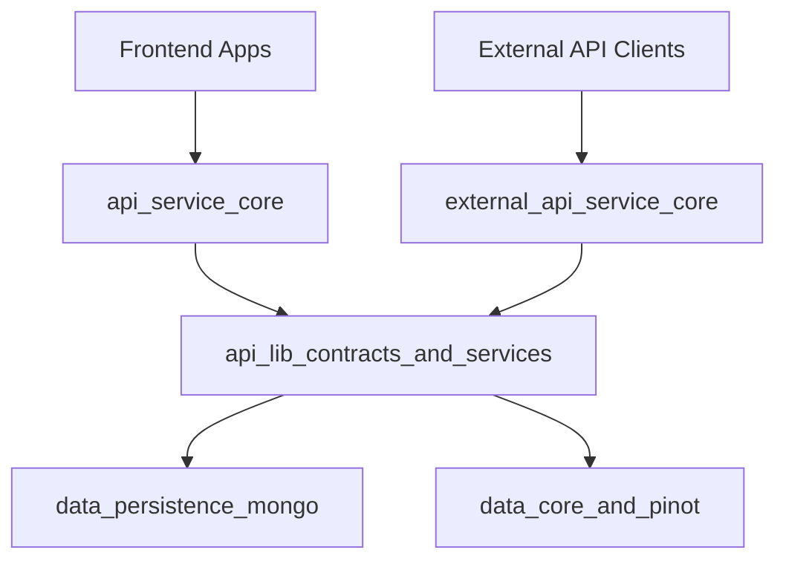
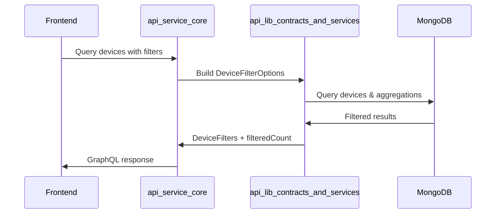

# api_lib_contracts_and_services

## Overview
The **api_lib_contracts_and_services** module is a shared Java library that defines **API contracts (DTOs)** and **reusable service components** used across OpenFrame backend services. Its primary goal is to provide a **single source of truth** for:

- Filter and query DTOs shared by GraphQL and REST APIs
- Common response models consumed by frontend and external clients
- Shared service logic reused by DataLoaders and API services
- Stable contracts between `api_service_core`, `external_api_service_core`, and frontend clients

This module intentionally contains **no controllers**. It is consumed by higher-level services such as **API Service Core**, **External API**, and **Gateway**, ensuring consistency across the platform.

---

## Position in the System Architecture

- **Upstream producers**: `data_persistence_mongo`, `data_core_and_pinot`
- **Primary consumers**:
  - `api_service_core` (GraphQL + internal REST)
  - `external_api_service_core` (public REST API)
  - Frontend GraphQL clients

---

## High-Level Architecture

---

## Module Responsibilities

### 1. Shared DTO Contracts
Defines immutable data transfer objects used consistently across services.

- Audit & log filtering
- Device, tool, and organization filtering
- Cursor-based pagination
- Generic query result wrappers

### 2. Shared Mapping Logic
Provides reusable mappers that convert persistence models into API responses.

### 3. Shared Domain Services
Encapsulates reusable read-only service logic used by GraphQL DataLoaders and APIs.

### 4. Extension Hooks
Provides default processor implementations that can be overridden by downstream services.

---

## Submodules Overview

### Audit & Log DTOs
Defines log events, details, and filtering options used by:
- `api_service_core` (GraphQL logs)
- `external_api_service_core` (REST logs)

Includes:
- `LogEvent`
- `LogDetails`
- `LogFilterOptions`
- `LogFilters`

---

### Device Filtering DTOs
Shared filter contracts for device queries across GraphQL and REST.

Includes:
- `DeviceFilterOptions`
- `DeviceFilters`
- `DeviceFilterOption`
- `TagFilterOption`

These DTOs are populated using data from MongoDB and Pinot-backed aggregations.

---

### Event Filtering DTOs
Provides event filter inputs and normalized filter representations.

Includes:
- `EventFilterOptions`
- `EventFilters`

---

### Organization DTOs & Mapping

Includes:
- `OrganizationResponse`
- `OrganizationList`
- `OrganizationFilterOptions`
- `OrganizationMapper`

The `OrganizationMapper` is a **critical shared component** used by both GraphQL and REST APIs to ensure consistent transformation between:
- MongoDB `Organization` entities
- Public API response DTOs

---

### Tool DTOs

Includes:
- `ToolFilterOptions`
- `ToolFilters`
- `ToolList`

These DTOs are used to expose integrated tools consistently across APIs.

---

### Pagination & Query Utilities

Includes:
- `CursorPaginationInput`
- `CountedGenericQueryResult`

These utilities standardize pagination and filtered count handling for list-based APIs.

---

### Shared Services

#### InstalledAgentService
Reusable service for querying installed agents per machine.

Used by:
- GraphQL DataLoaders in `api_service_core`

Responsibilities:
- Batch lookup by machine IDs
- Single-machine agent resolution

---

#### ToolConnectionService
Reusable service for resolving tool connections per machine.

Responsibilities:
- Efficient batch loading
- GraphQL-friendly result ordering

---

### Extension Processors

#### DefaultDeviceStatusProcessor

Default no-op implementation of device status post-processing.

- Activated only if no custom `DeviceStatusProcessor` bean is provided
- Enables downstream services to override behavior without modifying this module

---

## Data Flow Example: Device List with Filters

---

## Design Principles

- **Strict separation of contracts and controllers**
- **No business orchestration logic**
- **Backward-compatible DTO evolution**
- **Shared ownership across services**

---

## When to Modify This Module

✅ Add new shared DTOs required by multiple services
✅ Extend shared filtering or pagination contracts
✅ Add reusable read-only services

❌ Do not add controllers
❌ Do not add service-specific business logic
❌ Do not introduce persistence configuration

---

## Summary

The **api_lib_contracts_and_services** module is the **foundation layer** that ensures API consistency across OpenFrame. By centralizing contracts, filters, mappers, and shared services, it enables rapid evolution of APIs while protecting frontend and external clients from breaking changes.
