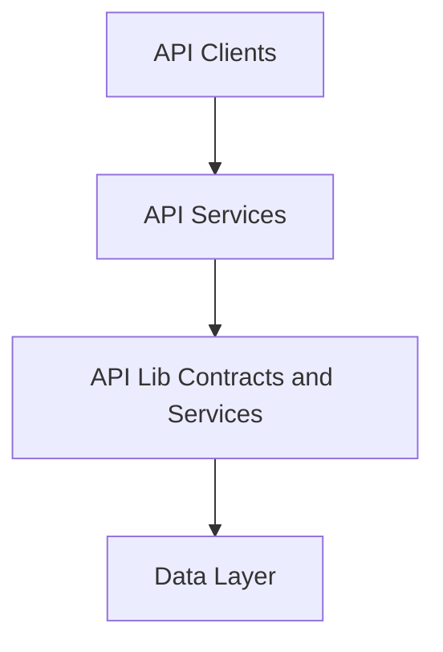

# api_lib_contracts_and_services

This module provides **shared API contracts and lightweight services** used across the OpenFrame platform. It acts as the canonical boundary between API layers (GraphQL, REST, external APIs) and downstream services, ensuring consistent data models, filters, pagination semantics, and shared domain logic.

The module is intentionally free of transport-specific concerns and focuses on:
- Stable **DTO contracts** reused by multiple services
- **Filter and pagination models** for list and search endpoints
- **Shared services** supporting GraphQL DataLoaders and REST controllers
- **Mappers and processors** that encapsulate cross-service domain behavior

## Position in the OpenFrame Architecture

`api_lib_contracts_and_services` sits between API-facing services (GraphQL, REST, External API) and the data layer. It is consumed by:
- `api_service_core_graphql_rest`
- `external_api_service_core`
- `management_service_core`

and depends primarily on shared data models from the data-layer modules.

## High-Level Sub-Modules

This module is organized conceptually into the following sub-modules:

### 1. Data Transfer Objects (DTOs)

DTOs define the **public and internal data contracts** exchanged between API services and clients. They include:
- List and filter options for logs, devices, events, tools, and organizations
- Cursor-based pagination inputs
- Standardized list and response wrappers

See: [DTOs](DTOs.md)

---

### 2. Shared Services

These services encapsulate reusable domain logic that does not belong to a single API surface. They are commonly used by GraphQL DataLoaders and REST controllers to avoid duplication.

Key responsibilities include:
- Batch loading of installed agents
- Resolving tool connections per machine

See: [Services](Services.md)

---

### 3. Mappers

Mappers provide **bidirectional transformation** between persistence-layer entities and API DTOs. They ensure consistency across GraphQL and REST APIs.

Currently, this module exposes a shared organization mapper.

See: [Mapper](Mapper.md)

---

### 4. Processors

Processors define **extension points** for domain-specific post-processing logic. They allow API services to hook into lifecycle events without hard dependencies.

See: [Processors](Processors.md)

## Integration with Other Modules

- API controllers and GraphQL data fetchers depend on these DTOs for request/response models
- DataLoader implementations rely on the shared services for efficient batching
- Management and external APIs reuse the same contracts to guarantee consistency

This design reduces duplication, enforces schema stability, and enables independent evolution of transport layers.

---

## Design Principles

- **Transport-agnostic**: No REST or GraphQL annotations
- **Backward compatibility**: DTOs evolve conservatively
- **Single source of truth**: One contract shared across services
- **Extensibility**: Default processors can be overridden by downstream services

---

## Summary

`api_lib_contracts_and_services` is a foundational module that standardizes how OpenFrame services communicate. By centralizing contracts, filters, pagination, and shared logic, it ensures consistent behavior across the entire platform while keeping higher-level services lightweight and focused.
