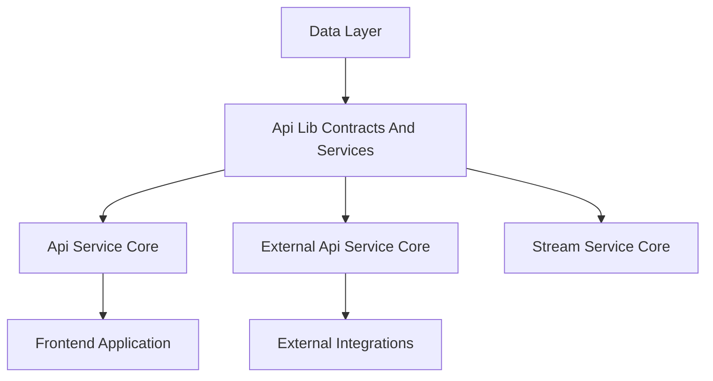
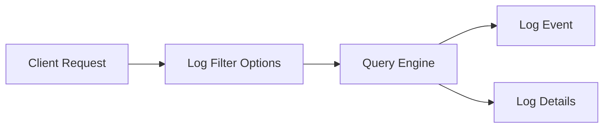
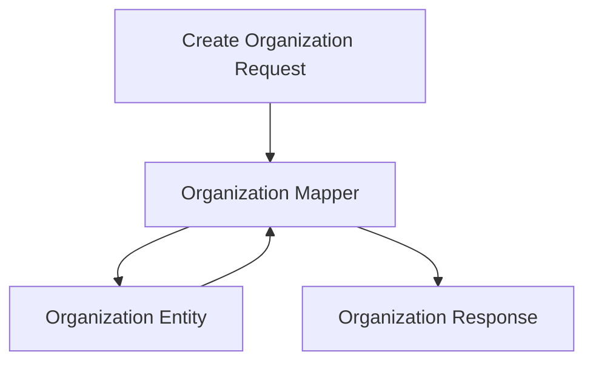
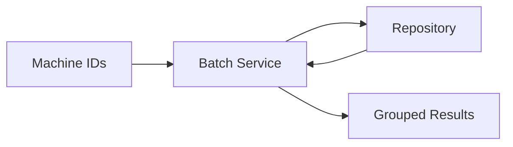

# Api Lib Contracts And Services

## Overview

The **Api Lib Contracts And Services** module is a shared Java library that defines **stable API contracts (DTOs)**, **mapping utilities**, and **domain services** used across multiple OpenFrame backend services. Its primary goal is to provide a **single source of truth** for data structures and shared business logic that must remain consistent between:

- Internal GraphQL APIs (Api Service Core)
- External REST APIs (External Api Service Core)
- Downstream consumers such as the frontend, stream processors, and integrations

This module deliberately contains **no controllers** and **no transport-specific logic**. Instead, it focuses on:

- Reusable DTOs for filters, lists, pagination, and responses
- Shared mappers between persistence models and API models
- Lightweight domain services that support batching and DataLoader-style access
- Default processors that can be overridden by higher-level services

---

## Position in the Platform Architecture

Api Lib Contracts And Services sits at the **contract boundary** between the data layer and service cores. It is imported by multiple services to ensure consistent schemas and behavior.

---

## Core Responsibilities

### 1. Shared Data Transfer Objects (DTOs)

The module defines a comprehensive set of DTOs used for **queries**, **filters**, **lists**, and **responses**. These DTOs are intentionally transport-agnostic and can be used by both GraphQL and REST APIs.

Key design principles:
- Immutable or builder-based construction
- Clear separation between filter inputs and response payloads
- Compatibility across internal and external APIs

---

### 2. Filtering and Query Contracts

Filtering DTOs standardize how clients express queries across devices, logs, events, organizations, and tools.

#### Audit and Log Filtering

- **LogEvent**: Lightweight representation of an audit log entry
- **LogDetails**: Extended log representation including message and details
- **LogFilterOptions**: Client-provided filter criteria (dates, severities, tool types)
- **LogFilters**: Aggregated filter metadata returned to clients
- **OrganizationFilterOption**: Organization dropdown options for log filtering

---

#### Device Filtering

Device-related filtering is split between **input options** and **computed filter results**:

- **DeviceFilterOptions**: Raw filter criteria such as status, OS type, tags, and organization
- **DeviceFilters**: Filter facets returned to the client with counts
- **DeviceFilterOption** and **TagFilterOption**: Individual selectable filter values

This structure enables efficient faceted search experiences in the frontend.

---

#### Event, Organization, and Tool Filters

- **EventFilterOptions** and **EventFilters**: Event query constraints
- **OrganizationFilterOptions**: Internal organization query filters
- **ToolFilterOptions** and **ToolFilters**: Tool filtering by type, category, and platform

All filter DTOs follow a consistent naming and structure pattern to reduce cognitive load across services.

---

### 3. Pagination and Query Results

#### Cursor-Based Pagination

The module standardizes pagination using cursor-based semantics:

- **CursorPaginationInput**: Defines `limit` and `cursor` with validation constraints

This approach is compatible with both GraphQL connections and REST list endpoints.

#### Counted Query Results

- **CountedGenericQueryResult**: Extends generic query results with a `filteredCount`

This enables UIs to display total and filtered counts without additional queries.

---

### 4. Organization Mapping and Contracts

Organizations are shared entities across many services. This module centralizes their API representation.

#### Organization DTOs

- **OrganizationResponse**: Canonical organization response used by GraphQL and REST APIs
- **OrganizationList**: List wrapper for organization collections

#### OrganizationMapper

The **OrganizationMapper** converts between persistence models and API DTOs:

- Generates immutable organization identifiers
- Enforces immutability of `organizationId`
- Supports partial updates
- Handles nested contact and address mapping

---

### 5. Shared Domain Services

While most logic lives in higher-level services, this module provides **reusable domain services** that encapsulate common access patterns.

#### InstalledAgentService

Responsibilities:
- Retrieve installed agents by machine ID
- Batch-load agents for multiple machines
- Support GraphQL DataLoader usage

Key characteristics:
- Read-only access patterns
- Deterministic ordering aligned with input IDs

---

#### ToolConnectionService

Responsibilities:
- Retrieve tool connections per machine
- Batch resolution for multiple machines

This service mirrors the InstalledAgentService pattern to maintain consistency across DataLoader implementations.

---

### 6. Default Processing Hooks

#### DefaultDeviceStatusProcessor

This component provides a **default no-op implementation** for device status post-processing:

- Logs device status updates
- Is conditionally loaded only if no custom processor is defined

This design allows downstream services to override behavior without modifying shared code.

---

## Interaction With Other Modules

Api Lib Contracts And Services is intentionally passive and reused by multiple cores:

- **Api Service Core**: Uses DTOs, mappers, and services for GraphQL APIs
- **External Api Service Core**: Reuses the same contracts for REST endpoints
- **Stream Service Core**: Consumes shared DTOs for event processing
- **Frontend Application**: Relies on these contracts indirectly through API responses

By centralizing contracts here, OpenFrame ensures:
- Consistent schemas across APIs
- Reduced duplication
- Safer refactoring and evolution of services

---

## Design Principles and Best Practices

- **Contract First**: DTOs are designed before transport logic
- **Reuse Over Duplication**: Shared logic lives here, not in controllers
- **Extensibility**: Default implementations are overridable
- **Stability**: Backward compatibility is prioritized

---

## Summary

The **Api Lib Contracts And Services** module is the backbone of OpenFrame’s API consistency. It defines the contracts, mappings, and shared services that allow multiple backend systems to evolve independently while speaking the same language. Any change in this module has platform-wide impact and should be approached with careful versioning and compatibility considerations.
