# api_lib_dtos_and_services

## Overview

The **api_lib_dtos_and_services** module is a shared library within the OpenFrame / Flamingo platform. It provides **cross-service DTOs, mappers, and lightweight domain services** that are reused by:

- API Service (REST + GraphQL)
- Gateway Service
- Stream and Management services (indirectly via DTO contracts)

Its primary goal is to **standardize data contracts and shared business helpers** across services while avoiding duplication in individual service cores.

This module intentionally contains **no controllers and no persistence logic**. Instead, it focuses on:

- Data Transfer Objects (DTOs)
- Filter and pagination models
- Entity-to-DTO mappers
- Read-focused domain services used by GraphQL DataLoaders
- Default processors with safe fallback behavior

---

## Position in the Overall Architecture

```mermaid
flowchart LR
    Client["Client UI"] --> Gateway["Gateway Service"]
    Gateway --> ApiService["API Service"]
    ApiService --> GraphQL["GraphQL Layer"]

    GraphQL --> DataFetchers["GraphQL DataFetchers"]
    DataFetchers --> DataLoaders["GraphQL DataLoaders"]

    DataLoaders --> SharedLib["api_lib_dtos_and_services"]
    SharedLib --> DataCore["Shared Data Repositories"]
```

**Key role:**
- Acts as the **shared contract and utility layer** between API-facing services and underlying data models.

---

## High-Level Module Structure

The module can be logically divided into the following sub-modules:

| Sub-module | Responsibility | Documentation |
|-----------|---------------|---------------|
| DTOs | Shared request/response and filter models | `api_lib_dtos.md` |
| Mappers | Entity ↔ DTO conversion logic | `api_lib_mappers.md` |
| Services | Shared read-focused domain services | `api_lib_services.md` |
| Processors | Default processing hooks | `api_lib_processors.md` |

---

## How This Module Is Used

### REST Controllers
- Controllers in **api_service_core_rest_controllers** return DTOs defined here
- Ensures REST and GraphQL share identical response shapes

### GraphQL DataFetchers & DataLoaders
- DataLoaders rely on shared services (e.g. InstalledAgentService)
- DTO filters are reused for GraphQL queries

### Stream & Management Services
- Consume DTO contracts for consistent event, organization, and tool representations

---

## Design Principles

- **No business orchestration** – only helpers and shared logic
- **Immutable data contracts** where possible
- **Read-optimized services** (batch-friendly, DataLoader-ready)
- **Spring-friendly defaults** using `@ConditionalOnMissingBean`

---

## Sub-Module Documentation

- [DTOs](DTOs.md)
- [Mappers](Mappers.md)
- [Services](Services.md)
- [Processors](Processors.md)

---

## Summary

The **api_lib_dtos_and_services** module is the backbone of shared API contracts in OpenFrame. It enables:

- Consistent data models across REST, GraphQL, and internal services
- Efficient GraphQL batching via shared services
- Safe extensibility through default processors

This module should remain **stable, minimal, and backward-compatible**, as changes ripple across multiple services.
