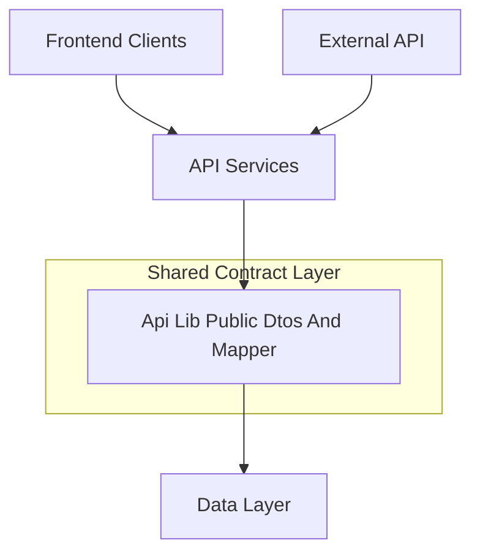
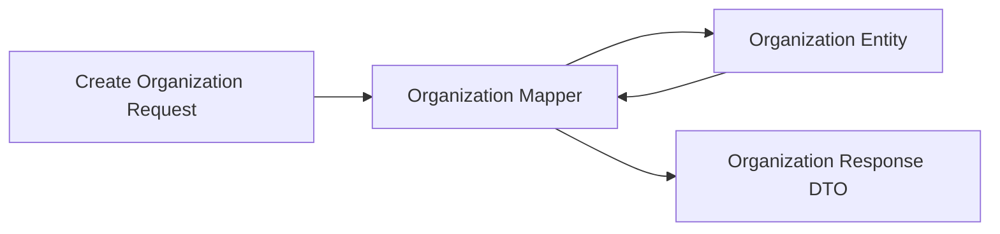
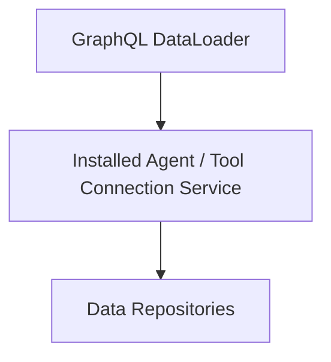

# Api Lib Public Dtos And Mapper

## Overview

The **Api Lib Public Dtos And Mapper** module is a shared library that defines **public-facing Data Transfer Objects (DTOs)**, **filter models**, **pagination helpers**, and **mapping and service utilities** used consistently across OpenFrame API surfaces.

This module acts as a **contract layer** between:
- API services (REST and GraphQL)
- External API services
- Frontend clients
- Internal domain and data layers

By centralizing DTOs and mappers, it ensures:
- Consistent API schemas across services
- Strong separation between persistence models and API contracts
- Reusable filtering, pagination, and list response patterns

---

## Position in the System

Api Lib Public Dtos And Mapper sits between **API services** and the **data layer**, providing stable schemas and mapping logic.

---

## Module Responsibilities

This module is responsible for:

- Defining **public DTOs** for devices, tools, organizations, logs, and events
- Providing **filter option and filter result models** for list and search endpoints
- Supplying **cursor-based pagination inputs** with validation
- Mapping **organization entities** to and from API DTOs
- Offering lightweight **read-oriented services** used by GraphQL DataLoaders
- Providing default processors for extensibility hooks

---

## Core Areas

### 1. Shared Query and Pagination DTOs

#### Counted Generic Query Result

`CountedGenericQueryResult` extends a generic query result by adding a `filteredCount` field. It is commonly used when APIs must return:
- A page of results
- The total number of items matching applied filters

Typical use cases include filtered list views in the UI.

#### Cursor Pagination Input

`CursorPaginationInput` standardizes cursor-based pagination across APIs:
- `limit` is validated to stay within safe bounds
- `cursor` represents the opaque pagination pointer

This DTO is shared across GraphQL and REST endpoints.

---

### 2. Audit and Log DTOs

Audit-related DTOs provide a consistent structure for logs and filtering metadata.

#### Log Event and Details

- **LogEvent** represents a lightweight log entry suitable for lists
- **LogDetails** extends this with full message and detail fields for drill-down views

Both models carry organization, device, tool, and severity context.

#### Log Filters and Filter Options

The module separates:
- **Filter options** (`LogFilterOptions`) used as input criteria
- **Available filter values** (`LogFilters`, `OrganizationFilterOption`) used to populate UI dropdowns

This distinction allows APIs to dynamically compute available filters based on data.

---

### 3. Device Filtering DTOs

Device-related DTOs follow a clear pattern:

- **DeviceFilterOptions** – input constraints (status, type, OS, tags)
- **DeviceFilterOption** and **TagFilterOption** – individual selectable values with counts
- **DeviceFilters** – aggregated response containing options and a filtered count

This structure supports advanced device inventory filtering and faceted search.

---

### 4. Event Filtering DTOs

Event filtering is handled with lightweight DTOs:

- **EventFilterOptions** – includes date ranges and user constraints
- **EventFilters** – exposes available event types and users

These DTOs are commonly used by audit timelines and activity views.

---

### 5. Organization DTOs

Organization DTOs are shared across GraphQL and REST APIs.

#### Organization Response

`OrganizationResponse` is the canonical API representation of an organization and includes:
- Business metadata (category, employees, revenue)
- Contract lifecycle dates
- Contact and address information
- Audit fields such as creation and deletion timestamps

#### Organization List and Filters

- **OrganizationList** wraps organization collections
- **OrganizationFilterOptions** defines internal filtering criteria

---

### 6. Tool DTOs

Tool-related DTOs expose consistent filtering and listing semantics:

- **ToolFilterOptions** – input filters such as category, type, and enabled state
- **ToolFilters** – available filter values
- **ToolList** – wrapper for integrated tool collections

These models are used by both internal APIs and external integrations.

---

## Mapping Logic

### Organization Mapper

`OrganizationMapper` is the central mapping component in this module. It:

- Converts create requests into persistent entities
- Generates immutable organization identifiers
- Applies partial updates safely
- Maps entities into public response DTOs
- Handles deep mapping of nested contact and address structures

Key characteristics:
- Organization identifiers are generated once and never mutated
- Update operations only apply non-null fields
- Mailing address can be derived automatically from physical address

---

## Supporting Services

Although primarily a DTO module, it includes small, focused services used by API layers.

### Installed Agent Service

Provides optimized lookup methods for installed agents:
- Bulk resolution by machine IDs
- Single-machine queries

This service is commonly used by GraphQL DataLoaders to avoid N+1 queries.

### Tool Connection Service

Offers read-only access to tool connection data:
- Bulk lookup grouped by machine
- Single-machine access

Both services focus on **read efficiency** and **batch-friendly APIs**.

---

## Extensibility Hooks

### Default Device Status Processor

`DefaultDeviceStatusProcessor` provides a no-op style implementation that:
- Listens to device status changes
- Logs updates for observability

It is conditionally loaded and can be overridden by custom implementations in downstream services without modifying this module.

---

## Design Principles

- **Separation of concerns**: DTOs are isolated from persistence models
- **Reusability**: Shared across REST, GraphQL, and external APIs
- **Backward compatibility**: Changes are additive and non-breaking where possible
- **Extensibility**: Default processors can be overridden by consumers

---

## Summary

The **Api Lib Public Dtos And Mapper** module is a foundational building block of the OpenFrame platform. It defines the shared language used by APIs, clients, and services, enabling consistent data exchange, flexible filtering, and clean separation between internal models and public contracts.

By centralizing DTO definitions, mapping logic, and lightweight services, it significantly reduces duplication and improves long-term maintainability across the platform.
