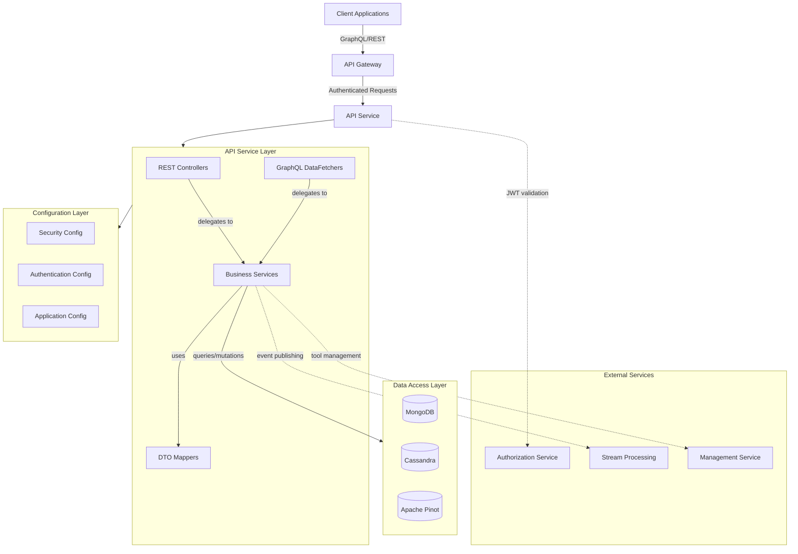
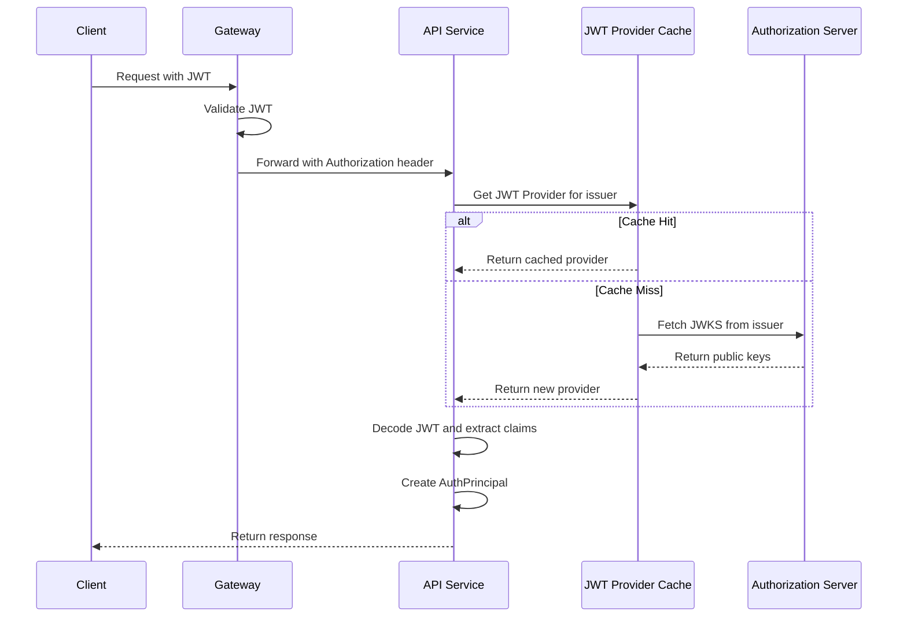
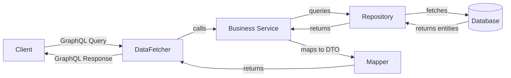
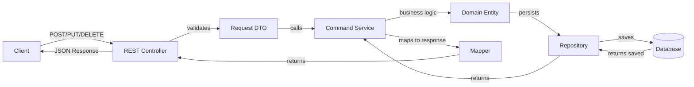
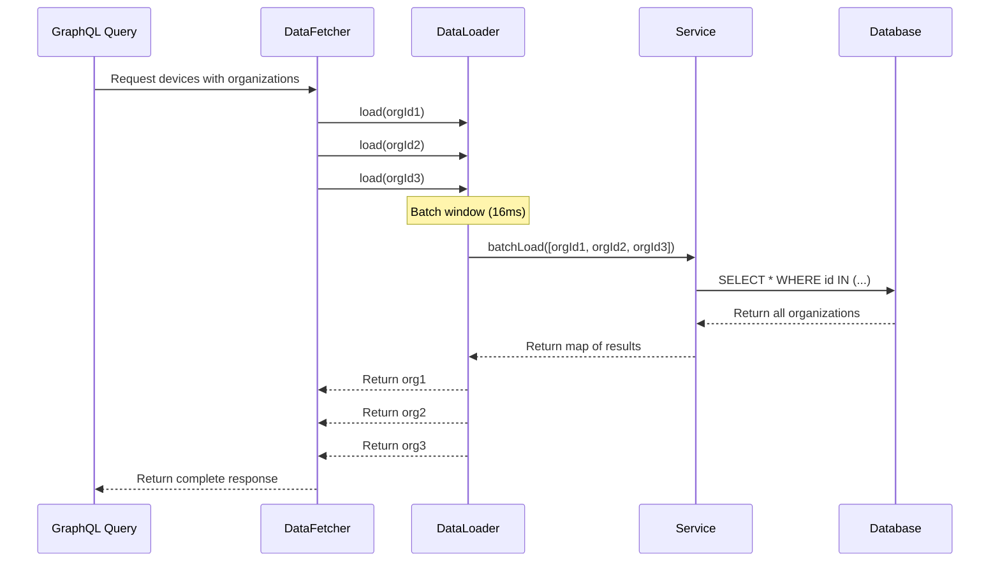

# API Service Module

## Overview

The **API Service** is the primary internal GraphQL and REST API gateway for the OpenFrame platform. It provides a unified interface for querying and mutating data across devices, organizations, users, events, logs, and integrated tools. This service acts as the backend-for-frontend (BFF) layer, orchestrating data access and business logic while delegating authentication and authorization to upstream services.

**Key Responsibilities:**
- GraphQL API for complex queries with filtering, pagination, and search
- REST API for CRUD operations on core entities
- Data aggregation and transformation for frontend consumption
- Integration with MongoDB, Cassandra, and Apache Pinot data layers
- Multi-tenant data isolation and security
- Real-time data fetching with DataLoader batching

**Technology Stack:**
- **Framework:** Spring Boot 3.x
- **API:** Netflix DGS (Domain Graph Service) for GraphQL
- **Security:** Spring Security with OAuth2 Resource Server
- **Data Access:** Spring Data MongoDB, Cassandra, Pinot
- **Caching:** Caffeine for JWT provider caching
- **Validation:** Jakarta Bean Validation

---

## Architecture Overview

The API Service follows a layered architecture with clear separation of concerns:



---

## Module Structure

The API Service is organized into the following sub-modules:

### 1. [Configuration Layer](./api_service_configuration.md)
Handles application-wide configuration including security, authentication, and bean definitions.

**Core Components:**
- `ApiApplicationConfig` - Application-level bean configuration
- `AuthenticationConfig` - Custom authentication argument resolvers
- `SecurityConfig` - OAuth2 Resource Server and JWT validation

### 2. [REST Controllers](./api_service_rest_controllers.md)
Provides RESTful endpoints for CRUD operations on core entities.

**Core Components:**
- `DeviceController` - Device status management
- `OrganizationController` - Organization CRUD operations
- `UserController` - User management and profile operations

### 3. [GraphQL DataFetchers](./api_service_graphql_datafetchers.md)
Implements GraphQL queries and mutations with advanced filtering and pagination.

**Core Components:**
- `DeviceDataFetcher` - Device queries with filtering and relationships
- `EventDataFetcher` - Event queries and mutations
- `LogDataFetcher` - Audit log queries with time-series data
- `OrganizationDataFetcher` - Organization queries
- `ToolsDataFetcher` - Integrated tool queries

### 4. [Application Entry Point](./api_service_application.md)
Bootstrap configuration and component scanning setup.

**Core Components:**
- `ApiApplication` - Spring Boot application entry point

---

## Key Features

### 1. GraphQL API with Netflix DGS

The API Service uses Netflix DGS framework to provide a powerful GraphQL API:

- **Type-safe schema-first development**
- **Automatic DataLoader batching** for N+1 query prevention
- **Custom scalar types** for dates, JSON, and cursors
- **Input validation** with Jakarta Bean Validation
- **Error handling** with custom error codes

**Example Query:**
```graphql
query GetDevices($filter: DeviceFilterInput, $pagination: CursorPaginationInput) {
  devices(filter: $filter, pagination: $pagination) {
    totalCount
    edges {
      node {
        machineId
        hostname
        status
        organization {
          name
        }
        installedAgents {
          agentType
          version
        }
      }
      cursor
    }
    pageInfo {
      hasNextPage
      hasPreviousPage
      startCursor
      endCursor
    }
  }
}
```

### 2. Cursor-Based Pagination

All list queries support cursor-based pagination for efficient data traversal:

- **Forward pagination** with `first` and `after`
- **Backward pagination** with `last` and `before`
- **Total count** for UI pagination controls
- **Stable cursors** across data mutations

### 3. Advanced Filtering

Multi-dimensional filtering with AND/OR logic:

- **Field-specific filters** (status, type, date ranges)
- **Search across multiple fields** with full-text search
- **Dynamic filter options** based on current data
- **Filter aggregations** for faceted search UI

### 4. Multi-Tenant Data Isolation

Automatic tenant context injection:

- **JWT-based tenant identification**
- **Tenant-scoped database queries**
- **Cross-tenant data prevention**
- **Tenant-specific configuration**

### 5. DataLoader Batching

Efficient data loading with automatic batching:

- **Organization batching** for device queries
- **Tag batching** for device metadata
- **Tool connection batching** for integration status
- **Installed agent batching** for agent information

---

## Security Architecture

### JWT Validation Flow



### Security Configuration

The API Service implements a **minimal security configuration** because the Gateway handles most authentication/authorization:

**Gateway Responsibilities:**
- JWT validation and filtering
- PermitAll path handling
- Cookie-to-header conversion
- Rate limiting and throttling

**API Service Responsibilities:**
- OAuth2 Resource Server configuration
- JWT issuer resolution with caching
- `@AuthenticationPrincipal` support
- Tenant context extraction

**Configuration Highlights:**
```java
@Bean
public SecurityFilterChain securityFilterChain(HttpSecurity http) {
    return http
        .csrf(AbstractHttpConfigurer::disable)
        .authorizeHttpRequests(auth -> auth.anyRequest().permitAll())
        .oauth2ResourceServer(oauth2 -> 
            oauth2.authenticationManagerResolver(issuerResolver))
        .build();
}
```

---

## Data Flow Patterns

### 1. GraphQL Query Flow



### 2. REST Mutation Flow



### 3. DataLoader Batching Flow



---

## Integration Points

### Upstream Dependencies

| Service | Purpose | Communication |
|---------|---------|---------------|
| **Gateway Service** | Request routing, authentication | HTTP/REST |
| **Authorization Service** | JWT validation, JWKS endpoint | HTTP/REST |
| **Management Service** | Tool configuration, health checks | Internal API |
| **Stream Processing** | Event publishing, CDC events | Kafka |

### Downstream Dependencies

| Data Store | Purpose | Access Pattern |
|------------|---------|----------------|
| **MongoDB** | Primary data store for entities | Spring Data MongoDB |
| **Cassandra** | Time-series data for logs | Spring Data Cassandra |
| **Apache Pinot** | Real-time analytics queries | JDBC/REST API |
| **Kafka** | Event streaming and CDC | Spring Kafka |

### Related Modules

- **[Gateway Service](./gateway_service.md)** - Routes requests to API Service
- **[Authorization Service](./authorization_service.md)** - Provides JWT validation
- **[Data Layer (MongoDB)](./data_layer_mongo.md)** - Entity repositories and documents
- **[Data Layer (Core)](./data_layer_core.md)** - Cassandra and Pinot repositories
- **[External API](./external_api.md)** - Public-facing API endpoints
- **[Security Core](./security_core.md)** - Shared security utilities

---

## Configuration

### Application Properties

**Key Configuration Properties:**

```yaml
# JWT Provider Caching
openframe.security.jwt.cache:
  expire-after: 1h
  refresh-after: 30m
  maximum-size: 100

# GraphQL Configuration
dgs:
  graphql:
    path: /graphql
    schema-locations: classpath*:schema/**/*.graphqls
    
# Data Source Configuration
spring:
  data:
    mongodb:
      uri: ${MONGODB_URI}
      database: ${MONGODB_DATABASE}
    cassandra:
      keyspace-name: ${CASSANDRA_KEYSPACE}
      contact-points: ${CASSANDRA_CONTACT_POINTS}

# Pinot Configuration
pinot:
  broker-url: ${PINOT_BROKER_URL}
  controller-url: ${PINOT_CONTROLLER_URL}
```

### Environment Variables

| Variable | Description | Default |
|----------|-------------|---------|
| `MONGODB_URI` | MongoDB connection string | `mongodb://localhost:27017` |
| `MONGODB_DATABASE` | Database name | `openframe` |
| `CASSANDRA_CONTACT_POINTS` | Cassandra nodes | `localhost:9042` |
| `CASSANDRA_KEYSPACE` | Keyspace name | `openframe` |
| `PINOT_BROKER_URL` | Pinot broker endpoint | `http://localhost:8099` |
| `JWT_ISSUER_URI` | Authorization server URL | `http://localhost:9000` |

---

## API Endpoints

### REST Endpoints

| Method | Path | Description | Auth Required |
|--------|------|-------------|---------------|
| `PATCH` | `/devices/{machineId}` | Update device status | Yes |
| `POST` | `/organizations` | Create organization | Yes |
| `PUT` | `/organizations/{id}` | Update organization | Yes |
| `DELETE` | `/organizations/{id}` | Delete organization | Yes |
| `GET` | `/users` | List users (paginated) | Yes |
| `GET` | `/users/{id}` | Get user by ID | Yes |
| `PUT` | `/users/{id}` | Update user | Yes |
| `DELETE` | `/users/{id}` | Soft delete user | Yes |

### GraphQL Endpoints

| Type | Operation | Description |
|------|-----------|-------------|
| **Query** | `devices` | List devices with filtering and pagination |
| **Query** | `device` | Get single device by machineId |
| **Query** | `deviceFilters` | Get available filter options |
| **Query** | `events` | List events with filtering |
| **Query** | `eventById` | Get single event by ID |
| **Query** | `eventFilters` | Get available event filters |
| **Query** | `logs` | List audit logs with filtering |
| **Query** | `logDetails` | Get detailed log entry |
| **Query** | `logFilters` | Get available log filters |
| **Query** | `organizations` | List organizations |
| **Query** | `organization` | Get organization by ID |
| **Query** | `integratedTools` | List integrated tools |
| **Query** | `toolFilters` | Get available tool filters |
| **Mutation** | `createEvent` | Create new event |
| **Mutation** | `updateEvent` | Update existing event |

---

## Error Handling

### REST Error Responses

```json
{
  "timestamp": "2024-01-15T10:30:00Z",
  "status": 404,
  "error": "Not Found",
  "message": "Organization not found with ID: 123",
  "path": "/organizations/123"
}
```

### GraphQL Error Responses

```json
{
  "errors": [
    {
      "message": "Validation failed for argument [filter]",
      "locations": [{"line": 2, "column": 3}],
      "path": ["devices"],
      "extensions": {
        "classification": "ValidationError",
        "field": "filter.status",
        "rejectedValue": "INVALID_STATUS"
      }
    }
  ],
  "data": null
}
```

---

## Performance Considerations

### Caching Strategy

1. **JWT Provider Cache** - Caffeine cache for JWT decoders (1 hour TTL)
2. **DataLoader Batching** - Automatic batching with 16ms window
3. **Query Result Caching** - Application-level caching for filter options

### Query Optimization

1. **Cursor-based pagination** - Efficient for large datasets
2. **Field-level filtering** - Push filters to database layer
3. **Projection optimization** - Only fetch requested GraphQL fields
4. **Index usage** - Proper indexing on filter fields

### Monitoring Metrics

- GraphQL query execution time
- DataLoader batch sizes and hit rates
- JWT cache hit/miss rates
- Database query performance
- API endpoint response times

---

## Development Guidelines

### Adding New GraphQL Queries

1. **Define schema** in `src/main/resources/schema/*.graphqls`
2. **Create DataFetcher** class with `@DgsQuery` annotation
3. **Implement service layer** for business logic
4. **Add DataLoader** if batching is needed
5. **Write integration tests** for the query

**Example:**
```java
@DgsComponent
public class MyDataFetcher {
    
    @DgsQuery
    public MyEntity myQuery(@InputArgument String id) {
        return myService.findById(id);
    }
}
```

### Adding New REST Endpoints

1. **Create controller** class with `@RestController`
2. **Define request/response DTOs** with validation
3. **Implement service layer** for business logic
4. **Add mapper** for DTO conversion
5. **Write unit and integration tests**

**Example:**
```java
@RestController
@RequestMapping("/my-resource")
public class MyController {
    
    @PostMapping
    @ResponseStatus(HttpStatus.CREATED)
    public MyResponse create(@Valid @RequestBody MyRequest request) {
        return myService.create(request);
    }
}
```

---

## Testing

### Unit Testing

```java
@ExtendWith(MockitoExtension.class)
class DeviceServiceTest {
    
    @Mock
    private DeviceRepository deviceRepository;
    
    @InjectMocks
    private DeviceService deviceService;
    
    @Test
    void shouldUpdateDeviceStatus() {
        // Test implementation
    }
}
```

### Integration Testing

```java
@SpringBootTest
@AutoConfigureGraphQlTester
class DeviceDataFetcherIntegrationTest {
    
    @Autowired
    private GraphQlTester graphQlTester;
    
    @Test
    void shouldFetchDevices() {
        graphQlTester.documentName("devices")
            .execute()
            .path("devices.edges")
            .entityList(Device.class)
            .hasSize(10);
    }
}
```

---

## Deployment

### Docker Configuration

```dockerfile
FROM eclipse-temurin:21-jre-alpine
WORKDIR /app
COPY target/openframe-api-*.jar app.jar
EXPOSE 8080
ENTRYPOINT ["java", "-jar", "app.jar"]
```

### Kubernetes Deployment

```yaml
apiVersion: apps/v1
kind: Deployment
metadata:
  name: openframe-api
spec:
  replicas: 3
  selector:
    matchLabels:
      app: openframe-api
  template:
    metadata:
      labels:
        app: openframe-api
    spec:
      containers:
      - name: api
        image: openframe/api:latest
        ports:
        - containerPort: 8080
        env:
        - name: MONGODB_URI
          valueFrom:
            secretKeyRef:
              name: mongodb-secret
              key: uri
```

---

## Troubleshooting

### Common Issues

**Issue: JWT validation fails**
- **Cause:** Issuer URI not reachable or JWKS endpoint down
- **Solution:** Check `JWT_ISSUER_URI` configuration and network connectivity

**Issue: GraphQL query returns null for nested fields**
- **Cause:** DataLoader not registered or batch function not implemented
- **Solution:** Verify DataLoader registration in DGS configuration

**Issue: Slow query performance**
- **Cause:** Missing database indexes or inefficient filters
- **Solution:** Add indexes on filter fields and optimize query patterns

**Issue: 401 Unauthorized on all requests**
- **Cause:** Gateway not forwarding Authorization header
- **Solution:** Check Gateway configuration and JWT extraction logic

---

## Related Documentation

- [Gateway Service](./gateway_service.md) - Request routing and authentication
- [Authorization Service](./authorization_service.md) - OAuth2 and JWT management
- [Data Layer (MongoDB)](./data_layer_mongo.md) - Entity models and repositories
- [External API](./external_api.md) - Public-facing REST API
- [Security Core](./security_core.md) - Shared security components

---

## Additional Resources

- **Netflix DGS Documentation:** https://netflix.github.io/dgs/
- **Spring Security OAuth2:** https://docs.spring.io/spring-security/reference/servlet/oauth2/resource-server/index.html
- **GraphQL Best Practices:** https://graphql.org/learn/best-practices/
- **OpenFrame Community:** https://join.slack.com/t/openmsp/shared_invite/zt-36bl7mx0h-3~U2nFH6nqHqoTPXMaHEHA

---

**Last Updated:** 2024-01-15  
**Version:** 1.0.0  
**Maintainers:** OpenFrame Platform Team
