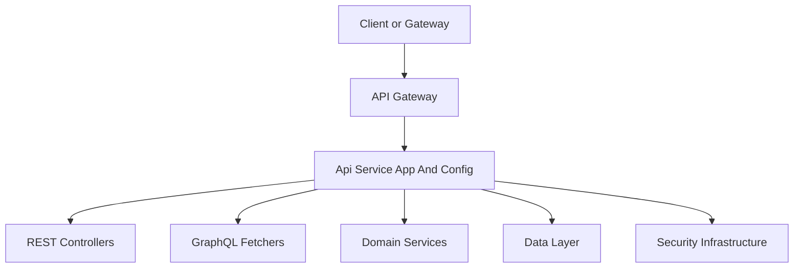
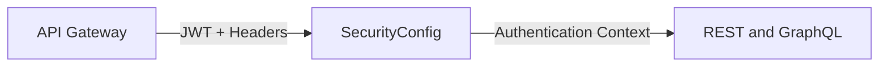

# Api Service App And Config

## Overview

The **Api Service App And Config** module defines the foundational application bootstrap and core configuration for the OpenFrame API service. It is responsible for:

- Bootstrapping the Spring Boot API application
- Registering shared infrastructure beans used across REST controllers and GraphQL fetchers
- Providing minimal, gateway-compatible security configuration
- Initializing required OAuth client data at startup
- Defining GraphQL custom scalar support for date and time handling

This module intentionally avoids business logic. Instead, it establishes a stable runtime and configuration layer on top of which API controllers, GraphQL data fetchers, and domain services operate.

---

## Position in the System Architecture

The Api Service App And Config module sits at the core of the API runtime. It wires together configuration from shared libraries and exposes a fully initialized Spring context used by downstream modules such as REST controllers, GraphQL fetchers, and domain services.

---

## Application Entry Point

### ApiApplication

**ApiApplication** is the Spring Boot entry point for the OpenFrame API service.

**Key responsibilities:**

- Starts the Spring Boot application lifecycle
- Defines component scanning boundaries
- Ensures API, data, core utilities, notifications, and Kafka integrations are loaded

**Component scan scope:**

- API layer
- Shared data layer
- Core utilities and validation
- Notification infrastructure
- Kafka integration

This centralized bootstrap ensures consistent wiring across all API-facing capabilities.

---

## Configuration Components

### ApiApplicationConfig

**Purpose:**
Provides core application-wide beans required by multiple downstream modules.

**Key bean:**

- **PasswordEncoder**
  - Uses BCrypt hashing
  - Shared by authentication, user management, and client-related services

This configuration ensures a single, consistent password encoding strategy across the API service.

---

### AuthenticationConfig

**Purpose:**
Extends Spring MVC configuration to support OpenFrame-specific authentication primitives.

**Key responsibility:**

- Registers a custom argument resolver for authenticated principals

This allows REST controllers to directly receive authenticated user context via method parameters without manual token parsing.

---

### SecurityConfig

**Purpose:**
Defines a minimal Spring Security setup compatible with OpenFrame’s gateway-first security model.

**Design principles:**

- Authentication and authorization are enforced at the Gateway layer
- The API service trusts validated JWTs forwarded by the Gateway
- Local security configuration exists primarily to enable framework-level authentication context

**Key features:**

- OAuth2 Resource Server support
- Dynamic JWT issuer resolution
- Cached JWT authentication providers using Caffeine
- CSRF disabled (handled upstream)
- All requests permitted at the API layer

This setup allows controllers and services to safely rely on authentication context without duplicating gateway logic.

---

### DataInitializer

**Purpose:**
Ensures required OAuth client configuration exists when the API service starts.

**How it works:**

- Runs as a CommandLineRunner during application startup
- Reads default OAuth client credentials from environment properties
- Creates or updates the OAuth client record in persistent storage

**Why this matters:**

- Prevents misconfiguration during fresh deployments
- Ensures consistent OAuth client credentials across environments
- Reduces manual database setup steps

---

### RestTemplateConfig

**Purpose:**
Provides a shared RestTemplate bean for synchronous HTTP calls.

**Usage:**

- Internal service-to-service communication
- External API calls when reactive clients are not required

This avoids repeated RestTemplate instantiation and standardizes HTTP client usage.

---

## GraphQL Scalar Configuration

The Api Service App And Config module defines custom GraphQL scalars to ensure consistent serialization and validation of temporal values.

### DateScalarConfig

**GraphQL scalar:** `Date`

**Format:**

- `yyyy-MM-dd`

**Responsibilities:**

- Serialize Java LocalDate values to GraphQL-compatible strings
- Parse and validate incoming date values
- Enforce strict date formatting

This scalar prevents ambiguous date handling across clients and services.

---

### InstantScalarConfig

**GraphQL scalar:** `Instant`

**Format:**

- ISO-8601 instant representation

**Responsibilities:**

- Serialize Java Instant values
- Parse and validate incoming timestamp strings
- Ensure timezone-safe, unambiguous timestamps

---

## Interaction With Other Modules

The Api Service App And Config module does not implement business logic directly. Instead, it enables and supports other modules, including:

- REST controllers for HTTP-based APIs
- GraphQL fetchers and data loaders
- Domain services and processors
- Shared data repositories and messaging infrastructure

By centralizing application bootstrapping and configuration, this module ensures that all downstream components operate within a consistent, secure, and fully initialized runtime environment.

---

## Summary

The **Api Service App And Config** module is the backbone of the OpenFrame API service. It:

- Starts and wires the API application
- Defines shared infrastructure beans
- Establishes gateway-compatible security behavior
- Initializes required OAuth data
- Provides robust GraphQL scalar handling

This separation of concerns keeps the API service modular, maintainable, and aligned with OpenFrame’s gateway-first architecture.