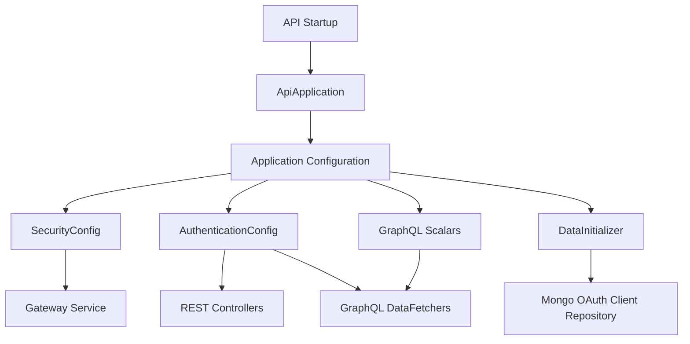

# API Service Application and Configuration

This module represents the **entry point and foundational configuration** for the OpenFrame API service. It is responsible for bootstrapping the Spring Boot application, wiring cross-cutting infrastructure concerns (security, authentication context, HTTP clients), initializing required data, and extending the GraphQL layer with custom scalars.

The API service itself focuses on **business APIs (REST and GraphQL)** and intentionally delegates most authentication and authorization enforcement to the **Gateway service**. This module ensures the API can still resolve authenticated principals, validate JWTs, and expose a consistent runtime environment.

---

## Responsibilities

- Start the OpenFrame API Spring Boot application
- Define global beans shared across REST and GraphQL layers
- Integrate with OAuth2/JWT infrastructure provided by the Gateway
- Register GraphQL custom scalars used across schemas
- Initialize mandatory runtime data (for example default OAuth clients)

---

## High-Level Architecture

---

## Core Components Overview

### ApiApplication

**Component**: `ApiApplication`

- Main Spring Boot entry point
- Defines component scanning across:
  - API layer
  - Data layer
  - Core domain services
  - Kafka and notification infrastructure
- Responsible only for startup orchestration

See: [Configuration and Bootstrap](Configuration and Bootstrap.md)

---

### Application Configuration

This module exposes several Spring `@Configuration` classes that establish baseline infrastructure:

- Password encoding
- Authentication principal resolution
- Security filter chain
- HTTP client configuration
- GraphQL scalar extensions

Each concern is documented in detail in dedicated sub-modules:

- [Configuration and Bootstrap](Configuration and Bootstrap.md)
- [Data Initialization](Data Initialization.md)
- [GraphQL Scalars](GraphQL Scalars.md)
- [HTTP Client Configuration](HTTP Client Configuration.md)

---

### Security Model

The API service uses a **minimal security configuration**:

- All HTTP requests are permitted at this layer
- JWT validation is enabled only to support `@AuthenticationPrincipal`
- Issuer-based JWT decoding is cached for performance

> **Important**: Authorization decisions are enforced at the **Gateway service**, not here.

For broader context, refer to the *Gateway Service Application and Security* documentation.

---

### Data Initialization

At startup, the API service ensures required OAuth client records exist:

- Reads default OAuth client ID and secret from environment properties
- Creates or updates the client record in MongoDB
- Ensures password and refresh-token grants are available

This guarantees that downstream OAuth flows function correctly even in fresh deployments.

---

## Relationship to Other Modules

- **Gateway Service**: Performs request authentication, authorization, and header enrichment
- **Authorization Server**: Issues JWTs consumed by this API
- **GraphQL Layer**: Relies on custom scalars registered here
- **Data Layer**: Used by initializers and downstream services

This module intentionally stays **thin** and avoids business logic, which lives in:

- REST Controllers
- GraphQL DataFetchers
- Core Domain Services

---

## Summary

The `api_service_app_and_config` module forms the **foundation of the OpenFrame API runtime**. It:

- Boots the application
- Defines shared infrastructure beans
- Bridges security context from the Gateway
- Extends GraphQL with domain-friendly scalar types
- Prepares required OAuth data at startup

All higher-level API behavior builds on top of the guarantees established here.
