# API Service Application

The **API Service Application** is the main entry point and bootstrap component for OpenFrame's internal API service. It provides both REST and GraphQL endpoints for managing core platform entities including devices, organizations, users, events, and logs. This service acts as the primary internal API gateway for the OpenFrame platform, enabling secure, multi-tenant access to platform resources.

---

## Table of Contents

1. [Overview](#overview)
2. [Architecture](#architecture)
3. [Core Components](#core-components)
4. [Configuration](#configuration)
5. [Security Model](#security-model)
6. [API Interfaces](#api-interfaces)
7. [Data Flow](#data-flow)
8. [Integration Points](#integration-points)
9. [Deployment](#deployment)
10. [Related Modules](#related-modules)

---

## Overview

### Purpose

The API Service Application serves as the **internal API layer** for the OpenFrame platform, providing:

- **Dual API Paradigms**: REST endpoints for simple CRUD operations and GraphQL for complex queries
- **Multi-Tenant Security**: JWT-based authentication with dynamic issuer resolution
- **Resource Management**: Centralized access to devices, organizations, users, tools, events, and logs
- **Data Aggregation**: GraphQL DataLoaders for efficient N+1 query resolution
- **Internal Service Communication**: Secure API for inter-service communication within the OpenFrame ecosystem

### Key Capabilities

| Capability | Description |
|------------|-------------|
| **REST API** | Traditional REST endpoints for device status updates, organization management, and user CRUD operations |
| **GraphQL API** | Flexible query interface with filtering, pagination, and nested data fetching |
| **JWT Authentication** | Multi-issuer JWT validation with caching for performance |
| **Multi-Tenancy** | Tenant-aware data access and isolation |
| **Data Federation** | Aggregates data from MongoDB, Cassandra, and Apache Pinot |
| **Real-time Updates** | Integration with Kafka for event-driven updates |

### Technology Stack

```text
Framework:        Spring Boot 3.x
API Paradigms:    REST (Spring MVC) + GraphQL (Netflix DGS)
Security:         Spring Security OAuth2 Resource Server
Authentication:   JWT with dynamic issuer resolution
Caching:          Caffeine (JWT provider cache)
Data Access:      Spring Data MongoDB, Cassandra, Pinot
Messaging:        Apache Kafka
Observability:    SLF4J/Logback
```

---

## Architecture

### High-Level Architecture

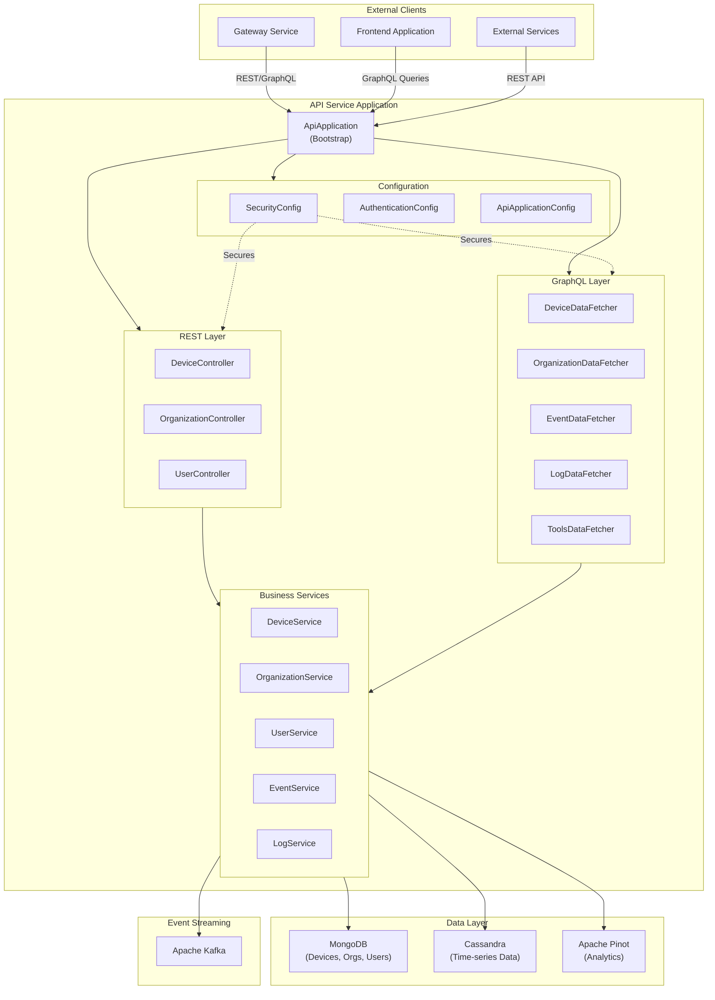

### Component Interaction Flow

```mermaid
flowchart LR
    subgraph Request["Request Processing"]
        REQ["HTTP Request"]
        JWT["JWT Token"]
    end

    subgraph Security["Security Layer"]
        FILTER["Security Filter Chain"]
        RESOLVER["JWT Issuer Resolver"]
        CACHE["JWT Provider Cache"]
        VALIDATOR["JWT Validator"]
    end

    subgraph Controller["Controller Layer"]
        REST_CTRL["REST Controllers"]
        GQL_CTRL["GraphQL DataFetchers"]
    end

    subgraph Service["Service Layer"]
        BIZ["Business Services"]
        MAPPER["Data Mappers"]
    end

    subgraph Data["Data Access"]
        REPO["Repositories"]
        DB["Databases"]
    end

    REQ --> FILTER
    JWT --> FILTER
    FILTER --> RESOLVER
    RESOLVER --> CACHE
    CACHE --> VALIDATOR
    VALIDATOR --> Controller

    Controller --> REST_CTRL
    Controller --> GQL_CTRL

    REST_CTRL --> BIZ
    GQL_CTRL --> BIZ

    BIZ --> MAPPER
    MAPPER --> REPO
    REPO --> DB
```

---

## Core Components

### 1. ApiApplication (Bootstrap)

**Location**: `com.openframe.api.ApiApplication`

The main Spring Boot application class that bootstraps the API service.

**Key Responsibilities**:
- Application initialization and startup
- Component scanning across multiple packages
- Spring context configuration

**Component Scanning Strategy**:

```java
@ComponentScan(basePackages = {
    "com.openframe.api",          // API controllers and datafetchers
    "com.openframe.data",         // Data layer (MongoDB, Cassandra, Pinot)
    "com.openframe.core",         // Core business logic
    "com.openframe.notification", // Notification services
    "com.openframe.kafka"         // Kafka integration
})
```

**Startup Flow**:

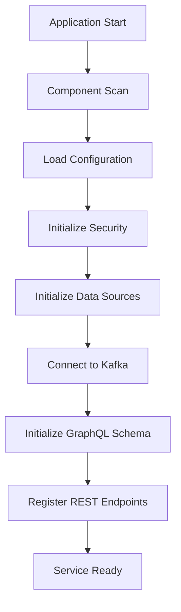

### 2. Configuration Components

For detailed configuration documentation, see [API Service Configuration](api_service_configuration.md).

**Key Configuration Classes**:

| Component | Purpose | Key Features |
|-----------|---------|--------------|
| **SecurityConfig** | JWT authentication and authorization | Multi-issuer JWT validation, Caffeine caching, OAuth2 resource server |
| **AuthenticationConfig** | Custom authentication resolvers | `AuthPrincipal` argument resolver for controllers |
| **ApiApplicationConfig** | General application beans | BCrypt password encoder |

**Security Configuration Highlights**:

```text
JWT Provider Caching:
- Maximum Size: Configurable (default: 1000 providers)
- Expire After Write: Configurable (default: 1 hour)
- Refresh After Write: Configurable (default: 30 minutes)
- Cache Key: JWT Issuer URL
- Cache Value: JwtAuthenticationProvider instance
```

### 3. REST Controllers

For detailed REST controller documentation, see [API Service REST Controllers](api_service_rest_controllers.md).

**Available Controllers**:

| Controller | Base Path | Purpose |
|------------|-----------|---------|
| **DeviceController** | `/devices` | Device status management |
| **OrganizationController** | `/organizations` | Organization CRUD operations |
| **UserController** | `/users` | User management and profile updates |

**REST API Design Principles**:
- RESTful resource naming
- Standard HTTP status codes
- Request validation with `@Valid`
- Exception handling with `@ResponseStatusException`
- Structured logging for all operations

### 4. GraphQL DataFetchers

For detailed GraphQL datafetcher documentation, see [API Service GraphQL DataFetchers](api_service_graphql_datafetchers.md).

**Available DataFetchers**:

| DataFetcher | Purpose | Key Queries |
|-------------|---------|-------------|
| **DeviceDataFetcher** | Device queries and filtering | `devices`, `device`, `deviceFilters` |
| **OrganizationDataFetcher** | Organization queries | `organizations`, `organization`, `organizationByOrganizationId` |
| **EventDataFetcher** | Event log queries | `events`, event filtering and pagination |
| **LogDataFetcher** | System log queries | `logs`, log search and filtering |
| **ToolsDataFetcher** | Integrated tool queries | `tools`, tool connection status |

**GraphQL Features**:
- Cursor-based pagination
- Advanced filtering with multiple criteria
- DataLoader pattern for N+1 query optimization
- Nested field resolution with batching
- Search functionality across entities

---

## Configuration

### Application Properties

**Required Configuration** (`application.yml`):

```yaml
# Server Configuration
server:
  port: 8080

# Security Configuration
openframe:
  security:
    jwt:
      cache:
        expire-after: 1h
        refresh-after: 30m
        maximum-size: 1000

# Data Source Configuration
spring:
  data:
    mongodb:
      uri: ${MONGODB_URI:mongodb://localhost:27017/openframe}
      database: openframe
    
  cassandra:
    keyspace-name: openframe
    contact-points: ${CASSANDRA_CONTACT_POINTS:localhost}
    port: 9042
    local-datacenter: datacenter1

# Kafka Configuration
spring:
  kafka:
    bootstrap-servers: ${KAFKA_BOOTSTRAP_SERVERS:localhost:9092}
    consumer:
      group-id: api-service
      auto-offset-reset: earliest

# Pinot Configuration
pinot:
  broker:
    url: ${PINOT_BROKER_URL:http://localhost:8099}
```

### Environment Variables

| Variable | Description | Default | Required |
|----------|-------------|---------|----------|
| `MONGODB_URI` | MongoDB connection string | `mongodb://localhost:27017/openframe` | Yes |
| `CASSANDRA_CONTACT_POINTS` | Cassandra contact points | `localhost` | Yes |
| `KAFKA_BOOTSTRAP_SERVERS` | Kafka broker addresses | `localhost:9092` | Yes |
| `PINOT_BROKER_URL` | Apache Pinot broker URL | `http://localhost:8099` | Yes |
| `JWT_CACHE_EXPIRE_AFTER` | JWT provider cache expiration | `1h` | No |
| `JWT_CACHE_MAXIMUM_SIZE` | Maximum cached JWT providers | `1000` | No |

### Component Scan Packages

The application scans the following packages for Spring components:

```text
com.openframe.api          → API controllers, datafetchers, configurations
com.openframe.data         → Data repositories, entities, configurations
com.openframe.core         → Core business services and domain logic
com.openframe.notification → Notification services (email, webhooks)
com.openframe.kafka        → Kafka producers, consumers, stream processors
```

---

## Security Model

### Authentication Flow

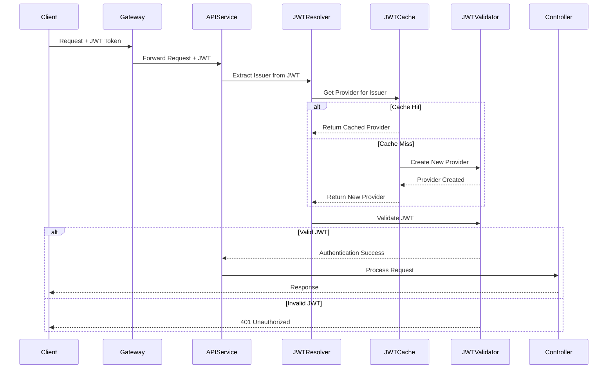

### Multi-Issuer JWT Support

The API service supports **dynamic JWT issuer resolution**, allowing authentication from multiple OAuth2 authorization servers:

**Supported Issuers**:
- OpenFrame Authorization Service (primary)
- External OAuth2 providers (configurable)
- Development/testing issuers

**Issuer Resolution Process**:

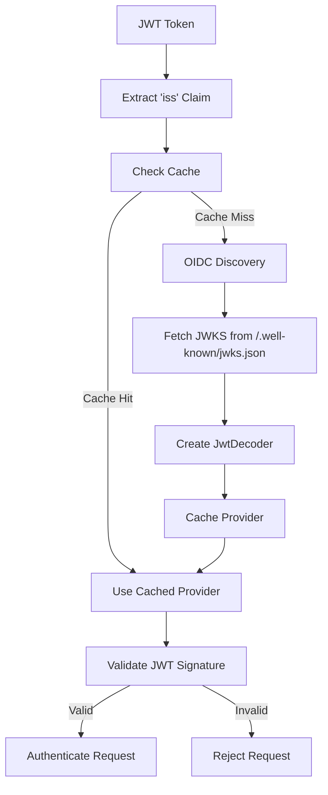

### Authorization Model

**Current Implementation**: Permissive (all authenticated requests allowed)

```java
.authorizeHttpRequests(auth -> auth
    .anyRequest().permitAll()
)
```

**Future Enhancement**: Role-based access control (RBAC) with tenant isolation

```text
Planned Authorization Rules:
- ADMIN: Full access to all resources
- ORG_ADMIN: Access to organization-scoped resources
- USER: Access to user-scoped resources
- AGENT: Access to device-scoped resources
```

### AuthPrincipal Resolution

The `AuthenticationConfig` registers a custom argument resolver for extracting authenticated user information:

```java
@Override
public void addArgumentResolvers(List<HandlerMethodArgumentResolver> resolvers) {
    resolvers.add(new AuthPrincipalArgumentResolver());
}
```

**Usage in Controllers**:

```java
@DeleteMapping("/{id}")
public void deleteUser(@PathVariable String id,
                       @AuthenticationPrincipal AuthPrincipal principal) {
    userService.softDeleteUser(id, principal.getId());
}
```

**AuthPrincipal Fields**:
- `id`: User ID from JWT subject claim
- `tenantId`: Tenant/organization ID
- `roles`: User roles and permissions
- `email`: User email address

---

## API Interfaces

### REST API Endpoints

#### Device Management

```text
PATCH /devices/{machineId}
  Description: Update device status
  Request Body: { "status": "ONLINE" | "OFFLINE" | "MAINTENANCE" }
  Response: 204 No Content
  Authentication: Required
```

#### Organization Management

```text
POST /organizations
  Description: Create new organization
  Request Body: CreateOrganizationRequest
  Response: 201 Created, OrganizationResponse
  Authentication: Required

PUT /organizations/{id}
  Description: Update organization
  Request Body: UpdateOrganizationRequest
  Response: 200 OK, OrganizationResponse
  Authentication: Required

DELETE /organizations/{id}
  Description: Delete organization
  Response: 204 No Content
  Error: 409 Conflict if organization has machines
  Authentication: Required
```

#### User Management

```text
GET /users
  Description: List users with pagination
  Query Params: page (default: 0), size (default: 20)
  Response: 200 OK, UserPageResponse
  Authentication: Required

GET /users/{id}
  Description: Get user by ID
  Response: 200 OK, UserResponse
  Error: 404 Not Found
  Authentication: Required

PUT /users/{id}
  Description: Update user
  Request Body: UpdateUserRequest
  Response: 200 OK, UserResponse
  Authentication: Required

DELETE /users/{id}
  Description: Soft delete user
  Response: 204 No Content
  Authentication: Required
```

### GraphQL API Schema

#### Device Queries

```graphql
type Query {
  # Get paginated devices with filtering
  devices(
    filter: DeviceFilterInput
    pagination: CursorPaginationInput
    search: String
  ): DeviceConnection!

  # Get single device by machine ID
  device(machineId: String!): Machine

  # Get available filter options
  deviceFilters(filter: DeviceFilterInput): DeviceFilters!
}

type Machine {
  id: ID!
  machineId: String!
  hostname: String
  status: DeviceStatus!
  organizationId: String
  organization: Organization
  tags: [Tag!]!
  toolConnections: [ToolConnection!]!
  installedAgents: [InstalledAgent!]!
  createdAt: DateTime!
  updatedAt: DateTime!
}
```

#### Organization Queries

```graphql
type Query {
  # Get paginated organizations with filtering
  organizations(
    filter: OrganizationFilterInput
    pagination: CursorPaginationInput
    search: String
  ): OrganizationConnection!

  # Get organization by internal ID
  organization(id: String!): Organization

  # Get organization by external organization ID
  organizationByOrganizationId(organizationId: String!): Organization
}

type Organization {
  id: ID!
  organizationId: String!
  name: String!
  description: String
  createdAt: DateTime!
  updatedAt: DateTime!
}
```

#### Event and Log Queries

```graphql
type Query {
  # Get paginated events
  events(
    filter: EventFilterInput
    pagination: CursorPaginationInput
  ): EventConnection!

  # Get paginated logs
  logs(
    filter: LogFilterInput
    pagination: CursorPaginationInput
    search: String
  ): LogConnection!
}
```

#### Tools Queries

```graphql
type Query {
  # Get integrated tools
  tools(
    filter: ToolFilterInput
    pagination: CursorPaginationInput
  ): ToolConnection!
}
```

### GraphQL DataLoader Pattern

The API service uses **Netflix DGS DataLoaders** to optimize N+1 query problems:

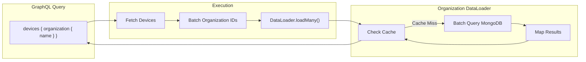

**Registered DataLoaders**:
- `tagDataLoader`: Batch load device tags
- `toolConnectionDataLoader`: Batch load tool connections
- `installedAgentDataLoader`: Batch load installed agents
- `organizationDataLoader`: Batch load organizations

---

## Data Flow

### REST Request Flow

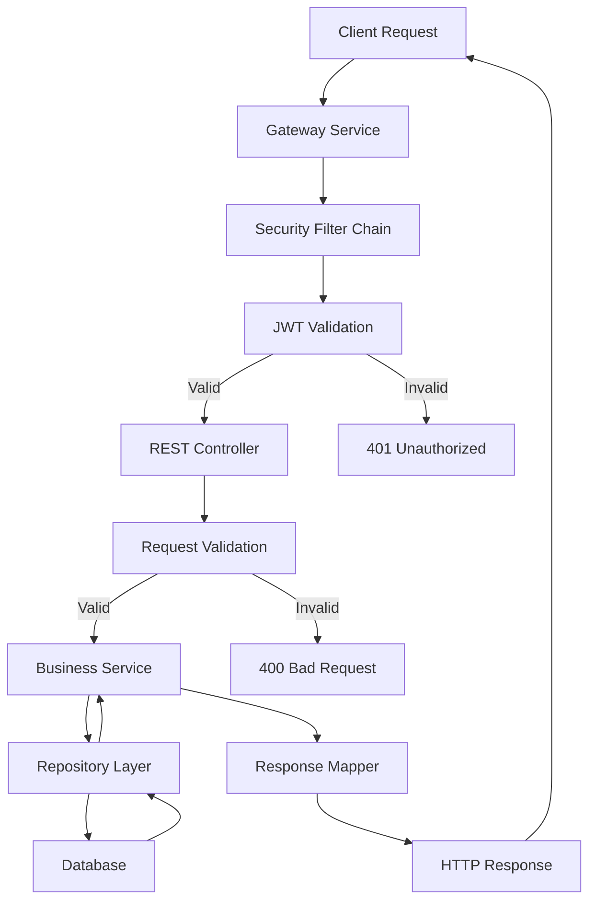

### GraphQL Query Flow

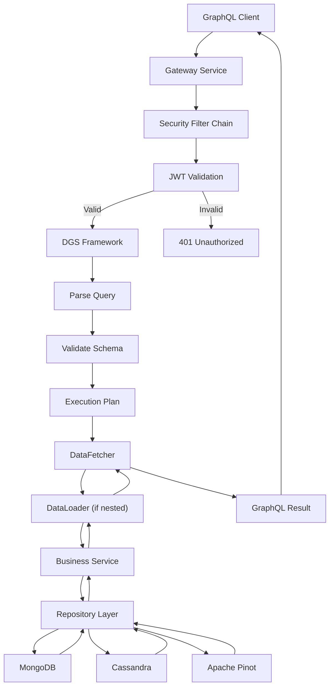

### Event-Driven Updates

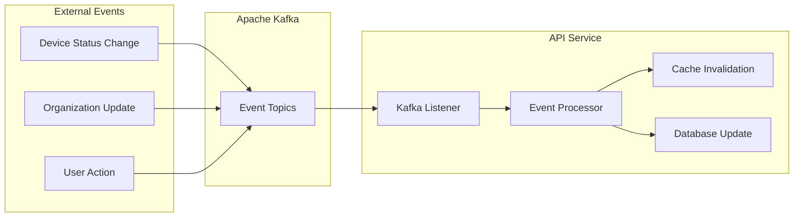

---

## Integration Points

### Upstream Dependencies

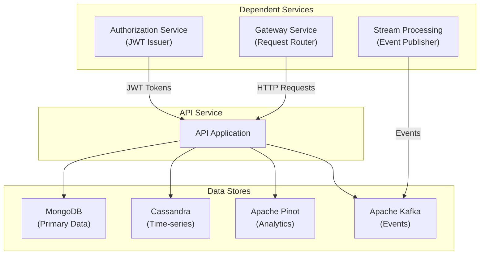

### Downstream Consumers

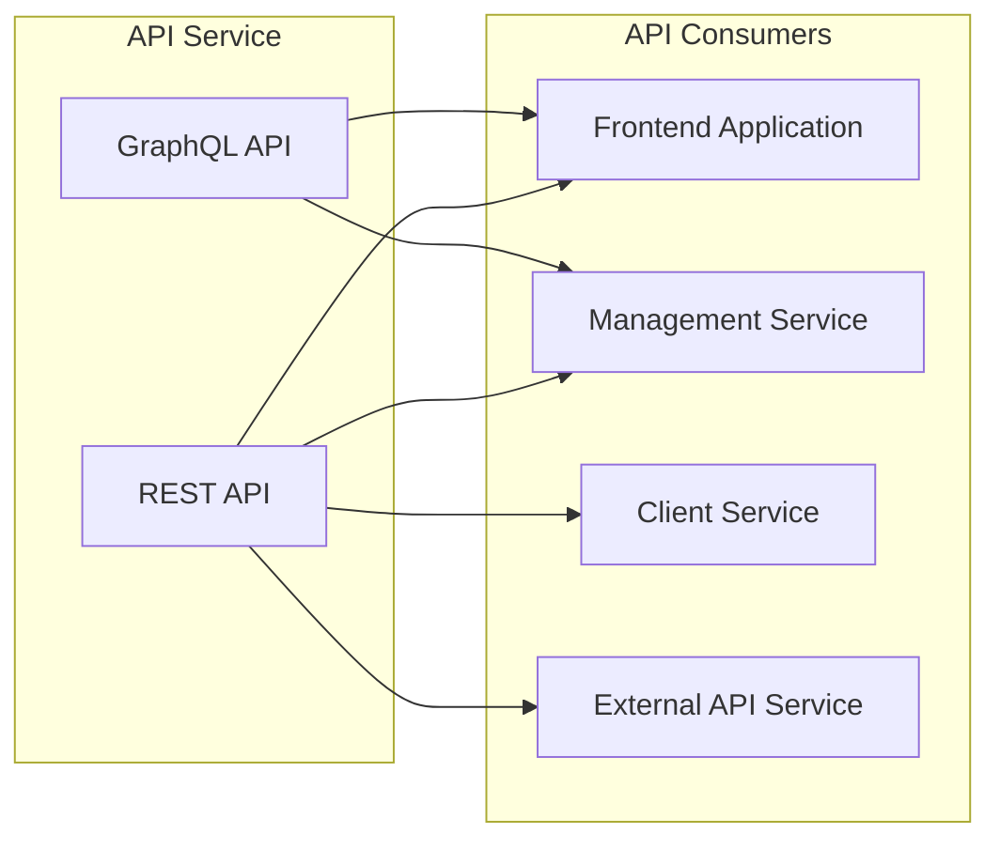

### Related Module Integration

| Module | Integration Type | Purpose |
|--------|------------------|---------|
| [Authorization Service](authorization_service.md) | JWT Provider | Issues JWT tokens for authentication |
| [Gateway Service](gateway_service.md) | API Gateway | Routes requests to API service |
| [Data Layer MongoDB](data_layer_mongo.md) | Data Access | Primary data storage for entities |
| [Data Layer Kafka](data_layer_kafka.md) | Event Streaming | Publishes and consumes domain events |
| [Data Layer Core](data_layer_core.md) | Analytics | Cassandra and Pinot integration |
| [External API](external_api.md) | Public API | Exposes subset of API service functionality |
| [Management Service](management_service.md) | Internal Consumer | Uses API for tool and device management |
| [Client Service](client_service.md) | Internal Consumer | Uses API for device registration |

---

## Deployment

### Container Configuration

**Dockerfile** (example):

```dockerfile
FROM eclipse-temurin:17-jre-alpine

WORKDIR /app

COPY target/openframe-api-*.jar app.jar

EXPOSE 8080

ENV JAVA_OPTS="-Xmx512m -Xms256m"

ENTRYPOINT ["sh", "-c", "java $JAVA_OPTS -jar app.jar"]
```

### Kubernetes Deployment

**Deployment Manifest** (example):

```yaml
apiVersion: apps/v1
kind: Deployment
metadata:
  name: openframe-api
  namespace: openframe
spec:
  replicas: 3
  selector:
    matchLabels:
      app: openframe-api
  template:
    metadata:
      labels:
        app: openframe-api
    spec:
      containers:
      - name: api
        image: openframe/api-service:latest
        ports:
        - containerPort: 8080
          name: http
        env:
        - name: MONGODB_URI
          valueFrom:
            secretKeyRef:
              name: mongodb-credentials
              key: uri
        - name: KAFKA_BOOTSTRAP_SERVERS
          value: "kafka-headless:9092"
        - name: CASSANDRA_CONTACT_POINTS
          value: "cassandra-headless"
        - name: PINOT_BROKER_URL
          value: "http://pinot-broker:8099"
        resources:
          requests:
            memory: "512Mi"
            cpu: "500m"
          limits:
            memory: "1Gi"
            cpu: "1000m"
        livenessProbe:
          httpGet:
            path: /actuator/health/liveness
            port: 8080
          initialDelaySeconds: 60
          periodSeconds: 10
        readinessProbe:
          httpGet:
            path: /actuator/health/readiness
            port: 8080
          initialDelaySeconds: 30
          periodSeconds: 5
---
apiVersion: v1
kind: Service
metadata:
  name: openframe-api
  namespace: openframe
spec:
  selector:
    app: openframe-api
  ports:
  - port: 8080
    targetPort: 8080
    name: http
  type: ClusterIP
```

### Health Checks

**Spring Boot Actuator Endpoints**:

```text
GET /actuator/health          → Overall health status
GET /actuator/health/liveness → Kubernetes liveness probe
GET /actuator/health/readiness → Kubernetes readiness probe
GET /actuator/info            → Application information
GET /actuator/metrics         → Prometheus metrics
```

**Health Indicators**:
- MongoDB connection status
- Cassandra connection status
- Kafka connection status
- Pinot broker availability
- JWT provider cache health

### Scaling Considerations

**Horizontal Scaling**:
- Stateless design allows multiple replicas
- JWT provider cache is instance-local (acceptable for performance)
- No session state stored in application

**Vertical Scaling**:
- Increase heap size for larger JWT provider caches
- Adjust connection pool sizes for databases
- Tune Caffeine cache settings

**Performance Tuning**:

```yaml
# Recommended JVM Options
JAVA_OPTS: >
  -Xmx1g
  -Xms512m
  -XX:+UseG1GC
  -XX:MaxGCPauseMillis=200
  -XX:+HeapDumpOnOutOfMemoryError
  -XX:HeapDumpPath=/tmp/heapdump.hprof

# Recommended Cache Settings
openframe:
  security:
    jwt:
      cache:
        maximum-size: 5000
        expire-after: 2h
        refresh-after: 1h
```

---

## Related Modules

### Configuration and Controllers

- **[API Service Configuration](api_service_configuration.md)**: Security, authentication, and application configuration
- **[API Service REST Controllers](api_service_rest_controllers.md)**: REST endpoint implementations
- **[API Service GraphQL DataFetchers](api_service_graphql_datafetchers.md)**: GraphQL query resolvers

### Security and Authentication

- **[Authorization Service](authorization_service.md)**: OAuth2 authorization server and JWT issuer
- **[Security Core](security_core.md)**: Shared security utilities and JWT configuration
- **[Security OAuth](security_oauth.md)**: OAuth2 client and BFF controller

### Data Access

- **[Data Layer MongoDB](data_layer_mongo.md)**: MongoDB repositories and entities
- **[Data Layer Kafka](data_layer_kafka.md)**: Kafka producers and consumers
- **[Data Layer Core](data_layer_core.md)**: Cassandra and Pinot integration

### Service Integration

- **[Gateway Service](gateway_service.md)**: API gateway and request routing
- **[External API](external_api.md)**: Public-facing API service
- **[Management Service](management_service.md)**: Tool and device management
- **[Client Service](client_service.md)**: Agent registration and heartbeat

---

## Additional Resources

### Development

- **GraphQL Playground**: `http://localhost:8080/graphiql` (when enabled)
- **API Documentation**: `http://localhost:8080/swagger-ui.html` (if Swagger configured)
- **Actuator Endpoints**: `http://localhost:8080/actuator`

### Testing

**Example GraphQL Query**:

```graphql
query GetDevicesWithOrganization {
  devices(
    filter: { status: ONLINE }
    pagination: { first: 10 }
  ) {
    totalCount
    edges {
      node {
        machineId
        hostname
        status
        organization {
          name
          organizationId
        }
        installedAgents {
          agentType
          version
        }
      }
    }
    pageInfo {
      hasNextPage
      endCursor
    }
  }
}
```

**Example REST Request**:

```bash
# Create Organization
curl -X POST http://localhost:8080/organizations \
  -H "Authorization: Bearer $JWT_TOKEN" \
  -H "Content-Type: application/json" \
  -d '{
    "name": "Acme Corp",
    "organizationId": "acme-001",
    "description": "Acme Corporation"
  }'

# Update Device Status
curl -X PATCH http://localhost:8080/devices/machine-123 \
  -H "Authorization: Bearer $JWT_TOKEN" \
  -H "Content-Type: application/json" \
  -d '{"status": "ONLINE"}'
```

### Monitoring

**Key Metrics to Monitor**:
- Request rate and latency (REST and GraphQL)
- JWT validation cache hit rate
- Database connection pool utilization
- Kafka consumer lag
- GraphQL query complexity and execution time
- DataLoader batch sizes and cache hit rates

**Logging Configuration**:

```yaml
logging:
  level:
    com.openframe.api: INFO
    com.openframe.api.controller: DEBUG
    com.openframe.api.datafetcher: DEBUG
    org.springframework.security: DEBUG
    org.springframework.graphql: DEBUG
```

---

## Summary

The **API Service Application** is the central internal API gateway for the OpenFrame platform, providing:

✅ **Dual API Paradigms**: REST for simple operations, GraphQL for complex queries  
✅ **Multi-Tenant Security**: JWT-based authentication with dynamic issuer resolution  
✅ **Efficient Data Access**: DataLoader pattern for optimized database queries  
✅ **Comprehensive Resource Management**: Devices, organizations, users, events, logs, and tools  
✅ **Event-Driven Architecture**: Kafka integration for real-time updates  
✅ **Scalable Design**: Stateless, horizontally scalable, cloud-native

This service acts as the **primary data access layer** for internal OpenFrame services and the frontend application, abstracting the complexity of multi-database queries and providing a unified, secure API interface.

---

**Questions or Issues?**  
For support, join the OpenMSP Slack community: https://www.openmsp.ai/
