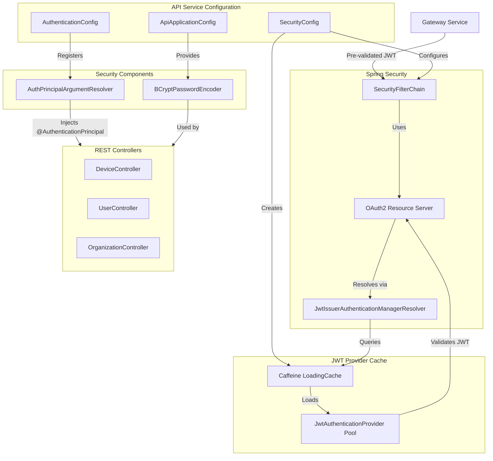
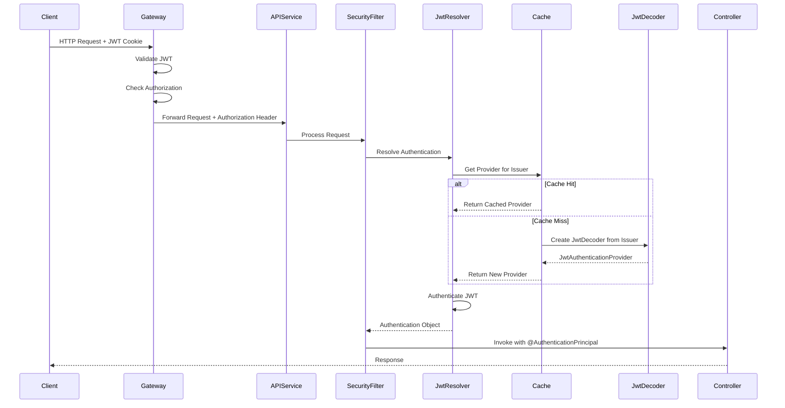
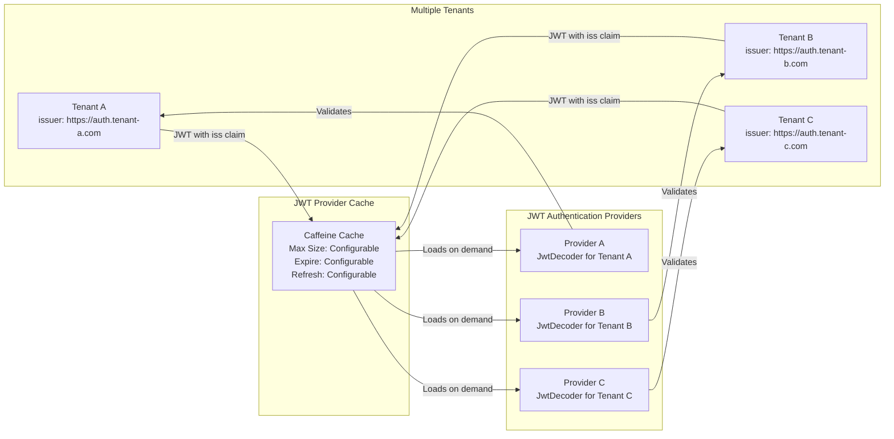
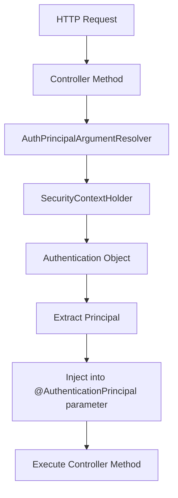
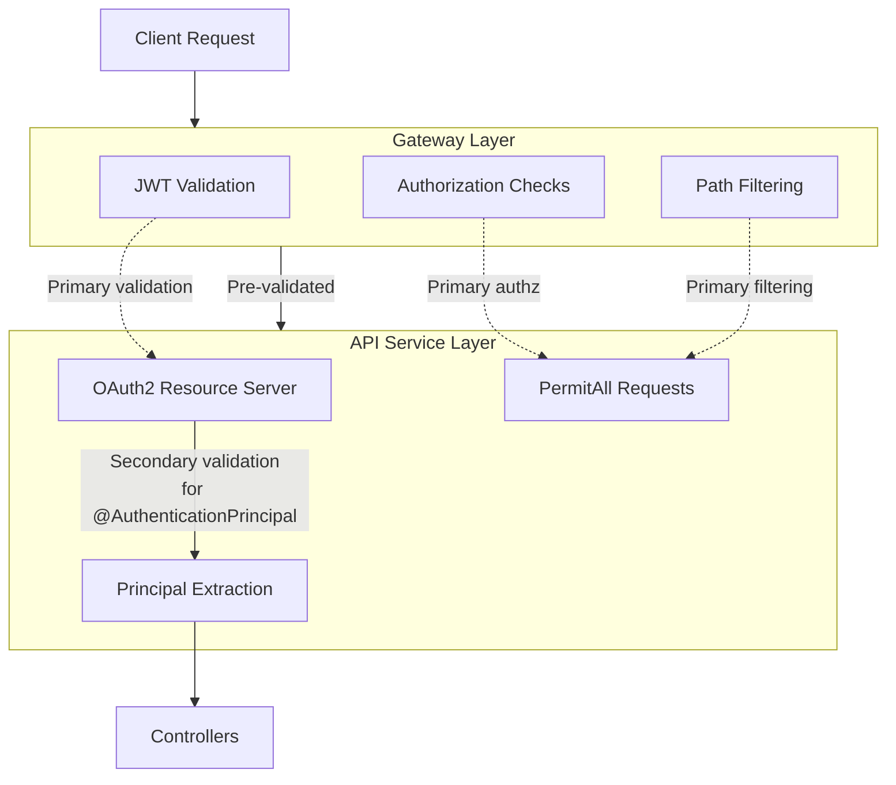
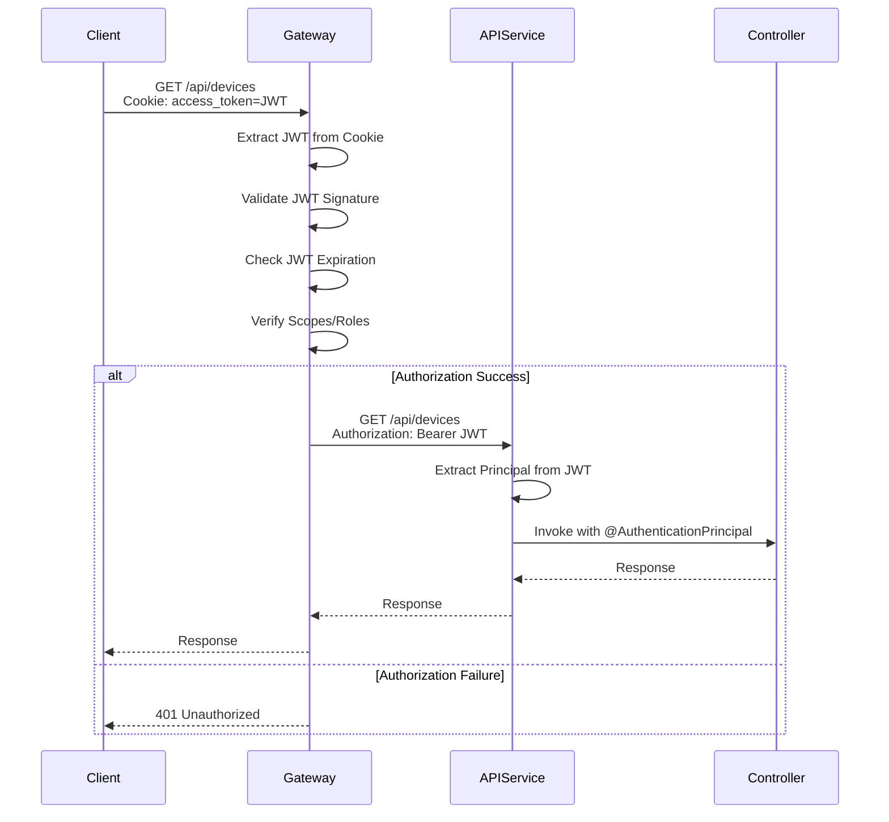
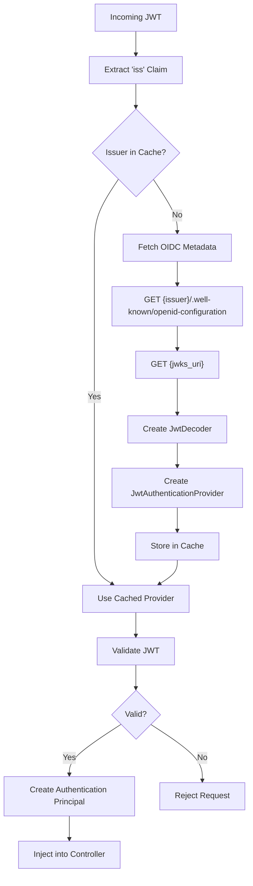
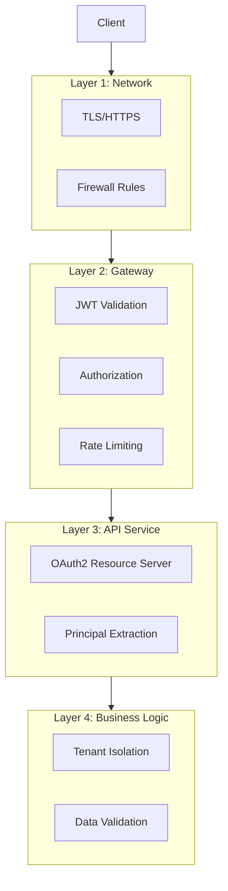

# API Service Configuration Module

## Overview

The **API Service Configuration** module provides the foundational Spring Security and application configuration for the OpenFrame API Service. This module establishes the security infrastructure, authentication mechanisms, and core application beans required for the API service to operate within the OpenFrame ecosystem.

**Key Responsibilities:**
- OAuth2 Resource Server configuration with multi-tenant JWT validation
- Custom authentication principal resolution for controllers
- Password encoding configuration
- JWT provider caching for performance optimization
- Integration with the Gateway service for delegated authentication

**Module Location:** `deps-openframe-oss-lib/openframe-api-service-core/src/main/java/com/openframe/api/config/`

**Related Modules:**
- [Gateway Service](gateway_service.md) - Handles upstream authentication and authorization
- [Security Core](security_core.md) - Provides JWT validation and security utilities
- [Authorization Service](authorization_service.md) - Issues JWT tokens for authentication

---

## Architecture Overview

### Component Architecture



### Security Flow



### Multi-Tenant JWT Validation



---

## Core Components

### 1. ApiApplicationConfig

**Purpose:** Provides core application-level beans for the API service.

**Location:** `com.openframe.api.config.ApiApplicationConfig`

**Key Features:**
- Password encoder bean configuration
- Uses BCrypt hashing algorithm for secure password storage
- Singleton bean shared across the application

**Configuration:**

```java
@Configuration
@RequiredArgsConstructor
@Slf4j
public class ApiApplicationConfig {

    @Bean
    public PasswordEncoder passwordEncoder() {
        return new BCryptPasswordEncoder();
    }
}
```

**Bean Details:**

| Bean | Type | Scope | Purpose |
|------|------|-------|---------|
| `passwordEncoder` | `BCryptPasswordEncoder` | Singleton | Password hashing for user authentication |

**Usage Example:**

```java
@Service
public class UserService {
    
    @Autowired
    private PasswordEncoder passwordEncoder;
    
    public void createUser(String username, String rawPassword) {
        String hashedPassword = passwordEncoder.encode(rawPassword);
        // Save user with hashed password
    }
    
    public boolean validatePassword(String rawPassword, String hashedPassword) {
        return passwordEncoder.matches(rawPassword, hashedPassword);
    }
}
```

**BCrypt Configuration:**
- **Strength:** Default (10 rounds)
- **Algorithm:** BCrypt adaptive hashing
- **Salt:** Automatically generated per password
- **Thread-Safe:** Yes

---

### 2. AuthenticationConfig

**Purpose:** Configures custom argument resolvers for authentication principal injection in controllers.

**Location:** `com.openframe.api.config.AuthenticationConfig`

**Key Features:**
- Registers `AuthPrincipalArgumentResolver` for `@AuthenticationPrincipal` support
- Enables automatic injection of authenticated user details into controller methods
- Implements Spring MVC's `WebMvcConfigurer` interface

**Configuration:**

```java
@Configuration
public class AuthenticationConfig implements WebMvcConfigurer {

    @Override
    public void addArgumentResolvers(List<HandlerMethodArgumentResolver> resolvers) {
        resolvers.add(new AuthPrincipalArgumentResolver());
    }
}
```

**Argument Resolver Flow:**



**Controller Usage Example:**

```java
@RestController
@RequestMapping("/api/users")
public class UserController {
    
    @GetMapping("/me")
    public UserDTO getCurrentUser(@AuthenticationPrincipal AuthPrincipal principal) {
        // principal contains authenticated user information
        String userId = principal.getUserId();
        String tenantId = principal.getTenantId();
        List<String> roles = principal.getRoles();
        
        return userService.getUserById(userId);
    }
    
    @PostMapping("/profile")
    public void updateProfile(
        @AuthenticationPrincipal AuthPrincipal principal,
        @RequestBody ProfileUpdateRequest request
    ) {
        // Automatically inject authenticated user
        userService.updateProfile(principal.getUserId(), request);
    }
}
```

**Benefits:**
- ✅ Type-safe access to authentication details
- ✅ Eliminates boilerplate `SecurityContextHolder.getContext()` calls
- ✅ Consistent authentication handling across controllers
- ✅ Supports custom principal types

---

### 3. SecurityConfig

**Purpose:** Configures Spring Security for OAuth2 Resource Server with multi-tenant JWT validation and caching.

**Location:** `com.openframe.api.config.SecurityConfig`

**Key Features:**
- OAuth2 Resource Server configuration
- Multi-tenant JWT issuer resolution
- Caffeine-based JWT provider caching
- Minimal security (delegates to Gateway)
- Configurable cache parameters

**Configuration Properties:**

```yaml
openframe:
  security:
    jwt:
      cache:
        expire-after: 1h          # Cache entry expiration
        refresh-after: 30m        # Background refresh interval
        maximum-size: 100         # Maximum cached issuers
```

**Security Filter Chain:**

```java
@Bean
public SecurityFilterChain securityFilterChain(
    HttpSecurity http, 
    LoadingCache<String, JwtAuthenticationProvider> jwtProviderCache
) throws Exception {
    JwtIssuerAuthenticationManagerResolver issuerResolver = 
        new JwtIssuerAuthenticationManagerResolver(
            issuer -> jwtProviderCache.get(issuer)::authenticate
        );
    
    return http
        .csrf(AbstractHttpConfigurer::disable)
        .authorizeHttpRequests(auth -> auth
            .anyRequest().permitAll()  // Gateway handles authorization
        )
        .oauth2ResourceServer(oauth2 -> 
            oauth2.authenticationManagerResolver(issuerResolver)
        )
        .build();
}
```

**JWT Provider Cache:**

```java
@Bean
public LoadingCache<String, JwtAuthenticationProvider> jwtProviderCache() {
    return Caffeine.newBuilder()
        .maximumSize(maximumSize)
        .expireAfterWrite(expireAfter)
        .refreshAfterWrite(refreshAfter)
        .build(issuer -> {
            log.info("Creating JwtDecoder for issuer: {}", issuer);
            var decoder = JwtDecoders.fromIssuerLocation(issuer);
            return new JwtAuthenticationProvider(decoder);
        });
}
```

**Cache Behavior:**

| Event | Action | Impact |
|-------|--------|--------|
| **First JWT from Tenant** | Load JwtDecoder from issuer's `/.well-known/openid-configuration` | ~100-500ms latency |
| **Subsequent JWTs** | Use cached JwtAuthenticationProvider | <1ms latency |
| **After `refresh-after`** | Background refresh of provider | No request latency |
| **After `expire-after`** | Evict and reload on next request | ~100-500ms latency |
| **Cache Full** | Evict least recently used issuer | Automatic |

**Security Design Principles:**



**Why PermitAll?**

The API service uses `permitAll()` for all requests because:

1. **Gateway Handles Security:** The Gateway service performs comprehensive JWT validation and authorization before requests reach the API service
2. **Defense in Depth:** OAuth2 Resource Server is enabled to support `@AuthenticationPrincipal` extraction, not for primary security
3. **Performance:** Avoids duplicate validation (Gateway already validated)
4. **Separation of Concerns:** Gateway = security boundary, API = business logic

**Security Layers:**

```text
┌─────────────────────────────────────────────────────────────┐
│ Layer 1: Gateway Service (Primary Security)                │
│ - JWT signature validation                                  │
│ - JWT expiration checks                                     │
│ - Authorization rules (roles, scopes)                       │
│ - Path-based access control                                 │
│ - Rate limiting                                              │
└─────────────────────────────────────────────────────────────┘
                            ↓
┌─────────────────────────────────────────────────────────────┐
│ Layer 2: API Service (Secondary Validation)                │
│ - OAuth2 Resource Server (for principal extraction)        │
│ - JWT issuer resolution                                     │
│ - Authentication object creation                            │
│ - @AuthenticationPrincipal support                          │
└─────────────────────────────────────────────────────────────┘
```

---

## Configuration Properties

### JWT Cache Configuration

**Property Prefix:** `openframe.security.jwt.cache`

| Property | Type | Default | Description |
|----------|------|---------|-------------|
| `expire-after` | Duration | `1h` | Maximum time a JWT provider stays in cache |
| `refresh-after` | Duration | `30m` | Time after which cache refreshes provider in background |
| `maximum-size` | Long | `100` | Maximum number of tenant issuers to cache |

**Example Configuration:**

```yaml
openframe:
  security:
    jwt:
      cache:
        expire-after: 2h
        refresh-after: 1h
        maximum-size: 200
```

**Tuning Guidelines:**

| Scenario | Recommended Settings | Rationale |
|----------|---------------------|-----------|
| **Few Tenants (<10)** | `maximum-size: 50`<br/>`expire-after: 24h`<br/>`refresh-after: 12h` | Long-lived cache, minimal eviction |
| **Many Tenants (100+)** | `maximum-size: 500`<br/>`expire-after: 1h`<br/>`refresh-after: 30m` | Larger cache, more frequent refresh |
| **High Security** | `maximum-size: 100`<br/>`expire-after: 15m`<br/>`refresh-after: 5m` | Frequent validation of issuer metadata |
| **High Performance** | `maximum-size: 1000`<br/>`expire-after: 6h`<br/>`refresh-after: 3h` | Maximize cache hits |

---

## Integration Points

### 1. Gateway Service Integration

**Flow:**



**Gateway Responsibilities:**
- Extract JWT from cookies or Authorization header
- Validate JWT signature and expiration
- Check user roles and scopes
- Add `Authorization: Bearer <JWT>` header to downstream requests
- Handle authentication failures

**API Service Responsibilities:**
- Extract authentication principal from pre-validated JWT
- Provide `@AuthenticationPrincipal` to controllers
- Execute business logic

---

### 2. Controller Integration

**REST Controllers** (see [API Service REST Controllers](api_service_rest_controllers.md)):

```java
@RestController
@RequestMapping("/api/devices")
public class DeviceController {
    
    @GetMapping
    public List<DeviceDTO> getDevices(
        @AuthenticationPrincipal AuthPrincipal principal
    ) {
        // principal.getTenantId() - automatically extracted
        // principal.getUserId() - automatically extracted
        // principal.getRoles() - automatically extracted
        return deviceService.getDevicesByTenant(principal.getTenantId());
    }
}
```

**GraphQL DataFetchers** (see [API Service GraphQL DataFetchers](api_service_graphql_datafetchers.md)):

```java
@Component
public class DeviceDataFetcher {
    
    @DgsQuery
    public List<Device> devices(
        @AuthenticationPrincipal AuthPrincipal principal,
        DataFetchingEnvironment env
    ) {
        return deviceService.getDevicesByTenant(principal.getTenantId());
    }
}
```

---

### 3. Security Core Integration

**Dependencies:**

```xml
<dependency>
    <groupId>com.openframe</groupId>
    <artifactId>openframe-security-core</artifactId>
</dependency>
```

**Provided by Security Core:**
- `AuthPrincipal` - Principal object containing user/tenant information
- `AuthPrincipalArgumentResolver` - Argument resolver for `@AuthenticationPrincipal`
- JWT validation utilities
- Security constants

**See:** [Security Core Module](security_core.md) for detailed security infrastructure documentation.

---

## Multi-Tenant JWT Validation

### Issuer Resolution Process



### Example JWT Claims

```json
{
  "iss": "https://auth.tenant-a.openframe.run",
  "sub": "user-123",
  "aud": "openframe-api",
  "exp": 1735689600,
  "iat": 1735686000,
  "tenant_id": "tenant-a",
  "user_id": "user-123",
  "roles": ["ROLE_USER", "ROLE_ADMIN"],
  "scopes": ["read:devices", "write:devices"]
}
```

### Issuer Discovery

**OIDC Discovery Endpoint:**

```text
GET https://auth.tenant-a.openframe.run/.well-known/openid-configuration
```

**Response:**

```json
{
  "issuer": "https://auth.tenant-a.openframe.run",
  "authorization_endpoint": "https://auth.tenant-a.openframe.run/oauth2/authorize",
  "token_endpoint": "https://auth.tenant-a.openframe.run/oauth2/token",
  "jwks_uri": "https://auth.tenant-a.openframe.run/oauth2/jwks",
  "response_types_supported": ["code", "token"],
  "grant_types_supported": ["authorization_code", "refresh_token"],
  "token_endpoint_auth_methods_supported": ["client_secret_basic"]
}
```

**JWKS Endpoint:**

```text
GET https://auth.tenant-a.openframe.run/oauth2/jwks
```

**Response:**

```json
{
  "keys": [
    {
      "kty": "RSA",
      "kid": "tenant-a-key-1",
      "use": "sig",
      "alg": "RS256",
      "n": "0vx7agoebGcQSuuPiLJXZptN9nndrQmbXEps2aiAFbWhM78LhWx...",
      "e": "AQAB"
    }
  ]
}
```

---

## Performance Considerations

### Cache Performance

**Cache Hit Scenario:**

```text
Request → Cache Lookup (0.1ms) → Cached Provider → Validate JWT (1-2ms) → Total: ~2ms
```

**Cache Miss Scenario:**

```text
Request → Cache Lookup (0.1ms) → Fetch OIDC Metadata (50-200ms) → 
Fetch JWKS (50-200ms) → Create Provider (10ms) → Validate JWT (1-2ms) → 
Total: ~100-500ms
```

**Performance Metrics:**

| Metric | Value | Notes |
|--------|-------|-------|
| **Cache Hit Latency** | <2ms | In-memory lookup + JWT validation |
| **Cache Miss Latency** | 100-500ms | Network calls to issuer |
| **Cache Hit Ratio** | >99% | After warm-up period |
| **Memory per Issuer** | ~50KB | JwtDecoder + JWKS keys |
| **Total Cache Memory** | ~5MB | For 100 issuers |

### Optimization Strategies

**1. Pre-warm Cache on Startup:**

```java
@Component
public class JwtCacheWarmer implements ApplicationListener<ApplicationReadyEvent> {
    
    @Autowired
    private LoadingCache<String, JwtAuthenticationProvider> jwtProviderCache;
    
    @Autowired
    private TenantRepository tenantRepository;
    
    @Override
    public void onApplicationEvent(ApplicationReadyEvent event) {
        List<String> issuers = tenantRepository.findAll()
            .stream()
            .map(Tenant::getIssuerUrl)
            .toList();
        
        issuers.forEach(issuer -> {
            try {
                jwtProviderCache.get(issuer);
                log.info("Pre-warmed cache for issuer: {}", issuer);
            } catch (Exception e) {
                log.warn("Failed to pre-warm cache for issuer: {}", issuer, e);
            }
        });
    }
}
```

**2. Monitor Cache Statistics:**

```java
@Component
public class CacheMetrics {
    
    @Autowired
    private LoadingCache<String, JwtAuthenticationProvider> jwtProviderCache;
    
    @Scheduled(fixedRate = 60000)
    public void logCacheStats() {
        CacheStats stats = jwtProviderCache.stats();
        log.info("JWT Cache Stats - Hits: {}, Misses: {}, Hit Rate: {}%",
            stats.hitCount(),
            stats.missCount(),
            stats.hitRate() * 100
        );
    }
}
```

**3. Adjust Cache Size Based on Tenant Count:**

```yaml
# For 10 tenants
openframe.security.jwt.cache.maximum-size: 50

# For 100 tenants
openframe.security.jwt.cache.maximum-size: 200

# For 1000+ tenants
openframe.security.jwt.cache.maximum-size: 2000
```

---

## Security Best Practices

### 1. Defense in Depth

**Multiple Security Layers:**



### 2. JWT Validation Checklist

**Gateway validates:**
- ✅ JWT signature (using issuer's public key)
- ✅ JWT expiration (`exp` claim)
- ✅ JWT not-before (`nbf` claim)
- ✅ JWT audience (`aud` claim)
- ✅ JWT issuer (`iss` claim)
- ✅ User roles and scopes

**API Service validates:**
- ✅ JWT issuer (for provider resolution)
- ✅ JWT structure (for principal extraction)

### 3. Secure Configuration

**Production Configuration:**

```yaml
openframe:
  security:
    jwt:
      cache:
        expire-after: 1h          # Reasonable expiration
        refresh-after: 30m        # Background refresh
        maximum-size: 200         # Based on tenant count
        
spring:
  security:
    oauth2:
      resourceserver:
        jwt:
          issuer-uri: ${ISSUER_URI}  # From environment variable
```

**Environment Variables:**

```bash
# Never hardcode issuer URIs
export ISSUER_URI=https://auth.openframe.run

# Use secrets management for sensitive data
export JWT_SECRET=$(vault read -field=value secret/jwt-secret)
```

### 4. Monitoring and Alerting

**Key Metrics to Monitor:**

```yaml
metrics:
  jwt:
    cache:
      hit_rate: >95%              # Alert if <95%
      miss_count: <100/hour       # Alert if >100/hour
      eviction_count: <10/hour    # Alert if >10/hour
    validation:
      failure_rate: <1%           # Alert if >1%
      latency_p99: <100ms         # Alert if >100ms
```

**Logging:**

```java
log.info("Creating JwtDecoder for issuer: {}", issuer);  // Cache miss
log.warn("JWT validation failed for issuer: {}", issuer); // Validation failure
log.error("Failed to fetch OIDC metadata from: {}", issuer); // Network error
```

---

## Troubleshooting

### Common Issues

#### 1. JWT Validation Failures

**Symptoms:**
- 401 Unauthorized responses
- "Invalid JWT signature" errors
- "JWT expired" errors

**Diagnosis:**

```bash
# Check JWT claims
echo "eyJhbGciOiJSUzI1NiIsInR5cCI6IkpXVCJ9..." | base64 -d | jq .

# Verify issuer is reachable
curl https://auth.tenant-a.openframe.run/.well-known/openid-configuration

# Check JWKS endpoint
curl https://auth.tenant-a.openframe.run/oauth2/jwks
```

**Solutions:**
- Verify issuer URL is correct and reachable
- Check JWT expiration time
- Ensure clock synchronization (NTP)
- Verify JWKS keys are up-to-date

#### 2. Cache Performance Issues

**Symptoms:**
- High latency on first request per tenant
- Frequent cache misses
- Memory pressure

**Diagnosis:**

```java
// Enable cache statistics logging
@Scheduled(fixedRate = 60000)
public void logCacheStats() {
    CacheStats stats = jwtProviderCache.stats();
    log.info("Cache Stats: {}", stats);
}
```

**Solutions:**
- Increase `maximum-size` if evicting frequently
- Increase `expire-after` for stable tenants
- Pre-warm cache on startup
- Monitor memory usage

#### 3. @AuthenticationPrincipal Not Injecting

**Symptoms:**
- `principal` parameter is null in controllers
- `NullPointerException` when accessing principal

**Diagnosis:**

```java
// Check if AuthPrincipalArgumentResolver is registered
@Autowired
private RequestMappingHandlerAdapter adapter;

@PostConstruct
public void checkResolvers() {
    adapter.getArgumentResolvers().forEach(resolver -> {
        log.info("Registered resolver: {}", resolver.getClass().getName());
    });
}
```

**Solutions:**
- Verify `AuthenticationConfig` is being scanned
- Check `@Configuration` annotation is present
- Ensure `AuthPrincipalArgumentResolver` is on classpath
- Verify Gateway is forwarding `Authorization` header

#### 4. Multi-Tenant Issuer Resolution Failures

**Symptoms:**
- "Unable to resolve issuer" errors
- Different tenants failing intermittently

**Diagnosis:**

```bash
# Test each tenant's issuer
for issuer in tenant-a tenant-b tenant-c; do
  curl -v https://auth.$issuer.openframe.run/.well-known/openid-configuration
done
```

**Solutions:**
- Verify DNS resolution for all tenant issuers
- Check network connectivity to issuer endpoints
- Ensure issuer URLs use HTTPS
- Verify OIDC metadata is valid JSON

---

## Testing

### Unit Tests

**Testing PasswordEncoder:**

```java
@SpringBootTest
class ApiApplicationConfigTest {
    
    @Autowired
    private PasswordEncoder passwordEncoder;
    
    @Test
    void testPasswordEncoding() {
        String rawPassword = "mySecurePassword123";
        String encoded = passwordEncoder.encode(rawPassword);
        
        assertNotEquals(rawPassword, encoded);
        assertTrue(passwordEncoder.matches(rawPassword, encoded));
        assertFalse(passwordEncoder.matches("wrongPassword", encoded));
    }
    
    @Test
    void testPasswordEncoderGeneratesUniqueSalts() {
        String password = "samePassword";
        String encoded1 = passwordEncoder.encode(password);
        String encoded2 = passwordEncoder.encode(password);
        
        assertNotEquals(encoded1, encoded2); // Different salts
        assertTrue(passwordEncoder.matches(password, encoded1));
        assertTrue(passwordEncoder.matches(password, encoded2));
    }
}
```

**Testing JWT Cache:**

```java
@SpringBootTest
class SecurityConfigTest {
    
    @Autowired
    private LoadingCache<String, JwtAuthenticationProvider> jwtProviderCache;
    
    @Test
    void testCacheLoadsProvider() {
        String issuer = "https://auth.test-tenant.openframe.run";
        
        JwtAuthenticationProvider provider = jwtProviderCache.get(issuer);
        
        assertNotNull(provider);
        assertEquals(provider, jwtProviderCache.get(issuer)); // Same instance
    }
    
    @Test
    void testCacheEviction() throws InterruptedException {
        jwtProviderCache.invalidateAll();
        
        String issuer = "https://auth.test-tenant.openframe.run";
        jwtProviderCache.get(issuer);
        
        assertEquals(1, jwtProviderCache.estimatedSize());
        
        jwtProviderCache.invalidate(issuer);
        assertEquals(0, jwtProviderCache.estimatedSize());
    }
}
```

### Integration Tests

**Testing Security Filter Chain:**

```java
@SpringBootTest
@AutoConfigureMockMvc
class SecurityFilterChainIntegrationTest {
    
    @Autowired
    private MockMvc mockMvc;
    
    @Test
    void testPermitAllRequests() throws Exception {
        mockMvc.perform(get("/api/devices"))
            .andExpect(status().isOk()); // No authentication required
    }
    
    @Test
    @WithMockJwt(issuer = "https://auth.test.openframe.run", subject = "user-123")
    void testAuthenticationPrincipalInjection() throws Exception {
        mockMvc.perform(get("/api/users/me"))
            .andExpect(status().isOk())
            .andExpect(jsonPath("$.id").value("user-123"));
    }
}
```

**Testing Multi-Tenant JWT Validation:**

```java
@SpringBootTest
class MultiTenantJwtValidationTest {
    
    @Autowired
    private LoadingCache<String, JwtAuthenticationProvider> jwtProviderCache;
    
    @Test
    void testMultipleTenantIssuers() {
        List<String> issuers = List.of(
            "https://auth.tenant-a.openframe.run",
            "https://auth.tenant-b.openframe.run",
            "https://auth.tenant-c.openframe.run"
        );
        
        issuers.forEach(issuer -> {
            JwtAuthenticationProvider provider = jwtProviderCache.get(issuer);
            assertNotNull(provider);
        });
        
        assertEquals(3, jwtProviderCache.estimatedSize());
    }
}
```

---

## Related Documentation

### Core Dependencies
- [Security Core](security_core.md) - JWT validation and security utilities
- [Gateway Service](gateway_service.md) - Primary authentication and authorization layer
- [Authorization Service](authorization_service.md) - JWT token issuance

### API Service Modules
- [API Service REST Controllers](api_service_rest_controllers.md) - REST endpoint implementations
- [API Service GraphQL DataFetchers](api_service_graphql_datafetchers.md) - GraphQL query implementations
- [API Service Application](api_service_application.md) - Main application entry point

### Data Layer
- [Data Layer MongoDB](data_layer_mongo.md) - MongoDB repositories and documents
- [Data Layer Core](data_layer_core.md) - Core data access configuration

---

## Additional Resources

### Spring Security Documentation
- [OAuth2 Resource Server](https://docs.spring.io/spring-security/reference/servlet/oauth2/resource-server/index.html)
- [JWT Authentication](https://docs.spring.io/spring-security/reference/servlet/oauth2/resource-server/jwt.html)
- [Multi-Tenancy](https://docs.spring.io/spring-security/reference/servlet/oauth2/resource-server/multitenancy.html)

### Caffeine Cache
- [Caffeine GitHub](https://github.com/ben-manes/caffeine)
- [Caffeine Wiki](https://github.com/ben-manes/caffeine/wiki)

### OpenID Connect
- [OIDC Discovery](https://openid.net/specs/openid-connect-discovery-1_0.html)
- [JWKS Specification](https://datatracker.ietf.org/doc/html/rfc7517)

---

## Summary

The **API Service Configuration** module provides:

✅ **OAuth2 Resource Server** - Multi-tenant JWT validation with issuer resolution  
✅ **JWT Provider Caching** - High-performance caching with Caffeine  
✅ **Authentication Principal Injection** - Type-safe `@AuthenticationPrincipal` support  
✅ **Password Encoding** - BCrypt-based secure password hashing  
✅ **Gateway Integration** - Seamless integration with upstream security layer  
✅ **Multi-Tenant Support** - Dynamic issuer resolution for multiple tenants  

**Key Design Principles:**
- **Separation of Concerns:** Gateway handles primary security, API handles principal extraction
- **Performance:** Aggressive caching minimizes latency
- **Flexibility:** Supports unlimited tenants with dynamic issuer resolution
- **Security:** Defense in depth with multiple validation layers

For questions or issues, please consult the [OpenMSP Slack Community](https://join.slack.com/t/openmsp/shared_invite/zt-36bl7mx0h-3~U2nFH6nqHqoTPXMaHEHA).
