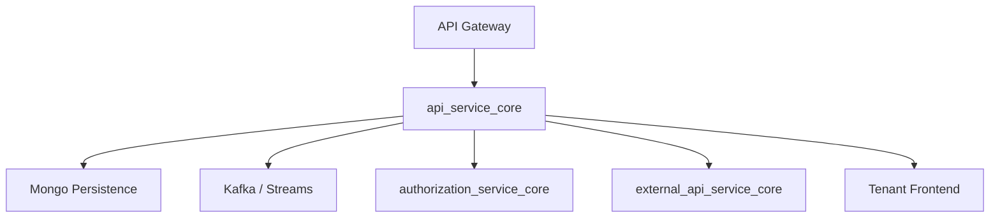
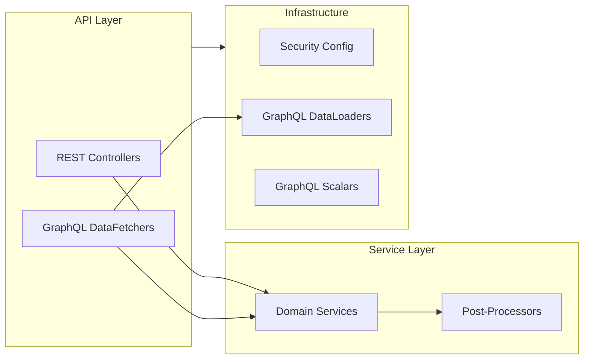
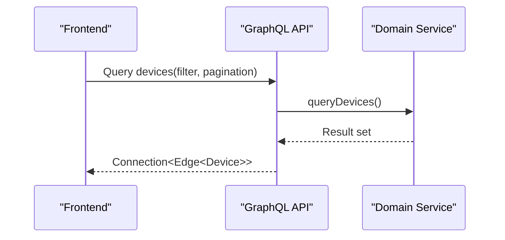
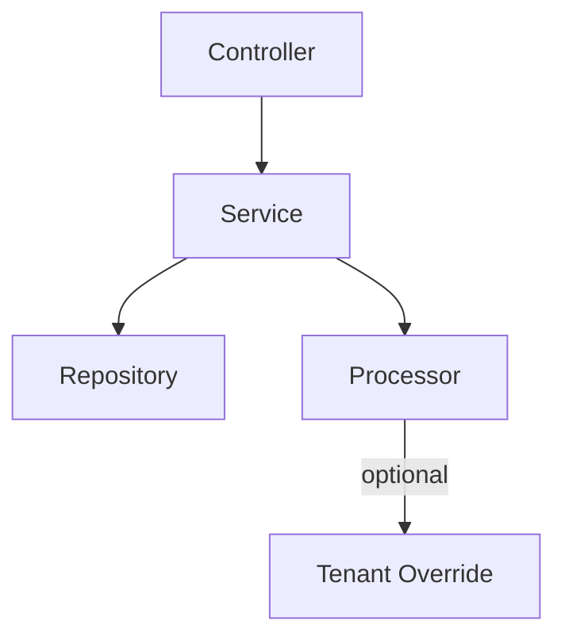

# api_service_core

## Overview
The **api_service_core** module is the central internal API layer of the OpenFrame platform. It provides REST and GraphQL APIs consumed by the Gateway, External API, frontend clients, and internal services. This module focuses on **business-facing API orchestration**, **GraphQL aggregation**, and **tenant-aware operations**, while delegating authentication and perimeter security to the Gateway.

Key responsibilities:
- Expose internal REST endpoints for platform management
- Provide GraphQL queries and mutations via Netflix DGS
- Coordinate domain services (users, devices, organizations, tools, events)
- Act as a bridge between persistence layers and client-facing APIs

---

## Position in the System

The module is deployed as part of multiple Spring Boot applications (see `service_bootstrap_apps`) and shared as a library across services.

---

## Architecture Overview

---

## Core Subsystems

### 1. Configuration
Responsible for wiring shared infrastructure beans.

- **ApiApplicationConfig** – password encoding
- **AuthenticationConfig** – custom `@AuthenticationPrincipal` resolver
- **SecurityConfig** – minimal OAuth2 resource server support
- **RestTemplateConfig** – HTTP client bean
- **DataInitializer** – bootstrap OAuth client configuration
- **DateScalarConfig / InstantScalarConfig** – custom GraphQL scalars

---

### 2. REST Controllers
Expose internal REST endpoints primarily consumed by the Gateway or management tools.

| Controller | Responsibility |
|-----------|---------------|
| HealthController | Liveness check |
| MeController | Current authenticated user info |
| ApiKeyController | API key lifecycle management |
| AgentRegistrationSecretController | Agent bootstrap secrets |
| InvitationController | User invitations |
| UserController | User administration |
| OrganizationController | Organization lifecycle |
| SSOConfigController | SSO provider configuration |
| ForceAgentController | Forced agent/tool actions |
| DeviceController | Internal device status updates |
| ReleaseVersionController | Platform release info |
| OpenFrameClientConfigurationController | Client config delivery |

---

### 3. GraphQL API (Netflix DGS)
GraphQL is the primary query interface for frontend applications.

**Queries and Mutations** are implemented using DGS components:
- DeviceDataFetcher
- EventDataFetcher
- LogDataFetcher
- OrganizationDataFetcher
- ToolsDataFetcher

These fetchers translate GraphQL inputs into domain queries and return cursor-based connections.

---

### 4. GraphQL DataLoaders
To avoid N+1 query problems, DataLoaders batch related entity fetches.

- InstalledAgentDataLoader
- OrganizationDataLoader
- TagDataLoader
- ToolConnectionDataLoader

These loaders integrate tightly with Mongo repositories and domain services.

---

### 5. DTOs and API Contracts
The module defines a large set of DTOs for:
- REST responses (users, organizations, API keys)
- GraphQL inputs and connections
- OAuth / OIDC flows
- SSO configuration
- Force operations and bulk actions

DTOs are deliberately decoupled from persistence models to ensure API stability.

---

### 6. Domain Services and Processors

Services encapsulate business logic and persistence access, while **processors** provide extension points.

- **UserService** – user lifecycle, soft deletion, validation
- **SSOConfigService** – SSO provider configuration and validation
- **Default*Processor** – no-op hooks overridable by SaaS tenants

---

## Security Model

- Authentication and authorization are handled at the **Gateway** layer
- api_service_core trusts inbound requests with validated JWTs
- OAuth2 Resource Server is enabled only to populate `AuthPrincipal`
- All endpoints are `permitAll()` internally

This keeps the service lightweight and focused on business logic.

---

## Extensibility

The module is designed as a **shared library**:
- Default processors can be overridden via Spring beans
- Domain validation logic is pluggable
- SaaS tenants can inject custom behavior without forking core logic

---

## Summary

The **api_service_core** module is the backbone of OpenFrame’s internal API architecture. It consolidates REST and GraphQL access patterns, enforces consistent domain behavior, and integrates seamlessly with the broader OpenFrame microservice ecosystem.
