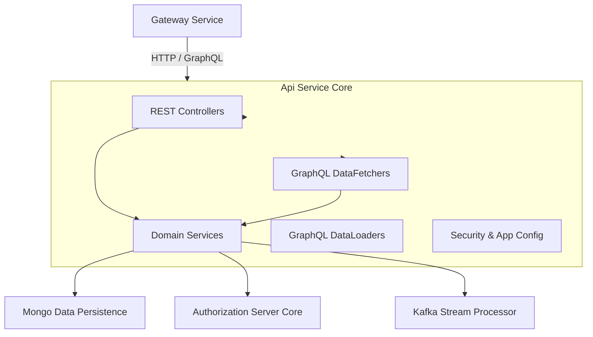
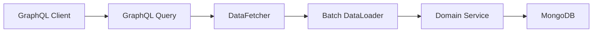

# Api Service Core

## Overview

Api Service Core is the central **internal API and GraphQL service** within the OpenFrame platform. It exposes authenticated, tenant-aware APIs used by the Gateway, Frontend, and other backend services to manage users, organizations, devices, tools, events, logs, and SSO configuration.

This module is intentionally **thin on security enforcement**. Authentication and authorization are primarily handled upstream by the Gateway Service Core. Api Service Core focuses on:

- Business orchestration and validation
- REST and GraphQL API exposure
- Integration with persistence, streaming, and authorization services
- Extensibility via processor hooks and conditional beans

It is implemented as a Spring Boot service with Spring MVC, Spring Security (OAuth2 Resource Server), and Netflix DGS for GraphQL.

---

## Responsibilities

- Provide **internal REST APIs** for mutations and operational queries
- Provide **GraphQL APIs** for rich, cursor‑based querying
- Resolve authenticated principals for downstream logic
- Coordinate domain services across organizations, users, devices, tools, events, and logs
- Manage SSO configuration lifecycle
- Optimize GraphQL performance with DataLoaders

---

## High-Level Architecture

---

## Configuration Layer

### Api Application Configuration

Api Service Core defines minimal application-wide beans. A notable example is password encoding, which is shared across user and security-related flows.

- **ApiApplicationConfig**
  - Provides a `BCryptPasswordEncoder` bean

### Authentication Argument Resolution

- **AuthenticationConfig**
  - Registers a custom argument resolver
  - Enables controller methods to inject the authenticated `AuthPrincipal`

This allows REST endpoints to directly access tenant, user, and role context without manual token parsing.

### Security Configuration

- **SecurityConfig**
  - Enables OAuth2 Resource Server support
  - Resolves JWT authentication dynamically per issuer
  - Caches JWT authentication providers using Caffeine
  - Permits all requests at this layer

> Authentication, authorization, and request filtering are enforced by the Gateway Service Core. Api Service Core only validates JWTs to support principal resolution.

---

## REST API Controllers

Api Service Core exposes internal REST endpoints primarily used by the Gateway and trusted services.

### Health Controller

- **HealthController**
  - `GET /health`
  - Lightweight liveness check

### User and Identity

- **MeController**
  - `GET /me`
  - Returns authenticated user context derived from the JWT principal

- **UserController**
  - List users with pagination
  - Fetch, update, and soft-delete users
  - Enforces business rules such as:
    - Preventing self-deletion
    - Protecting owner accounts

### Organization Management

- **OrganizationController**
  - Create, update, and delete organizations
  - Handles conflict scenarios (for example, organizations with existing machines)
  - Uses mapping and command services to separate API and domain logic

### Device Operations

- **DeviceController**
  - Update device status by machine ID
  - Used internally by agent and integration flows

### Client Configuration

- **OpenFrame Client Configuration Controller**
  - Exposes client configuration required by OpenFrame agents and clients

### Release Version

- **ReleaseVersionController**
  - Retrieves the current platform or client release version

### SSO Configuration

- **SSOConfigController**
  - Manage SSO provider configurations
  - Enable or disable providers
  - Expose enabled providers for login flows
  - Expose available providers for admin configuration

---

## GraphQL API Layer

Api Service Core uses **Netflix DGS** to expose a GraphQL API optimized for frontend consumption.

### Data Fetchers

Each domain has a dedicated DataFetcher responsible for translating GraphQL inputs into service calls.

- **DeviceDataFetcher**
  - Query devices with cursor-based pagination
  - Fetch device filters
  - Resolve related entities (tags, tools, agents, organization)

- **EventDataFetcher**
  - Query and mutate events
  - Supports filtering, sorting, and pagination

- **LogDataFetcher**
  - Query audit logs and filters
  - Fetch detailed log records

- **OrganizationDataFetcher**
  - Query organizations
  - Fetch organizations by internal or external identifiers

- **ToolsDataFetcher**
  - Query integrated tools
  - Fetch available tool filters

### GraphQL Performance Model

DataLoaders batch and cache related entity lookups, eliminating N+1 query patterns.

---

## GraphQL DataLoaders

Api Service Core defines multiple DataLoaders to efficiently resolve nested relationships:

- **InstalledAgentDataLoader**
  - Batch loads installed agents by machine ID

- **OrganizationDataLoader**
  - Batch loads organizations by organization ID
  - Preserves request ordering and handles nulls

- **TagDataLoader**
  - Batch loads tags associated with machines

- **ToolConnectionDataLoader**
  - Batch loads tool connections per machine

These loaders are automatically integrated into the DGS execution context.

---

## Service Layer

### User Service

- **UserService**
  - User lookup, update, pagination, and soft deletion
  - Enforces business invariants around roles and status
  - Emits lifecycle hooks via `UserProcessor`

### SSO Configuration Service

- **SSOConfigService**
  - Full lifecycle management of SSO provider configurations
  - Encrypts client secrets at rest
  - Validates allowed domains and auto-provisioning rules
  - Triggers post-processing hooks for downstream effects

### Domain Validation

- **DefaultDomainExistenceValidator**
  - Default implementation that does not block on domain existence
  - Designed for override in SaaS or tenant-aware deployments

---

## Extensibility via Processors

Api Service Core uses **processor interfaces with default implementations** to enable extensibility without forking the core module.

- **DefaultInvitationProcessor**
  - Hooks for invitation creation and revocation

- **DefaultSSOConfigProcessor**
  - Hooks for SSO config save, delete, and toggle

- **DefaultUserProcessor**
  - Hooks for user lifecycle events

All default processors are conditionally loaded and can be replaced by custom implementations.

---

## Interaction with Other Modules

Api Service Core acts as a **central orchestration layer**:

- Receives authenticated requests from the Gateway Service Core
- Delegates identity flows to the Authorization Server Core
- Reads and writes domain data via Mongo persistence modules
- Consumes enriched data produced by streaming services
- Serves both internal REST clients and GraphQL frontend clients

---

## Summary

Api Service Core is the backbone of OpenFrame’s internal API surface. It combines REST and GraphQL APIs with strong domain modeling, extensibility, and performance optimizations, while delegating cross-cutting concerns like security and routing to dedicated platform services.

This design keeps the module focused, composable, and adaptable across SaaS and self-hosted deployments.