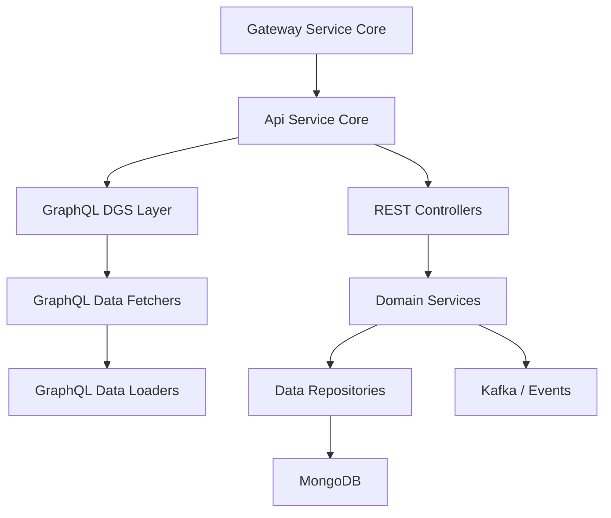
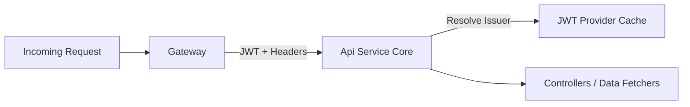
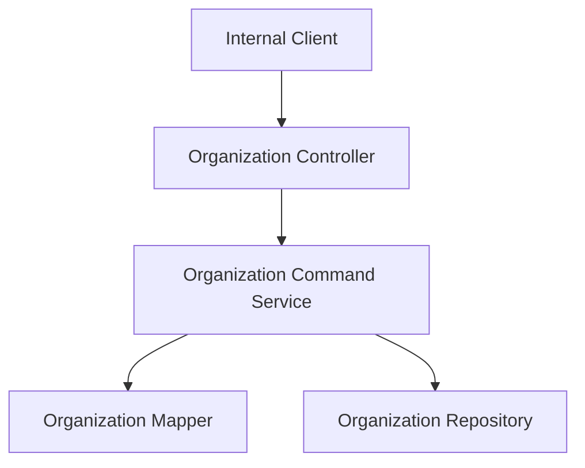
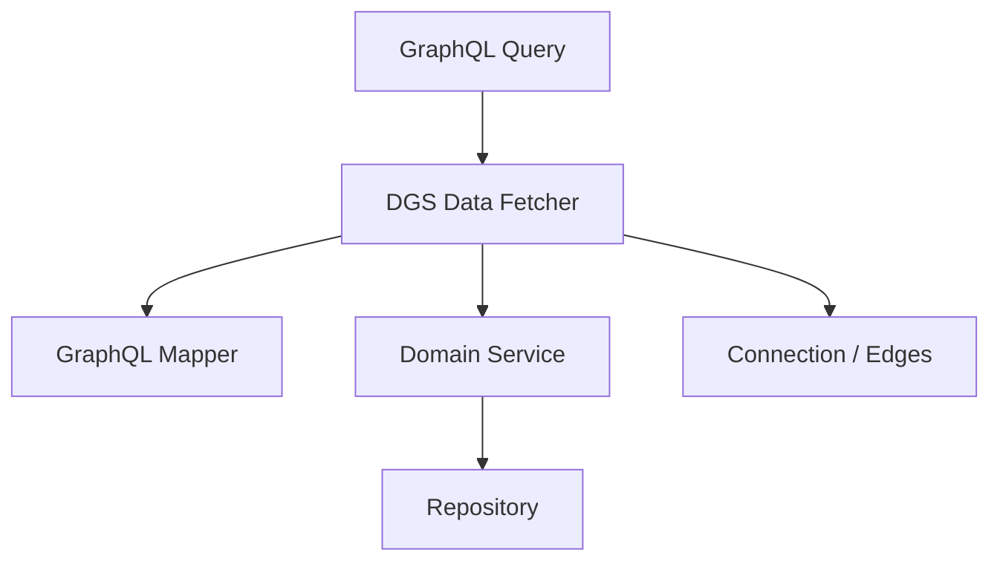
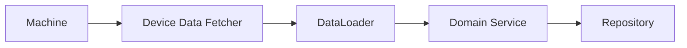
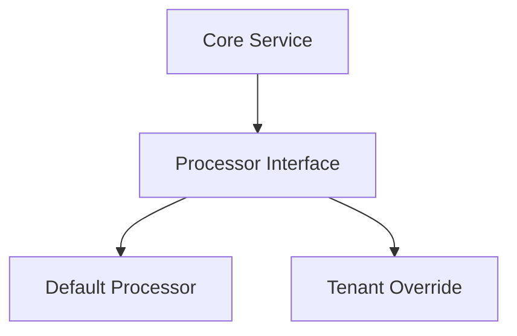

# Api Service Core

## Overview

Api Service Core is the central **internal API and GraphQL service** of the OpenFrame platform. It exposes domain-centric operations for devices, organizations, users, events, logs, tools, and authentication context, and acts as the primary backend consumed by the Gateway Service Core and other internal services.

This module is intentionally **thin at the HTTP security layer**: authentication, authorization, and request filtering are handled upstream by the Gateway. Api Service Core focuses on:

- Domain APIs (REST and GraphQL)
- Business orchestration and validation
- Efficient data access patterns (GraphQL DataLoaders)
- Extension points for tenant-specific behavior

It is built with Spring Boot, Spring Security (resource server mode), and Netflix DGS for GraphQL.

---

## Responsibilities

Api Service Core is responsible for:

- Exposing **internal REST endpoints** for mutations and operational APIs
- Exposing **GraphQL queries and mutations** for read-heavy and relational data access
- Resolving authenticated user context via `AuthPrincipal`
- Coordinating domain services across devices, organizations, users, events, logs, and tools
- Providing extension hooks for invitations, SSO, users, and domain validation

---

## High-Level Architecture

**Key points:**

- The Gateway forwards authenticated requests and injects authorization headers
- Api Service Core trusts upstream authentication and only resolves principals
- GraphQL DataLoaders eliminate N+1 query problems
- Persistence is primarily backed by MongoDB, with Kafka used for event-driven workflows

---

## Security Model

Api Service Core runs as an **OAuth2 Resource Server** with minimal policy enforcement.

### Design Principles

- All requests are permitted at the service level
- JWT validation is delegated to issuer-based authentication managers
- Authentication context is required only when controllers explicitly request it

### Key Components

- **SecurityConfig**
  - Configures JWT issuer resolution
  - Caches `JwtAuthenticationProvider` instances using Caffeine

- **AuthenticationConfig**
  - Registers `AuthPrincipalArgumentResolver`
  - Enables `@AuthenticationPrincipal AuthPrincipal` injection

- **ApiApplicationConfig**
  - Provides shared infrastructure beans (for example, password encoding)

---

## REST Controllers

REST controllers expose **internal mutation and operational APIs**. Read-heavy and relational queries are intentionally handled via GraphQL.

### Health Controller

- **Endpoint:** `GET /health`
- Purpose: Liveness and readiness checks
- Returns a simple `OK` response

### Me Controller

- **Endpoint:** `GET /me`
- Returns the current authenticated user context
- Uses `@AuthenticationPrincipal AuthPrincipal`
- Gracefully handles unauthenticated access

### Device Controller

- **Endpoint:** `PATCH /devices/{machineId}`
- Updates device status by machine identifier
- Used by internal services and automation

### Organization Controller

- **Endpoints:**
  - `POST /organizations`
  - `PUT /organizations/{id}`
  - `DELETE /organizations/{id}`

- Responsibilities:
  - Organization lifecycle management
  - Validation and conflict handling (for example, preventing deletion when machines exist)

---

## GraphQL API (Netflix DGS)

Api Service Core provides a rich GraphQL API for querying interconnected domain data.

### Core Data Fetchers

- **DeviceDataFetcher**
  - Devices, single device lookup
  - Device filters
  - Related entities via DataLoaders

- **OrganizationDataFetcher**
  - Organization lists and lookups

- **EventDataFetcher**
  - Events with cursor-based pagination
  - Event creation and updates

- **LogDataFetcher**
  - Audit logs and detailed log inspection

- **ToolsDataFetcher**
  - Integrated tools and tool filters

### Pagination and Filtering

- Cursor-based pagination (`CursorPaginationInput`)
- Consistent filter option DTOs
- Sorting via shared `SortInput`

---

## GraphQL DataLoaders

To avoid N+1 query issues, Api Service Core uses DGS DataLoaders.

### Implemented DataLoaders

- **InstalledAgentDataLoader**
  - Batch loads installed agents by machine ID

- **OrganizationDataLoader**
  - Batch loads organizations by organization ID
  - Filters out soft-deleted entities

- **TagDataLoader**
  - Batch loads machine tags

- **ToolConnectionDataLoader**
  - Batch loads tool connections per machine

---

## Domain Services

Api Service Core coordinates domain logic through focused services.

### User Service

- User lookup and existence checks
- Pagination-based listing
- Profile updates
- Soft deletion with safety checks:
  - Prevents self-deletion
  - Prevents deletion of owner accounts

### SSO Config Service

- Manages SSO provider configurations
- Supports create, update, delete, and toggle operations
- Encrypts and decrypts sensitive secrets
- Validates allowed domains and auto-provisioning rules

### Domain Validation

- **DefaultDomainExistenceValidator**
  - Default implementation that does not block on domain existence
  - Designed to be overridden in SaaS or tenant-specific deployments

---

## Extension and Processor Hooks

Several components are intentionally designed as **override points**.

### Default Processors

- **DefaultInvitationProcessor**
- **DefaultSSOConfigProcessor**
- **DefaultUserProcessor**

These processors:

- Are conditionally loaded
- Perform no side effects by default
- Enable downstream modules or tenants to inject custom behavior without forking core logic

---

## Integration with Other Modules

Api Service Core sits at the center of the OpenFrame backend ecosystem:

- Receives traffic from **Gateway Service Core**
- Persists and queries data from **MongoDB persistence modules**
- Emits and consumes events through **Kafka and stream processing services**
- Supplies authenticated and structured data to frontend and automation layers

Rather than duplicating logic, this module relies on shared contracts, mappers, and persistence layers defined elsewhere in the platform.

---

## Summary

Api Service Core provides the **authoritative internal API surface** for OpenFrame. Its design emphasizes:

- Clear separation of concerns
- High-performance GraphQL querying
- Minimal security duplication
- Strong extensibility for tenant-specific behavior

It is the backbone that connects authentication, data persistence, and domain logic into a cohesive internal API layer.
