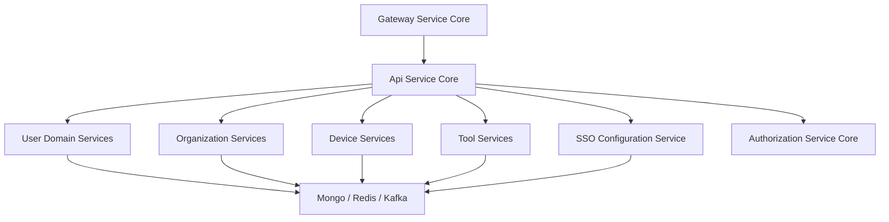
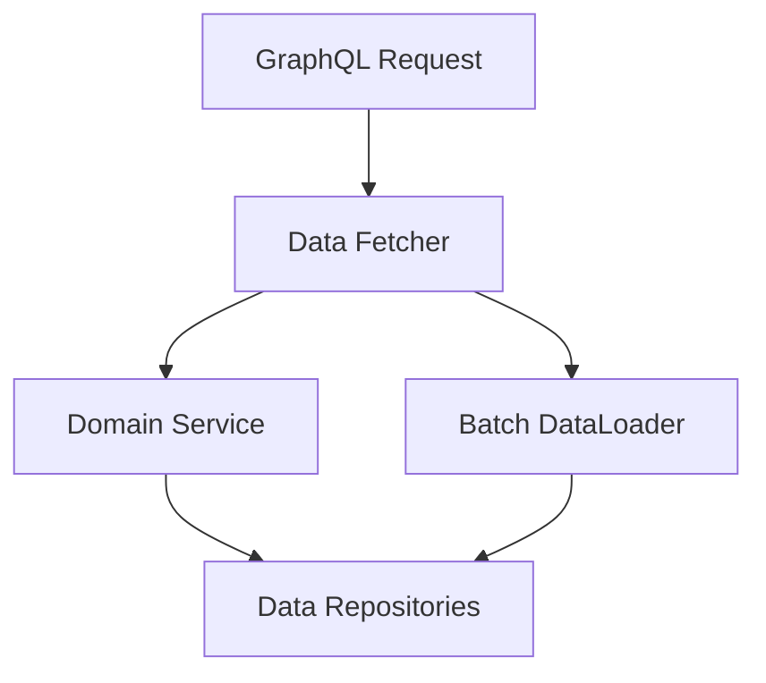

# Api Service Core

## Overview

The **Api Service Core** module is the primary internal API layer of the OpenFrame platform. It exposes REST and GraphQL endpoints used by the frontend, gateway, client agents, and internal services to manage users, organizations, devices, tools, authentication-related metadata, and system configuration.

This module is intentionally designed to be **thin and stateless**, delegating:
- Authentication and authorization enforcement to the **Gateway Service Core**
- OAuth2 and identity workflows to the **Authorization Service Core**
- Persistence to shared data-layer modules (MongoDB, Redis, Kafka)

Api Service Core focuses on **domain orchestration, validation, and API composition**.

---

## Responsibilities

Api Service Core is responsible for:

- Internal REST APIs for administration and system actions
- GraphQL APIs for rich data querying (devices, events, logs, organizations, tools)
- User, invitation, organization, and API key lifecycle management
- SSO configuration management and validation
- Client and agent coordination actions (force install, update, reinstall)
- Providing authenticated user context to downstream services

---

## High-Level Architecture

**Key points:**
- All external traffic reaches Api Service Core **through the Gateway**
- JWT validation is handled upstream; Api Service Core only resolves principals
- GraphQL uses DataLoaders to avoid N+1 database access patterns

---

## Security Model

Api Service Core applies a **minimal security configuration**:

- OAuth2 Resource Server is enabled to support `@AuthenticationPrincipal`
- All endpoints are marked as `permitAll()` at this layer
- JWT decoding is cached per issuer using Caffeine

Authentication responsibilities handled elsewhere:
- Token validation and path filtering: Gateway Service Core
- Token issuance, login, SSO flows: Authorization Service Core

---

## Configuration Components

### Api Application Configuration

- Provides shared beans required across the API
- Includes a `PasswordEncoder` based on BCrypt

### Authentication Configuration

- Registers a custom argument resolver
- Enables controller methods to inject `AuthPrincipal`

### Security Configuration

- Configures OAuth2 Resource Server
- Uses issuer-based JWT decoder caching
- Disables CSRF (API-only service)

### Data Initializer

- Bootstraps a default OAuth client at startup
- Ensures client secrets stay in sync with environment configuration

---

## REST Controllers

### Health Controller

- `GET /health`
- Used for liveness and readiness checks

### Me Controller

- `GET /me`
- Returns authenticated user context derived from JWT

### User Controller

- Manage platform users
- Supports listing, updating, and soft deletion
- Enforces safety rules (no self-delete, no owner delete)

### Invitation Controller

- Create, list, revoke, and resend user invitations
- Delegates lifecycle hooks to an invitation processor

### Organization Controller

- Internal mutation endpoints for organizations
- Handles create, update, and delete
- Protects against deleting organizations with active machines

### Api Key Controller

- Full lifecycle management of API keys
- Supports create, update, regenerate, list, and delete
- Keys are scoped per authenticated user

### Agent Registration Secret Controller

- Manages secrets used by agents during registration
- Supports rotation and listing

### Force Agent Controller

- Executes forced actions on clients and tool agents
- Includes install, update, reinstall (single or bulk)

### Release Version Controller

- Exposes current platform release version metadata

### OpenFrame Client Configuration Controller

- Provides runtime configuration consumed by OpenFrame clients

### SSO Configuration Controller

- Manage SSO provider configurations
- Supports enable/disable, validation, and secure secret storage

---

## GraphQL API Layer

Api Service Core uses **Netflix DGS** to expose GraphQL queries and mutations.

### Data Fetchers

- **Device Data Fetcher**: Devices, filters, and relationships
- **Event Data Fetcher**: Events with cursor-based pagination
- **Log Data Fetcher**: Audit and activity logs
- **Organization Data Fetcher**: Organization queries
- **Tools Data Fetcher**: Integrated tools and filters

### Data Loaders

To prevent N+1 query problems:

- Installed Agent Data Loader
- Organization Data Loader
- Tag Data Loader
- Tool Connection Data Loader

These loaders batch database access per request lifecycle.

---

## Domain Services

### User Service

- User querying and updates
- Soft-delete logic with safety constraints
- Emits lifecycle hooks via a user processor

### SSO Configuration Service

- Stores encrypted SSO secrets
- Validates allowed domains
- Supports provider-specific rules (e.g., Microsoft tenant enforcement)

### Default Validators and Processors

Api Service Core provides **default implementations** that can be overridden:

- Domain existence validation
- Invitation lifecycle hooks
- SSO configuration hooks
- User lifecycle hooks

This makes the module extensible for SaaS and tenant-specific behavior.

---

## Interaction With Other Modules

Api Service Core collaborates closely with:

- **Gateway Service Core**: entry point, auth enforcement, routing
- **Authorization Service Core**: login, OAuth2, SSO flows
- **External Api Service Core**: public-facing read APIs
- **Management Service Core**: background jobs, initialization, schedulers
- **Client Agent Service Core**: agent registration and heartbeat flows

It intentionally avoids duplicating logic already owned by those modules.

---

## Design Principles

- Thin controllers, rich domain services
- Clear separation between read (GraphQL / external APIs) and write paths
- Strong validation at boundaries
- Extensibility via conditional beans and processors
- Gateway-first security model

---

## Summary

The **Api Service Core** module is the backbone of OpenFrame’s internal API surface. It provides a unified, extensible, and secure way to orchestrate platform domains while delegating cross-cutting concerns like authentication, persistence, and streaming to specialized modules.

It is optimized for:
- Multi-tenant SaaS deployments
- High-volume GraphQL querying
- Clean separation of responsibilities across the OpenFrame stack
