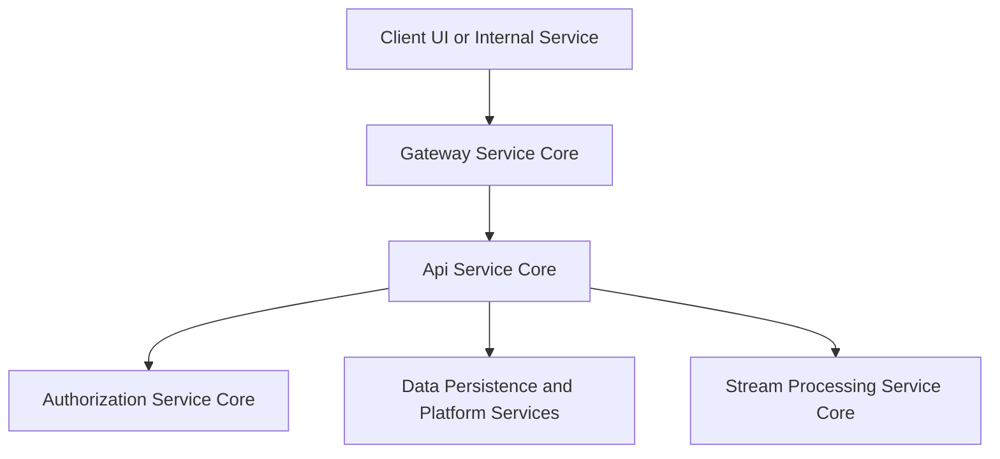
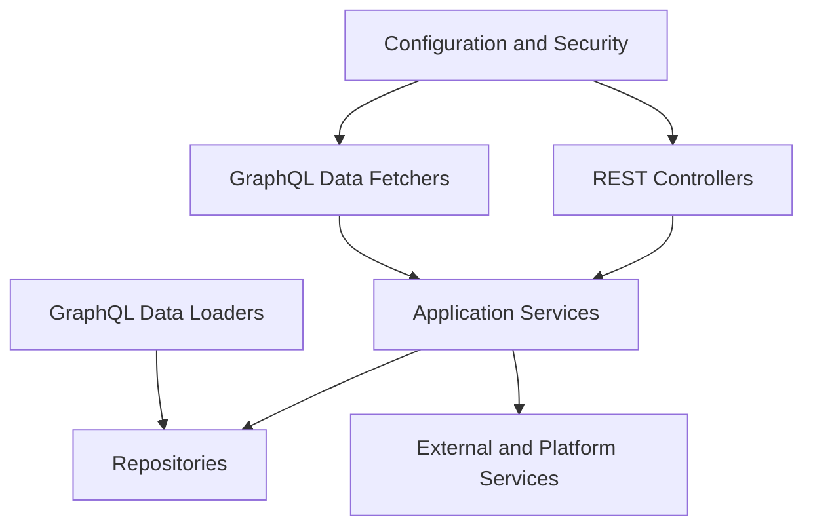
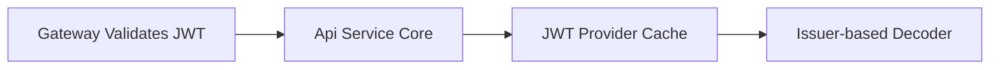
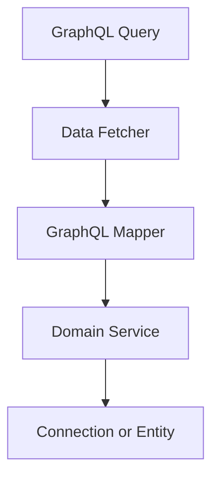

# Api Service Core

## Overview

The **Api Service Core** module is the central internal API layer of the OpenFrame platform. It exposes authenticated REST and GraphQL endpoints used by the Flamingo/OpenFrame UI, internal services, and gateway layer to manage users, organizations, devices, tools, events, logs, SSO configuration, and operational actions such as forced agent updates.

This module is intentionally **thin on authorization logic**. Authentication, JWT validation, and request-level access control are handled primarily by the Gateway Service Core. Api Service Core focuses on:

- Business-oriented API composition
- GraphQL aggregation and query optimization
- Internal REST mutation endpoints
- Integration with persistence, stream, and authorization subsystems

It is implemented as a Spring Boot application and heavily leverages:

- Spring Web MVC (REST)
- Netflix DGS (GraphQL)
- Spring Security (resource server support)
- MongoDB-backed repositories (via data modules)

---

## Position in the Platform

Api Service Core sits behind the Gateway Service Core and in front of data, authorization, and stream-processing services.

---

## High-Level Responsibilities

- Expose **internal REST APIs** for mutations and operational actions
- Expose **GraphQL APIs** for rich, filterable, paginated queries
- Aggregate and map domain data into API and GraphQL DTOs
- Coordinate with downstream services (data, auth, streams)
- Provide extension hooks via processor interfaces

---

## Architecture Overview

Api Service Core is organized into several logical layers.

---

## Configuration Layer

The configuration layer wires core infrastructure used across the module.

### Application and Infrastructure Configuration

- **ApiApplicationConfig**
  - Provides shared beans such as `PasswordEncoder` (BCrypt)

- **RestTemplateConfig**
  - Exposes a shared `RestTemplate` for outbound HTTP calls

### Authentication Integration

- **AuthenticationConfig**
  - Registers a custom argument resolver for `AuthPrincipal`
  - Enables controller methods to directly receive the authenticated user

### Security Configuration

- **SecurityConfig**
  - Enables OAuth2 Resource Server support
  - Uses issuer-based JWT authentication manager resolution
  - Caches JWT decoders per issuer using Caffeine
  - Permits all requests, assuming Gateway-level enforcement

### Data Initialization

- **DataInitializer**
  - Bootstraps a default OAuth client at application startup
  - Ensures client credentials are created or updated based on environment configuration

### GraphQL Scalar Configuration

- **DateScalarConfig**
  - Custom GraphQL scalar for `yyyy-MM-dd` date values

- **InstantScalarConfig**
  - Custom GraphQL scalar for ISO-8601 `Instant` timestamps

---

## REST API Layer

REST controllers expose mutation-heavy and operational endpoints intended for internal use.

### Health and Identity

- **HealthController**
  - Simple liveness endpoint (`/health`)

- **MeController**
  - Returns the currently authenticated user context

### User and Invitation Management

- **UserController**
  - List, retrieve, update, and soft-delete users

- **InvitationController**
  - Create, list, revoke, and resend user invitations

User lifecycle events are extensible via `UserProcessor` and `InvitationProcessor` hooks.

### Organization Management

- **OrganizationController**
  - Create, update, and delete organizations
  - Enforces business constraints such as preventing deletion when machines exist

### API Key Management

- **ApiKeyController**
  - CRUD operations for user API keys
  - Supports regeneration and soft deletion

### Device and Agent Operations

- **DeviceController**
  - Internal endpoint for updating device status

- **AgentRegistrationSecretController**
  - Manages agent registration secrets

- **ForceAgentController**
  - Triggers forced tool installation, updates, reinstalls, and client updates

### Platform Configuration

- **OpenFrameClientConfigurationController**
  - Exposes client configuration used by OpenFrame agents

- **ReleaseVersionController**
  - Returns the currently active platform release version

- **SSOConfigController**
  - Manages Single Sign-On provider configuration
  - Supports provider discovery, enable/disable, and secure secret handling

---

## GraphQL API Layer

GraphQL is used for read-heavy, relational, and filterable queries. Netflix DGS is used as the implementation framework.

### Data Fetchers

Each data fetcher corresponds to a domain area:

- **DeviceDataFetcher**
  - Devices, filters, and related entities

- **EventDataFetcher**
  - Events, event filters, and mutations

- **LogDataFetcher**
  - Audit logs and detailed log inspection

- **OrganizationDataFetcher**
  - Organization queries and filtering

- **ToolsDataFetcher**
  - Integrated tools and tool filters

### Data Loaders

To avoid N+1 query problems, Api Service Core uses GraphQL DataLoaders:

- **InstalledAgentDataLoader**
- **OrganizationDataLoader**
- **TagDataLoader**
- **ToolConnectionDataLoader**

These batch and cache related entity lookups per request.

---

## Service Layer and Extension Points

The service layer contains core business logic and integrates with repositories and external systems.

### Core Services

- **UserService**
  - User lifecycle management and validation

- **SSOConfigService**
  - Secure storage and validation of SSO provider configuration
  - Domain validation and encryption handling

### Processor Interfaces

Several operations support post-processing hooks that can be overridden by downstream modules:

- **UserProcessor**
- **InvitationProcessor**
- **SSOConfigProcessor**

Default implementations are provided:

- **DefaultUserProcessor**
- **DefaultInvitationProcessor**
- **DefaultSSOConfigProcessor**

This pattern allows additional side effects (notifications, sync jobs, auditing) without modifying core logic.

---

## Error Handling and Validation

- Uses standard Spring validation (`@Valid`, `@Validated`)
- Maps domain and business exceptions to appropriate HTTP status codes
- Enforces safety rules such as:
  - Preventing self-deletion
  - Preventing deletion of owner accounts
  - Blocking invalid SSO auto-provisioning configurations

---

## Key Design Principles

- **Gateway-first security**: Trust the gateway for authentication and authorization
- **Read scalability**: Prefer GraphQL with cursor-based pagination
- **Extensibility**: Use processors and conditional beans
- **Clear separation of concerns**: Controllers, services, mappers, and repositories

---

## Summary

The **Api Service Core** module is the backbone of OpenFrame's internal API surface. It consolidates REST and GraphQL access patterns, coordinates complex domain interactions, and provides stable extension points for platform evolution. By remaining thin on security enforcement and rich in composition and orchestration, it enables the rest of the Flamingo and OpenFrame stack to scale cleanly and predictably.