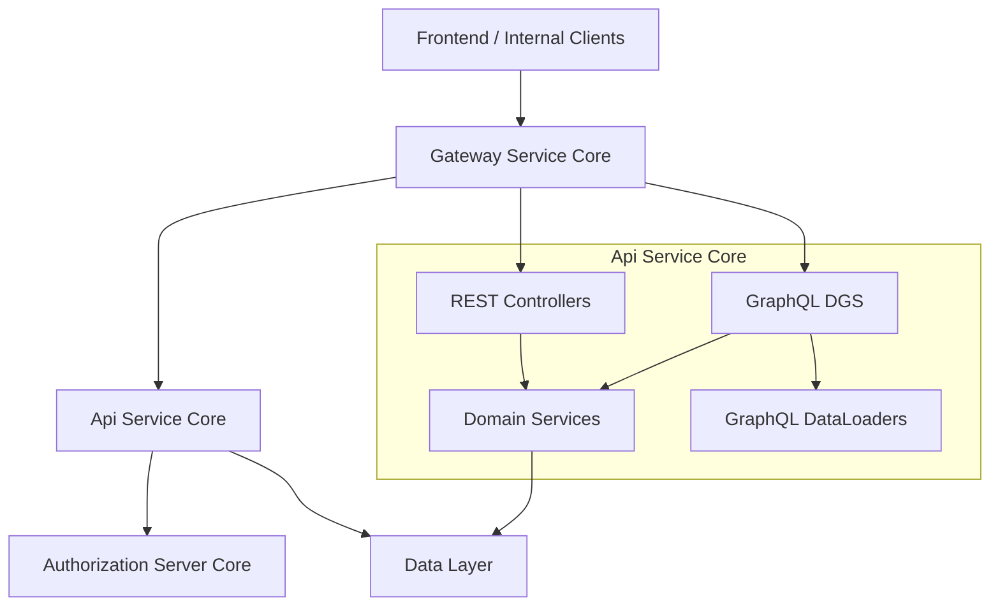
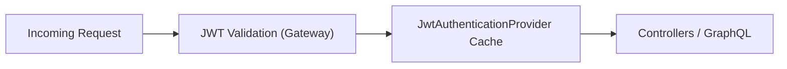
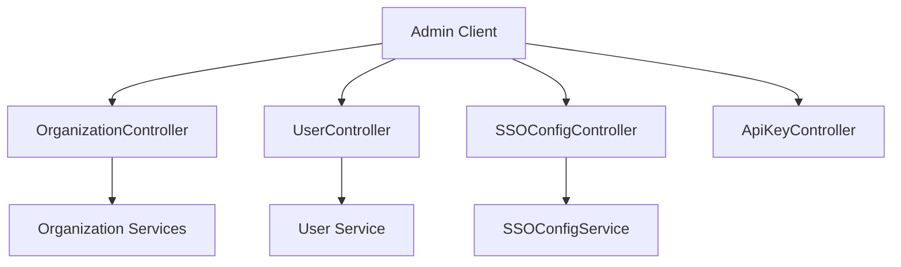
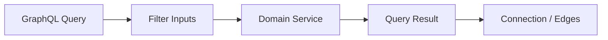
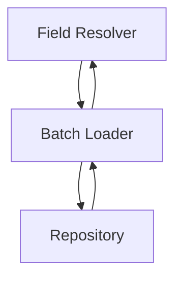

# Api Service Core

## Overview

Api Service Core is the central internal API layer of the OpenFrame platform. It exposes **REST** and **GraphQL** endpoints that power the OpenFrame frontend, internal services, and automation workflows. This module is responsible for:

- User, organization, invitation, and API key management
- Device, event, log, and tool query APIs
- Single Sign-On (SSO) configuration and lifecycle management
- Agent and tool force actions (install, update, reinstall)
- GraphQL schema execution with optimized batching via DataLoaders
- Minimal security enforcement as an OAuth2 Resource Server behind the Gateway

Api Service Core is designed to be **stateless**, **tenant-aware**, and **gateway-first**, delegating authentication and request filtering to the Gateway Service Core while focusing on business logic and data orchestration.

---

## Architectural Role

Api Service Core sits behind the Gateway Service Core and serves as the primary backend for internal platform operations.

**Key characteristics:**
- REST is used for commands and admin-style operations
- GraphQL is used for rich querying with filtering, pagination, and relations
- DataLoader pattern prevents N+1 query issues
- Designed for horizontal scalability

---

## Configuration Layer

The configuration layer bootstraps core infrastructure concerns.

### Application Configuration

- **ApiApplicationConfig**
  - Provides a shared `PasswordEncoder` using BCrypt

- **AuthenticationConfig**
  - Registers `AuthPrincipalArgumentResolver`
  - Enables direct injection of authenticated user context into controllers

- **RestTemplateConfig**
  - Exposes a shared `RestTemplate` for outbound HTTP calls

### Security Configuration

- **SecurityConfig**
  - Enables OAuth2 Resource Server support
  - Uses issuer-based JWT decoding with a Caffeine-backed cache
  - All requests are `permitAll` because:
    - Authentication and authorization are enforced by the Gateway
    - This service only requires identity context for business logic

---

## REST Controllers

REST controllers implement command-oriented APIs and internal operations.

### Identity and Access

- **MeController** – Returns current authenticated user context
- **ApiKeyController** – CRUD operations for user API keys
- **AgentRegistrationSecretController** – Manages agent bootstrap secrets

### Organization and User Management

- **OrganizationController** – Create, update, and delete organizations
- **UserController** – User listing, updates, and soft deletion
- **InvitationController** – Invite, revoke, and resend user invitations

### SSO Configuration

- **SSOConfigController**
  - Manage provider configurations (Google, Microsoft, etc.)
  - Toggle enablement
  - Control auto-provisioning and allowed domains

### Platform Operations

- **DeviceController** – Internal device status updates
- **ForceAgentController** – Force installs, updates, and reinstalls
- **ReleaseVersionController** – Current platform release metadata
- **OpenFrameClientConfigurationController** – Client version configuration
- **HealthController** – Liveness endpoint

---

## GraphQL Layer

Api Service Core uses **Netflix DGS** for GraphQL execution.

### Data Fetchers

- **DeviceDataFetcher** – Devices, filters, tags, agents, and relations
- **EventDataFetcher** – Event queries and mutations
- **LogDataFetcher** – Audit logs and log details
- **OrganizationDataFetcher** – Organization queries
- **ToolsDataFetcher** – Integrated tools and filters

### GraphQL Scalars

- **DateScalarConfig** – `yyyy-MM-dd` formatted dates
- **InstantScalarConfig** – ISO-8601 instants

### Pagination Model

GraphQL uses cursor-based pagination with connection/edge semantics.

---

## DataLoader Layer

To avoid N+1 query issues, GraphQL relations are resolved via DataLoaders.

- **InstalledAgentDataLoader** – Agents per device
- **OrganizationDataLoader** – Organizations per device
- **TagDataLoader** – Tags per device
- **ToolConnectionDataLoader** – Tool connections per device

---

## Service Layer

The service layer encapsulates business logic and orchestration.

### Core Services

- **UserService** – User lifecycle and role enforcement
- **SSOConfigService** – Provider config, encryption, validation, and hooks
- **DeviceService / EventService / LogService** – Query orchestration
- **ToolService** – Integrated tool querying

### Processor Hooks

Processor interfaces allow downstream services to react to lifecycle events.

Default implementations include:
- **DefaultUserProcessor**
- **DefaultInvitationProcessor**
- **DefaultSSOConfigProcessor**

These are conditionally loaded and can be overridden by tenant-specific services.

---

## Domain Validation and Extensibility

- **DefaultDomainExistenceValidator**
  - Provides permissive defaults for domain validation
  - Intended to be overridden in SaaS or tenant-aware deployments

This design enables Api Service Core to remain generic while supporting advanced multi-tenant rules.

---

## Key Design Principles

- Gateway-first security model
- Clear separation between commands (REST) and queries (GraphQL)
- Strong DTO boundaries for API stability
- Extensible via Spring conditional beans and processors
- Optimized for large datasets via cursor pagination and batching

---

## Summary

Api Service Core is the backbone of OpenFrame’s internal API surface. It bridges authenticated requests from the Gateway to domain services and the data layer, providing a scalable, extensible, and GraphQL-friendly backend optimized for MSP-scale workloads.
